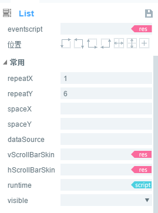

#Référence de module List


##Création de composants List par layaairide

Le module List affiche la liste des articles.Par défaut est une liste de direction verticale.La liste peut être personnalisée par l 'éditeur ui.Chaque liste List est habituellement la même et l 'éditeur peut personnaliser les entrées de contenu de liste de styles différents.
List comprend généralement deux éléments: un élément de rendu de liste (cellules) et une barre de défilement.
L'interface de script du module List, s'il vous plaît.[List API](http://layaair.ldc.layabox.com/api/index.html?category=Core&class=laya.ui.List)".


 


###1.1 Création de composants List

####Édition des entrées de liste.

L 'élément de liste peut être un objet Box ou View (page) ou un autre objet de page personnalisé.Voici l 'exemple de l' objet box.
​**A**Sélectionnez glisser un composant label depuis le panneau de ressources jusqu 'à l' interface de la zone d 'édition, et définissez un nom d' attribut label dont la valeur est m 'u label.En outre, définissez les attributs de corrélation d 'affichage de label pour qu' ils soient plus beaux.
​**B.**Sélectionnez l 'objet label en utilisant le raccourci Ctrl + B ou en sélectionnant**Barre de menu - > Édition >**Sélectionnez le type de récipient Box et cliquez sur le bouton de détermination pour compléter l 'ajout du récipient box.

​< br / >
(Figure 1)


 ####Conversion en conteneurs list.

Sélectionnez les objets de rendu de la liste, en utilisant les raccourcis claviers Ctrl + B ou en sélectionnant**Barre de menu - > Édition >**Sélectionnez le type de récipient List et cliquez sur le bouton de détermination pour compléter l 'ajout du récipient list.
​< br / >
(Figure 2)
####Spécifie les éléments de rendu de liste pour list.
Procédé 1: Double - cliquez sur l 'objet List pour entrer dans l' intérieur de List et définissez le nom de propriété de l 'élément de rendu de liste List comme render.**Remarque & ‧‧;: la valeur du nom de l 'attribut de rendu dans la liste doit être render.**

Méthode 2: Double - cliquez sur l 'objet List pour entrer dans le List et définissez la valeur de rendertype des attributs de l' élément de rendu de liste List comme render.


​< br / >
(Figure 3)

####Ajouter une barre de défilement pour list.
Procédé 1: Sélectionnez et faites glisser un composant vscrollbar à l 'intérieur de l' ensemble List à partir d 'un panneau de ressources et définissez le nom de propriété de l' objet vscrollbar comme scrollbar.***Remarque: la valeur du nom de propriété de la barre de défilement doit être strollbar.***

Method 2: Selection of List Components, the right Property panel is used to the present of vsscrollbarskin, the Selection and remorquage of a vscrollbarr component from the Resource Panel to this skin Property produce the Rolling band

​< br / >
(Figure 4)

####Remorquage des paramètres de largeur de List
La valeur de repeatx de la propriété est de 1 et la valeur de repeaty de 6.Définit le nom de référence global de l 'objet List, c' est - à - dire que la valeur de var de l 'attribut est m' u list.
​< br / >
(Figure 5)

####Attribuer une valeur à l'objet list dans le Code.


```javascript

  var data: Array<string> = [];

   for(var m:number =0;m<20;m++){

        data.push({m_label:"No."+m});
}
m_list.array = data;
```


####Exécution des tâches de vérification dans le cadre du programme.

   ​        < br / >
(Figure 6)

####Ajouter un script dans le Code pour masquer les barres de défilement et définir l'effet de la barre de caoutchouc tirée.

```javascript

 m_list.scrollBar.hide = true;//隐藏列表的滚动条。
 m_list.scrollBar.elasticBackTime = 200;//设置橡皮筋回弹时间。单位为毫秒。
 m_list.scrollBar.elasticDistance = 50;//设置橡皮筋极限距离。
```


####Exécution des tâches de vérification dans le cadre du programme.
​< br / >
(Figure 7)


###1.2 caractéristiques usuelles des composants List

​< br / >
(Figure 8)

- 124.**Attribut**- 124.**Description fonctionnelle**- 124.
124 -----------------------------------------------------------------------------------------------------
Le nombre de cellules affichées dans la direction horizontale \ \ 124.- 124.
Le nombre de cellules est affiché dans la direction verticale.- 124.
La distance (en pixels) entre les cellules affichées dans la direction horizontale \ \ \ 124.- 124.
La distance entre les cellules affichées dans la direction verticale \ \ \ \ \ \ \ \ \ \ \ \ \ \ \- 124.
La peau roule dans la direction verticale.- 124.
124. La peau roule dans le sens horizontal.- 124.


  


###1.3 Tips:

L'ajout d'une barre de défilement à List se fait de deux manières: d'une part, en glissant une barre de défilement directement à l'intérieur de la barre et en la désignant sous le nom de strollbar et, d'autre part, en définissant les propriétés de List comme l'adresse de ressource de la barre de défilement pour Les valeurs vscrollbarskin et hscrollbarskin.

Les éléments de rendu de liste List peuvent être soit des objets Box soit des objets de page.

​


##Création de composants List par Code

Lorsque nous procédons à l 'écriture du Code, il est inévitable de contrôler l' ui par le Code, de créer la classe Ui U List et de définir les attributs associés à List par le Code.

**Exécution de l 'exemple:**
​< br / >
(Figure 9) Création de List par Code

D 'autres attributs de List peuvent également être définis au moyen d' un code, l 'exemple suivant montre comment créer List à partir d' un code pour différentes peaux (Styles) et les lecteurs intéressés peuvent définir List par leur propre code pour créer une liste adaptée à leurs besoins.

**Exemple:**


```javascript

module laya {
    import Stage = Laya.Stage;
    import List = Laya.List;
    import Handler = Laya.Handler;
    import WebGL = Laya.WebGL;

    export class UI_List {
        constructor() {
            // 不支持WebGL时自动切换至Canvas
            Laya.init(800, 600, WebGL);

            Laya.stage.alignV = Stage.ALIGN_MIDDLE;
            Laya.stage.alignH = Stage.ALIGN_CENTER;

            Laya.stage.scaleMode = Stage.SCALE_SHOWALL;
            Laya.stage.bgColor = "#232628";

            this.setup();
        }

        private setup(): void {
            var list: List = new List();

            list.itemRender = Item;

            list.repeatX = 1;
            list.repeatY = 4;

            list.x = (Laya.stage.width - Item.WID) / 2;
            list.y = (Laya.stage.height - Item.HEI * list.repeatY) / 2;

            // 使用但隐藏滚动条
            list.vScrollBarSkin = "";

            list.selectEnable = true;
            list.selectHandler = new Handler(this, this.onSelect);

            list.renderHandler = new Handler(this, this.updateItem);
            Laya.stage.addChild(list);

            // 设置数据项为对应图片的路径
            var data: Array<string> = [];
            for (var i: number = 0; i < 10; ++i) {
                data.push("res/ui/listskins/1.jpg");
                data.push("res/ui/listskins/2.jpg");
                data.push("res/ui/listskins/3.jpg");
                data.push("res/ui/listskins/4.jpg");
                data.push("res/ui/listskins/5.jpg");
            }
            list.array = data;
        }

        private updateItem(cell: Item, index: number): void {
            cell.setImg(cell.dataSource);
        }

        private onSelect(index: number): void {
            console.log("当前选择的索引：" + index);
        }
    }

    import Box = Laya.Box;
    import Image = Laya.Image;
    class Item extends Box {
        public static WID: number = 373;
        public static HEI: number = 85;

        private img: Image;

        constructor(){
            super();
            this.size(Item.WID, Item.HEI);
            this.img = new Image();
            this.addChild(this.img);
        }

        public setImg(src: string): void {
            this.img.skin = src;
        }
    }
}
new laya.UI_List();
```


