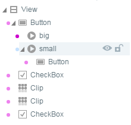
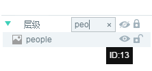

#Gestionnaire de niveau

Le gestionnaire de niveau est l 'un des éléments essentiels du modèle de conception`场景编辑器`Tous les composants`层级管理器`Affiche la structure hiérarchique.

###Structure hiérarchique

####1.1 niveau racine

A moins que dialog ne soit sélectionné lors de la création de la page ui, ni ui ni animation, le niveau racine est View et l 'ID est 1.Comme le montre la figure 1.

< br / > (Figure 1)

####1.2 ensembles multicouches

L 'Encapsulation multicouche est autorisée dans le gestionnaire hiérarchique, chaque couche paternelle s' ouvre avec un triangle gris et cliquez sur ce triangle pour étendre le niveau, comme le montre la figure 2.

< br / > (Figure 2)

####1.3 optimisation hiérarchique

Dans le gestionnaire hiérarchique, l 'icône du composant est précédée de points ronds de différentes couleurs.La même couleur représente le noeud du même ensemble et, si les valeurs de couleur sont différentes, il faut les optimiser, comme le montre la figure 3.

< br / > (fig. 3) Il faut optimiser l 'intersection des points des différentes couleurs

La méthode d 'optimisation est simple: il suffit d' aligner les mêmes points de couleurs au même niveau, il y a une petite technique à noter que lorsque l 'on fait glisser sous l' ensemble pour une ligne droite, l 'ordre est modifié au même niveau.Si l 'affichage est un cadre lors de la traction de l' ensemble, il est glissé jusqu 'au sous - niveau de l' ensemble cible.En outre, l 'ordre hiérarchique peut être modifié par des raccourcis claviers,`ctrl + 方向键向上`Pour l'étage supérieur,`ctrl+方向键向下`Pour un niveau inférieur.

< br / > (Figure 4)

Une fois que l 'ordre d' affichage hiérarchique a été modifié, la phase de couleur du point rond n 'atteint l' objectif d 'optimisation.Comme le montre la figure 5.

< br / > (Figure 5)

###Fonction du panneau de gestionnaire de niveau

####2.1 ensembles d 'affichage et de masquage

Sélectionner`层级管理器`Cliquez sur le côté droit d 'un composant`眼睛图标`Oui.**Cacher**`场景编辑器`B**Ensemble de correspondance**, cliquez à nouveau pour désactiver le masquage.Les résultats sont présentés dans la figure 6.

  (动图6)

####2.2 ensemble de verrouillage et de déverrouillage

Sélectionner`层级管理器`Cliquez sur le côté droit d 'un composant`锁形图标`Oui.**Verrouillage**`场景编辑器`Cliquez à nouveau sur l 'élément correspondant pour désactiver le verrou.Les résultats sont indiqués dans la figure 7.

  (动图7)

####2.3 bouton fonctionnel de base

Le bouton functionnel de fond du gestionnaire de niveaux fonctionne pour la liste de niveaux entiers.

Clic`刷新`La liste des gestionnaires de niveau entier sera mise à jour

Clic`眼睛`Bouton qui masque ou affiche tous les composants du gestionnaire de niveau entier;

Clic`锁形`Bouton qui verrouille ou désactive tous les composants du gestionnaire de niveau entier;

Les effets concrets sont indiqués dans la figure 8.

  （动图8）

####2.4 filtre de recherche de composants

Le composant est recherché dans un gestionnaire hiérarchique et peut être filtré par un mot - clé du nom original du composant ou par un alias du composant, comme le montre la figure 9.

   （图9）

**Tips: alias du composant, paramétré par les propriétés name du paramètre d 'attributs.Pour faciliter la recherche et le positionnement d 'un composant après l' établissement d 'un alias.**

###Gestionnaire de niveaux

####3.1 composants de reproduction, de collage et de suppression

Après sélection du composant dans le gestionnaire hiérarchique, le bouton droit peut effectuer des opérations courantes telles que copie, suppression et collage.Comme le montre la figure 10.

< br / > (Figure 10)

**Tips:**Raccourcis clavier`ctrl+c`Copier`ctrl+v`Coller`Delete`Supprimer.

####3.2 conversion et dispersion des récipients

Lorsque vous sélectionnez un ou plusieurs composants, le bouton droit peut`转换为容器`Voir la figure 11.

< br / > (Figure 11)

**Tips:**Raccourcis clavier`ctrl+B`Assemblage`转换为容器`".

Sélectionnez l 'ensemble contenant et le bouton droit`打散容器`La relation de niveau de récipient peut être supprimée, comme le montre la figure 12.

< br / > (Figure 12)

**Tips:**Raccourcis clavier`ctrl+U`Dispersez le récipient.

####3.3 retrait et déploiement intégral

Cliquez sur le triangle devant de l 'icône pour déployer ou retirer les composants sous le contenant actif, le bouton droit`全部收起`Et`全部展开`L 'ensemble de l' étage Racine peut être déployé ou désactivé, comme le montre la figure 13.

   (动图13)

####3.4 création de noeuds de composants

Dans le menu droit, vous pouvez créer rapidement un composant courant`创建2D`Vous pouvez créer directement un composant de base 2D,`创建Graphics`Vous pouvez créer un ensemble graphique vectoriel,`创建UI组件`Des composants communs ui peuvent être créés pour créer des composants dans la Bibliothèque de composants correspondants, tels que la figure 14.

< br / > (Figure 14)

**Tips**- Oui.*Le composant de la touche droite correspond parfaitement à la Bibliothèque de composants, de sorte que la création du composant peut également être effectuée par l 'intermédiaire de la Bibliothèque de composants.*

###Autres opérations

####4.1 opérations à option multiple

Maintenez le Maj enfoncé pour sélectionner simultanément plusieurs composants adjacents sous le même niveau;

Le Ctrl peut sélectionner simultanément plusieurs composants adjacents ou séparés sous le même niveau;

####4.2 manipulation de composants supplémentaires

En plus de créer directement un composant dans le menu droit, vous pouvez également`组件库`Et`资源管理器`Lorsque plusieurs composants de l 'éditeur de scène sont superposés dans une conception de scène complexe, le composant est créé directement par glisser - déposer.`层级管理器`La création et la gestion des composants est un mode de développement plus efficace.L 'opération d' ajout du composant est indiquée dans la figure 15.

   (动图15)

