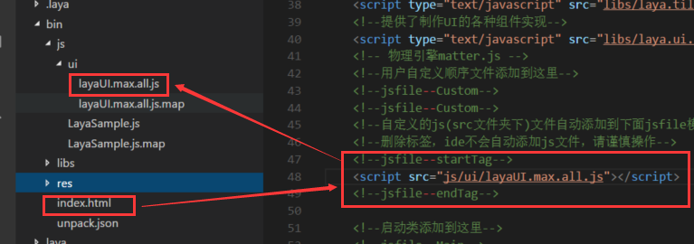

#Affichage d 'une page créée par l' IDE avec un code

Avant de lire ce texte, lisez le document sur la base du modèle de conception.

Cette page est orientée vers les nouveaux venus du moteur layaair et de l 'IDE, si l' IDE a créé une page ui, comment la page ui peut - elle être affichée par l 'élaboration du Code.Continuez de lire ce qui suit.


##Base d 'utilisation de l' UI

####Savoir dans quel répertoire sont exportés les catégories UI

Tout d 'abord, nous devons savoir, exporter la page ui.`F12或ctrl+F12`Après, si nous n 'avons pas modifié la valeur par défaut, le Code UI exporté est`src/ui`Table des matièresSi vous voulez changer, appuyez sur le raccourci F9 pour sortir le panneau de configuration du projet, comme le montre la figure 1.

 


(Figure 1)

####Règles de nomenclature du Répertoire UI

Pour les raisons de Typescript lui - même, deux règles importantes doivent faire l'objet d'une attention particulière dans le cadre du projet ts lorsqu'il s'agit de nommer un répertoire ui:

Nom du nouveau répertoire interdit`ui`Dans le cas contraire, il est possible d 'afficher les erreurs de temps avec un code.

Il est interdit d 'avoir un double nom dans le même répertoire longitudinal.Par exemple, le catalogue paternel est identique au catalogue des enfants (AA / aa), ou le catalogue paternel est identique au catalogue des petits - enfants (AA / BB / aa), quel que soit le niveau de hiérarchie qui les sépare, le même nom de catalogue pour tout niveau de relation est interdit et peut donner lieu à une erreur de déclaration.

####Fichier de code généré après l 'exportation

Après l 'utilisation d' une fonction d 'Export de l' IDE, un fichier de classe ui ts est généré par défaut sous le répertoire src / UI ((`layaUI.max.all.ts`).Contient toutes les informations sur les pages ui créées, comme le montre la figure 2 - 1.

 


(Figure 2 - 1)

 


(Figure 2 - 2)

Si l 'on compare la partie rouge des figures 2 - 1 et la structure de la table des matières des figures 2 - 2, il est en fait facile de trouver la relation.Ui est une structure, Shop est un catalogue sous ui.Demo est le nom de fichier ui dans lequel le nom de fichier ui est constitué d 'un nom ui (tel que demoui) en même temps que le mot clé ui, ce qui est utilisé lors de l' élaboration du Code.Pas le nom de fichier ui initialement créé dans l 'IDE.Pour citer, par exemple, la catégorie ui à utiliser, comme indiqué dans le code suivant:


```typescript

import demoUI = ui.shop.demoUI;
```


####Comprendre la classe ui JS introduite dans l'index.html

Par défaut, l 'IDE introduira automatiquement la classe ui compilée dans l' index.html.Comme le montre la figure 3.On le saura ici, sauf s' il y a un problème.

  


(Figure 3)


##Coder, afficher la page créée par l 'IDE

Supposons qu 'on affiche la page éditée par test.ui dans la figure 2 - 2.

####Pour citer d 'abord la catégorie ui exportée


```typescript

//引入test页面的UI类
import testUI = ui.testUI;
```


####Création d 'un procédé privé de chargement destiné à charger le retour de ressources d' Atlas UI

Dans ce procédé, l 'objet testui introduit est personnalisé à test puis ajouté à la scène.


```typescript

private onLoaded():void{
        //实例化UI界面
        var test:testUI = new testUI();
        //把实例后的UI界面添加到舞台
         Laya.stage.addChild(test);
    }
```


####Chargez les ressources d 'Atlas utilisées sur la page, puis affichez l' ui sur la scène par le biais d 'un procédé de retour.


```typescript

//加载页面中的图集，并将页面显示
Laya.loader.load("res/atlas/comp.atlas", Laya.Handler.create(this, this.onLoaded));
```


####Code complet

Exemples de procédures d'entrée pour des projets vides


```typescript

//引入test页面的UI类
import testUI = ui.testUI;
class GameMain{
    constructor()
    {
        Laya.init(600,400);
      	//加载页面中的图集，并将页面显示
        Laya.loader.load("res/atlas/comp.atlas", Laya.Handler.create(this, this.onLoaded));
    }

    private onLoaded():void{
        //实例化UI界面
        var test:testUI = new testUI();
        //把实例后的UI界面添加到舞台
         Laya.stage.addChild(test);
    }
}
new GameMain();
```


Si vous ne réussissez pas à montrer ui, suivez rigoureusement les étapes de ce document, et même les noms doivent être cohérents, d 'abord pour s' assurer qu' il n 'y a pas de problème, puis pour essayer avec souplesse.