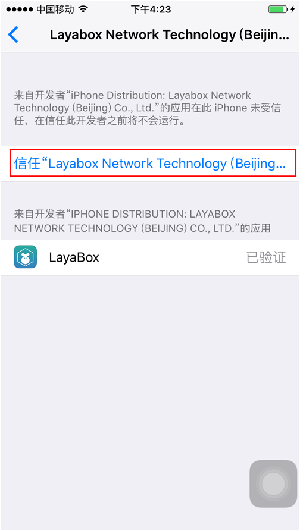
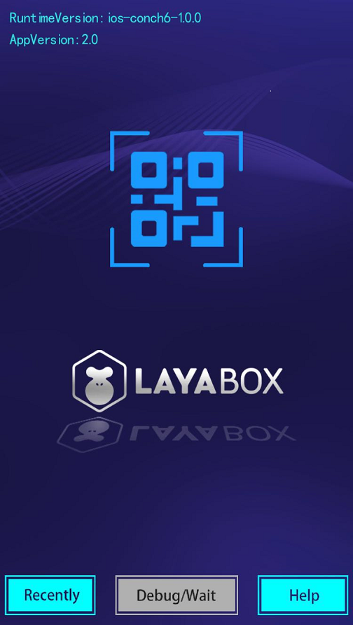

#Comment utiliser layanative pour tester l'exécution d'app?

###Test app

####Affichage du Code bidimensionnel téléchargé de l'app d'essai

Ouvrez layaairide, cliquez sur le coin supérieur gauche.Bouton de menu, barre de menu

Cliquez sur l 'outil dans la barre de menu & ‧‧; > télécharger l' opérateur et affichez l 'adresse de téléchargement bidimensionnel de l' app d 'essai (voir la figure 2).

  < br / >
Figure 1

​< br / >
Figure 2

####Téléchargement et installation de la version Android

Le Code de balayage est directement utilisé avec le téléphone Android, et cliquez sur APK pour l 'installation.

**Si vous utilisez un code de balayage de micromessagerie, il faut copier l 'adresse du lien pour le télécharger dans un navigateur de téléphonie mobile en raison des paramètres de sécurité des micromessageries.**    

####Téléchargement et installation de la version iOS

Après avoir balayé le Code par micro - courrier, cliquez sur "ouvrir dans Safari", puis sur "ouvrir dans le navigateur Safari".**Install**Cliquez sur le bouton et cliquez sur l 'installation, comme le montre le diagramme suivant:

**Mesure 1:**

​ < br / >
Figure 3

**Mesure 2:**

  < br / >
Figure 4

**Mesure 3:**

  < br / >
Figure 5

**Tips:**

Après avoir cliqué sur l 'installation, il n' y a pas de fonction de saut automatique ici, il faut vérifier manuellement sur le Bureau du système si l 'application layabox est en cours d' installation et, si elle est en cours d 'installation, attendre l' étape suivante après l 'installation.

**Mesure 4**

Une fois l 'installation réussie, cliquez sur l' exploitation pour faire sortir le "développeur d 'entreprise non confiant", ce qui nécessite un réglage par le développeur lui - même.

Cliquez sur "Paramètres" - > General "> Equipment Management >

Après l 'ouverture du test layabox, l' APP peut être utilisé normalement, comme indiqué ci - après:

**Mesure 5**

​< br / >
Figure 6

**Mesure 6**

​< br / >
Figure 7

**Mesure 7**

​< br / >
Figure 8

**Mesure 8**

​< br / >
Figure 9

**Mesure 9**

​< br / >
Figure 10

###Mise à l 'essai du projet au moyen d' apps d 'essai

**Mesure 1:**

Lorsque l 'application est ouverte, une interface comme la figure 11 est visible:

< br / >
Figure 11

**Mesure 2:**

Ouvrez les cases à l 'aide de layaairide, cliquez sur l' icône Code bidimensionnel à droite du dernier côté de la barre de menu, affiche l 'interface de code bidimensionnelle du projet (voir la figure 12).< br / >
Figure 12

**Mesure 3:**

Cliquez sur l 'icône de Code bidimensionnel bleu (Figure 13) de l' app d 'essai pour accéder à l' interface du Code de balayage.Scanne le Code bidimensionnel de layanative à droite (fig. 14), ce qui ouvre le test.

  < br / >
Figure 13

  < br / >
Figure 14

Une fois que le Code de balayage a été validé, l 'app teste le projet de cas (fig. 15).

<! - - todo: peut - être faudra - t - il changer l 'image du projet >

  < br / >
Figure 15

**Layanative n 'est pas un navigateur, saisissez l' adresse de l 'ensemble du chemin, même si l' index.html est activé par défaut.**

* http: / / testgame.layabox.com / index.js correct.
* http: / / 192.168.0.100: 8899 / index.js correct.
* http: / / testgame.layabox.com / Error
* Erreur: < http: / / testgame.layabox.com >
* http: / / 192.168.0.100: 8899 / erreur.
* http: / / 192.168.0.100: 8899 erreur

< http: / / github.com / layabox / layaair - DOC / tree / Master / chinese / layanative / Screen u orientation * * - >

###Note

Les documents en format de texte (par exemple INI, XML, HTML, json, JS, etc.) doivent tous être des formats de codage utf8, car le matériel iOS ne supporte pas actuellement les fichiers codés en format non utf8.

###Recommandations

Il est conseillé aux développeurs d 'apprendre les connaissances de base développées par Android et IOS, qui permettent de connecter des dispositifs mobiles à des ordinateurs, de consulter à tout moment log, qui contient de nombreuses informations importantes pouvant aider les développeurs à se positionner.Par exemple: nom de fichier non codé en format utf8, erreur de réseau, erreur de téléchargement, etc.