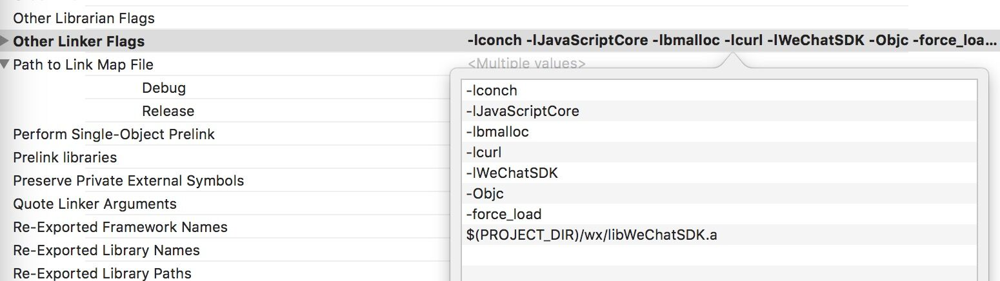

#Autres annotations

##Carte de la tierce partie

Le Sous - sol de layanative rend compte de l 'utilisation des rendements opengles, des contrôles glsurfaceview d' Android et des contrôles glkview de l 'iOS, de sorte qu' il n 'est pas possible de tenir compte des cartes de tiers, telles que les cartes de 100 degrés.

##Présentation des documents

**Les fichiers de format de texte dans le projet (par exemple INI, XML, HTML, json, JS, etc.) doivent tous être des formats de codage utf8, car le dispositif iOS ne supporte pas les fichiers codés en format non utf8.**

##Modèle Debug et modèle Release

Layanative log est divisé en trois catégories:


```java

LOGI 普通流程log
LOGW 警告log
LOGE 错误log
```


Dans le script JS, l 'développeur peut définir le mode debug par les fonctions suivantes:


```javascript

if( window.conch )
{
    //值为1：表示所有LOGE全部弹出alert
    //值为2：表示所有LOGE和LOGW全部弹出alert
    window.conch.config.setDebugLevel(1);
}
```


**Tips**
*Conch ne peut être appelé que dans l 'environnement layanative, il n' y a pas de définition de Concord dans la version Web et il faut donc déterminer s' il existe.*
*Les objets Conch peuvent être obtenus par le biais de browser.window ['Conch'] lorsque la langue a été mise au point.*

##Micromessages d'interface iOS

Connecter le SDK à la version 1.77 du micromessage sous la plate - forme iOS nécessite une augmentation des paramètres d 'objc, une augmentation par défaut dans les documents officiels du micromessage`-Objc -all_load`Mais cela pourrait entraîner une erreur de traduction.
Dans ce cas, on peut changer les paramètres.`-Objc -force_load libWeChatSDK.a`Après configuration, comme le montre la figure 1:



##En ce qui concerne les simulateurs iOS

Layanative supporte le simulateur IOS, mais il est conseillé à l 'concepteur d' utiliser le module iOS en tant que machine de réglage étant donné que le simulateur fonctionne moins efficacement.

##Accès à l'information

La fonction \ \ 124 \ \ \ \ \ \ \ \ \ \ \ \ \ \ \
124 ---------------------------------------------------------------------------------------------------------------------------------------------------------------------------------------
124, & 124, & 124, & 124, & 124, & 124, & 124, & 124, & 124, & 224, & 224, & 224, & 224, & 224, & 224, & 236; & 234; & 236
La valeur de retour de KB \ \ 124 \ \ \ \ \ \ \ \ \ \ \ \ \ \ \\\ \\
La valeur de retour de KB \ \ 124 \ \ 124 \ \ \ \ 124 \ \ \ \ \ \ 124 \ \ \ \\\ \
= 124 = () \ \ 124 \ \ Statut du réseau \ \ 124 \ \ renvoie \ \ int, net \ \ NO = \ \ 0; net u wifi = 1; net \ \ 2G = 2; net u 3G = 3; net u 4G = 4; net u unkonown = 5 124124124
La valeur de retour est une chaîne de caractères semblable à ios - conch5 - 0.9.2, Android - conch5 - 0.9 \ \ 124.
{\ 1ch00ffff} 124tos (}
Le numéro de version de la chaîne 1.1 \ \ 124 \ \ \ 124tr ()  \ 124 \ \ tgetapversion () \ \ 124 \ \ AP est obtenu par le biais de la version de la chaîne 1.1 \ \ 124 \\\\\\\- 124.
124%- 124.

Ces fonctions appartiennent toutes à la catégorie conch.config, exemples d 'appel:


```javascript

if( window.conch )
{
    window.conch.config.getRuntimeVersion();
}
```


**Tips**
*Conch ne peut être appelé que dans l 'environnement layanative, il n' y a pas de définition de Concord dans la version Web et il faut donc déterminer s' il existe.*
*Les objets Conch peuvent être obtenus par le biais de browser.window ['Conch'] lorsque la langue a été mise au point.*

##Fausses cases dans les projets de blindage

Des indications erronées apparaissent parfois au cours de l 'exécution du projet et sont toutes des erreurs de code dans le projet.Notre proposition est de corriger ces erreurs dans les cadres de balles, si elles ne peuvent pas être résolues avant de retourner au blindage.Le Code de la boîte de tir incorrecte est le suivant:


```java

window.showAlertOnJsException(false);
```


##Traitement des anomalies lors de l'initialisation ou du chargement du moteur sur le script de démarrage
Dans la version layanative2.0, en cas d'anomalie (par exemple, d'instabilité du réseau) lors de l'initialisation du moteur et du chargement du script de démarrage, le moteur est automatiquement appelé à la fonction window.onlayaininterror (error), définie par défaut dans config.js et codée comme suit:

```javascript

window.onLayaInitError=function(e)
{
	console.log("onLayaInitError error=" + e);
	alert("加载游戏失败，可能由于您的网络不稳定，请退出重进");
}
```

Les développeurs peuvent modifier les informations erronées et les modes de communication en fonction de leurs propres besoins.

##Acquisition de modèles de matériel
Dans la layanative2.0, l'IOS peut obtenir un modèle d'équipement en faisant appel à conch.config.getdeviceinfo ().Les rideaux de tête de l 'iPhone x peuvent être adaptés et codés comme suit:

```javascript

if( window.conch )
{
    var devInfo = JSON.parse(window.conch.config.getDeviceInfo());

    if (devInfo.devicename === 'iPhone10,3' || devInfo.devicename === 'iPhone10,6')
    {
        // iPhone X适配
    }
}
```
