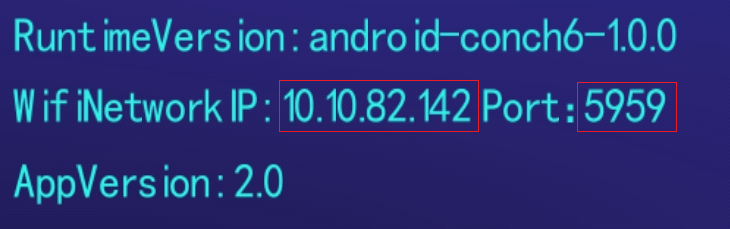
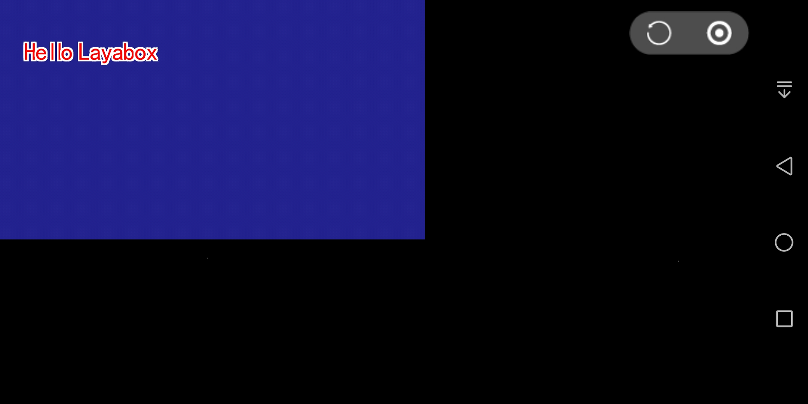

#Vérifier le code JavaScript sur une machine Android

##Attention:
Comme la dernière version de chrome a été mise à jour à 69, il a été impossible d 'installer manuellement un essai de point d' arrêt JS dans l 'environnement de layanative, solution:
L 'développeur peut écrire le Code debugger pour effectuer la mise en page.
Installer une version de chrome68 pour la mise en page.
Je moteur de la société va résoudre ce problème dès que possible, vous causer des inconvénients, s' il vous plaît pardonnez - moi.

##Principe de la mise en page

La mise à l 'essai du code JavaScript est effectuée au moyen d' un navigateur Chrome sur l 'adaptateur.Le serveur websocket est activé simultanément par layanative sur le testeur Android.Le navigateur Chrome communique avec layanative par l 'intermédiaire de la connexion websocket, ce qui permet d' effectuer un ajustement de JavaScript du projet à l 'aide de chrome.

Lorsque le code JavaScript d 'un élément de débogage est sélectionné, deux modes de débogage peuvent être sélectionnés:

Modèle debug / normal

Dans ce mode, le projet sur le testeur Android peut être lancé et exécuté directement, et le navigateur Chrome peut être connecté au réglage après l 'exécution du projet.

Modèle debug / wait

Dans ce mode, la connexion du navigateur Chrome est attendue après le démarrage du projet sur le testeur Android.L 'exécution du script JavaScript ne se poursuivra qu' une fois que la connexion hrome aura été établie.
Sélectionnez le mode de priorité lorsqu 'il est nécessaire de régler le script JavaScript chargé au démarrage.

**Attention & ‧‧;: s' il vous plaît, assurez - vous que le modem est sur le même réseau que le testeur Android.**

##Mise en service du projet Android de layaairide

###Mesure 1:

Le projet a été construit à l'aide de layaairide pour produire le projet Android.

< - - - todo: ajouter une adresse de lien.Se référer en particulier à "l 'utilisation de l' IDE pour la construction".- >

###Mesure 2: Modifier le mode de débogage

Utilisez Android studio pour ouvrir les travaux de construction.

Ouvrez Android \ \ u studio / APP / src / main / assets / config.ini, modifiez la valeur de jsdebugmode et définissez le mode de débogage requis.Figure 1

[] (IMG / Android \ \ u debugmode.ping)

Figure 1

Jsdebugmode a été évaluée et interprétée comme suit:

124 \ \ \ \ \ \ \ \ \ \ \ \ \ 
124: -: \ \ 124: \ \ 124.
{\ 1ch00ffff}
- 124, 1 \ \ 124 \ / modèle normal \ \ 124.
- 124 °2 °124 °

**Tips:**

Lorsque le projet a été officiellement lancé, définissez la valeur de jsdebugmode comme zéro, faute de quoi la performance du projet sera affectée.

###Mesure 3: compiler et exécuter les projets

Utilise le projet Android studio.

Si vous choisissez le mode debug / normal, attendez qu 'Android réussisse.**Démarrage et fonctionnement**Projet

[] (IMG / Android \ \ u app \ / run.ping)

Figure 2 démarrage et exploitation réussis du testeur Android

Si vous choisissez le mode debug / wait, attendez qu'Android réussisse.**Démarrage**Projet

[] (IMG / Android \ \ u app \ \ boot.ping)

Figure 3 testeur Android activé avec succès

###Mesure 4: utiliser le projet de connexion de chrome

Ouvrez le navigateur Chrome sur le modem et saisissez l 'adresse suivante:

> chrome - devtools http: / / devtools / bundled / inspector.html? Experiments = true & v8only = true & WS = 10.10.82.142: 5959

**Attention:**WS = 10.10.82.142: 5959 l'adresse IP de l'appareil d'essai Android et 5959 le numéro de port jsdebugport indiqué dans le document config.ini de l'étape 2, veuillez le modifier en fonction de la situation et des besoins réels de l'équipement.

###Mesure 5: mise en route des essais

Une fois la connexion réussie, le projet JavaScript peut être ajusté à l 'aide de chrome.Comme le montre la figure 2:

[] (IMG / debug \ \ u connected.ping)

Figure 4

##Utiliser l 'app d' essai pour la mise à l 'essai

###Mesure 1: confirmation des adresses IP et des numéros de port

Ouvrez l 'app de test et vous pouvez voir l' adresse IP du dispositif Android dans le coin supérieur gauche et le numéro de port requis pour le réglage.

Comme le montre la figure 1, l 'adresse IP du matériel est 10.10.82.142 et le numéro de port: 5959.

Figure 5

###Mesure 2: sélectionner le mode de débogage

Cliquez sur le bouton situé au milieu de l 'écran et choisissez le mode de débogage.

Figure 6

Figure 7

###Mesure 3: Code bidimensionnel pour le projet de balayage

Cliquez sur l 'icône de Code bidimensionnel bleu au milieu de l' app d 'essai pour scanner l' adresse de Code bidimensionnel layanative du projet.

Si le modèle debug / normal est retenu, on attend le succès du projet.**Démarrage et fonctionnement**".

Figure 8 succès des projets

Si le modèle debug / wait est sélectionné, l 'app doit être testé pour éjecter l' interface suivante:

Figure 9

###Mesure 4: raccordement d 'un test app à un navigateur Chrome

Ouvrez le navigateur Chrome et saisissez l 'adresse suivante:

> chrome - devtools http: / / devtools / bundled / inspector.html? Experiments = true & v8only = true & WS = 10.10.82.142: 5959

**Attention:**WS = 10.10.82.142: 5959 est l'adresse IP et le numéro de port que vous souhaitez voir à l'étape 1. Veuillez les modifier en fonction de l'état réel de votre matériel.

###Mesure 5: mise en route des essais

Une fois la connexion réussie, le projet JavaScript peut être ajusté à l 'aide de chrome.Comme le montre la figure 7:

[] (IMG / debug \ \ u connected.ping)

Figure 10

**Tips:**Tester le raccourci de l 'app

Après avoir testé l 'application App avec succès, deux boutons sont affichés sur l' écran.Les deux boutons fonctionnent comme suit:

**Boutons de mise à jour**

Lorsque le Code de l 'élément est modifié, cliquez sur le bouton de rafraîchissement pour recharger l' ouvrage modifié sans avoir à revenir au Code.

**Attention:**Dans le cas de la connexion chrome, l 'app d' essai peut s' effondrer en cliquant sur le bouton de rafraîchissement.Je vous prie de bien vouloir m 'excuser.

**Bouton de retour**

Cliquez sur le bouton de retour pour revenir à l 'interface du Code de balayage et reprendre le Code de balayage.

##PROBLÈMES de la version actuelle

**Je vous prie de bien vouloir m 'excuser.**

Pendant la mise au point du modem, il y a des risques de confusion de la mise au point à l 'aide d' un point de rupture manuellement ajouté par le modem (point de rupture non debugger).
Dans ce cas, veuillez prendre les mesures suivantes:

Étape 1: Établir les points d'arrêt suivants:

[IMG / 7.ping]

Figure 11

Mesure 2: supprimer tous les points de rupture

[IMG / 8.ping]

Figure 12

Mesure 3: redémarrer le projet de démarrage et réutiliser le projet de raccordement de chrome.

[IMG / 9.ping]

Figure 13

Mesure 4: rétablir les points de rupture nécessaires

[IMG / 7.ping]

Figure 14