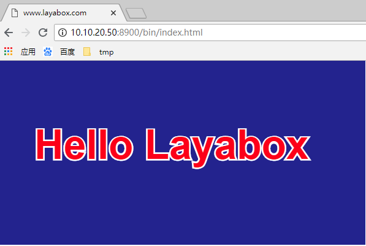

#Utiliser layaair pour exécuter le projet layaair

Vous devez avoir une bonne connaissance de layaair ou de layaair lorsque vous lisez ce document, et vous avez décrit en détail dans le document layaair comment utiliser layaide pour créer le premier programme "Hello layabox".

< http: / / github.com / layabox / layaair - DOC / tree / Master / chinese / layanative / Screen / U orientation * * - >

Mesure 1: J'ai déjà créé un simple projet Hello layabox, comme le montre la figure 1:

< br / >
Les résultats opérationnels sont indiqués à la figure 2:

< br / >
Figure 2

étape 2: cliquez sur la touche de menu "Code bidimensionnel" dans le coin supérieur droit de layaide pour afficher une interface de Code bidimensionnel, et affichez une adresse http: / / www.`http://10.10.20.50:8900/bin/h5/index.html`Figure 3

< br / >
Figure 3

étape 3: cliquez sur le bouton & ‧‧; browser open & ‧‧; dans l 'interface de code 2D`http://10.10.20.50:8900/bin/h5/index.html`Ouvre l 'image, comme le montre la figure 4:

< br / >
Figure 4

Étape 4: ouvrir l 'app de test layabox déjà installé sur le téléphone portable, puis l' ouvrir comme le montre la figure 5:

< br / >
Figure 5

Étape 5: cliquez sur l 'icône de Code bidimensionnel bleu au - dessus de l' app et Scannez le Code bidimensionnel layanative à droite au milieu de l 'étape 2.

< br / >
Figure 6

< br / >
Figure 7

Étape 6: une fois que le Code d'épreuves aura été validé, l'app sera chargé et exploité comme exemple de projet Hello - layabox, comme le montre la figure 7:

< br / >
Figure 8