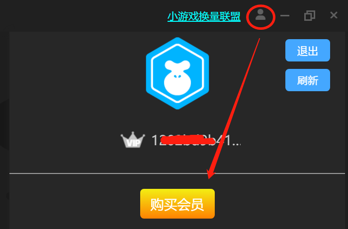
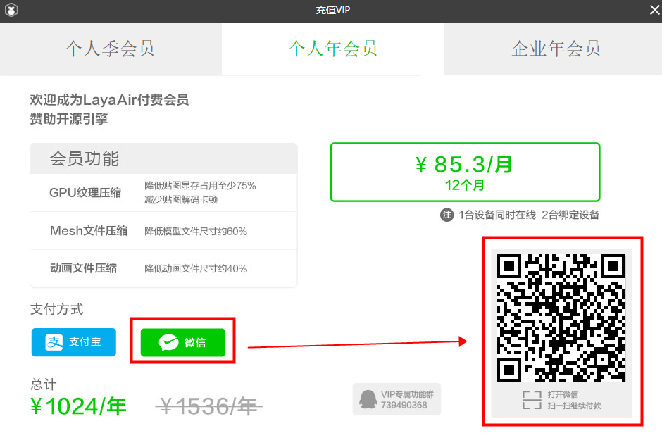
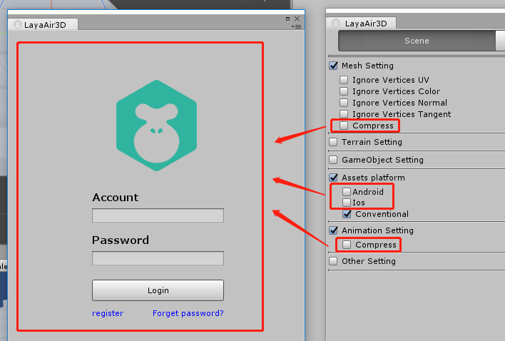
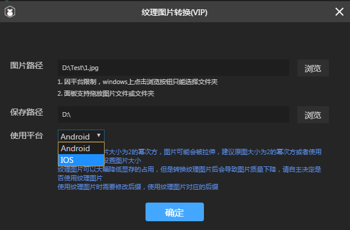
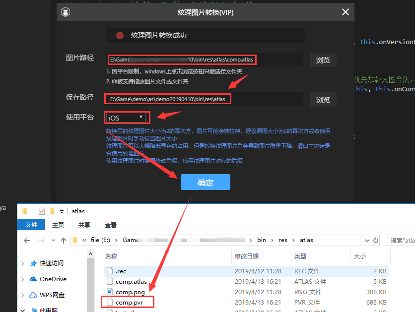
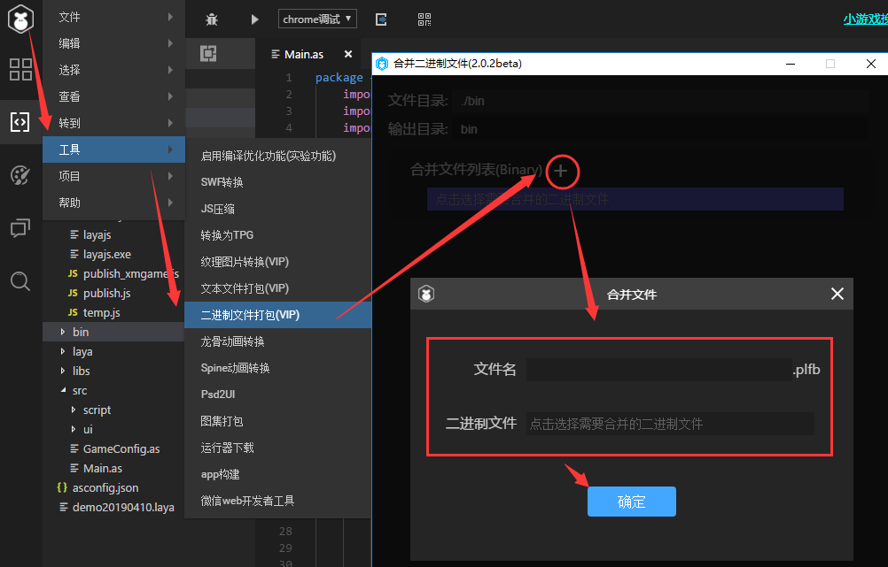

#Layaair Engine VIP

Le moteur et l 'outil de cet article

Cliquez sur le répertoire suivant pour sauter directement:

[toc]

##I. layaair 2.0 pourquoi promouvoir la fonction exclusive VIP

À layaair 1.0, le moteur gratuit n 'a pas de modèle de rentabilité, ce qui a mis à rude épreuve la survie de l' équipe.Pour réduire la pression de survie de l 'équipe de moteur, il ne peut y avoir de réduction de l' investissement humain dans les services périphériques tels que les documents, la communauté, etc.Mais ce n 'est pas la voie du développement durable des moteurs, si l' ensemble des moteurs sont toujours gratuits, cela ne fait qu 'aggraver la situation, si les moteurs ne peuvent pas survivre, cela doit être une mauvaise nouvelle pour la grande majorité des entreprises de jeu qui n' ont pas la capacité de développer et de maintenir les moteurs.

Ainsi, avant le lancement du 2.0, nous avons réfléchi à un point d'équilibre, à savoir réduire les coûts de développement pour les promoteurs, utiliser gratuitement les moteurs et développer efficacement les jeux à faible seuil, et trouver la voie d'un développement durable qui permette aux moteurs de survivre.

Par conséquent, nous continuons d 'améliorer les performances des moteurs et des outils gratuits de 2.0 dans le cadre de la base layaair 2.0, en particulier la maturité des moteurs 3D.Dans le même temps, cependant, il a été décidé de mettre à l 'essai plusieurs services à valeur ajoutée autour du moteur afin que le moteur soit durable.

Le coût actuel de la fonction VIP est une de ces tentatives et est relativement faible, même pour les particuliers.En outre, le fait de ne pas utiliser la fonction VIP n 'a pas d' incidence sur la mise en ligne du jeu.Bien sûr, une fois utilisé, il est certain que l 'efficacité du jeu sera améliorée ou optimisée.

Enfin, nous espérons que les entreprises à la valeur ajoutée autour des moteurs seront comprises et soutenues par les développeurs, et que les moteurs ne pourront investir davantage de main - d 'œuvre et d' énergie dans les documents et autres services gratuits de base que lorsque les entreprises auront réglé la pression de survie.Faire en sorte que les moteurs du développement durable de l 'écologie plus prospère.


##Quelles sont les fonctions exclusives du VIP

Puisque c 'est une fonction exclusive, les membres du VIP ont naturellement une fonction unique qui n' est pas celle du développeur du VIP.Les fonctions actuelles sont les suivantes:

###Compression de fichier de modèle 3D:

Effet: réduction d 'environ 60% de la taille du fichier du modèle;

The Model in 3D Game is an important part of the volume of Game resources.Ainsi, la réduction de la taille du fichier modèle permet de réduire la durée de chargement du jeu et d 'accélérer la vitesse d' entrée du joueur.Dans le contexte actuel de la vitesse du réseau, la réduction du volume du jeu est également une fonction à valeur ajoutée plus importante.

###Compression de texture (2d + 3D):

Effet: réduction d 'environ 75% de l' affichage et réduction du phénomène carden de décodage d 'images.

Dans un jeu, la compression texturée n 'est pas utilisée, afin d' économiser l 'occupation apparente.En règle générale, la carte originale est conçue sur la base d 'un modèle à faible résolution, puis étirée dans le jeu pour s' adapter à un modèle à haute résolution.Cela entraîne un phénomène de mosaïque dans le jeu (ce problème est dû à un grand nombre de petits jeux dans certains modèles de haute résolution d 'André), alors que les modèles de compression texturée, même conçus à haute résolution, prennent moins de place dans la mémoire, de sorte qu' en cas d 'occupation apparente équivalente, les effets de compression d' images 2D et de traction sur des modèles à haute résolutionComme le montre la figure 1.L 'image 3D fonctionne mieux après compression, la perte de compression pour le motif original est presque négligeable.

 


(Figure 1)

> Rappel: après compression texturée en 3D, il est pratiquement impossible de visualiser, donc recommandé d 'utiliser.Cependant, il faut faire preuve de prudence dans la compression de texture en 2D, les images statiques (par exemple ui) ne doivent pas utiliser les fonctions de compression de texture, les images dynamiques (animation de personnages 2D, etc.) ne sont pas trop évidentes et ne sont pas utilisables pour les besoins d 'expression de qualité d' image haute définition.

Description fonctionnelle:

Les formats de fichiers d 'images couramment utilisés dans les jeux sont généralement PNG et JPG, et les images doivent d' abord être décodées par CPU puis transmises à GPU pour être utilisées.Le format compressé par texture est un format qui peut être lu et affiché directement par l 'unité GPU sans décodage, ce qui permet, d' une part, d 'économiser une grande quantité de visualisation et, d' autre part, de réduire la pression CPU résultant du décodage d 'images.

Ce qui doit retenir l 'attention de l' développeur.La compression de texture n 'est disponible que dans le mode webgl car elle dépend de l' accélération matérielle de la carte.En outre, le format des différentes plates - formes (systèmes d'exploitation) varie.Par exemple, nous sommes au format KTX sur la plate - forme Android et au format PVR sur la plate - forme IOS.

> en raison du format différent des différentes plates - formes, les jeux entre plates - formes, en utilisant la compression texturée tout en réduisant l 'apparence, ont pour coût d' augmenter la taille du fichier et, en fin de compte, de trouver un point d 'équilibre en fonction du projet.

###Compression de fichiers d 'animation 3D:

Effet: réduction d 'environ 40% de la taille du fichier d' animation 3D;

La compression des fichiers d 'animation 3D, comme celle des modèles, a pour effet de réduire la taille des fichiers téléchargés afin d' accélérer l 'entrée des joueurs dans le jeu.

###Regroupement des documents (json + binaire):

Effet: les fichiers de texte du type json peuvent être fusionnés pour réduire sensiblement le nombre d 'interactions de téléchargement de fichiers et améliorer l' efficacité de chargement de jeux;

Description fonctionnelle:

Lorsqu 'il y a plus de petits fichiers dans le jeu, les demandes http sont considérablement augmentées, ce qui ralentit le chargement, tandis que les fonctions de fichiers combinées peuvent fusionner des fichiers de type json, ce qui réduit le nombre de demandes de fichiers http et améliore ainsi l' efficacité de chargement.Bien entendu, en cas de fusion aveugle, les documents peuvent être téléchargés en une seule fois après emballage.Les concepteurs doivent donc utiliser le projet en fonction de sa situation réelle, en particulier lorsqu'il y a beaucoup de petits documents.

###Autres:

Le nombre de modules élargis continuera d'augmenter à l'avenir (nous continuerons de recueillir les fonctionnalités dont les membres ont besoin d'urgence et d'augmenter le nombre de modules VIP grâce à l'augmentation du nombre de votants).

###Note spéciale

####Services techniques autres que les fonctions VIP

Il y a souvent des développeurs qui se posent la question de savoir si l 'achat de VIP peut nous aider à répondre à certaines questions sur les moteurs.Ici, je suis très désolé de vous répondre que l 'achat de la fonction VIP offre des avantages principalement la fonction exclusive elle - même, mais aussi des questions liées à l' utilisation de la fonction VIP, par exemple la fonctionnalité exclusive VIP ne sera pas utilisée, ou des soupçons de bug au cours de l 'utilisation, ainsi que des conseils et des avis sur la fonction exclusive VIP, peuvent être directement associés à la fonction exclusive du moteur VIP pour communiquer qq Groupe, le groupe QQ est:`739490368`

S'il existe une demande de services techniques, le coût élevé de ces services n'est pas supportable par le prix actuel de la fonction VIP.S' il y a une demande d 'achat de services techniques, on peut faire des recherches par micromessagerie.`399050`, contacter les responsables de la coopération commerciale des services techniques pour communiquer ou comprendre.

####Distinction entre le VIP personnel et le VIP d 'entreprise

Le VIP d 'entreprise et le VIP personnel sont identiques dans l' utilisation de la fonction, il n 'y a pas de différence fonctionnelle.

La seule différence est que le compte VIP personnel ne peut être lié qu 'à deux terminaux et que le numéro de compte ne peut être connecté qu' à l 'un d' eux à la même heure.Le même compte VIP d 'entreprise peut relier 20 terminaux et en même temps enregistrer 10 terminaux.Cela facilite la maintenance du compte de l 'entreprise et évite les problèmes liés à la cessation de service.


##Tarification et achat de la fonction VIP et acquisition de factures

###Prix de la fonction VIP

####Personnel VIP:

1 024 yuan / an / maximum Binding 2 terminal / Simultaneous Connection 1 Terminal

####Entreprise VIP:

10 240 yuan / an / maximum

###Mode d 'achat

####Acheter sur Internet

Adresse du lien:[https://www.layabox.com/vip/](https://www.layabox.com/vip/)

Étape 1: cliquez sur la page d 'introduction VIP sur le site officiel pour accéder à la page d' achat, comme le montre la figure 1 - 1.


(Figure 1 - 1)

Etape 2: sélectionner le mode d 'accès sur la page d' achat, le numéro de compte est commun à la communauté, cliquez sur la figure 1 - 2`手机或用户名登录`, saisissez un numéro de téléphone portable ou un nom d 'utilisateur et un mot de passe et confirmez l' accès.


(Figure 1 - 2)

Mesure 3: après l 'enregistrement, sélectionnez d' abord le type de membre individuel ou d 'entreprise, puis le mode de paiement (micromessagerie ou paiement Bao), puis cliquez sur l' achat immédiat, comme le montrent les figures 1 à 3.Une fois le paiement effectué, le compte précédemment enregistré devient le compte VIP.Vous pouvez profiter de la fonction VIP si vous cliquez sur le numéro de compte avant d 'utiliser la fonction VIP.

 


(figures 1 à 3)

####Achat dans layaairide

Première étape:

Téléchargez la dernière version de layaairide, cliquez sur le bouton du Centre personnel situé dans le coin inférieur droit ou le coin supérieur droit.Après l 'accès (c' est aussi le numéro de compte et le mot de passe dans la communauté), on peut voir les boutons d 'achat des membres, comme le montre la figure 2 - 1.Cliquez directement sur ce bouton pour accéder à l 'interface d' achat.

 


(Figure 2 - 1)

Mesure 2:

Sur la page de recharge, sélectionnez le type de membre VIP préféré, cliquez sur le bouton du mode de paiement (pool de paiement ou micro - message) pour afficher le Code bidimensionnel de paiement correspondant, comme le montre la figure 2 - 2, le paiement du Code de balayage devient membre VIP, et l 'enregistrement du compte avant l' utilisation de la fonction VIP permet de bénéficier de la fonction VIP.



(Figure 2 - 2)

####Achat dans le module d 'exportation Unity de layaair

Première étape:

Vérifier si la dernière version du module unity3d est disponible et, dans la négative, recommander une mise à jour (au moins 2.0.1).Et vérifiez si le moteur et la version 1 à l 'insert, faute de quoi l' ancien moteur ne peut pas identifier la nouvelle version de l 'insert, ce qui peut rendre certaines fonctions inutilisables.

Téléchargement de la dernière version de l 'interface d' exportation Unity[点击进入插件下载地址](https://ldc2.layabox.com/layadownload/?type=layaairide)(voir la figure 3 - 1.


(Figure 3 - 1)

Mesure 2:

Après l 'installation, cliquez sur n' importe quelle fonction VIP pour obtenir les droits d 'authentification de compte d' accès.Comme le montre la figure 3 - 2.

 


(Figure 3 - 2)

Mesure 3:

Si vous êtes connecté et VIP, utilisez la fonction VIP directement.

Si le VIP n 'est pas acheté, cliquez sur les fonctions VIP à droite de la figure 3 - 2, et sautez directement sur l' interface d 'achat VIP.Ou en cliquant sur le bouton`Account`Numéro de compte`Recharge`(recharge) pour accéder à l 'interface d' achat VIP.Comme le montre la figure 3 - 3.

 


(Figure 3 - 3)

Dans l 'interface d' achat VIP, sélectionnez le type de membre VIP préféré, cliquez sur le bouton du mode de paiement (pool de paiement ou micro - message) et devenez membre VIP après le paiement du Code de balayage droit, comme le montre la figure 3 - 4.Vous pouvez profiter de la fonction VIP si vous cliquez sur le numéro de compte avant d 'utiliser la fonction VIP.

 


(figures 3 à 4)

###Facture relative

####Entrée de facturation

Adresse de la facture:[https://developers.masteropen.layabox.com/dist/recharge_succ_list.html](https://developers.masteropen.layabox.com/dist/recharge_succ_list.html)

####Sélection de l 'enregistrement de la facture

Dans l 'arrière - plan de la facture, sélectionnez le dossier de consommation payé et cochez l' option suivante.Comme le montre la figure 4 - 1.


(Figure 4 - 1)

####Remplir les factures et les messages de messagerie express

Choisissez le dossier de consommation et cliquez sur`下一步`Après, vous entrez dans la page où sont remplies les informations relatives à la facture et remplissez les informations authentiques par les options et les cadres de saisie de la figure 4 - 2, et`提交`(Veuillez vérifier l'exactitude de l'information, la facturation erronée résultant d'une erreur de communication, sous la responsabilité de la partie ayant rempli la facture).


  


(Figure 4 - 2)

####Rappel de facture

En raison de la périodicité fiscale des factures,

Si une demande de facturation est présentée avant le 20 de chaque mois, des factures sur papier seront établies et envoyées dans le mois en cours (généralement environ une semaine après la présentation de la demande).

Si une demande de facturation est présentée après 20 jours, une facture sur papier doit être établie et envoyée après le 10 du mois suivant (environ une semaine après le 10).

Les périodes ci - dessus sont prolongées en cas de vacances.

Enfin, s' il y a une urgence particulière, vous pouvez ajouter à la fonction VIP la fonction exclusive de communication qqq`739490368`) consultez l 'administrateur de liaison.


##MODALITÉS d'utilisation des fonctions VIP

Les fonctions VIP de 2D doivent être utilisées à layaairide, et les fonctions VIP de 3D doivent être utilisées dans les connecteurs d 'exportation de layaair.On va se renseigner.

Comme le montre la figure 5 - 1.La fonction VIP de 2D peut être trouvée et utilisée dans la barre d 'outils du menu de navigation.

  


(Figure 5 - 1)

Comme le montre la figure 5 - 2, les fonctions VIP 3D combinées avec les fonctions ordinaires peuvent être visualisées et ne peuvent être utilisées qu 'une fois que l' authentification du VIP a été enregistrée.


(Figure 5 - 2)
En ce qui concerne l 'utilisation de la fonction VIP, la plupart des fonctions 3D sont plus faciles à comprendre et, à l' exception de la compression d 'autocollants, la compression de modèles et la compression de fichiers d' animation ne sont que des modifications de la taille du fichier.On trouvera ci - après une description détaillée de certaines fonctions qui requièrent notre attention.

###Transformation d 'images texturées (compression texturée)

Ouvrez layaairide.`纹理图片转换`Interface fonctionnelle

Clic`浏览`Sélectionnez le dossier dans lequel se trouve l 'image à convertir (si vous ne voulez pas sélectionner le dossier, simplement glisser - le dans le panneau fonctionnel),

Cependant, spécifie le Répertoire de sortie et la plate - forme (androïde ou IOS) à utiliser après la compression sélectionnée, comme le montre la figure 6 - 1.

 


(Figure 6 - 1)

####Compression texture de monographies JPG

Il convient de noter ici que l 'utilisation de la compression texturée distingue les plates - formes et que le suffixe de fichier d' André comprimé de l 'iOS est différent.Cliquez donc sur`确定`On verra.`.ktx`Et`.pvr`Deux fichiers de suffixe différents sont présentés dans la figure 6 - 2.

 


(Figure 6 - 2)

Ces deux fichiers sont utilisés séparément pour différentes plates - formes du système, dont KTX pour la plate - forme Android.PVR plateforme iOS pour pomme.

On peut mettre ces deux fichiers différents.`bin/res`Table des matièresIl n 'y a pas de différence entre le mode d' utilisation et les ressources JPG et Ping, et il suffit d 'ajouter un jugement pour distinguer les plates - formes afin d' appeler différents suffixes.Renvoie simplement le Code comme suit:


```typescript

//以下代码片段仅作参照
.......
    if (Browser.onAndroid) {
		this.extension = "ktx";
    } else if (Browser.onIOS) {
        this.extension = "pvr";
    }

    var sp:Sprite = new Sprite();
    sp.loadImage("res/1."+this.extension);
.......	
//以上代码片段仅作参照
```


####Compression de texture PNG

Comme la plate - forme Android ne supporte pas la conversion du format PNG en format de compression de texture (il suffit de continuer à utiliser le format PNG sur la plate - forme Android), les images en format PNG ne peuvent utiliser la compression de texture que sur la plate - forme IOS.

Pour ce qui est de l 'utilisation des outils, il n' y a pas de différence notable entre les diagrammes JPG et les processus d 'utilisation.D 'une part, il convient de noter que la plate - forme Android n' est pas en mesure de procéder à la compression de texture et qu 'elle ne peut continuer qu' à utiliser les ressources du format PNG.D 'un autre côté, il convient de noter que la largeur de la carte PNG doit être la Sous - puissance de 2.

#####Compression d 'images

Pour la compression d 'Atlas d' un suffixe de Ping, l 'utilisation est identique à celle d' un seul diagramme, mais pour le traitement de l 'image, la barre de chemin d' image, glisser. PG ou le fichier d 'Atlas sont identifiables et comprimés avec succès.Les processus sont présentés dans les figures 6 à 3.

 


(figures 6 à 3)

###Emballage de fichiers (fichier json + fichier binaire)

Cette fonction permet de regrouper plusieurs fichiers dispersés en un seul document, ce qui permet de combiner les fichiers texte au format json et les fichiers binaires, comme le montre la figure 7.

 


(Figure 7)

####Opération de fusion de fichiers de format json

Ouvre.`文本文件打包`L 'interface fonctionnelle VIP, comme le montre la figure 7 - 1, cliquez sur la zone de blocs de couleurs pour sélectionner les fichiers de format json sous le catalogue Bin pour fusionner (Atlas, scènes, préformes prefab, etc.

 


(Figure 7 - 1)

Les règles de fusion peuvent être multiples, cliquez sur`(+)`Vous pouvez créer une règle de fusion dans le nouveau panneau, comme le montre la figure 7 - 2.
  


(Figure 7 - 2)

Il convient de noter que le nom du fichier dans la figure 7 - 2 est celui - là.`.plf`Est un pseudo - suffixe, d 'abord un vrai suffixe, mais compte tenu du fait que le paquet local du jeu de micro - messagerie n' est pas reconnu.plf ce suffixe de fichier, afin de distinguer le type binaire, souvenez - vous de ce type.Le document qui sera finalement créé, comme le montre la figure 7 - 3, sera un document qui sera remplacé par json.

Cliquez pour déterminer si toutes les règles de fusion sont prêtes.Pour voir les résultats de la compilation de la figure 7 - 3.`打开发布文件夹`Cliquez sur le bouton pour voir le fichier fusionné.

 


(figures 7 à 3)

####Opération de fusion de fichiers binaires

La fusion de fichiers binaires et la fusion de fichiers json sont pour l 'essentiel identiques, ce qui signifie que json fusionne les fichiers json et les fichiers binaires.En outre, le type de fusion de fichiers json est PLF et le fichier de sortie est un suffixe json.Le type de fusion de fichiers binaires est plfb et le fichier sortant est un suffixe zip.Par conséquent, le processus d 'exploitation n' est plus détaillé et, à travers deux graphiques, décrit approximativement le processus d 'utilisation et l' emplacement de la différence.

 


Figure 7 - 4 types de surveillance

 


(figures 7 à 5)

Une règle de regroupement des fichiers correspond à un fichier zip, tel que la règle 3dscene.plfb, qui produit un fichier 3dscene.zip.

Rappelez - vous ici que ce suffixe zip n 'est pas un format standard zip, mais un fichier binaire avec un suffixe zip, pour répondre à l' absence d 'un suffixe rare dans les jeux de micro - messagerie, et qu' il n 'est donc possible de trouver qu' un seul suffixe usuel.Ne tentez pas de décompresser le fichier zip après la sortie synthétique, il est impossible de décompresser avec succès.

####Utilisation de fichiers fusionnés

Qu 'il s' agisse d' un atlas ou d 'un scénario, il n' y a pas de différence entre l 'usage antérieur à la fusion et l' utilisation postérieure à la fusion, y compris la façon dont l 'image ou le nom de scène originaux sont ouverts, comme auparavant.La seule chose à noter est que, pour utiliser une image ou une scène avant la fusion, il faut veiller à ce que le document fusionné soit chargé d 'abord, de sorte que la logique de chargement antérieur soit placée dans le retour de chargement de fichier fusionné.

Le Code de référence de l'exemple json est le suivant:


```typescript

//先加载plf类型的合并后文件Image.json
Laya.loader.load([{url: "res/Image.plf", type: "plf"}], Handler.create(this, function():void {
	
    //在回调里，正常使用原来的图集
	Laya.loader.load("res/atlas/comp.atlas", Handler.create(this, function():void {
		var img:Texture = Laya.loader.getRes("comp/comp.png");
		var sp:Sprite = new Sprite();
		sp.graphics.drawTexture(img);
		Laya.stage.addChild(sp);
		}));
    
	Laya.loader.load("res/atlas/test.atlas", Handler.create(this, function():void {
		var img:Texture = Laya.loader.getRes("test/test.png");
		var sp:Sprite = new Sprite();
		sp.graphics.drawTexture(img);
		Laya.stage.addChild(sp);
		}));
}));
```


Ii) Code de référence pour l'exemple binaire:


```typescript

//先加载plfb类型的合并后二进制文件bone.zip
Laya.loader.load([{url: "res/bone/bone.zip", type: "plfb"}], Laya.Handler.create(this, function() {
            // 模板
            let template = new Laya.Templet();
            template.on(Laya.Event.COMPLETE, this, function() {
                let skeleton = template.buildArmature(0);
                Laya.stage.addChild(skeleton);
                skeleton.pos(300, 300);
                skeleton.scale(.5, .5);
                skeleton.play(0, true);
            });
            template.loadAni("res/bone/alien.sk");
        }));
```


Il est important de noter que le type de fichier texte emballé est le PLF.`type: "plf"`Le type de chargement binaire est plfb ((`type: "plfb"`).


###Mode de communication de questions fonctionnelles VIP

Enfin, si vous êtes le développeur qui a acheté la fonction VIP, si vous rencontrez un problème avec la fonction VIP, bienvenue dans le Groupe de communication de la fonction VIP.

Qqq number: 739490368

Il convient de noter que le personnel officiel du moteur ne répond que dans le Groupe aux questions, recommandations et bug concernant l 'utilisation de la fonction VIP.Il n'y a pas de service de questions - réponses pour les questions qui ne sont pas liées au VIP.

