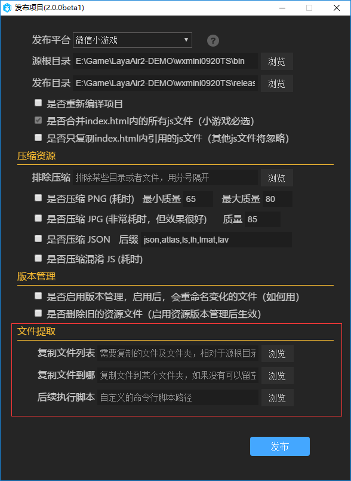

#Introduction au jeu de micro - lettres

> Author: Charley

#####D'abord, qu'est - ce qu'on doit savoir sur les micros?

L'explication officielle du jeu est:

Le petit jeu de micro - lettre est une sorte de programme de micromessagerie, c 'est - à - dire qu' il est instantané, sans téléchargement, sans avoir à expérimenter, peut jouer avec des amis dans le micro - message, par exemple PK, entourage, etc.

Non vérifié - la page s' ouvre dans une nouvelle fenêtre ou un nouvel ongletC'est censé être le jeu H5?

Comment ça?Cela commence par la définition de H5...

H5 est généralement considéré comme le nom abrégé de HTML5, mais aux yeux de l 'développeur, HTML5 n' est qu 'une norme technique Web qui satisfait à cette norme et le jeu qui peut fonctionner dans un navigateur est le jeu HTML5.Plus de gens connaissent mal la technologie.Pour plus de commodité, les jeux qui ne nécessitent pas de téléchargement sont appelés jeux H5 et les jeux de pages de téléphonie mobile.

L 'environnement de fonctionnement d' un petit jeu de micromessagerie n 'est pas un navigateur, ni un navigateur, mais un Runtime dans un app de micromessagerie.Bien que les interfaces des microjeux soient compatibles avec la plupart des fonctionnalités Canvas et webgl, elles sont instantanées sans téléchargement des caractéristiques HTML5 installées.Il est clair que les jeux de micromessagerie ne sont pas des jeux standard HTML5.

**Alors...**Comment le développement du jeu peut - il fonctionner dans un navigateur?

####Est - ce que les développeurs ne peuvent utiliser que l 'API libre des jeux de micro - messages?

Avec ces deux questions, nous poursuivrons notre présentation.

Comme on le sait, le moteur layaair est basé sur l 'ensemble de la plate - forme HTML5, puisque c' est l 'ensemble de la plateforme, il ne faut pas rater le petit jeu de micromessagerie!

Ainsi, le jour de la publication du jeu de micromessagerie, le moteur layaair a également lancé pour les développeurs une bibliothèque d 'adaptation du jeu de micromessagerie.À partir de la version layaair 1.7.14, les développeurs téléchargent le moteur ou l 'ide de la dernière version, et il suffit d' initialiser le Programme d 'adaptation conformément au document de programme d' adaptation pour adapter sans interruption le projet de jeu HTML5 à un petit jeu de micromessagerie.Layaairide 2.0, en particulier pour le développement et la diffusion de micro - jeux, a fait une grande optimisation.

Ainsi, les projets mis au point par l 'intermédiaire du moteur layaair peuvent fonctionner non seulement dans un navigateur, mais aussi dans une plate - forme pour un jeu de micromessagerie.

Peut - être le développeur veut - il savoir, puisque le jeu de micro - messagerie n'est pas HTML5,

####Quelles sont les différences à prendre en compte dans le processus de développement?

Si l 'API est mis au point au moyen d' un micro - message officiel, il faut faire attention, par exemple ne pas soutenir DOM et Bom, les petits jeux ne peuvent avoir qu 'une toile, ne pas soutenir eval, ne pas soutenir XML, etc...

Mais...

Pour les concepteurs du moteur layaair, il n 'est pas nécessaire de comprendre les différences, il suffit de suivre les règles normales de développement du moteur layaair.

> Attention & ‧‧;: les jeux de micro - messages, bien qu 'ils soient une sous - catégorie de microprogrammes, ne sont pas synonymes de petits programmes, l' API est différent, le moteur layaair n 'est pas favorable au développement de microprogrammes.

#### **Pour développer un petit jeu, il faut faire attention à:**

#####Lors de la création d 'un projet, cochez le bouton. "`增加微信小游戏支持`".Comme le montre la figure 1.

 

(Figure 1)

#####Contrairement à layaair 1.x, layaair 2.x n 'a plus besoin d' écrire manuellement le Code de la Bibliothèque d 'adaptation du jeu

#####3, une fois le développement achevé, cliquez directement sur le bouton de lancement du projet, peut être publié sous forme de micromessagerie.Comme le montre la figure 2.

  

(Figure 2)

En particulier, grâce à la fonction d 'extraction de fichiers, les fichiers de paquets locaux 4M ou 8m du projet peuvent être extraits directement dans le Répertoire de micromessagerie au moment de leur publication.Pour l 'extraction de paquets locaux dans un projet.

Pour d 'autres petits jeux, attention et expérience, voir d' autres fichiers layaair.

En outre, il est fortement recommandé de regarder les documents officiels des jeux de micro - lettres, les documents des moteurs layaair sont beaucoup plus liés aux moteurs, bien sûr, il y a aussi un certain nombre d 'interfaces de jeu, mais regardez attentivement les documents officiels des micromessageries.

Liens:

[https://developers.weixin.qq.com/minigame/dev/index.html](https://developers.weixin.qq.com/minigame/dev/index.html)

