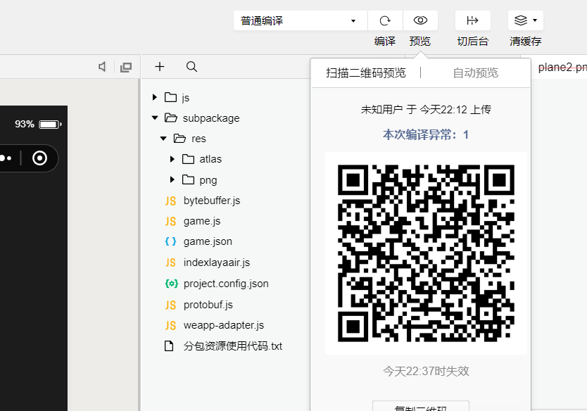

#Créer un premier jeu de micro - lettres

]*Autohor: Charley - version: layaair - 2.0 Update: 2018 - 10 - 27*

###I. PRÉPARATION À l'environnement de DÉVELOPPEMENT

####Téléchargement et installation de l 'environnement de développement intégré de layaairide

Layaairide est un environnement de développement intégré pour le moteur layaair, qui intègre le moteur layaair et des exemples de projets, UI, animation, etc., éditeur visuel, l 'élaboration et la gestion de codes de projet, etc.**Les promoteurs peuvent créer et diffuser des microjeux en utilisant directement layaairide.**

**Com.NET.CN guanwangwangxiazaizhi.com.NET.CN gwxzdz.com.NET.CN**- Oui.[http://ldc2.layabox.com/layadownload/?type=layaairide](http://ldc2.layabox.com/layadownload/?type=layaairide)

####Téléchargement et installation d 'outils de développement de micro - messages

Les outils de développement de micromessagerie sont principalement utilisés dans la prévisualisation et la mise en page de petits produits de jeu, les essais de machines, les présentations téléchargées et ainsi de suite.Est un outil indispensable au développement de petits jeux.

**Developing Tool**- Oui.
[https://developers.weixin.qq.com/minigame/dev/devtools/download.html](https://developers.weixin.qq.com/minigame/dev/devtools/download.html)

  

####Create a small Program Creator account number, acquisition of Developer ID (appid)

Même s' il n 'y a pas d' appid pour mettre au point des réglages, les fonctions peuvent être limitées.Par conséquent, avant de développer, il est préférable de créer un compte de développeur de micromessagerie publique.

#####Attention avant l 'enregistrement

Un.**L 'enregistrement comme développeur personnel n' a pas besoin d 'un numéro de version, mais n' a pas non plus accès à la fonction de paiement.**Le débit peut être réalisé par une publicité d 'accès, lorsque l' accès publicitaire peut être rempli d 'informations personnelles ou d' informations d 'entreprise.
Si dans le jeu**Il faut utiliser le numéro de compte de l 'entrepreneur.**".Et le numéro de la version.
Lors de l'enregistrement du compte de la plate - forme publique de micromessagerie, il convient de garder à l'esprit que la classification est la classification des jeux, faute de quoi le compte enregistré ne peut être utilisé que pour mettre au point de petits programmes plutôt que de petits jeux.
À l'heure actuelle, l'achat dans le cadre de petits jeux n'est disponible qu'en version anglaise et la publicité est accessible à André et à IOS.

**Adresse d 'enregistrement**- Oui.[https://mp.weixin.qq.com/wxopen/waregister?action=step1](https://mp.weixin.qq.com/wxopen/waregister?action=step1)

Après l 'enregistrement du compte de l' développeur, l 'appid est visible dans les paramètres de développement du menu de configuration.

###

###Création et lancement de microjeux avec layaairide

####Création d 'exemples de petits jeux avec layaairide

Ouvrez layaairide, cliquez`新建`Affiche le panneau du nouveau projet.Sélectionnez n 'importe quel type d' article dans la liste des types d 'articles à gauche du panneau, définissez le nom de l' article, le chemin du projet, le type de langage de développement, la version du moteur sur le côté droit du panneau.Pour créer un petit jeu, n 'oubliez pas de cocher`增加微信小游戏支持`Comme le montre la figure ci - dessous.

####Élaboration de projets

Cette section de développement de projet ne donne pas de détails, les moteurs associés et l 'utilisation de l' IDE peuvent voir d 'autres documents.Comme nous avons choisi de créer des exemples, nous pouvons accéder directement à la chaîne de distribution de petits jeux.

####Jeu de micro - lettres

Cliquez sur le bouton de distribution du projet, sélectionnez la plate - forme de distribution comme un jeu de micromessagerie dans l 'interface du projet de distribution éjectée.

Si vous ne l 'avez pas compilé dans le projet, vous pouvez sélectionner si vous voulez reformuler le projet et le reformuler au moment de sa publication.

L'extraction de fichiers est essentielle en raison des restrictions imposées au téléchargement du paquet 4M.Seuls les fichiers contenus dans le paquet 4M peuvent être copiés à l 'aide d' une fonction d 'extraction de fichiers vers un répertoire d' éléments de micromessagerie spécifié.Comme le montre la figure ci - dessous.

> limitation de paquets pouvant atteindre 8m, telle qu 'elle est décrite dans d' autres documents contenant des éléments pertinents.Cet article ne s' adresse qu 'aux nouveaux joueurs qui connaissent rapidement les processus de distribution de jeux.

 

 

(diagramme: fonction d 'extraction de fichiers permettant de filtrer uniquement les fichiers de paquets 4M cochés après avoir cliqué sur le navigateur)

**Tips**- Oui.

> cliquez sur l 'icône des points d' interrogation à droite de la plate - forme de publication pour voir la description détaillée des options.

Après avoir configuré le contenu nécessaire à la publication.Dernier clic.Vous pouvez générer un petit jeu de micro - messages.

###Création d 'un projet de petit jeu à l' aide d 'un outil de développement de micro - messages

####Enregistrement du numéro de compte de l 'émetteur, sélection du type d' élément

Ouvre "l 'outil de développement de micro - messagerie Web" et connecte - le avec le Code de micromessagerie de l' développeur.Et choisissez**Projet de programme**Cliquez sur les paramètres du projet.

 

####Créer un petit jeu

Après avoir cliqué sur un petit élément de programme, dans le panneau éjecté, cliquez sur le signe du coin inférieur droit pour éjecter le panneau créé par le petit élément de jeu.Comme le montre la figure ci - dessous.

  

`项目目录`Il est préférable de sélectionner un répertoire local de paquets qui vient d 'être copié par une fonction d' extraction.Si cette fonction n 'est pas trop familière.On peut aussi choisir temporairement le catalogue des petits jeux que layaairide vient de publier (généralement dans le Répertoire racine du projet).

`AppID`Les entrées appid qui ont été précédemment vues sur la plate - forme publique de micromessagerie peuvent être mises au point sans entrée, mais les fonctions sont limitées.Il est donc préférable de saisir l 'appid.

####Compilation d 'outils de concepteur de micro - messages

Une fois que le projet de petit jeu a été créé, les effets et les réglages peuvent être prédicés dans l 'outil.

 

####Machine Test and Test

Étant donné que l 'effet du projet peut également être testé dans la layaairide, il n' y a pas de contradiction entre les effets des deux côtés, à moins qu 'il ne s' agisse de l' adaptation.Le plus important, c'est de cliquer.**Aperçu**Fonction, à travers le Code de balayage de micro - messagerie mobile, l 'essai et la mise à l' essai de la machine dans le micro - message.

 

**Tips:**

Lorsque le moteur est téléchargé, le nombre par défaut ne peut pas dépasser 4M, le Sous - paquet de configuration ne peut pas dépasser 8m, de sorte que, sous le catalogue de diffusion de l 'IDE, le Répertoire de l' exemple libs peut être supprimé directement.Parce que l 'objet de l' exemple a été intégré dans le code.js.Sinon, il se pourrait que le téléchargement soit impossible à cause de plus de 4M.Cette question sera également optimisée dans la nouvelle version.

Après avoir balayé le Code de micromessagerie, un petit programme est lancé, cliquez sur le bouton de fenêtre flottante dans le coin supérieur droit pour ouvrir le réglage et le panneau de contrôle de performance.

Après l 'ouverture du panneau de contrôle de fonctionnement et de réglage de machine, comme indiqué dans la figure ci - dessous.

 

Ainsi, le développement d 'un petit jeu complet est terminé.C 'est pas si simple.Les petits jeux mis au point par layaairide sont essentiellement sans soudure utilisés dans les microjeux.