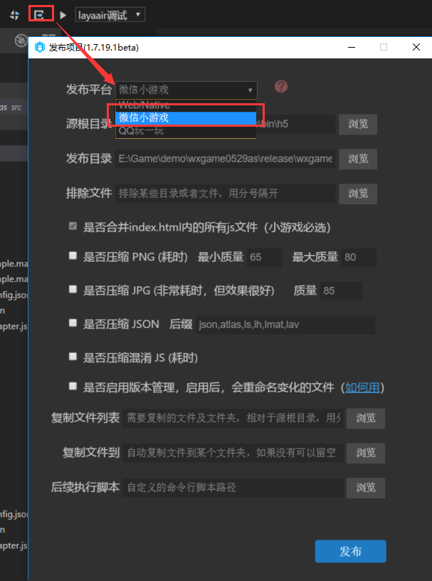

#Présentation de l 'outil de distribution de petit jeu et du Répertoire de petit jeu

> Author: Charley
]
> Ce document est basé sur la version layaairide 1.7.19.1beta

###Description de la fonction de publication de l 'IDE

Cliquez sur le bouton d 'affichage et sélectionnez un petit jeu de micro - messages, comme le montre la figure 1.

 

(Figure 1)

#####Table des matières

Le répertoire source est plus facile à comprendre que le Répertoire de publication, généralement par défaut.Si le répertoire d 'articles est copié, il faut vérifier si le répertoire est correct.En outre,**Les espaces, les caractères chinois et les caractères chinois ne sont pas autorisés dans le chemin de répertoire, faute de quoi la publication échouera.**

#####Exclusion des fichiers

Il y a souvent des développeurs qui ne comprennent pas.Lorsque vous sélectionnez ici la table des matières à exclure, les fichiers dans la table des matières à exclure ne sont pas non plus publiés mais ne sont pas comprimés.Après l 'exclusion ici, toutes les options de compression suivantes sont cochées et les fichiers de la liste d' exclusion sont sautés.

#####Compression and Edition Management

Les options de compression, cochez et activez la compression dès que vous les sélectionnez, car elles sont plus intuitives et permettent d 'expérimenter votre propre expérience, peu de présentations.Il convient de noter qu'une fois activé, il faudra beaucoup de temps.Le délai de publication sera prolongé.En outre, sans cocher les options permettant d 'activer la gestion de version.Chaque fois que la publication est publiée, tous les documents non exclus sont comprimés.Donc, si ce n 'est qu' une mise à jour partielle**, il est recommandé d 'activer la gestion des versions de sorte que seules les versions mises à jour soient comprimées.La publication peut prendre moins de temps.**

Si un développeur dispose d 'un outil de compression de tiers plus utile, il est possible de ne pas sélectionner l' outil de compression de ceinture propre de l 'IDE en bas`后续执行脚本`Une fonction, exécute un outil de ligne de commande personnalisé ou un script, comprimé avec l 'outil préféré.* Les outils particulièrement utiles peuvent également être recommandés à Charley *.

#####Fichier de reproduction

Par exemple, un répertoire de paquets locaux est programmé dans le projet, et le Répertoire de paquets locaux est alors directement copié dans le Répertoire de projets du petit jeu par le biais des deux options de copie du fichier.Bien entendu, les fichiers dans le Répertoire racine doivent encore être traités manuellement, pour cette partie, les camarades de l 'équipe d' outils sont en cours d 'optimisation et la version suivante peut être résolue.

###Après la publication du catalogue de jeux

  

(Figure 2)

#### `code.js`Document de projet`libs`Catalogue de moteurs

En règle générale, le Répertoire libs peut ne pas être reproduit dans le petit répertoire car, pour résoudre les problèmes du domaine window, le petit jeu combine l 'ensemble du jeu et la Bibliothèque citée dans le code.js.Toutefois, si les projets ts et JS ne sont pas cités dans l'index.html, ils le sont plutôt dans le projet ou dans le projet as sous la forme d'une requête.Ça ne colle pas au Code.A ce moment - là, il est également nécessaire de copier manuellement les bibliothèques qu 'il utilise, en particulier les banques de tiers.

#### `res`Répertoire des ressources

Les res sont un répertoire de ressources par défaut, et en raison de la limitation du paquet initial, il est recommandé que le contenu du paquet initial soit bien planifié, de préférence placé dans un catalogue unique, ce qui facilite l 'enlèvement du paquet initial.

Ce document fusionnera JS en JS.

#### `game.js`Fichier d 'entrée

Les fichiers JS à l 'entrée du jeu et les bibliothèques d' adaptation JS et autres sont introduits ici.L'IDEA a été créée au moment de la création du projet et, d'une manière générale, il n'y a pas lieu de bouger ici.

#### `game.json`Fichier de configuration

L 'outil développeur et le client doivent lire cette configuration pour terminer les paramètres de rendu et d' attribut d 'interface associés.Par exemple, la direction de l 'écran vertical, l' affichage de la barre d 'état, les petits sous - traitants de jeux sont configurés ici.Comment configurer concrètement, et utiliser les paramètres[查看微信小游戏的开发文档](https://mp.weixin.qq.com/debug/wxagame/dev/index.html?t=2018115)".

#### `project.config.json`Fichier de configuration de projet

Le document contient des informations sur les petits jeux, qui peuvent être éditées directement si vous voulez modifier des informations telles que l 'appid.

> la valeur du paramètre de projet libversion est forcément game, il n 'y a pas d' erreur ici.Cependant, en cas d 'affichage normal dans layaairide et de citation d' une bibliothèque d 'adaptation, après la publication en tant que petit jeu, il est possible de vérifier si la valeur dans le Librairie n' est pas un jeu.Non, il faut changer de jeu.

#### `weapp-adapter.js`Fichier de base de données

Les outils de publication layaairide sont automatiquement cités lors de leur publication.

