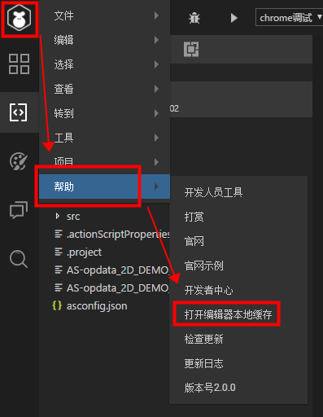

# IDE常见问题的解决方案

>udate：2019-3-13

###キャッシュ大法治百病

開発者はIDEを使う時、エラーを出すことがあります。時には無視すればいいです。時にはIDEを再起動しなければ解決できません。再起動しても解決できない場合もあります。この時。開発者に先にキャッシュを整理して解決するよう提案します。ほとんどの場合はキャッシュの問題が原因です。

####キャッシュファイルはどこですか？

IDEナビゲーションのヘルプメニューには「`打开编辑器本地缓存`」を図1に示します。ここをクリックすることで、キャッシュのリソースディレクトリにジャンプできます。

 

（図1）

キャッシュディレクトリが開いたら、図2に示すようになります。レイアウトの問題なら、layoutディレクトリを直接削除することができます。もし何の問題か分からないなら。ご覧のカタログとファイルは全部削除しても大丈夫です。

 

キャッシュを削除すると、多くの一般的な問題が解決されます。まだ解決されていないなら、QQ群管理者に連絡して、遠隔的に処理に協力します。本稿では、問題解決のための経験に基づいて、この文書にいくつかの経験をまとめていきます。