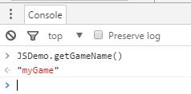

# AS3与JS混合编码

AS 3とJSの相互作用はよくある需要で、flashプラグインは簡単なインターフェース関数を提供します。`ExternalInterface.call`和`ExternalInterface.addCallback`JSと対話する。しかしHTML 5をリリースすると、このフラッシュのインターフェイスが使えなくなります。

AS 3言語対応HTML 5のエンジンとして、LayaAirを通過できます。`Browser.windows`和`__JS__`方法はJSと相互作用し、LayaAirエンジンのASコンパイラは特有のマクロコンパイルをサポートし、AS 3開発者がより複雑なAS 3とJSの混合符号化を実現するのを助けます。

###1.AS 3を初めて知ってブラウザと対話する

仮に私たちがJSDemo.asというスタートクラスのファイルを作成したとします。AS 3コードの中でJSのオリジナルのalertポップアップ効果を実現します。サンプルコードは以下の通りです。

**方式一:**


```java

package 
{
	import laya.utils.Browser;
	public class JSDemo {
		
		public function JSDemo() 
		{
			//初始化引擎
			Laya.init(0, 0);
			//运行JS alert
			Browser.window.alert('我是alert');			
		}		
	}
}
```


**方式二:**


```java

package 
{
	public class JSDemo
	{
		public function JSDemo()
		{
			//初始化引擎
			Laya.init(0, 0);
			//运行JS alert
			__JS__('alert("我是alert")');
		}
	}
}
```


以上の2つの方式は運転の結果から見て、図1に示すように完全に一致しています。

<br/>
（図1）

二つの方式の違いはどこですか？

　　`Browser.window`これはブラウザのwindowに対する引用で、ブラウザの全体関数はすべてマウントしています。`window`上にあるので、Browser.window.alertで弾戸の関数を喚起することができます。すべてのwindowの関数と属性はこの方式で行うことができます。

　　`__JS__`LayaCommpilerコンパイラが提供するマクロコンパイル関数です。`__JS__()`関数内のコードはコンパイルされず、jsコードに直訳されます。


###2.AS 3とブラウザが交互に階段を進む

LayaAirエンジンとブラウザのインタラクションはalertほど簡単ではないです。以下は例示コードを通してASとブラウザのインタラクションをさらに理解します。

**方式一:**


```java

package 
{
	import laya.utils.Browser;

	public class JSDemo
	{
		public function JSDemo()
		{
			//初始化引擎
			Laya.init(0, 0);
	
			var Height:int = Browser.window.innerHeight;
			var width:int = Browser.window.innerWidth;
			Browser.window.console.log("Console Log：浏览器高："+ Height + " 浏览器宽：" + width);
		}
	}
}
```


**方式二:**


```java

package 
{

	public class JSDemo
	{
		public function JSDemo()
		{
			//初始化引擎
			Laya.init(0, 0);
			
			var BrowserInfo:String = __JS__('"Console Log：浏览器高：" + window.innerHeight + " 浏览器宽："+ window.innerWidth');
			trace(BrowserInfo);
		}
	}
}
```


以上の2つの方式は運転の結果から見て、図2に示すように完全に一致しています。

<br/>
（図2）

上記の2つの方式は相対的に言えば、採用を勧めます。`Browser.window`方式がインタラクティブで、`__JS__`方式は文字列の中でJSコードを書くので、もし誤って書き間違えたら、エラーメッセージもないです。


###3.AS 3とJSの混合符号化

プロジェクトでは第三者のjsクラスを使って開発を支援します。ASプログラムの中ではどう処理しますか？ここでは一番よく使うjquery.jsを使って説明します。

まずはjqueryの[官网下载](http://jquery.com/download/)jquery.jsバージョンは、例では私達が使っています。`jquery-3.2.0.min.js`。プロジェクトの入り口のindex.1ページにあります。`bin\h5\`目次の下）を追加します。`<script type="text/javascript" src="jquery-3.2.0.min.js"></script>`。

​*Tips：サードパーティライブラリ導入はLayaAirエンジンライブラリ導入前に追加する必要があります。*

入り口ページにライブラリの参照を追加した後、AS 3の入口ライブラリに下記のコードを作成します。


```java

package {
	import laya.utils.Browser;
	public class JSDemo {
		
		public function JSDemo() {
			//初始化引擎
			Laya.init(0, 0);
          	//Browser.window后的$(Browser.document)为第三方库jquery的方法。
			Browser.window.$(Browser.document).ready(function():void{
				
				Browser.window.alert("jquery调用成功");
			});
			
		}
		
	}
}
```


コンパイルが実行された後、私たちはポップアップが成功したことを示します。私たちはAS 3のプロジェクトで混合コードを実現することに成功しました。


###4.JS呼び出しASインターフェース

私たちが開発したプロジェクトはweb開発者と交差して呼び出すことがありますが、上記の方法でweb開発者のjsメソッドを呼び出すことができます。では、web開発者はどのように私たちの書いたロジックを呼び出しますか？開発者はさらに考えてもいいです。AS 3でH 5を開発します。実はコンパイラで直接コンパイルして、jsを生成しました。ですから、インターフェースを暴露して、ウェブ開発者に直接に私達のjsコードを呼び出すだけでいいです。簡単な例コードで使い方を説明します。

**JSDemo.asコードは以下の通りです。**


```java

package {
	import laya.webgl.WebGL;

	public class JSDemo {
		
		public function JSDemo() {
			//初始化引擎
			Laya.init(0, 0);
			
		}
      //定义一个静态函数 对外暴露给web调用者。
		public static function getGameName():String
		{
			return "myGame";
		}
		
	}
}
```


コンパイルを実行して、ブラウザコンソールを開いて、入力します。`JSDemo.getGameName()`出力が見つかりました`"myGame"`を選択します。呼び出しが成功したことを示し、これによりウェブ開発者との対話が実現された。

<br/>
（図3）


上記の例はただ静的な方法を定義しただけで、内部のすべての方法と属性を開放することもできます。

JSDemo.asコードの修正は以下の通りです。


```java

package {
	import laya.utils.Browser;

	public class JSDemo {
		
		private var name:String = "Game";
		public function JSDemo() {
			//初始化引擎
			Laya.init(0, 0);
         	//定义一个命名空间的属性为app；
			Browser.window.app = this;
			
		}
		public static function getGameName():String
		{
			return "myGame";
		}
		public function getVersion():String
		{
			return "1.2.0";
		}
		
	}
}
```


コンパイル運転、ブラウザコンソールを開いて、前後に入力します。`app`を選択します`app.name`を選択します`app.getVersion()`図4に示すように、私たちが呼び出した効果はすでに達成されています。LayaAirエンジンのAS開発とウェブ開発者のインタラクティブなシームレスさが見られます。

<br/>
（図4）


###5.コードのスマートヒント

上記の例では、JS元のメソッドを呼び出すのは簡単ですが、元のJSメソッドは、AS 3プロジェクトではコードの提示がありません。したがって、マクロコンパイル法に関連して、手動で関数宣言を追加し、コードヒントを得る。

例えば私達はwindow種類を作ります。`window.as`＊）ブラウザでよく使う関数をパッケージ化します。

window.asコードは以下の通りです。


```java

/*[IF-FLASH]*/package
{
	public class window
	{
		public function window()
		{
		}
		public static function alert(msg:Object):void
		{			
		}
	}
}
```


`/*[IF-FLASH]*/`LayaComplerのコンパイルマクロです。その後のクラスはJSにコンパイルされません。これについては分かりませんので、先にご了承ください。[宏编译教程文档](https://github.com/layabox/layaair-doc/blob/master/Chinese/LayaAir_AS3/LayaCompile_Macros.md)。


このような種類があれば、私達は直接windowの書き方を書くことができます。そして、ヒントがあります。

以下は直接jsの方法で書きます。`alert()`を選択します

JSDemo.asコードは以下の通りです。


```java

package {
	public class JSDemo {
		public function JSDemo() {
			//初始化引擎
			Laya.init(0, 0);
			window.alert("我是alert");
		}
	}
}
```


コンパイル運転効果は図5に示すように、alertを成功裏に実行しました。だから、私たちはよく使うWindowの方法の開発者をすべてカプセル化することができます。これからはJSと混成符号化する時、コードのスマートヒントがあります。

<br/>

（図5）


###6.ASはNodejsを書きます

まずASの工事を新しく作って、この工事はASの原生の工事です。LayaAirのクラスはしばらく無視できます。プロジェクトのスタートクラスはここでMain.asに設定して、新しいものを作ります。`require.as`。

require.asコードは以下の通りです。


```java

package
{
	/*[IF-FLASH-BEGIN]*/
	public class require
	{
		
		public function require(path:String)
		{
		}
		
	}
	/*[IF-FLASH-END]*/
}
```


​

プロジェクトのスタートクラスMain.asコードは以下の通りです。


```java

package
{
	public class Main
	{
		public var http:Object = require('http');
		public var net:Object = require('net');
		public var url:Object = require('url');
		public function Main()
		{
			var server:Object = this.http.createServer(clientHandler);
			server.listen(8989);
		}
		private function clientHandler(req:Object,respose:Object):void
		{
			trace("收到消息");
			respose.writeHead(200, {'Content-Type': 'text/plain'});
			respose.end('Hello Laya');
		}
	}
}
```


​*Tips：nodeのサーバを作成するappiは、移動可能です。[https://nodejs.org/](https://nodejs.org/)*


　　`Main.as`ダイナミックサーバを作成しました。ポートは8989です。サーバーはクライアントからの要求を受けて、ハローLayaに戻ります。

　　`require.as`このクラスはLayaComplerコンパイラのマクロコンパイルを使っています。`/*[IF-FLASH-BEGIN]*/`和`/*[IF-FLASH-END]*/`この二つのラベルの間のコードは文法的なヒントに使われています。コンパイルに参加しません。[宏编译教程文档](https://github.com/layabox/layaair-doc/blob/master/Chinese/LayaAir_AS3/LayaCompile_Macros.md)を選択します。

​**このプロジェクトをコンパイル:**

nodeでプロジェクトを起動してjsファイルをコンパイルします。現在のディレクトリでコマンドライン入力を開く`node Main.max.js`。ブラウザで入力します。[http://localhost:8989/](http://localhost:8989/)ページの表示が見られます。ハローLaya。

これまでASコードで動的サーバを成功裏に書いたことを示しています。