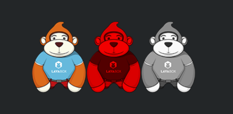
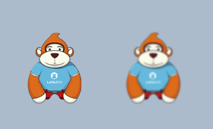

#フィルタ効果の設定

>LayaAirエンジンは、カラーフィルタ、発光（または影）フィルタ、ぼかしフィルタの3つの効果を提供します。カラーフィルタは、CanvasとWebGLモードをサポートしていますが、発光フィルタとボケフィルタは、性能の消耗が大きいため、WebGLモードのみに対応しています。


##1、カラーフィルタの設定

###1.1色フィルタAPIの概要

カラーフィルタ類のColorFilterはlaya.filtersパッケージにあり、指定行列（*4 x 5に配列されたマトリックス*）により各カラーチャンネルを変更します。

クリック[laya.filters.ColorFilter ](http://layaair.ldc.layabox.com/api/index.html?category=Filter&class=laya.filters.ColorFilter)APIの説明を見る。


###1.2カラーフィルタの設定

ビットマップにカラーフィルタを設定するには、まずカラー行列を設定し、次にコードで示すように、ColorFilter方法でカラーフィルタの例を作成します。


```java

			//由 20 个项目（排列成 4 x 5 矩阵）组成的数组，红色
			var redMat:Array = 
				[
					1, 0, 0, 0, 0, //R
					0, 0, 0, 0, 0, //G
					0, 0, 0, 0, 0, //B
					0, 0, 0, 1, 0, //A
				];

			//创建一个颜色滤镜对象,红色
			var redFilter:ColorFilter = new ColorFilter(redMat);
```


最後にSpriterのfilters属性によってカラーフィルタ効果を所定の位置に重ね合わせます。Main.asエントリクラスを作成し、デフォルトのアプリケーション（FlashBuiderを推奨）に設定します。コードは下記の通りです。


```java

package
{
	import laya.display.Sprite;
	import laya.display.Stage;
	import laya.filters.ColorFilter;
	import laya.resource.Texture;
	import laya.utils.Browser;
	import laya.utils.Handler;
	import laya.webgl.WebGL;
	
	public class Main
	{
		private const ApePath:String = "res/img/monkey1.png";

		private var apeTexture:Texture;

		public function Main()
		{
			// 不支持WebGL时自动切换至Canvas
			Laya.init(Browser.clientWidth, Browser.clientHeight, WebGL);

			Laya.stage.alignV = Stage.ALIGN_MIDDLE;
			Laya.stage.alignH = Stage.ALIGN_CENTER;

			Laya.stage.scaleMode = "showall";
			Laya.stage.bgColor = "#232628";

			Laya.loader.load(ApePath, Handler.create(this, setup));
		}

		private function setup(e:*=null):void
		{
			normalizeApe();
			makeRedApe();
			grayingApe();
		}

		private function normalizeApe():void
		{
			var originalApe:Sprite = createApe();
			
			apeTexture = Laya.loader.getRes(ApePath);
			originalApe.x = (Laya.stage.width - apeTexture.width * 3) / 2;
			originalApe.y = (Laya.stage.height - apeTexture.height) / 2;
		}

		private function makeRedApe():void
		{
			//由 20 个项目（排列成 4 x 5 矩阵）组成的数组，红色
			var redMat:Array = 
				[
					1, 0, 0, 0, 0, //R
					0, 0, 0, 0, 0, //G
					0, 0, 0, 0, 0, //B
					0, 0, 0, 1, 0, //A
				];

			//创建一个颜色滤镜对象,红色
			var redFilter:ColorFilter = new ColorFilter(redMat);

			// 赤化猩猩
			var redApe:Sprite = createApe();
			redApe.filters = [redFilter];

			var firstChild:Sprite = Laya.stage.getChildAt(0) as Sprite;
			redApe.x = firstChild.x + apeTexture.width;
			redApe.y = firstChild.y;
		}
		
		private function grayingApe():void
		{
			//由 20 个项目（排列成 4 x 5 矩阵）组成的数组，灰图
			var grayscaleMat:Array = [
				0.3086, 0.6094, 0.0820, 0, 0, 
				0.3086, 0.6094, 0.0820, 0, 0, 
				0.3086, 0.6094, 0.0820, 0, 0, 
				0, 0, 0, 1, 0];
			
			//创建一个颜色滤镜对象，灰图
			var grayscaleFilter:ColorFilter = new ColorFilter(grayscaleMat);
			
			// 灰度猩猩
			var grayApe:Sprite = createApe();
			grayApe.filters = [grayscaleFilter];

			var secondChild:Sprite = Laya.stage.getChildAt(1) as Sprite;
			grayApe.x = secondChild.x + apeTexture.width;
			grayApe.y = secondChild.y;
		}

		private function createApe():Sprite
		{
			var ape:Sprite = new Sprite();
			ape.loadImage(ApePath);
			Laya.stage.addChild(ape);
			
			return ape;
		}
	}
}
```


上のコードでは、元のビットマップ、赤フィルタ効果のビットマップ、灰色フィルタ効果のビットマップを作成しました。運転効果は図1に示します。

<br/>(図1)


##2、発光と影フィルタの設定

###2.1発光フィルタAPIについて簡単に説明する。

発光フィルタ類GlowFilterはlaya.filtersパッケージにあり、発光のオフセット角度をシャドウフィルタとしても使用でき、パラメータ説明は図2に示すようになっている。注意：このフィルターはWebGLモードでのみ有効です。

<br/>(図2)

クリック[laya.filters. GlowFilter](http://layaair.ldc.layabox.com/api/index.html?category=Filter&class=laya.filters.GlowFilter)APIの説明を見る。


###2.2発光フィルタと影フィルタの設定

発光と影フィルタの設定は比較的簡単で、符号化によって直接的に効果の例を確認します。

まずMain.asエントリクラスを作成し、デフォルトのアプリケーション（FlashBuiderを推奨）に設定して、コードを作成します。


```java

package
{
	import laya.display.Sprite;
	import laya.filters.GlowFilter;
	import laya.webgl.WebGL;

	public class Main
	{
		public function Main()
		{
			//初始化舞台
			Laya.init(1334,750,WebGL);                
			//设置舞台背景色
			Laya.stage.bgColor  = "#ffffff";
			
			//原始位图
			createImg(100,50);			
			//发光滤镜
			creteGlowFilter();			
			//阴影滤镜
			createShadeFilter();
		}
		
		/**创建发光滤镜位图**/
		private function creteGlowFilter():void
		{			
			//创建发光滤镜
			var glowFilter:GlowFilter = new GlowFilter("#ff0000", 15, 0, 0)
			//在坐标280,50创建位图
			var img:Sprite = createImg(280,50); 		
			//添加发光滤镜
			img.filters = [glowFilter];
			
		}	
		
		
		/**创建阴影滤镜位图**/
		private function createShadeFilter():void
		{
			//创建阴影滤镜
			var glowFilter:GlowFilter = new GlowFilter("#000000", 8, 8, 8)
			//在坐标460,50创建位图
			var img:Sprite = createImg(460,50);			
			//添加阴影滤镜
			img.filters = [glowFilter];				
		}
		
		/**创建位图**/
		 private function createImg(w:int,h:int):Sprite
		{
			 var Img:Sprite = new Sprite(); 			 
			 //添加到舞台
			 Laya.stage.addChild(Img);   			 
			 //加载显示图片，坐标位于100,50
			 Img.loadImage("res/img/monkey1.png",w,h); 			 
			 return Img;
		}
	}
}
```


上のコードでは元のビットマップ、発光フィルタ効果のビットマップ、影フィルタ効果のビットマップを作成しました。運転効果は図3に示す通りです。

<br/>(図3)


##3、ぼかしフィルタの設定

###3.1あいまいフィルタAPIの簡単な説明

ぼかしフィルタ類BlurFilterはlaya.filtersパッケージにあり、streengthパラメータを調整することによってぼかしフィルタの強度を設定し、値が大きいほど、ペーストフィルタをかけます。パラメータ説明は図4に示されています。注意：このフィルターはWebGLモードでのみ有効です。

<br/>(図4)

クリック[laya.filters. BlurFilter](http://layaair.ldc.layabox.com/api/index.html?category=Filter&class=laya.filters.BlurFilter)APIの説明を見る。


###3.2ぼかしフィルタの設定

ぼかしフィルタの設定は簡単で、ぼかしフィルタの例を作成し、ぼかし強度を設定してビットマップに重畳すればいいです。私たちは直接に符号化によって効果の例を確認します。

まずMain.asエントリクラスを作成し、デフォルトのアプリケーション（FlashBuiderを推奨）に設定して、コードを作成します。


```java

package 
{
	import laya.display.Sprite;
	import laya.display.Stage;
	import laya.filters.GlowFilter;
	import laya.resource.Texture;
	import laya.utils.Browser;
	import laya.utils.Handler;
	import laya.webgl.WebGL;
	import laya.filters.BlurFilter;
	
	public class Main{
		private const apePath:String = "res/img/monkey1.png";

		private var ape:Sprite;
        private var ape2:Sprite;

		public function Main() 
		{
			// 不支持WebGL时自动切换至Canvas
			Laya.init(Browser.clientWidth, Browser.clientHeight,WebGL);

			Laya.stage.alignV = Stage.ALIGN_MIDDLE;
			Laya.stage.alignH = Stage.ALIGN_CENTER;

			Laya.stage.scaleMode = "showall";
			Laya.stage.bgColor = "#aabbcc";

			Laya.loader.load(apePath, Handler.create(this, setup));
		}

		private function setup(tex:Texture):void
		{
			createApe();
			createBlurFilter();
            
		}

		private function createApe():void
		{
			ape = new Sprite();
			ape.loadImage(apePath);

            ape2 = new Sprite();
			ape2.loadImage(apePath);

			var texture:Texture = Laya.loader.getRes(apePath);
			ape.x = (Laya.stage.width - texture.width) / 2 -100;
			ape.y = (Laya.stage.height - texture.height) / 2;

            ape2.x = (Laya.stage.width - texture.width) / 2 +100;
			ape2.y = (Laya.stage.height - texture.height) / 2;
            
			Laya.stage.addChild(ape);
            Laya.stage.addChild(ape2);
		}

		private function createBlurFilter():void
		{
			//创建模糊滤镜实例
			var blurFilter:BlurFilter = new BlurFilter();
			//设置模糊滤镜
			ape2.filters = [blurFilter];
		}

    
	}
}
```


上のコードの中で、オリジナルのビットマップとボケフィルタ効果のビットマップを作成しました。運転効果は図5に示す通りです。

<br/>(図5)


