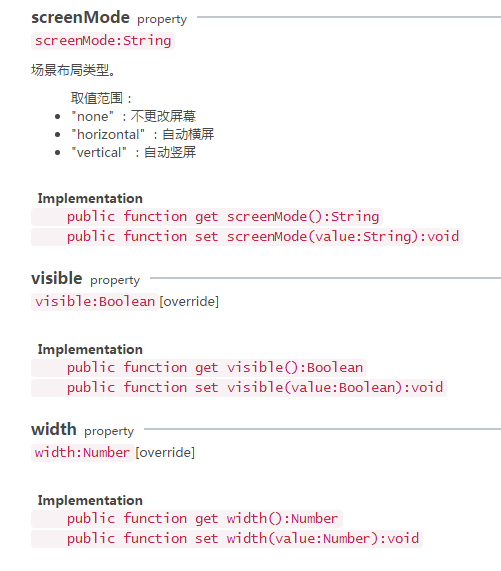

#画面適合APIの概要

モバイル端末（携帯電話、タブレット、テレビ）の増加に伴って、デバイスの断片化、スクリーンの断片化の度合いも増加しています。今日は、ゲームの表示に影響が大きいスクリーンの断片化を検討します。

スクリーンをより深く理解するために、まずIphoneの画面解像度の発展から話します。

以前のモバイルデバイスでは、画面画素は比較的低い。例えば、Iphone 3は320×480で、Iphone 3では、1画素は1画面の物理画素に等しい。その後、デバイスのスクリーンのピクセル密度が高くなるにつれて、iphone 4からRetinaスクリーンが発売され、解像度は640×960となり、倍になりましたが、スクリーンのサイズは変化していません。これは同じ大きさのスクリーンで、画素が倍以上になることを意味します。これはdevicePixelRatioで、他のAndroidモバイルデバイスも同様です。

だから、私たちは一つの公式を導出しました。`物理分辨率=像素分辨率*devicePixelRatio`;

エンジンは上記の2つの解像度に対してパッケージ化した。

デバイスピクセル解像度：Laya.Browser.clientWidth、Laya.Browser.clientHeight；

設備の物理解像度：Laya.Browser.width、Laya.Browser.height；

ピクセル比：Laya.Browser.pixelRatio；

デフォルトではブラウザから取得したclientWidthはピクセル解像度ではなく、スケーリングされた解像度で正確な解像度を得るためには、htmlページ内にviewport metaタグを設定し、contentの値を設定する必要があります。`width=device-width,initial-scale=1.0,minimum-scale=1.0,maximum-scale=1.0,user-scalable=no`「です。

LayaAirエンジン内で、もしページにviewportタグが設定されていないなら、エンジンは自動的に1つを生成して、正しい幅と高さを確保します。

スクリーンはゲームごとに使います。モバイル機器、特に携帯電話の画面が似合いますが、LayaAirエンジンはどうやって実現されますか？まず関連APIを調べてみます。`laya.display.stage`」をクリックします。

##一、画面に適したズームモード設定について

画面に適したズームモードは全部で7種類に分けられています。関連した説明は図1、図2、図3に示されています。

​		 
図（1）画面にフィットするズームモード

​ 
図（2）画面にフィットするズームモード

​ 
図（3）画面にフィットするズームモード

##二、配置モードの設定について

配置モードは、従来の水平方向の配置と垂直方向の配置です。関連するAPIパラメータは、図4、図5、図6に示すように説明されている。
​ 
図（4）画面にフィットする配置モード

​ 
図（5）画面にフィットする配置モード

​ 
図（6）配置モードのプロパティ

##三、画面方向の知能適合設定

LayaAirエンジンは、ブラウザの表示の割合に応じて自動横画面または縦画面を設定できます。システムのスクリーンロックに影響されません。関連するAPI設定パラメータは、図7、図8に示すように、

​ 
図（7）画面方向の適合

​ 
図（8）画面方向の適合

詳細について`laya.display.stage`APIの説明はAPIドキュメントに入って確認してください。http://layaair.ldc.layabox.com/api/index.category=Core&class=laya.display.Stage