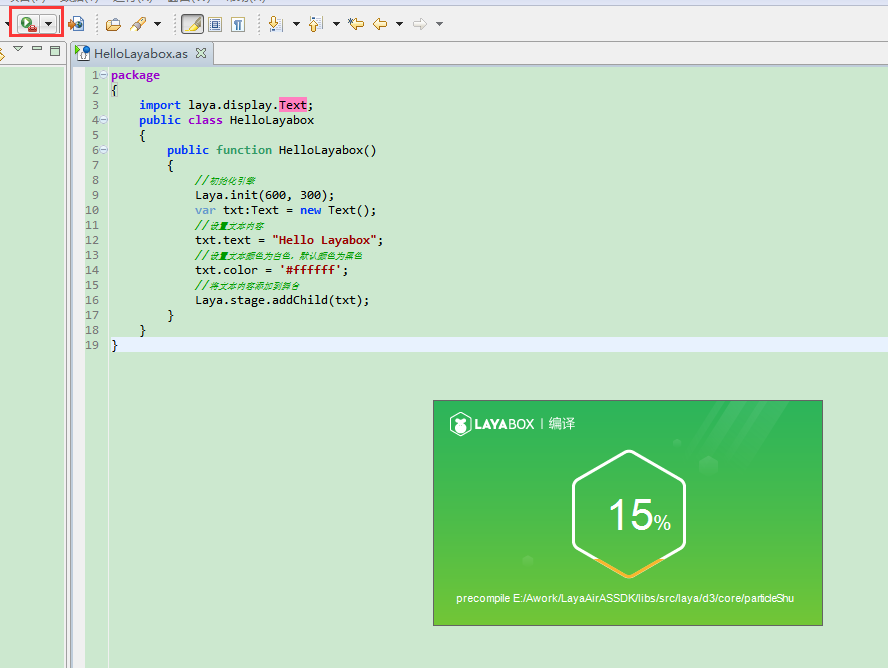
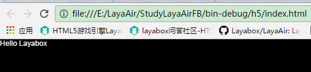

#FlashBuillerの最初のプログラム「Hello Layabox」

>**本編ではAS 3言語でFlashBuider環境にテキストを表示します。Hello Layaboxを終了したのはLayaAirエンジンを完成するための最初のプログラムです。本编を学ぶ前に必ず読んでください。Flash Builder开発环境の配置。**
>
>AS 3プロジェクトをLayaAirIDEで作成し、ディレクトリ構造を詳しく解説して読んで、プロジェクトを作成した場合は、第一歩をスキップすることができます。LayaAirIDEを採用したプロジェクトを提案します。
>


##新規プロジェクト

**ステップ1**:

Flash Buiderを開き、メニューバーに「ファイル」を注文し、「新規作成」を選択して「アクションScriptプロジェクト」をクリックして、プロジェクトを作成するウィンドウに入ります。図1に示すように

<br />

（図1）


**ステップ2**:

「項目名」入力欄に項目名を入力し、「フォルダ」入力欄に項目格納ディレクトリを入力するか、「ブラウズ」をクリックして保存されているディレクトリを選択します。次に「次へ」をクリックしてエンジンコンパイルとエンジンライブラリ構成の「構築パス」ウィンドウに入ります。図2に示すように

<br/>
（図2）


**ステップ3**:

構築された経路設定「ライブラリパス」画面では、まずシステムが持参するコンパイルSDKを削除します。

そして「SWCを追加」をクリックして、エンジンパックの「plyerglobal.swc」を追加します。

プロジェクトがFlashバージョンをリリースする需要があれば、LayaAirFlashの中の「LayaAirFlash.swc」を追加します。図3に示すように

<br/>(図3)


＊**Tips**：ボンネットディレクトリの下`LayaAirFlash/flash`フォルダの`glsl2agal.swc`Flashバージョンのリリースにも使用されますが、引用は`glsl2agal.swc`その後、プロジェクトのソースパスでFlashをリリースするライブラリを参照する必要があります。LayaAirFlash.swcはライブラリを集めていますので、引用を繰り返す必要はありません。注意したいのは`LayaAirFlash.swc`和`glsl2agal.swc`ファイルは一つしか導入できません。


**ステップ4**:

swcを導入した後、出力フォルダはデフォルトの`bin-debug`設定`bin`を選択します。LayaAirIDEはプロジェクトを作成した後、デフォルトのリリースディレクトリは採用されているbinディレクトリです。通常のUIやアニメなどのゲームデザインはLayaAirIDEを使う必要がありますので、プロジェクトを作成する時に一括して設定することをおすすめします。`bin`。

 <br /> (图4)


**ステップ5**:

経路構成を構築する「`源路径`」ウィンドウで「`添加文件夹`」を入力したり、「エンジンライブラリ所在リスト」をクリックして「エンジンライブラリ所在ディレクトリ」を選択し（注意：エンジンライブラリがあるディレクトリはlibsフォルダの下のSrcファイル）、確定をクリックして、エンジンライブラリの導入が完了しました。図5に示すように

<br/>(図5)

もし私たちがFlashバージョンをリリースしたいなら、以前のライブラリのパスを参照してください。`glsl2agal.swc`ソースパスを引用する場合は、flashを発行するために必要なソースライブラリを追加する必要があります(*LayaAirFlash.swcを参照してください*)flashソースライブラリは、"`引擎库目录\as\LayaAirFlash\flash\src`」ディレクトリ内には、図5-2に示すようになっています。

<br/>(図5-2)


**最後に、一番下の「完了」ボタンをクリックして、新規プロジェクトの案内を終了します。**

　　


##二番目のステップは「ハローLayabox」という文字を表示します。

**ステップ1**:

メニューバー「ファイル」から「新規作成」を選択し、「アクションクラス」をクリックして、新しいクラスのファイルを作成するウィンドウを開きます。図6に示すように

<br/>(図6)


*Tips：新規作成したアクションScriptプロジェクトにはプロジェクト名と同名のアクションScript類が用意されています。これを使うなら中のSpriteパッケージを削除しなければなりません。Flash元のカバンなので、削除しないとエラーが発生します。*


**ステップ2**:

名前欄にハローLayaboxを入力し、「完了」をクリックしてアクションScriptクラスを新規作成します。図6-1に示すように

<br/>
（図6-1）


**ステップ3**:

ハローLayabox.asをデフォルトのアプリケーションに設定します。図7に示すように

<br/>
（図7）


**ステップ4**:

ダブルクリックしてハローLayabox.asを開き、コードの作成を開始します。「ハローLayabox」のテキストをステージに追加しました。コードは以下の通りです。


```typescript

package
{
	import laya.display.Text;
	public class HelloLayabox
	{
		public function HelloLayabox()
		{
			//初始化引擎
			Laya.init(600, 300);
			var txt:Text = new Text();
			//设置文本内容
			txt.text = "Hello Layabox";
			//设置文本颜色为白色，默认颜色为黑色
			txt.color = '#ffffff';
			//将文本内容添加到舞台 
			Laya.stage.addChild(txt);
		}
	}
}
```


**ステップ5**:

コードの作成が完了したら、前の文章に配置されたコンパイラを使って、ボタンをクリックしてコンパイルを開始し、コンパイルが完了したら自動的にchrome実行コードを起動します。図8に示すように

<br/>

（図8）


運転結果は図9に示します。

<br/>
（図9）


**ステップ6**:

「ハローLayabox」はすでに表示されていますが、あまりにもシンプルです。次に「ハローLayabox」を美しくします。コードは以下の通りです。


```typescript

package
{
	import laya.display.Text;
	public class HelloLayabox
	{
		public function HelloLayabox()
		{
			//初始化引擎
			Laya.init(600, 300);
			var txt:Text = new Text();
			txt.text = "Hello Layabox";
			//设置文本颜色   
			txt.color = '#FF0000';
			//设置文本字体大小，单位是像素   
			txt.fontSize = 66;
			//设置字体描边   
			txt.stroke = 5;
			//描边为5像素   
			txt.strokeColor = '#FFFFFF';
			//设置为粗体   
			txt.bold = true;
			//设置文本的显示起点位置X,Y   
			txt.pos(60, 100);
			//设置舞台背景色   
			Laya.stage.bgColor = '#23238E';
			//将文本内容添加到舞台   
			Laya.stage.addChild(txt);
		}
	}
}
```


運転結果は図10に示します。

<br/>
（図10）


ここで、もしこの入門教程に従って上図の表示を完成したら、入門成功をおめでとうございます。AS 3言語で開発されたHTML 5プログラムはすでに完成しました。LayaAirの開発環境構成にも間違いがないと説明しました。LayaAirエンジンが開発したAPIの使い方は、オンラインAPIとオンラインDEMOを公式サイトLayabox開発者センターに確認してください。