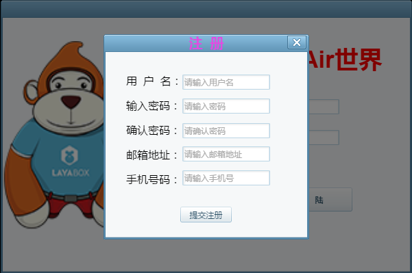
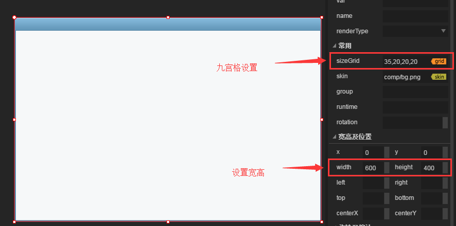
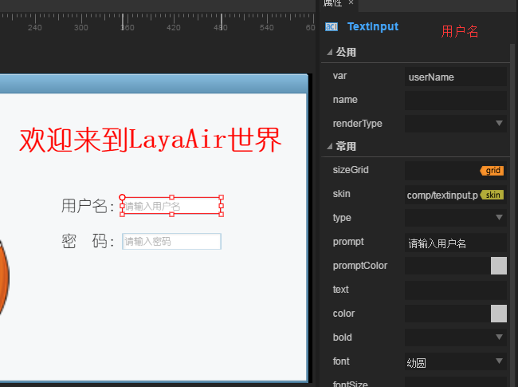
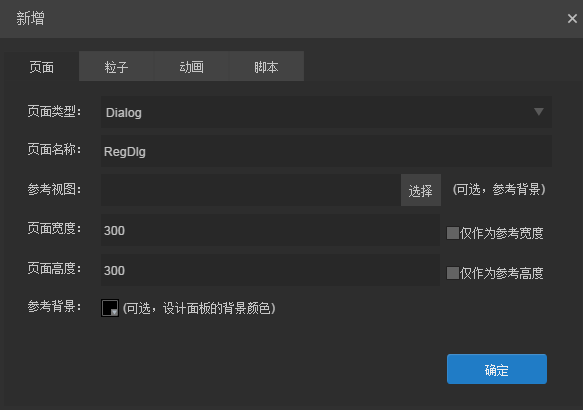
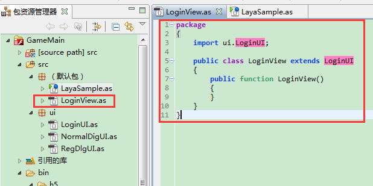
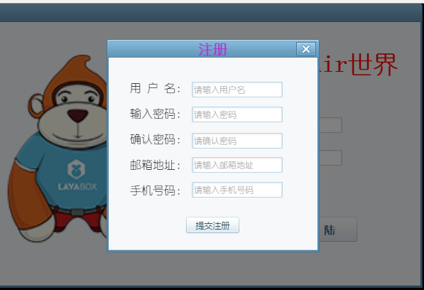

#LayaAir IDEを使ってゲームのログイン画面を作ります。

ゲーム開発者であれば、ゲームの登録、登録ページはよく知らないと信じています。LayaAirIDEを使って登録ページを作るにはどうすればいいですか？この教程を根気よく読んでください。

**まず、最終的に実現した効果を見てみます。図1、図2、図3、図4に示すように**


（図1）IDEでインターフェースを合わせた後、コードにログインページを実装してステージに追加し、登録ボタンをクリックして登録パネルをイジェクトする（図2に示す）。


（図2）登録提示成功ページ（図3に示す）をクリックし、右上の閉じるボタンをクリックして登録ページを閉じます。


（図3）確定または右上隅で閉じるボタンをクリックすると、登録成功ヒントページを閉じます。


（図4）ログインパネルのログインボタンをクリックするとログイン成功ページが表示されます。

##1、新規プロジェクト

インストールされているLayaAirIDEを開き、空いているプロジェクトを作成します。プロジェクトに名前を付けて、パスを選択して、プロジェクトクラスを選択して、最後にクリックして作成します。図5に示すように


（図5）作成したプロジェクト構造はここで詳しく説明しません。関連文書ページに切り替えて確認してください。

##2、ログインページを作成し、ログインページUIの接続を完了する。

###2.1リソースの追加

現在位置しているIDEページが編集モードでない場合は編集モードに切り替えます。図6に示すように


（図6）

LayaAirIDEを使用して作成されたプロジェクトは編集モードのリソースディレクトリにcompという名前のリソースファイルがあります。中にはよく使われているUIコンポーネントリソースが保存されています。この文書ではそんなに多くのリソースが使えないので、資源を削除して、新しいリソースを追加します。最終リソースファイルに保持されているリソースは図7に示されている。


（図7）リソース操作ステップ：リソースパネルの右ボタンで、所在ディレクトリ（リソース所在ディレクトリ）を開く。余分なリソースを削除し、リソースを追加する。IDEリソースパネルに戻ってリソースを更新する。図8に示すように


（図8）

###2.2ログインページの作成

編集モード項目モジュールで右キー→新規作成→ページに登録ページ（図9に示すように）を作成し、ページを作成するパネルをイジェクトする（図10に示すように）。


（図9）


（図10）

**ページの種類:**

二つの種類があります。ViewとDialogです。両者の違いは、DialogがViewから引き継ぎ、Viewにある機能Dialogがあり、Viewとは違ってDialogコンポーネントがポップアップダイアログであり、ダイアログのポップアップを実現し、ドラッグし、モードウィンドウ機能を実現することである。Viewは、実際のプロジェクトでは固定表示パネルとして機能することができ、Dialogは実際のプロジェクトではポップアップボックスとして表示することができる。

**ページ名:**

このページの名前

**参照ビュー:**

実際のプロジェクトの中にはいくつかのインターフェース上の資源が非常に多いかもしれません。この時は美術からの見取り図に従ってこれらの位置に行く必要があります。参考物が一つもないなら、見取り図を見て操作するだけで時間が長くなります。参考図の役割は、美術から与えられた図面を添付して写真に写すことです。（最終的には実際のプロジェクトには使用されません。）

**ページの幅、ページの高さ:**

ページの幅の高さには、後ろに「参考にするだけ」というチェックボックスがあります。このチェックボックスがチェックされた状態であれば、前に書いたこの幅の高さは実際のプロジェクトでは無効です。現在のページの要素の幅の高さを自動的に計算して、ページ全体の幅の高さを計算します。このオプションボックスをチェックしないと、前に設定した幅の高さが実際のページの幅の高さです。（リソースが設定されている幅の高さを超えていると、オーバーした部分はレンダリングされず、イベントは追加できません。）

**参考背景:**

ページを編集する際の背景の色(参考にするだけで実際の項目では有効になりません)

最後に確定ボタンを押すとIDEの中に視覚領域があります。

###2.3ログインページの編集

**一つのログインページでよく見られるのは、ゲームのLogo、タイトル、ユーザー名、パスワード、パスワードの選択ボックス、自動登録オプションボックス、登録ボタン、ログインボタンなどの要素です。次に、このような登録ページを作成します。**

**2.3.1.背景を追加する**:

背景リソースを選択して、ページに背景リソースをドラッグ＆ドロップします。右側のプロパティ欄でsize Grid属性を見つけました。（九宮格子を設置し、35,20,20,20に設定します。）九宮格を設定する目的は、絵を引き伸ばす際のボケを回避し、背景図の幅の高さをページの幅の高さに設定します。図11に示すように


（図11）

**2.3.2.ロゴリソースの追加:**

LayaBoxのLogo子猿をページに追加し、左側の位置に置いておきます（ここではスクリーンショットではなく、図12では効果が見られます）。

**2.3.3.タイトルを追加する：**


将资源面板中的Label组件拖拽到页面中。在右侧属性面板—常用属性中设置text属性为“欢迎来到LayaAir世界”，设置color颜色为红色“#ff 0400」は、ボールドの太さを「true」に設定し、fontフォントを「幼円」に設定します。**この項目のすべての文字は幼児円に設定されます。その後は触れません。**）、fontSizeテキストのフォントサイズを「35」に設定し、align水平配置を中央揃えの「センター」に設定します。図11に示すように


（図12）

**2.3.4.ユーザ名とパスワードを追加する：**

リソースリストからページ上の2つのLabelを適切な位置にドラッグし、右側のプロパティパネルにtextを「ユーザ名:」と「パスワード:」に設定し、フォントを「幼児円」に設定し、フォントサイズを「20」に設定します。

リソースリストからページ上の2つの入力ボックス「TextInput」をユーザー名とパスワードの対応する位置にドラッグし、右側の属性欄でユーザー名入力ボックスのvarに変数「userName」を宣言します。nameは、親ノード・get ChildByNameを通じてそのオブジェクトを取得し、属性を修正することができます。ユーザ名のpromptには「ユーザー名を入力してください」という設定で、フォントは同じ「幼円」です。パスワード入力ボックスはユーザー名入力ボックスと同じです。var変数を「userPassword」に設定し、promptを「パスワードを入力してください」に設定します。図13、図14に示すように


（図13）


（図14）

**2.3.5.チェックボックスを追加:**

記憶パスワードと自動登録チェックボックスを追加して、状態を記録するために使用します。

リソースディレクトリから2つのチェックボックスコンポーネントを引っ張り出し、右側のプロパティパネルに「パスワードを覚えておく」と「自動登録」を設定し、他のオプションにlabel Boldを「true」と太字にするかどうか、label Fontを「幼円」に設定します。図15、図16に示すように


（図15）


（図16）

**2.3.6.登録、登録ボタンを追加する：**

登録ボタン：クリックしたら登録ページをポップアップします。ログインボタン：ポップアップ登録メッセージをクリックしてください。

ボタン属性設定を図17、図18に示す。


（図17）


（図18）

**ここにログインすると、画面はもう全部完成しました。続いて、登録ウィンドウとヒントウィンドウを続けます。UIインターフェースが全部完成したらコードで対応できる機能を実現します。**

##3、登録ページを作成し、登録ページUIのつなぎ合わせを完了する。

**3.1登録ページの作成**

ステップは2.2登録ページと一致しています。異なるのは登録ページがDialogタイプです。（上の2.2でログインインターフェースを作成する際に、DialogとViewの違いを詳しく説明しました。ここでは詳しくは述べません。）確定ボタンをクリックして作成ページを完成します。図19に示すように


（図19）

**3.2ページの背景を追加する**

ステップ2.3.1を参照して、背景リソースをページにドラッグし、九宮枠と画像サイズを設定します。

**3.3タイトルを追加する**

ステップ2.3.3を参照して、Labelコンポーネントをページにドラッグし、タイトル位置に置いて、対応する属性を設定します。図20に示すように


（図20）

**3.4ユーザー名、ユーザー名入力ボックス、パスワード入力などのコンポーネントを追加します。**

リソースパネルからLabelコンポーネントを引っ張り出して、フォントを「幼円」、fontSizeフォントのサイズを「16」、配置方式を「left」に左揃え、テキストtextを表示します。Labelを選択してショートカットキーCtrl+Rを押して5つの同じコンポーネントをコピーします。図21に示すように


（図21）クリックして確定したら、ページに同じLabelが5つあります。適当に下の位置を調整して、Labelのtextテキストの内容を修正します。図22に示すように


（図22）

テキストが表示されるのはtextテキスト以外の内容は同じです。赤い枠nameの内容は管理しなくてもいいです。ショートカットでコンポーネントをコピーする時に自動的に生成されます。何の内容にも影響しません。前のテキストの表示内容があったら、後は必ず対応する入力ボックスがあります。リソースパネルからテキスト入力ボックスTextInputを引いてユーザー名の後に置いて、再度ショートカットキーCtrl+Rを使って5つの同じテキスト入力ボックスをコピーして、微調整位置、入力プロンプトにヒント内容を入力して、フォントfontを設定します。図23に示すように


（図23）

**3.5登録の提出ボタンとページを閉じるボタンを追加します。**

リソースパネルからButtonのコンポーネントを引き出して真下に置いてください。labelの表示文字は「登録の提出」、var変数名は「btnubmit」です。それから資源パネルから一つのクローズボタンをドラッグして右上に置いて、閉じるボタンのnameに「close」と名づけます。（Dialogページではページ上のコンポーネントnameをcloseと名づけて、コンポーネントをクリックするとDialogページを閉じます。）ボタンを閉じるデフォルト表示のlabel文字を削除します。図24、25に示すように


（図24）


（図25）

##4、提示ページを作成し、提示ページUIのつなぎ合わせを完了する。

**4.1ページの作成**

ステップは3.1と一致しています。ページ名はNormalDigに変更し、クリックして確定します。

**4.2表示コンポーネントを追加する**

リソースパネルからLabelコンポーネントをドラッグして、var変数に「txtContent」と定義し、一般的な属性を図26に示すように設定します。


（図26）

**4.3確定ボタンの追加とページボタンの閉鎖**

ステップ3.5と一致して、決定ボタンにvar変数を定義するのは「btnusure」です。図27、28に示すように


（図27）


（図28）

##5、コードで図1、2、3、4の効果を実現する。

コードを書く前に、まず編集モードでF 12から資源を引き出して、コードモードのbin/h 5/res/alasディレクトリの下で対応するセットファイルが生成されているか確認してください。もしないなら、編集モードに戻ってショートカットキーCtrl+F 12を押して資源を整理します。（ASプロジェクトは開発者にFBまたはFDを使って作成するよう提案しています。この記事はFBを例にしています。）

**5.1 FBでプロジェクトを導入する**

導入項目のステップ：FBファイルを開きます。FlashBuiderプロジェクトを導入します。プロジェクトフォルダを選択してプロジェクトディレクトリをコピーします。完成しました。（分かりません。基礎文書を参照してください。）

**5.2リソースをプリロードしてログインページを表示する**

リソースをプリロードする目的は、リソースを使用する際のロード時間が長すぎることを避けることです。（ボタンリソースはプリロードしなければなりません。）を選択します。リソースをプリロードした後、リソースローディング完了のコールバックでログインページを具体化します。コードは以下の通りです


```typescript

package {
	import laya.net.Loader;
	import laya.utils.Handler;
	
	import ui.LoginUI;

	public class LayaSample {
		public function LayaSample() {
			//初始化引擎
			Laya.init(1136, 640);
			//预加载资源
			Laya.loader.load("res/atlas/comp.json",Handler.create(this,onLoaded),null,Loader.ATLAS);
		}		
		//资源加载完成回调
		private function onLoaded():void
		{
			//实例化登陆页面
			var login_ui:LoginUI = new LoginUI();
			//把登陆页面添加到舞台上
			Laya.stage.addChild(login_ui);
		}
	}
}
```


コンパイル効果は図29に示す通りです。


（図29）

実際のプロジェクトでは、UIページ上の要素に対して多くの操作がある場合、UIページを直接的に入口クラスで実施することを提案しません。UI論理クラスを作成して、UIページを継承し、その中の要素を操作することを提案します。ここでコードを修正し、ログインページを作成し、対応するuiページを継承し、エントリクラスで登録ページを実行します。

新規登録ロジッククラスを図30に示します。


（図30）

エントリクラスのコードを以下のコードに変更します。


```typescript

package {
	import laya.net.Loader;
	import laya.utils.Handler;
	
	import ui.LoginUI;

	public class LayaSample {
		public function LayaSample() {
			//初始化引擎
			Laya.init(1136, 640);
			//预加载资源
			Laya.loader.load("res/atlas/comp.json",Handler.create(this,onLoaded),null,Loader.ATLAS);
		}		
		//资源加载完成回调
		private function onLoaded():void
		{
          	/////修改此处/////
			//实例化登陆页面
			var login_view:LoginView = new LoginView();
			//把登陆页面添加到舞台上
			Laya.stage.addChild(login_view);
		}
	}
}
```


**5.3ログイン、登録ボタンにイベントを追加し、対応するページを開く**

ログイン、登録ボタンにイベントを追加する前に、まずログインページの論理クラスと登録ページの論理クラスを作成して、それぞれのUIページを継承し、対応するUIインターフェースを操作する。図31、32に示すように


（図31）


（図32）

登録ボタンにクリックイベントを追加し、登録ボタンをクリックして登録ページをイジェクトする。コードは以下の通りです


```typescript

package
{
	import laya.events.Event;
	import ui.LoginUI;

	public class LoginView extends LoginUI
	{
		public function LoginView()
		{
			//给注册按钮添加点击事件
			this.btn_reg.on(Event.CLICK,this,onReg);
		}
		private function onReg(e:Event):void{
			//实例化并弹出注册页面
			var reg:RegDlg = new RegDlg();
			//弹出注册页面
			reg.popup();
		}
	}
}
```


以上のコードで実現した効果は、図33に示すようになります（効果は図2と一致します）。


（図33）閉じるボタンをクリックして登録ページを閉じることができます。

登録ボタンを提出するにはクリックイベントを追加し、クリックしてからヒントパネルをポップアップします。しかし、ポップアップと同時に、ヒントパネルのヒントコンテンツに値を付ける必要がありますので、まずヒントページのNormalDigクラスに切り替えて、公開された方法を追加してテキストの割り当てを行います。同時に決定ボタンにクリックイベントを追加して、クローズヒントページをクリックしてください。コードは以下の通りです


```typescript

package
{
	import laya.events.Event;
	
	import ui.NormalDigUI;

	/**
	 * 提示页面
	 * @author Laya
	 * 
	 */
	public class NormalDig extends NormalDigUI
	{
		public function NormalDig()
		{
			//给确定按钮侦听点击事件，点击后关闭面板
			this.btn_sure.on(Event.CLICK,this,onClick);
		}
		private function onClick(e:Event):void{
			//关闭页面
			this.close();
		}
		public function popupContent(msg:String):void{
			//给文本赋值
			this.txtContent.text = msg;
			//弹出页面
			this.popup();
		}
	}
}
```


登録ページのRegDlgクラスを開き、ヒントパネルに「登録成功！」コードは以下の通りです


```typescript

package
{
	import laya.events.Event;
	import ui.RegDlgUI;
	/**
	 * 注册页面
	 * @author Laya
	 * 
	 */
	public class RegDlg extends RegDlgUI
	{
		public function RegDlg()
		{
			//给提交注册按钮侦听点击事件
			this.btn_submit.on(Event.CLICK,this,onClick);
		}
		private function onClick():void
		{
			//实例化提示页面（目的是为了给提示面板中的文本赋值）
			var dlg:NormalDig = new NormalDig();
			dlg.popupContent("注册成功！");
		}
	}
}
```


以上のコードの運転効果は図34に示す通りです（図3の表示と一致します）。


（図34）

**ここに登録するページ関連コードは全部完了しました。次にログインページの論理コードを完成します。**

ログインログビュークラスを開けて、ログインボタンにイベントを登録し、ポップアップメッセージページをクリックしてログイン成功のメッセージを表示します。コードは以下の通りです


```typescript

package
{
	import laya.events.Event;
	import ui.LoginUI;
	public class LoginView extends LoginUI
	{
		private var dlg:NormalDig;
		public function LoginView()
		{
			//实例化提示面板（目的是为了在点击登陆按钮时给提示页面中的文本赋值）
			dlg = new NormalDig();
			//给注册按钮添加点击事件
			this.btn_reg.on(Event.CLICK,this,onReg);
			//给登陆按钮添加点击事件
			this.btn_login.on(Event.CLICK,this,onLogin);
		}
		private function onReg(e:Event):void{
			//实例化并弹出注册页面
			var reg:RegDlg = new RegDlg();
			//弹出注册页面
			reg.popup();
		}
		private function onLogin(e:Event):void 
		{
			//给提示面板赋值
			dlg.popupContent("登陆成功！");
		}
	}
}
```


以上のコードの運転効果は図35に示す通りです（図4の効果と一致します）。


（図35）

ここで、本ページの登録、登録例のドキュメントはすべて完了しました。開発者はこの基礎の上でより完全な登録、登録機能を実現することができます。問題があれば、フォーラムに提出してください。[http://ask.layabox.com/](http://ask.layabox.com/)