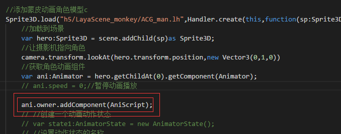

#Laya 2.0モデルアニメーションの使用

laya 2.0では3 Dモデルの動画に対して深さ修正と最適化を行いました。一部の機能は1.0の使用方法と違っています。または削除インターフェースを追加します。この文書は主に最近の開発者のフィードバックが多い3 Dモデルアニメの放映問題について、傍受活動を一時停止するなどの問題をまとめました。

###一、アニメーションの一時停止

1.0の中で私達の3 Dシステムの針はアニメーションの放送のアクティブな一時停止に対してskyinAni.player.stopによってです。このstop方法は直接アニメーションを一時停止します。これは2.0の中で3 Dアニメーションの再生速度のパラメーターを修正して最適化しました。開発者は直接アニメーションの再生速度を使ってアニメーションの一時停止と再生を制御することができます。

2.0の3 Dアニメーションは一時停止し、アニメイト.speed=0に変更しました。


```javascript

//添加蒙皮动画角色模型
Sprite3D.load("h5/LayaScene_monkey/ACG_man.lh",Handler.create(this,function(sp:Sprite3D):void{
//加载到场景
var hero:Sprite3D = scene.addChild(sp)as Sprite3D;
//让摄影机指向角色
camera.transform.lookAt(hero.transform.position,new Vector3(0,1,0))
//获取角色动画组件
var ani:Animator = hero.getChildAt(0).getComponent(Animator);
ani.speed = 0;//暂停动画播放	
}));
```


（図1）

###二、アニメの放送監督事件！

3 Dキャラクターアニメーションの使用において、私たちは常にキャラクターの動画再生状態をモニターして、私たちが欲しい攻撃や走行効果を達成します。2.0では、アニメのモニターを行うための新しい2つの方法を提供します。

#####1、現在のアニメーションの再生率

  


（図2）

#####アニメーションが非ループ再生の場合

コメントと同じようにアニメーションが**非ループ**（循環モードではない）放送時にこのNormalizedTimeは0.0~1の数を返します。つまり現在のアニメーションがすでに100%まで放送されています。この数は現在のアニメ放送の割合として理解できます。0.1は現在の10%まで放送されています。

##### **動画がループとして再生される場合**

この値は各再生終了後＋1という整数ビットで現在の動画再生のために何回も再生されますが、小数位は現在再生中の動画の割合です。例えば循環動画が3回再生されたなら、この数は3.0であるべきです。4回目の放送が半分になった時、この数は3.5であるべきです。

このように戻り値の意味を理解すれば、この戻り値に基づいて動画の状態をモニターすることができます。

私が監聴しているアニメは、60%から50%の間にアニメが放映されるたびに、キャラクターにboxを生成させます。


```javascript

	public class LayaAir3D {
		public var box :MeshSprite3D;
		public var scene:Scene3D;
		public var weaponIsClone:Boolean = false;
		public var heroAni:Animator;
		public function LayaAir3D() {

			//初始化引擎
			Laya3D.init(0, 0);
			
			//适配模式
			Laya.stage.scaleMode = Stage.SCALE_FULL;
			Laya.stage.screenMode = Stage.SCREEN_NONE;

			//开启统计信息
			Stat.show();
			
			//添加3D场景
			scene = Laya.stage.addChild(new Scene3D()) as Scene3D;
			
			//添加照相机
			var camera:Camera = (scene.addChild(new Camera( 0, 0.1, 100))) as Camera;
			camera.transform.translate(new Vector3(0, 3, 3));
			camera.transform.rotate(new Vector3( -30, 0, 0), true, false);
			camera.clearColor = null;

			//添加方向光
			var directionLight:DirectionLight = scene.addChild(new DirectionLight()) as DirectionLight;
			directionLight.color = new Vector3(0.6, 0.6, 0.6);
			directionLight.transform.worldMatrix.setForward(new Vector3(1, -1, 0));

			box = new MeshSprite3D(new BoxMesh(0.3,0.3,0.3));

			Sprite3D.load("h5/LayaScene_monkey/ACG_man.lh",Handler.create(this,function(sp:Sprite3D):void{
				var hero:Sprite3D = scene.addChild(sp)as Sprite3D;
				hero.getChildAt(0).addChild(box);
				heroAni = hero.getChildAt(0).getComponent(Animator)
				heroAni.linkSprite3DToAvatarNode("Dummy002",box);
				
				Laya.timer.frameLoop(1,this,onFrame)
			}));
		}
		private function onFrame():void{ 
		trace(heroAni.getCurrentAnimatorPlayState(0).normalizedTime);
		//当动画播放到百分之五十到六十之间时进行克隆
		if (0.6>(heroAni.getCurrentAnimatorPlayState(0).normalizedTime-Math.floor(heroAni.getCurrentAnimatorPlayState(0).normalizedTime))>0.5)
			{
				if(weaponIsClone)return;
				trace("sssssss")
				//克隆模型（位置，矩阵，等信息全被克隆）
				var weaponClone:Sprite3D = Sprite3D.instantiate(this.box);
				//为模型添加在定义脚本
				weaponClone.addComponent(WeaponScript);		
				//把克隆的武器放入场景中
				scene.addChild(weaponClone);
				weaponIsClone = true;
			}
			else if ((heroAni.getCurrentAnimatorPlayState(0)._normalizedTime-Math.floor(heroAni.getCurrentAnimatorPlayState(0)._normalizedTime))>0.98)
			{
				weaponIsClone = false;
			}
			
		}
	}
```


（図3）

###三、unityでアニメイベントを設定する

アニメイトでは、アニメトリガイベントAAAを追加できます。

このイベントはアニメがこの位置に放送されるとAAAという名前を触発する方法です。

unityでイベントを設定してApplyを最後にアニメモデルをエクスポートします。

 


（図4）

layaではシナリオを作成してこのイベントを受信することができます。

まずlayaでシナリオを作成します。シナリオ名はイベントのトリガに影響しませんので、任意に名前をつけます。シナリオの中でメソッド名は「AAA」です。この方法名はunityで設定するイベント名と同じです。図5のように。

 


（図5）

そして、私たちはこのシナリオをアニメーションノードに追加すればいいです。

 


（図6）