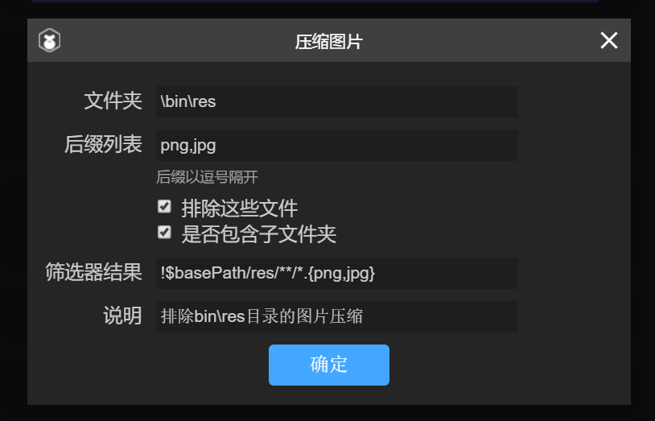
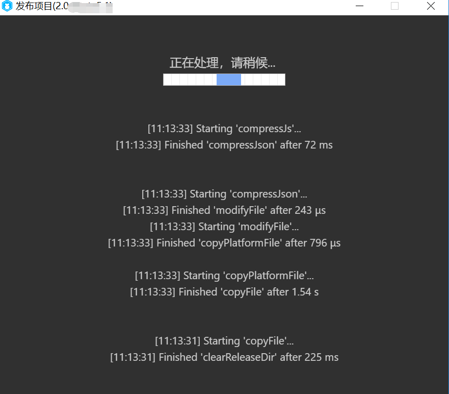

#プロジェクトリリースの詳細（新版）

>*author:charley version:LayaAir IDE 2.1.1 udate:2019-06-25*

[TOC]

LayaAir IDEはプロジェクトリリースの機能において常に最適化されており、中には複数のサイズバージョンのアップグレード反復が行われています。新しいバージョンでは、リリースプロセスのカスタマイズを強化しただけでなく、リリース・スクリーニングをより柔軟にし、ワンタッチでリリースすることで、より便利なユーザー体験を向上させました。

 


（図1-1）

各機能についての詳細を紹介します。

###一、リリースプラットフォームのオプション

本論文の執筆時のIDE 2.1.1バージョンまで、発表プラットフォームには現在6つの選択肢があります。それぞれVIVOミニゲーム、OPOミニゲーム、小米快ゲーム、Baiduのミニゲーム、Web、微信のゲームです。図1-2に示すように。

 


（図1-2）

異なるプラットフォームのタイプを選ぶと、リリース時に異なるプラットフォームに適応します。

`Web`HTML 5バージョンとしてリリースされ、ブラウザ環境、webView、LayaNativeのAPP環境で実行される。

`微信小游戏`WeChat型ゲームに適したアイテムとしてリリースされ、リリース後のアイテムはWeChat開発者のツール内で実行できます。

`百度小游戏`は、Baiduのゲームに適したプロジェクトとしてリリースされ、リリース後のプロジェクトは、Baiduの開発者のツール内で実行することができます（Baiduのゲームについては、関連するドキュメントを読むことができます）。

`小米快游戏`は、ミニゲームに適したアイテムとしてリリースされたもので、アワ開発者のツール内で実行できます。

`OPPO小游戏`OPOミニゲームに適したアイテムをリリースし、リリース後のアイテムはOPO開発者ツール内で実行できます。

`VIVO小游戏`は、VIVOミニゲームに適したプロジェクトとしてリリースされ、リリース後のプロジェクトはVIVO開発者ツール内（VIVOミニゲームについては閲覧可能なドキュメント）を実行することができます。

###二、Node-globモジュールの圧縮とバージョン管理機能の応用

混淆圧縮とバージョン管理はリリース時によく使われる機能です。しかし、どのようにより柔軟に管理し、どのようなディレクトリやファイルを圧縮するか、またはバージョン管理を開始するか、どれが不要ですか？LayaAirIDEも何度かの最適化と改版を行いました。新版のリリースから、発表機能にはnode-globモジュールが内蔵されています。カタログとファイルのマッチングがより柔軟になります。

LayaAirIDEのリリース機能はデフォルトでは一般的な除外と機能を含めて統合されています。開発者がカスタマイズしたファイルをフィルタリングすることもできます。リリースパネルの機能に合わせて説明します。

####1、圧縮機能（JSON、JS、写真）

JSONを圧縮するかどうか、画像を圧縮するかどうか、JSファイルを圧縮するかどうかなどの機能オプションをチェックすると、これらの対応する圧縮機能が起動されます。カラーブロック領域にはデフォルトのファイルフィルタ整合規則が表示されています。標準のファイルマッチング規則を変更するには、色ブロック領域をクリックします。図2-1に示すように。

 


（図2-1）

色のブロック内の領域をクリックすると、ブロック対応のルール編集画面に入ります。例えば、画像の色のブロック領域を圧縮するかどうかは、図2-2に示すように、圧縮画像の規則編集画面を開きます。

 


（図2-2）

`文件夹`フォルダはデフォルトではbinディレクトリです。圧縮範囲をサブディレクトリまたは下位のディレクトリに指定できますが、binディレクトリからのジャンプは許可されません。

`后缀列表`異なる圧縮タイプのクリック後のサフィックスリストのデフォルト値も違います。例えば、JSONを圧縮するデフォルト値はjson、圧縮画像のデフォルト値はpng、jpgです。圧縮JSファイルのデフォルトはjsです。

拡張子リストでは変更または追加が許可されていますが、分類ごとに呼び出される処理の仕組みに違いがありますので、開発者は勝手に拡張しないでください。そうでないとエラーが発生する可能性があります。例えば、JSONのサフィックスルールを圧縮して、他のサフィックス名を追加しても、ファイルはjson形式にします。js拡張子のようなものもあります。圧縮と同時に文法を検出し、混同します。これはJson形式の圧縮機構とは異なる。画像を圧縮する機能はもちろんです。

`排除这些文件`このオプションは、拡張子リストのフィルタリングに基づいた補助フィルタ機能で、この機能オプションをチェックした場合、現在のマッチングのファイルを圧縮するのではなく、現在のマッチングのファイルを除外します。この機構はしばしば複数の整合則を結合するために用いられる。例えば、私たちはbinディレクトリのすべてのpngとjpgのファイルをデフォルトで圧縮します。しかし、私はbinディレクトリのresディレクトリを無視したいです。圧縮しないでください。それでは、画像の右側のプラス記号を圧縮するかどうかをクリックして、図2-3に示すように、排除規則を新たに作ります。

 


（図2-3）

この除外規則を追加したら、クリックして確定します。結合後の整合規則は図2-4に示されています。

（図2-4）

`包含子文件夹`このオプションは、拡張子リストのフィルタリングに基づいた補助フィルタ機能です。チェックしないとマッチに限られます。`文件夹`オプションで設定した現在のディレクトリファイルにチェックを付けると、該当する規則にその下のすべてのサブフォルダディレクトリが含まれます。

`筛选器结果`フィルタ結果バーには、現在設定されているフィルタ機能だけでなく、より複雑なフィルタ条件を直接に編集することもできます。フィルタ条件を直接編集してからクリックしてください。`确定`保存します。他のフィルタパラメータが設定されている場合は、ここの設定は自動的に置き換えられます。

フィルタ内の規則は正則式のglob整合規則に似ていますが、解析パスモデルの場合、大括弧の中に複数のカンマで区切られた内容が展開されます。中の部分も「/」を含んでいます。a｛b/c，bcd｝はa/b/cとabcdに展開されます。ここでは簡単に常用するマッチング規則を紹介します。

|整合子𞓜説明𞓜
|--------------------------------------------------|
𞓜`*`|はファイルパス中の0文字以上の文字と一致しますが、パス分離子が最後に現れるまでは一致しません。
𞓜`**`|は経路中の0個以上のディレクトリとそのサブディレクトリとをマッチングさせるためには、単独で出現する必要があります。つまり、左右に他のものがありません。最後に現れたら、ファイルにもマッチします。𞓜
𞓜`?`|はファイルパスの1つの文字にマッチします。パスの区切り子にはマッチしません。
𞓜`[...]`|は、四角い括弧の中の任意の文字にマッチします。四角い括弧の中の最初の文字が^または！の場合、他の文字の中の任意の1つを表します。この組み合わせはできません。1文字だけです。例えば、[xyz].jsはx.js、y.js、z.jsにしかマッチできません。xy.js、xyz.jsなどにはマッチしません。
𞓜`!(pattern｜pattern｜pattern)`|は、括弧内で与えられたいずれのモードにもマッチしない|とマッチします。
𞓜`?(pattern｜pattern｜pattern)`|は括弧の中で与えられたいずれかのモードを0回または1回と整合し、js正則の中のものと類似している。`(pattern｜pattern｜pattern)?`𞓜
𞓜`+(pattern｜pattern｜pattern)`|は括弧の中で与えられたいずれかのモードにマッチします。少なくとも1回はjs正則のようです。`(pattern｜pattern｜pattern)+`𞓜
𞓜`*(pattern｜pattern｜pattern)`|は括弧の中で与えられたいずれかのモードを0回以上マッチングし、js正則のようなものです。`(pattern｜pattern｜pattern)*`𞓜
𞓜`@(pattern｜pattern｜pattern)`|は括弧の中で与えられたいずれかのモードに1回マッチし、js正則のようなものです。`(pattern｜pattern｜pattern)`𞓜

開発者がより多くのglobルールを知りたいなら、Baiduなどの検索エンジンでnode-glob関連の文書を検索することができます。ここでは詳しく紹介しません。

`说明`説明欄には、規則の提示に対して、長い間使わなくなってからこの規則を忘れないようにするための準備情報を記入してください。例えば、図2〜3では、この規則は「bin\resディレクトリ内のピクチャ圧縮を排除する」ために書かれている。

####リマインダの圧縮

圧縮機能を有効にすると、発表時間が遅くなります。圧縮するファイルが多ければ多いほど、圧縮時間が長くなります。オンラインデバッグ段階はできるだけチェックしないでください。特にJS圧縮後はコードが混同され、コードの可読性が悪くなり、デバッグに影響します。

####2、バージョン管理を有効にする

バージョン管理については、最初はリンク後に乱数を加えて管理されていましたが、WeChatなどの環境ではキャッシュの問題が深刻で、乱数方式ではキャッシュの問題が解決できず、更新されたバージョンによってページが混乱するなどの現象が発生します。したがって、LayaAirIDEはリリース時にキャッシュ問題を根本的に解決する方案を追加しました。それは直接ファイル名を変更することです。ファイル名は全部違っています。キャッシュ問題は自然に存在しません。

#####バージョン管理の仕組み

開発者がバージョン管理を有効にすると、リリース時に自動的にhash文字列のファイル名を生成し、同時に一つのversion.jsonのファイル名マッピングファイルを作成します。バージョン管理クラスResource Versionによる自動関連コードの中の実際のファイル名と名前変更後のバージョン管理制御のファイル。開発者がバージョン管理のファイルを有効にすると、リリース時にファイル名の中のhash文字列が自動的に更新されます。これは実行環境にとって、新しいファイルを呼び出したのに相当します。もちろんキャッシュによる問題はありません。

開発者は開発の過程で、最終的に生成されたファイル名がどのようなものかに注目する必要はありません。さらに、LayaAirIDE 2.0はプロジェクトを作成する際に、自動的にコードにバージョン管理クラスのResource Versionを統合していますので、開発者はResource Version類をどのように使うかについては、注目する必要はありません。バージョン管理を有効にしたい時に、プロジェクトのリリースインターフェースでバージョン管理を有効にするかどうかチェックすればいいです。

#####バージョン管理の効果を有効にします。

プロジェクトのリリースインターフェースで、バージョン管理を有効にするかどうかチェックした後、スクリーニングルールは圧縮と同じで、どのファイルがバージョン管理に参加していないかを制御するために採用されたglobルールです。この開発者はこのページを管理しないでください。これを変更すると問題が発生しやすいです。他のファイルは開発者が特定の要求を持っていれば、自分でコントロールできます。

注意が必要なのは、ミニゲームなど特定のミニゲームチャネルをリリースする場合、これらのミニゲーム自体のプロジェクトファイルとデフォルト指定ファイル名のファイルは自動的に無視処理され、バージョン管理には参加しません。例えば、game.jsとgame.jsonなどです。

 


（図3）

図3に示すように、左は開発環境下のbinディレクトリで、右はバージョン管理を有効にしたリリースディレクトリです。game.jsとgame.jsonのようなゲームプロジェクトが必要なファイルは自動的に無視されます。jsディレクトリ下のjsファイルとresディレクトリ下のpng画像ファイル名は、hash文字列に追加されています。


###三、ローカルバッグを抽出する

WeChat、Baiduなどのミニゲームのプラットフォームは比較的に熱いです。しかし、これらのプラットフォームはローカルパッケージの概念が存在し、パッケージに制限があるため、ローカルパッケージを抽出する機能や使いやすさが非常に重要であり、現在のバージョンは何度も最適化された最新のバージョンであり、以前の様々な不便を最適化し、開発者のワンタッチでミニゲームプロジェクトのローカルパッケージとしてリリースされる需要を満たすことができます。具体的なローカルパッケージに関する紹介とドキュメントは直接に対応するドキュメントを見て、ここでは重点的にどのように抽出するかを紹介します。

####1、ファイルを選択する

クリック`选择文件`右側の入力ボックスは、図4のようなbinディレクトリ構造ツリーをイジェクトする。開発者は、ローカルパッケージで使用するコードまたはリソースをチェックします。クリック**を選択します**すると、選択したディレクトリとファイルが自動的に保存され、指定されたローカルパケットのフィルタリングやコピーを行います。

 


（図4）

####2、ターゲットディレクトリ

デフォルトでは選択しない場合、ローカルパッケージディレクトリはreleaseディレクトリの下にwxgameuplackディレクトリを作成して、ローカルパッケージの内容を保存します。もちろん、開発者は、ゲームアイテムのローカルパッケージを保存するためのディレクトリを任意に指定することもできます。

具体的な操作：図5をクリックしてください。`目标目录`右側の入力ボックスで対応するディレクトリを選択すればいいです。


（図5）

ミニゲームの抽出ファイルは`选择文件`和`目标目录`この二つの核心機能は操作が簡単なことを見ないで、とても実用的な機能です。

最初のバージョンはローカルパケットを抽出できません。フルパッケージのコピーの抽出が面倒くさいです。またコピーする時は、ミニゲームのプロジェクトファイルをなくしたら、また手作業でコピーしなければなりません。これらの問題はこのバージョンですべて解決されました。ローカルパッケージだけでなく、カスタムフィルタもできます。対応するミニゲームプラットフォームを選択すると、該当するプロジェクトファイルがローカルパッケージリストにチェックされなくても、自動的に過去を抽出し、ミニゲームプロジェクトの整合性を保証します。


###四、その他の機能

 


（図6）

####1、オープンドメイン項目

WeChatやBaiduなどのミニゲームのオープンドメインプロジェクトのデフォルトのエントリファイルは、メインドメインのエントリファイルとは異なりますので、チェックしてください。`是否为微信/百度开放数据域项目`後は、自動的に入り口の問題を処理します。開発者が発表するたびに、手動で処理します。開発者のミニゲームのリリースが大幅に増加しました。

>Tips：オープンドメインがサポートされていないプラットフォームについては、異なるプラットフォームを選択した後、自動的に機能のチェックを遮断します。

####2、index.jsで引用されたクラスライブラリのみコピーされていますか？

デフォルトはチェック状態で、チェックしたらindex.jsで引用されたクラスライブラリのみコピーされます（通常は編集モードで、F 9のクラスライブラリ構成でクラスライブラリの参照を制御します）。libsで使われていないものは全部コピーします。そうすると、全体の体積が増加します。特別な用途がない限り、動かないでください。チェックしてください。

####3、リリース前に再コンパイルする

もし開発者がコンパイルを忘れてしまったため、発行されたコードが最近のコードではないかと心配したら、チェックしてください。`是否重新编译项目`チェックを付けると、リリース毎にプロジェクトをコンパイルしてからリリースフローを実行します。コンパイル忘れによるプロジェクトの発表後のエラーを避けることができます。


###五、発表過程の体験最適化

最終発表の時、通常はやはり写真、js、jsonなどを圧縮しなければならないので、プロジェクトが大きいほど、コンパイルを発表する時間も長くなります。これは避けにくいです。特にJS圧縮は文法を分析して混同しなければなりません。

以前はよく分からない開発者のフィードバックがあまりにも長いですが、この時間の長さはチェックの圧縮内容とプロジェクトの大きさによって決まりますので、開発者は最終発表ではない時に、デバッグ段階で混同と圧縮を行わないように提案します。

今回の3.0バージョンの最適化では、開発者のニーズを考慮し、開発者が自由に圧縮可能なファイルを選択できるようにするほか、コンパイルプロセスのリアルタイム印刷表示を追加しました。開発者に現在のところの製品コンパイルのリリースの進捗を大体理解させて、未知の状態にある時の切迫感を減らすことができます。

>LayaAirエンジンの公式は開発者の体験フィードバックを重視し、引き続き最適化を行っています。

 


（図7）

###六、小米、OPO、VIVOの特殊配置

ミニゲーム、OPOミニゲーム、VIVOミニゲームには視覚化開発デバッグツールがないので、LayaAirIDEに関連パラメータを配置するしかないです。図8-1とに示すように。その後、LayaAirIDE内で直接キーを押して成功を発表します。デバッグ方式としては、マイクロフォンにappkのデバッグ環境をインストールし、appkでrpkを開くファイルを選択し、chromeを通じてPC上でデータ線で携帯電話に接続してデバッグする。

   


（図8-1）左側はミニゲームとVIVOミニゲームのリリース画面で、右側はOPOミニゲームのリリース画面です。


これらの機能パラメータの記入を紹介します。

####1、ゲーム名

普通は中国語の漢字を書きます。英語でも大丈夫です。お店、デスクトップアイコン、パチンコなどのゲームの入り口を利用します。良い名前はゲームが吸えるかどうかの重要な要素です。ここで注意したいのは、小米とVIVOの要求は6つの漢字以内でなければなりません。OPOは10つの漢字以内であればいいです。私たちの提案は全部漢字6つを超えないようにしてください。ゲーム名が長すぎて、あまりいいところがないです。

####2、ゲームパッケージ名

ゲームパッケージ名のフォーマットは`com.company.module`1位は変わらず、2位は会社名、3位はプロジェクト名です。英語で書きます。例えば：`com.layabox.demoGame`。

####3、ゲームアイコン

ゲームのアイコンも重要なゲームの入り口の標識で、ゲームの名称と同じに、非常に重要な吸引量の元素で、もしゲームのアイコンの設計のすきなことならば、ゲームの名前は起きるすきなこと。同じ位置にいると他のゲームよりも多くのクリック率が得られます。ゲームアイコンの提供が必要です。`192 * 192`の正方形サイズです。

####4、ゲームバージョン名

ゲームのバージョン名は本当のバージョンで、一般的に機能バージョンの違いに使用されます。例えば私は大きいバージョンの変更があります。元は1.0です。2.0になります。Bugだけを変えるなら、1.0は完全に1.1に変えられます。この類推によって、浮動小数点の命名を提案します。例えば「0.1」、「1.3」、「5.0」…

####5、ゲームバージョン

ゲームのバージョンとバージョンの名前は違っています。ここはバージョンの更新を区別するためのチャネルプラットフォームです。毎回提審してすべて少なくとも再帰します+1、自分で試験して大丈夫です。しかし、ここの値を調べるには、前回の公判の値より少なくとも＋1、＋Nを必要とします。絶対に前のバージョンの値に等しくないか、または小さいということはできません。バージョン番号の再帰＋1を提案します。ここで注意したいのは、ゲームのバージョンは正の整数でなければなりません。

####6、最小プラットフォーム番号

最小プラットフォーム番号は、アワとOPOは現在1050にしか設定できません。（実際のテストアプリのバージョンに準じています。）未来に変更があります。または他の更新方法があります。直ちにこの文書に注目してください。

vivoは違っています。vivoは現在公式サイトでダウンロードされているクイックアプリケーションのデバッグで、内蔵されているバージョン番号は1034です。1041またはそれ以上のバージョンを紹介します。もしデバッタに表示されているバージョン番号が1041より小さいなら、まずビヴォ公式サイトに行って、ミニゲームエンジンのアプリインストールパッケージを更新してください。ウェブサイトを開く[[https://minigame.vivo.com.cn/documents/](https://minigame.vivo.com.cn/documents/#/download/engine)#[/download/engine](https://minigame.vivo.com.cn/documents/#/download/engine)」新しいバージョンをクリックしてダウンロードし、インストールすれば、ミニゲームプラットフォームのエンジンバージョンのアップグレードが可能です。インストールが完了したら、IDEの中の最小プラットフォーム番号は、モデレータに表示されているプラットフォームのバージョン番号を押して記入すればいいです。

####7、スクリーンの方向

ここでは、WeChatのゲームの横画面と同じように、ゲームの実際とエンジンの横画面設定が統一されていることに注意してください。

####8、包装が完了したら携帯のデバッグを開始する。

このオプションは本物のマシンを起動して試用します。

ミニリリースは必要ありません。LayaAirIDEはミニゲームが成功したら二次元コードを生成します。開発者は携帯電話でIDEが生成した二次元コードをスキャンすれば、このマシンのデバッグを開始できます。

OPOが本物のマシンでデバッグが必要な場合は、リリース時にチェックし、PC環境にADBがインストールされていることを保証します。[ ADB官网下载:  [http://adbshell.com/downloads](http://adbshell.com/downloads)」としながら、携帯電話とPCが接続されていることを確認し、USBデバッグの権限を開きました。

####9、正式版の署名を使うかどうか

テストバージョンのデバッグだけなら、ここでチェックしなくてもいいです。正式オンラインリリース前に（バージョンをアップしてプラットフォームに）チェックしなければなりません。

チェックを外すと、正式版の署名が有効になります。release署名について：

①会社については、一般的に一つの会社は署名しかないです。会社に署名があれば、会社の署名を使うことを勧めます。もしないなら、IDEのリリースはこの機能を統合して、開発者が署名を生成するのに便利です。

②個人開発者に対しては、複数のプロジェクトで一つの正式な署名を使用することができます。一度だけ生成すればいいです。

すでにreleaseに署名されている場合、Layaプロジェクトsign/releaseフォルダに署名ファイルを置いて、図8-2に示すようにします。

 


（図8-2）

####10、release署名を生成する

この機能は正式版の署名を生成するために、前の機能をチェックしない、またはすでにreleaseの署名がある場合は、ここを配置しなくてもいいです。チェックした後、設定パラメータは以下の通りです。`OpenSSL`環境):

 


（図8-3）

署名内容は英語で書いてください。翻訳してください。例は以下の通りです。


```

//国家简称，例如中国CN
Country Name (2 letter code) [AU]:
CN 

//省或直辖市名字，例如北京市BeiJing
State or Province Name (full name) [Some-State]:
BeiJing 

//区或市县的名称，例如海淀区HaiDian
Locality Name (eg, city) []:
HaiDian 

//公司或组织名,例如Layabox
Organization Name (eg, company) [Internet Widgits Pty Ltd]:
Layabox 

//单位或者是部门名称，例如游戏部门Game
Organizational Unit Name (eg, section) []:
Game 

//Email地址,例如：游戏对接合作 bd@layabox.com
Email Address []:
bd@layabox.com 
```


###特に注意する

####1、古いバージョンを変えたらpublish.jsをリリースする必要があります。

LayaAir 2.0.beta版から、publish.jsを修正しました。古いバージョンのpublish.jsを変えた開発者は自分で修正した内容を新版に移してください。図9に文字の内容を示します。2.10ベータバージョンのOPOにも同様のヒントがあります。

 


（図9）

####2、新プロジェクトの初発表は時間が長いです。

リリースをクリックしてコンパイルを行います。図10に示すように。

 


（図10）

発表前にrpkの配布環境をチェックしますので（rpkパッケージを生成するために）、環境がない場合はダウンロードを開始します。新規プロジェクトの最初のリリースは10分ぐらいかかります。具体的な時間はインターネットの速度によって違います。しかし、通常のネット速度では30分以上は間違いなく、30分を超えると、直接に発表画面を閉じて再発表しなければなりません。再発行はまだ成功していない場合、Layabox公式に連絡してフィードバックを行うことができます。

>ここでは将来のバージョンの最適化案を紹介します。現在のリリースは、新しいプロジェクトごとに発表環境をチェックします。プロジェクトの中で発表されていないものは全部再ダウンロードが必要です。複数のプロジェクトは新しいプロジェクトごとにチェックして更新します。各新プロジェクトの初発表が遅いです。OPOのゲームはこの問題がありません。OPOの仕組みは初めてです。後は遅くないです。
>
>今後のバージョンでは、ミニゲームも最初のリリース項目や、環境の更新が必要な場合のみダウンロードされます。新しいプロジェクトは前のプロジェクトがダウンロードした環境でコピーして使用します。これはダウンロード環境のリリース時間を減らすことができます。

####3、ミニゲームのリリースが成功したら、二次元コードがないと何かの理由がありますか？

リリース前に、他のリリースインターフェースをオフにする必要があります。そうでないと、二次元コードが発生できません。

ミニゲームは正常にリリースされた後、図11に示すようになります。他のインターフェースがあるかどうかを確認してください。閉じたら再発行すればいいです。

 


（図11）

>OPOミニゲームには二次元コードがありません。小米の速いゲームとVIVOの小さいゲームだけあります。


###七、コマンドラインのリリース

自動パッキングツールを作るために必要な開発者がいます。プロジェクトの発表もあります。`layaair2-cmd`コマンドラインのリリース方式。開発者が使用できます。`layaair2-cmd`IDEを開けない場合、layaair 2.0プロジェクトを圧縮、バージョン管理、エンジン適合などのコンパイルリリースなどで行う。複数の項目の間で発表される際の煩雑な切り替えの流れを避けることができます。

####1、layaair 2-cmd取付方式


```

npm install layaair2-cmd -g
```


>npmインストールができない開発者がいたら、コマンドラインをスキップしてドキュメントをリリースしてください。正直にLayaAirIDEの画面でリリースします。

####2、layaair 2-cmdはどのコマンドをサポートしていますか？

私たちは入力を通じて`layaair2-cmd -h`車に戻ったらlayaair 2-cmdのヘルプ情報が確認できます。

返却後の出力内容は以下の通りです。


```

Usage: layaair2-cmd [command] [args]

Options:
  -v, --version  output the version number
  -h, --help     output usage information

Commands:
  compile        compile project.
  publish        publish project.
  help [cmd]     display help for [cmd]
```


####layaair 2-cmdのヘルプ説明：

ヘルプでは、まずコマンドの使用例を示しました。


```

Usage: layaair2-cmd [command] [args]
```


説明：layaair 2-cmdの後は、まず具体的な対応コマンド、そしてこのコマンドのパラメータです。


```

Options:
  -v, --version  output the version number
  -h, --help     output usage information
```


説明：コマンドを入力しない場合`-h`プリントアウトは先ほど見たlayaair 2-cmdヘルプ説明です。`-v`プリント出力はlayaair 2-cmdバージョン番号です。もちろん、具体的なコマンドを入力すると、-hと-vはコマンドのヘルプ説明とバージョン番号に対応します。


```

Commands:
  compile        compile project.
  publish        publish project.
  help [cmd]     display help for [cmd]
```


説明：layaair 2-cmdはどのようなコマンドをサポートしていますか？-hのヘルプ説明にも直接3つのコマンドがあります。comple、publish、help。

`compile`プロジェクトコンパイルコマンドです。このコマンドは、IDEのF 8コンパイルに相当するJavaScriptファイルを作成します。ここで注意したいのは、リリースパネルにチェックを入れたら`是否重新编译项目`開発者は自分のコマンドラインのリリースプロセスでこのコマンドを呼び出さないでください。そうしないとプロジェクトが2回コンパイルされ、リリース時間が無駄になります。

`publish`プロジェクトの発表です。リリースパネルに相当します。リリースボタンをクリックしました。これが重要です。後で取り出して単独で紹介します。

`help`layaair 2-cmdのヘルプ説明です。`layaair2-cmd -h`効果は同じです。

####3、プロジェクトリリース命令の使用と注意事項

私たちはやはり先に通過します。`layaair2-cmd publish -h`コマンドを発行するヘルプを確認します。

車を返してから入力する内容は以下の通りです。


```

    Usage: layaair2-cmd publish [options]

    Options:
    -v, --version              output the version number
    -c, --config <configPlatform>  Set the publishing platform name[web|wxgame|qqw
    anyiwan|bdgame]
    -h, --help                     output usage information
```


私たちは助けを通して見ることができます。一番重要なパラメータは？`-c`現在はweb、wxgame、qwaniwan、bdgameの4つのパラメータをサポートしています。

`web`は、HTML 5のwebバージョンをリリースします。

`wxgame`WeChatのリリースプラットフォームです。

`qqwanyiwan`QQライトゲームプラットフォームをリリースするのです。

`bdgame`Baiduのゲームプラットフォームをリリースします。

#####使用例は以下の通りです。


```

layaair2-cmd publish -c wxgame
```


####注意事項を発表する

1.layaair 2-cmdのプロジェクトコンパイルとプロジェクトリリース命令はプロジェクトのルートディレクトリで実行しなければなりません。
2.プロジェクトを呼び出してコマンドラインを発行する前に、リリースプラットフォームに対応するjsonがあるかどうかを確認します。例えば、ウェブ版、プロジェクトフォルダを発表します。`.laya`カタログの下にweb.jsonがあるはずです。微信のミニゲームをリリースするにはwxgame.jsonが必要です。同じように、QQの軽いゲームはqwani.jsonがあって、Baiduの小さいゲームはbdgame.jsonがあります。
ない場合は、まずLayaAirIDEのリリース3.0ツールを使って対応するプラットフォームを選択して手動でリリースします。（特に注意してください。3.0でツールをリリースします。）リリースツールは自動的に対応するjsonを生成します。Jsonに保存されているのは、スクリーニングルールや設定情報を公開するツールです。


本編はこれで終了します。

疑問があればコミュニティに提出してください。[https://ask.layabox.com](https://ask.layabox.com/)


##この文章は賞賛します

本論文があなたのために役立つと思ったら、スキャンコードの作者への賞賛を歓迎します。激励は私たちがより多くの優れた文書を書くための動力です。

