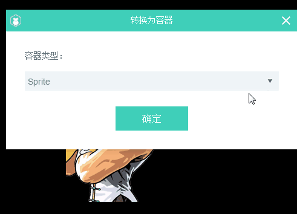
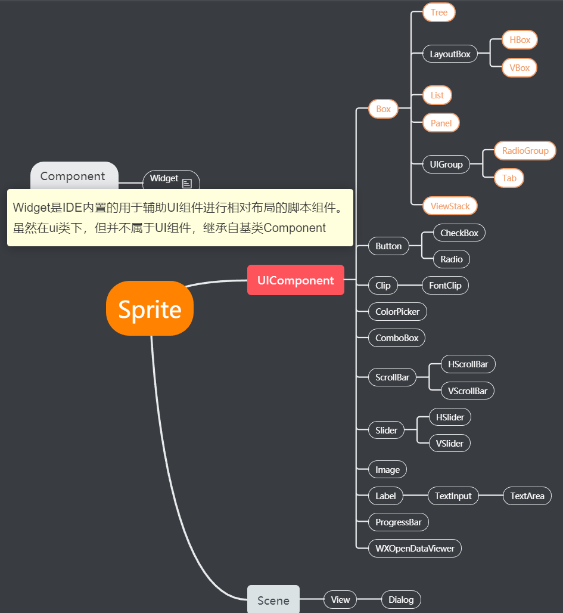

# UI组件的分类与继承关系

>author：charley version：2.0.1 udate：2019-04-02

セットはLayaAirエンジンのゲーム設計の基本で、ほとんどどこにもありません。LayaAir IDEには、2 Dベースコンポーネント（2 D）、フィルタコンポーネント（Filters）があり、図形描画コンポーネント（Graphysics）、物理コンポーネント（physics）、UIコンポーネント（UI）、公共コンポーネント（common）があります。開発者はコンポーネントをカスタマイズすることもできます。今回はUIコンポーネントをめぐって紹介します。

 

（図1）

##1、UIコンポーネントの分類

コンポーネント自体の構造および機能に応じて、UIコンポーネントを3つのカテゴリに分けることができる。それぞれビューコンポーネント、コンテナコンポーネント、ベースディスプレイコンポーネントです。

###1.1ベースディスプレイコンポーネント

ベースディスプレイコンポーネントは、ページ編集で最も一般的なUI表示コンポーネントです。リソースマネージャまたはベースコンポーネントライブラリでシーンエディタにドラッグして可視化します。はい、あります`属性设置器`に属性値を設定し、シーンエディタで直接表示効果を確認します。

基礎表示コンポーネントは、Sprite、Button、CheckBox、Clip、ColorPicker、Commbobox、FontClip、HScrollBar、HSlider、Image、Label、TextArea、TextInput、Radio、ProggressBar、Slider、Valder、Scrable、Scrabler、Bacrablerを含みます。

>*Tips:*Spriteは特に、基本的な表示パターンの表示リストノードであり、コンテナでもある。2.0では、UIコンポーネントの乱用を避けるために、コンポーネントルールによって命名されていないコンポーネントは、もはやImageコンポーネントとして認識されなくなり、デフォルトではSpriteとして認識されています。これは、最も性能の高い使用方法です。

###1.2容器類コンポーネント

Sprite、Box、及びBoxから継承されたUIコンポーネントは、通常、リソース名でコンポーネントを識別する必要はなく、1つ以上のベースコンポーネントによってコンテナに変換することによって生成されるコンテナ類コンポーネントである。IDEで通過できます。`Ctrl+B`ショートカットキーは、1つ以上のベースコンポーネントをコンテナコンポーネントに変換します。図2に示すように。

 

（図2）

容器類コンポーネントはスピリット、Box、List、Tab、Radio Group、View Stock、Panel、HBox、VBIox、Treeを含む。

###1.3ビューコンポーネント

ビュークラスのコンポーネントは、オブジェクトコンテナをページレベルで表示します。LayaAir IDEのUIシステムでは、ページはすべての表示コンポーネントを搬送するために使用され、LayaAirのビューコンポーネントはそれぞれScene、View、Dialogであり、シーンを作成するときに使用される。

 

相対配置を使用する必要がない場合は、デフォルトでSceneを使用し、相対配置が必要な場合は、Viewを使用することができます。Dialogはパチンコページを作る時に使います。

##2、コンポーネントの継承関係

SpriteクラスはLayaAirエンジンの中で最も基礎的な表示対象容器類であり、すべてのUIコンポーネントはベースのSpriteから継承されています。ここで、ベースディスプレイコンポーネントとコンテナコンポーネントはSpriteのサブクラスUComponentから継承されています。Spriteのサブクラスsceneはビューコンポーネントのベースクラスで、viewはsceneに継承され、Dialogはviewに継承されます。具体的なコンポーネント引継ぎ関係を図4に示す。

##3、コンポーネントの属性についての詳細な説明

具体的には、各コンポーネントの命名規則とコンポーネントの使用を理解するには、2.0のドキュメント「IDEコンポーネントのプロパティの詳細」を直接参照してください。

TS版リンクアドレス：[https://ldc2.layabox.com/doc/?nav=zh-ts-2-3-0](https://ldc2.layabox.com/doc/?nav=zh-ts-2-3-0)

AS版リンク先:[https://ldc2.layabox.com/doc/?nav=zh-as-2-3-1](https://ldc2.layabox.com/doc/?nav=zh-as-2-3-1)

JS版リンク先：https:/ldc 2.layabox.com/doc/？nav=zh-js-2-3-1

##この文章は賞賛します

本論文があなたのために役立つと思ったら、スキャンコードの作者への賞賛を歓迎します。激励は私たちがより多くの優れた文書を書くための動力です。

 