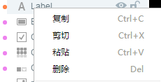
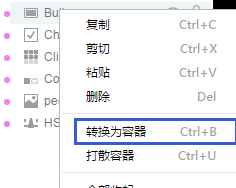

#レベルマネージャ

階層マネージャは、設計モードのコア構成部分の一つであり、すべての`场景编辑器`のセットは全部`层级管理器`に階層構造で表示されます。

###1、階層構造

####1.1ルートレベル

UIページを作成するときDialogを選択しない限り、UIであれ動画であれ、ルートレベルはViewであり、IDは1である。図1に示すように。

 (図1)

####1.2多層ネスト

階層マネージャでは、複数の入れ子が許可されています。各親レベルの層は灰色の三角標識で始まります。三角標識をクリックすると、図2に示すように階層が展開されます。

 (図2)

####1.3階層構造の最適化

階層マネージャでは、コンポーネントアイコンの前に異なる色の円点があります。同じ色は同じセットのノードを表していますが、色の値が異なる場合は、図3に示すように最適化が必要です。

 (図3)異なる色の円点を交互に配置する場合は、最適化が必要です。

最適化の方式はとても簡単で、同じ階層の下の同じ色の円点を並べてもいいです。ここには小さなテクニックがあります。コンポーネントの下にドラッグして、直線にすると、同じレベルで順番が変わります。コンポーネントをドラッグすると、枠として表示されます。目的のコンポーネントのサブレベルにドラッグします。また、ショートカットキーによって階層順を変更することもできます。`ctrl + 方向键向上`上の階層に移動します。`ctrl+方向键向下`下の階層に移動します。

 (図4)

階層表示順序を変更した後、円点の色相と同時に最適化の目標を達成することができます。図5に示すように。

 (図5)

###2、階層管理器パネルの機能

####2.1表示と隠しコンポーネント

選択する`层级管理器`のいずれかのコンポーネントをクリックして、コンポーネントの右側の`眼睛图标`はい、**非表示**`场景编辑器`的に命中する**対応コンポーネント**を選択して、再度クリックすると隠しが解除されます。効果は図6に示すようになります。

 (図6)

####2.2コンポーネントとロック解除

選択`层级管理器`のいずれかのコンポーネントをクリックして、コンポーネントの右側の`锁形图标`はい、**アンカー**`场景编辑器`の対応するコンポーネントをクリックするとロックが解除されます。効果は図7に示すようになります。

 (図7)

####2.3底機能ボタン

階層マネージャの下部機能ボタンは、階層リスト全体に対して動作します。

クリック`刷新`ボタンを押すと、階層マネージャのリストが更新されます。

クリック`眼睛`ボタンを押すと、階層マネージャ全体のコンポーネントがすべて非表示になります。

クリック`锁形`ボタンを押すと、階層マネージャ全体のコンポーネントをロックまたはロック解除します。

具体的な効果は図8に示すとおりです。

 (図8)

####2.4コンポーネント検索フィルタ

コンポーネントは階層マネージャで検索され、コンポーネントの元の名前のキーワードフィルタリングによっても、コンポーネントの別名によってフィルタリングされてもよく、効果は図9に示されている。

 (図9)

**Tips：コンポーネントの別名は、属性設定器のname属性によって設定されます。エイリアスを設定するとコンポーネントの検索と位置決めが便利です。**

###3、階層マネージャの右ボタンメニュー操作

####3.1コンポーネントのコピー、貼り付け、削除

階層マネージャのセットを選択すると、右クリックでコピー、スクラップ、削除、貼り付けなどの一般的な操作ができます。図10に示すように。

 (図10)

**Tips:**ショートカットキーも使用できます。`ctrl+c`コピーします`ctrl+x`切り取り、`ctrl+v`貼り付け、`Delete`削除します。

####3.2変換と散逸容器

一つまたは複数のコンポーネントを選択して、右クリックでいいです。`转换为容器`図11に示すように。

  （图11）

**Tips:**ショートカットキーも使用できます。`ctrl+B`コンポーネントを`转换为容器`。

コンテナのセットを選択し、右クリックで選択します。`打散容器`図12に示すように、コンテナレベル関係を解除することができる。

 (図12)

**Tips:**ショートカットキーも使用できます。`ctrl+U`容器をばらばらにする。

####3.3全部まとめて展開する

アイコンの前の三角形をクリックすると、現在のコンテナの下のコンポーネントを展開したり、閉じたりできます。右クリックしてください。`全部收起`和`全部展开`図13に示すように、ルートレベル全体のコンポーネントを展開または縮小することができる。

 (図13)

####3.4コンポーネントノードを作成する

コンポーネントを選択すると、右クリックメニューから一般的なコンポーネントを簡単に作成できます。右クリックメニューから`创建2D`直接に2 Dベースコンポーネントを作成できます。`创建Graphics`ベクトルグラフィックコンポーネントを作成できます。`创建UI组件`図14のように、UIの一般的なコンポーネントを作成することができる。

 (図14)

**Tips**:*右キーのコンポーネント作成は、コンポーネントライブラリに完全に対応していますので、コンポーネントライブラリを介してコンポーネントの作成を行うこともできます。*

###4、その他の操作

####4.1複数選択操作

Shiftを押しながら、同じ階層の下の複数の隣接するコンポーネントを選択できます。

Ctrlを押しながら、同じ階層の下の複数の隣接または離れたコンポーネントを同時に選択できます。

####4.2コンポーネント追加操作

右クリックメニューから直接コンポーネントを作成するほか、`组件库`および`资源管理器`でドラッグ＆ドロップしてコンポーネントを作成し、シーンエディタの複数のコンポーネントを重ね合わせた複雑なシーンを直接に通過します。`层级管理器`コンポーネントの作成と管理は比較的効率的な開発方式である。コンポーネント追加動作を図15に示す。

 (図15)

