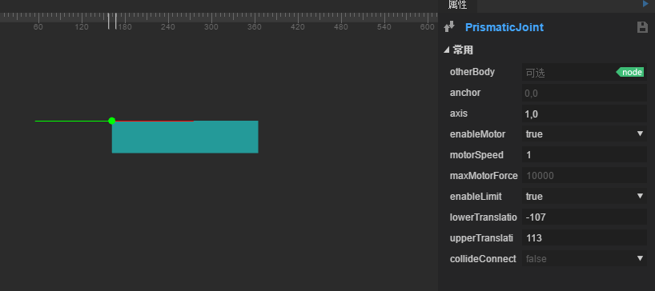
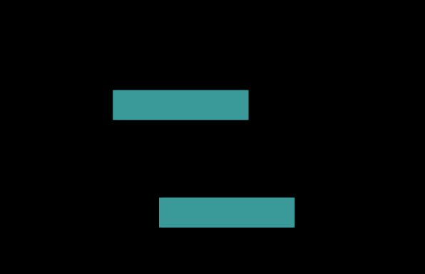

#ギアの関節と平行移動します。

##内容の概要

ゲーム開発では、ステージ設計にベルト、ギアドライブ、モバイルプラットフォームなどの装置が必要で、以下の関節の組み合わせを使って、制約関係ができるシステムを素早く作ることができます。

この内容は三つの関節を使う必要があります。

関節をずらす`PrismaticJoint`を選択して、関節を回転させます`RevoluteJiont`ギア関節`GearJoint`。

関節の組み合わせを使って、横の平行移動プラットフォームが歯車の回転を動かし、ブロックを持ち上げるような機関装置を作ることができます。

​

###1.関節をずらす紹介

関節をずらす`PrismaticJoint`：関節を移動すると、指定された軸に沿って2つの物体が相対的に動くことができます。相対的な回転を阻止します。

#####属性の紹介

#####other Body

[最初の設定が有効]関節の接続剛体は、設定せずに、デフォルトでは左上の空剛体となり、剛体オブジェクトにドラッグして設定が完了します。

#####アンチョー

[最初の設定が有効]関節の制御点は、自身の剛体に対して左上の位置がずれています。

#####axis

［最初の設定は有効です。］1つのベクトル値は、動き方向、例えば、1,0はX軸に沿って右側です。

#####enaboleMotor

モーターを開けるかどうかは、モーターを開けて目標の剛体を動かすことができます。

#####モータースピード

モータを有効にすると、axis軸上を移動すると最大速度になります。

#####maxMotorForce

モーターを有効にすると、最大の力を加えられます。

#####enaboleLimit

剛体の移動範囲に制約があるかどうか。

#####lower Translation

拘束を有効にすると、剛体移動範囲の下限は、アンチョーからのオフセット量（マイナス値）です。

#####up perTranslation

拘束を有効にすると、剛体移動範囲の上限は、アンチョーからのオフセット量（正の値）です。

#####collideConneced

[最初の設定が有効です]2つの剛体が衝突するかどうかは、デフォルトではfalseです。

####実例訓練

最も基本的な平移関節を単独で使うのは簡単です。ブロックにドラッグして追加します。`boxcollider`衝突体は彼にフラット関節を追加します。`PrismaticJoint`を選択します`rigidbody`重力`gravityScale`0に設定し、axisを（1,0）に設定してモーターのオンを設定します。速度は1です。最大最小オフセット量を制限します。効果は図の通りです。

運転効果は以下の通りです。（下図は物理補助線の効果を示しています。上の文書に紹介されています。f 9でチェックできます。）

​      

ゲームをより楽しくするためには、プラットフォームとプラットフォームの関連移動を利用して、ブロックにドラッグして長方形にして、衝突体、剛体を追加します。`rigidbody`重力`gravityScale`0に設定し、最初のブロックの並進関節に剛体をドラッグします。`PrismaticJoint`の`otherbody`でモータをオンし、速度を1とし、方向を1,0として、大きさオフセット制限を行います。

運行効果に問題があります。これは第二のブロックも一つの並進関節を必要とします。第二のブロックに並進関節を追加して、運行効果は以下の通りです。

ここに来て、一対三を挙げる開発者は、この並進は互いに向かうか、或いは斜めになるか、つまり、一つの軸にしか近づけないか、あるいは遠く離れているか、同時に一方の方向に移動してはいけないということに気づくだろう。関節の並進は相対的に移動するだけで、国内外の文書や公式マニュアルを見ても、関節の詳細については詳しく紹介していません。筆者は実験を通じて組み合わせの方法で機能を実現しました。だから、物理システムを使う時は、必ず物理的な思想に基づいて設計し、考えてみます。

私たちは前の例を続けて、上の方のブロックの関節を移動します。`PrismaticJoint`の中の`otherBody`図のように削除

そして彼に距離関節を追加します。`DistanceJoint`を選択して、下のブロックにフラット関節を追加します。`PrismaticJoint`そしてこの物体を`RigidBody`上の物体までの距離関節の`otherBody`図のように

設定後、運転効果は以下の通りです。

###2.回転関節の紹介

関節を回す`RevoluteJiont`：二つの物体に一つのアンカーポイントを共有させ、二つの物体が相対的に回転するように強制します。

#####属性の紹介

#####other Body

[最初の設定が有効]関節の接続剛体は、設定せずに、デフォルトでは左上の空剛体となり、剛体オブジェクトにドラッグして設定が完了します。

#####アンチョー

[最初の設定が有効]関節の制御点は、自身の剛体に対して左上の位置がずれています。

#####enaboleMotor

モーターを開けるかどうかは、モーターを開けて目標の剛体を動かすことができます。

#####モータースピード

モータを有効にすると最大回転速度になります。

#####maxMotorque

モータを有効にすると最大トルクがかかりますが、最大トルクが小さすぎると回転しなくなります。

#####enaboleLimit

剛体の回転範囲に制約があるかどうか。

#####lower Angle

拘束を有効にすると、剛体移動範囲の下限は、アンチョーからのオフセット量（マイナス値）です。

#####up perAngle

拘束を有効にすると、剛体移動範囲の上限は、アンチョーからのオフセット量（正の値）です。

#####collideConneced

[最初の設定が有効です]2つの剛体が衝突するかどうかは、デフォルトではfalseです。

####実例訓練

新しいシーンを作成して、円形の画像にドラッグして、円形の衝突体を追加します。`CircleCollider`を選択します。IDEは自動的に剛体を追加します。`RigidBody`を選択して、回転関節を追加します。`RevoluteJoint`関節のアンカーポイントを中心に、モーターをオンにして回転速度を1に設定します。図のように:

クリックして実行します。回転の丸さが見えます。

単独で使うのはとても簡単です。次は組み合わせを使います。この例に基づいて、正方形の衝突体を追加します。`BoxCollider`の長方形をプラットフォームとして使用します。

そして関節を移動します`PrismaticJoint`を選択します。多角形衝突体を追加しました。`PolygonCollider`の三角形を土台として、円を三角形の上で点を回転させます。（三角形のノードは円形のノード階層の上にあり、下の方に一番前に表示します。）最終的な効果は下図のようになります。

実行をクリックして、効果は以下の通りです。

###3.ギア関節の紹介

歯車の関節`GearJoint`：二つの歯車の間の制約関係をシミュレーションするために用いられ、歯車が回転する時に発生する運動量は二つの出力方式があります。一つは歯車自身の角速度、もう一つは歯車表面の線速度です。

#####属性の紹介

#####ジョインt 1

［最初の設定が有効］バインディングする第1の関節は、タイプはRevoluteJointまたはPrismatic Jointとすることができます。

#####ジョニーt 2

［最初の設定が有効］バインドする第2の関節は、タイプはRevoluteJointまたはPrismatic Jointとすることができます。

#####ナショナル

二つの歯車の角速度の割合は、デフォルトの1です。

#####collideConnect

二つの剛体が衝突してもいいですか？デフォルトはfalseです。

####実例訓練

関節を並進させ、関節を回転させた後に、ギア関節を使って、二つの関節を関連付けることができます。これによって、順番に関節を制約して、一つのシステムを完成させます。ちょっと複雑な組み合わせを作りましょう。

空のシーンを新たに作って、「ギア」と名付けて、シーンの中でブロックにドラッグして、丸い形をして、次の図のように並べます。

上から下までのスプライトの名前は、box、circle 1、yellow、circle 2、spriteです。ネーミングは具体的な物体の位置付けを容易にするためです。各物体に対応する衝突体を追加します。IDEは自動的に剛体を追加します。

位置をそろえたら一番上のブロックに平関節を追加します。`PrismaticJoint`また、該当する属性を設定して下図と一致させます。

その後、circelle 1物体に該当する関節を追加し、回転関節を追加します。`RevoluteJoint`ギア関節`GearJoint`そして、関節の並進と回転の関節をジョインt 1、ジョニーt 2の位置に引っ張り、両関節を関連付ける。

同じように、残りの円に回転関節を加えます。`RevoluteJoint`そしてギヤ関節で`GearJoint`二つの物体を順次接続し、yellowはcircell 1に接続し、circle 2はyellowを接続し、spriteはcircle 2に接続し、spriteの並進関節`PrismaticJoint`以下のように設定します。彼のy軸記号に注意してください。

注意したいのですが、最初のボックスボックスボックスボックスだけが開いて、シーン中のすべての物体の動きや回転を動かします。最終的な運行効果は以下の通りです。

もっと多い問題はコミュニティhttp:/ask.layabox.comに訪問してください。