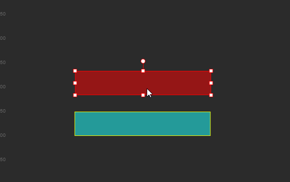
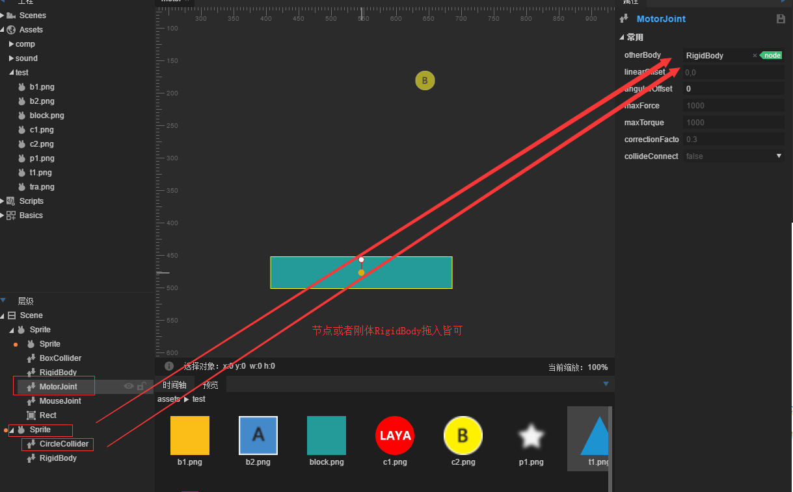

#モーターの関節

###1.モータ関節

モーターの関節`MotorJoint`二つの剛体を制限して相対位置と角度を一定に保つために使用します。

モータ関節は常に目標点に移動し、特定の角度を維持します。

#####属性の説明

#####other Body

[有効設定は初めてです]関節の接続剛体です。

#####ラインナップ

other Body座標位置によるオフセット量も、selfBodyの目標位置である。

#####angglar Offset

other Bodyによる角度オフセット量も、selfBodyの目標角度である。

#####maxForce

selfBodyが目標位置から逸脱した場合、目標位置に復帰するため、モータ関節に与えられた最大の力です。

#####maxTorque

selfBody角度が目標角度と異なる場合、モータ関節に課される最大トルクは目標角に到達させるために使用されます。

#####corection Facto

selfBodyが目標位置に移動する時の緩動因子は、0~1の値を取ると、値が大きいほど速くなります。

#####collideConnect

二つの物体が衝突してもいいですか？デフォルトはfalseです。

####実例訓練

モーターの関節の紹介は彼の意味がよく分かりません。簡単な例を作ってモーターの関節をよく理解して、モト.sceneを作成して、ブロックにドラッグして成長します。そして、階層の中でマウスの右ボタンでspriteノードを作成して、ノードのアンカー（左上隅）を長いバーの中心点に移動します。剛体は物体の左上にあり、直せないので、この親ノードをセットする方式で、図形スプライトはサブノードをレンダリングする）

そして、長いスプライトを空のスプライトノードにドラッグして、空のノードのサブノードにします。図のように:

親ノードに矩形衝突器を追加します。`BoxCollider`この時、衝突器の大きさは長いパターンと同じではなく、親ノードのスプライトの大きさと一致しています。彼をサイズと位置を調整して、長い棒の図形の大きさと位置を一致させる必要があります。

次に親ノードスプライトにモータ関節（デフォルト属性）を追加し、マウス関節（ドラッグするため、マウス関節にアンカーポイントが設定されていない、すなわちポイントがどこに追加されていますか？アンカーポイントを設定すると固定位置になります。）親ノードspriteにgraphic矩形を追加し、大きさを図と同じ大きさに設定し、そのrendertypeをhitに設定して、この図形をマウスとして判定領域をクリックします。また、モーターの関節の目標点として円形の衝突体を追加します。

これを作ったら、長方形の位置を図のように長い図形と重ねます。

次に、丸ノードまたは剛体リギdbodyをモーターの関節のother bodyにドラッグします。

ここに来てから、できました。とても簡単で、運行を保存して、モーターの関節の効果が見られます。

###2.車輪関節

車輪の関節`WheelJoint`：ノードの周りの回転は、剛体がノード位置で弾性オフセットを生じるような弾性特性を含む。

物理ホイールの製作に使います。

#####属性の説明

#####オタクボディ

[有効設定は初めてです]関節の接続剛体です。

#####アンチョー

[最初の設定が有効]関節のリンク点は、自身の剛体に対して左上の位置がずれています。

#####axis

［最初の設定は有効です。］1つのベクトル値は、動き方向、例えば、1,0はX軸に沿って右側です。

#####enaboleMotor

モーターを開けるかどうかは、モーターを開けて目標の剛体を動かすことができます。

#####モータースピード

モータを有効にすると最大回転速度になります。

#####maxMotorque

モータを有効にすると最大トルクがかかりますが、最大トルクが小さすぎると回転しなくなります。

#####frequency

スプリングシステムの振動周波数は、スプリングの弾性係数と見なすことができる。

#####damping

剛体はノードへの回帰過程で受けた減衰を0~1とした。

#####collideConnect

[最初の設定が有効です]2つの剛体が衝突するかどうかは、デフォルトではfalseです。

####模範練習

車輪のノードの名前は車輪を作ることです。例も非常に簡単です。詳細には説明しないで、下の図のように地面（剛体は静止タイプに設定されています。）と小型車の形をして、車輪の関節のotherbodyをバインディングする車体に引きずり込んで、下図のように設置してください。

運転効果は以下の通りです。

私たちは車が重力のために下に転がるのを見ました。これは車輪のモーターを開けていないからです。

次に私達はそれぞれ二つの車輪の関節のenabeleMotor属性をtrueに設定します。motorsSpeedは3に設定します。

このように小型車は車輪自身のモーターによって動力を提供して、運行を保存します。

モーターの動力のある車輪が動かす小型車が完成します。

###プーリ関節

プーリ関節`PulleyJoint`二つの物体を接地して互いに接続します。一つの物体が上昇すると、もう一つの物体が下がります。スーパーメアリーの中でロープで吊るされたプラットフォームのように、踏み続けるともう一つが上昇します。

#####属性の説明

#####other Body

[有効設定は初めてです]関節の接続剛体です。

#####other Ancher

[最初の設定が有効]剛体リンクポイントは、other Bodyの左上隅に対してオフセットされます。

#####other GroudPoint

[最初の設定が有効]プーリにノードother Ancherと接続されているノードは、other Bodyの左上の位置に対してオフセットがある。

#####self Ancher

[最初の設定が有効です]ご自身の剛体リンクポイントは、自身の剛体に対して左上の位置がずれています。

#####selfGroudPoint

[最初の設定が有効]プーリにノードselfAncherと接続されているノードは、自身の剛体の左上隅位置に対してオフセットされる。

#####ナショナル

[初回設定有効]両剛体移動距離比率。

#####collideConnect

[最初の設定が有効です]2つの剛体が衝突するかどうかは、デフォルトではfalseです。

####模範練習

新しいシーンを作って、板としてブロックを引きずり込んで、ボールとして円形を二つ追加し、それに対応する衝突体を追加して、ball 1にマウス関節とホイール関節を追加して、ball 2をプーリ関節の中のotherbodyにドラッグして、関節の4つのアンカーポイントを設定します。

二つの丸を連結するだけで、板は背景として参照してください。運行すると板の両端に2つのプーリがあるように見えます。マウスでball 1をドラッグして、効果を観察できます。

もっと多い問題はコミュニティhttp:/ask.layabox.comに訪問してください。