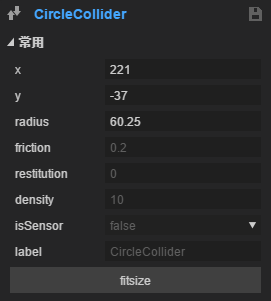
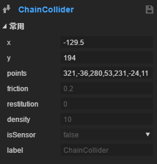
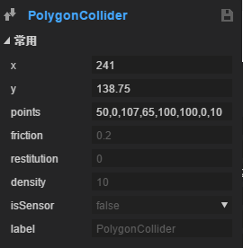

#2 D物理システム

###1.2 D物理システムの概要

ゲーム開発において、物理システムはすべての必用ではないが、ゲームユーザーの体験を高める重要な要素の一つである。怒りの小鳥、ワニのいたずら好きな風呂など、物理システムで作られた豊富なステージで、全球を風靡し、ゲーム開発者の需要とエンジンの反復に伴い、Laya 2.0はBを一体化した。ox 2 D物理システムは、Box 2 Dをカプセル化した後、開発者がBox 2 D物理システムにアクセスするために必要な様々な困難と不便を回避できるようにする。

LayaAirエンジンに統合されたBox 2 D物理システムは、まず剛体を理解する必要があります。`rigidbody`と衝突体`collider`物体が剛体を含むと物理エンジンの影響が受けられ、物体が衝突体を含むと物体が衝突し、物体が衝突体を含んで剛体を含まない場合は衝突しますが、物理運動学的な動力の影響はありません。

剛体`rigidbody`剛体とは、運動中や力によって作用した後、形や大きさが変わらず、内部の各点の相対的な位置が変わらないものをいう。

衝突体`collider`：衝突体は物体に判定枠を付け、衝突枠が重なると、両物体が衝突する。

関節`joint`：関節は2つ以上の物体に対して1つの制約を行うことができます。

**Box 2 D対応の関節はあります。**:

距離かんせつ`DistanceJoint`二つの物体の上にはそれぞれ一つの点があります。二つの間の距離は固定されています。

歯車の関節`GearJoint`：二つの歯車の間の制約関係をシミュレーションするために用いられ、歯車が回転する時に発生する運動量は二つの出力方式があります。一つは歯車自身の角速度、もう一つは歯車表面の線速度です。

モーターの関節`MotorJoint`：2つの剛体を制限し、相対的な位置と角度を一定に維持し、モータ関節は常に目標点に移動し、特定の角度を維持する。

マウスの関節`MouseJoint`：マウスで物体を操作します。オブジェクトを現在のマウスカーソルの位置にドラッグします。回転には制限がありません。

関節をずらす`PrismaticJoint`：関節を移動すると、指定された軸に沿って2つの物体が相対的に動くことができます。相対的な回転を阻止します。

プーリ関節`PulleyJoint`二つの物体を接地して互いに接続します。一つの物体が上昇すると、もう一つの物体が下がります。

関節を回す`RevoluteJiont`：二つの物体に一つのアンカーポイントを共有させ、二つの物体が相対的に回転するように強制します。

ロープの関節`RopeJoint`：2点間の最大距離を制限します。大きな負荷の下でも，接続された物体間の引張は阻止される。

溶接関節`WeldJoint`：二つの物体を相対的に動かすことができず、二つの剛体の相対的な位置と角度は同じで、一つの全体のようです。

車輪の関節`WheelJoint`：ノードの周りの回転は、剛体がノード位置で弾性オフセットを生じるような弾性特性を含む。

###2.剛体コンポーネントの紹介

####2.1剛体

RigidBody類はComponentから継承されています。剛体は三つのタイプをサポートしています。`static`を選択します`dynamic`和`kinematic`を選択します`dynamic`。

`static`静的なタイプで、静止して動かないで、重力の影響を受けないで、品質は無限大で、ノードを通じて(通って)移動することができて、回転して、スケーリングは制御します。

シミュレーション環境では静物体は動かないので、無限大の品質があるようです。Box 2 Dの内部では品質を逆にしてゼロに保存します。静的物体にはゼロ速度がある。静的物体は他の静的または運動学的物体と衝突できない。

`dynamic`ダイナミックタイプで、重力の影響を受けます。

動物体は全シミュレーションが可能である。これらはユーザーによって手動で移動できますが、通常は力によって移動します。動物体はどの物体とも衝突することができる。動物体は常に有限な非ゼロ質量を持っている。ダイナミックな物体の品質をゼロにしようとすれば、自動的に1キログラムの質量の物体を設定します。

`kinematic`運動タイプのため、重力に影響されず、速度や力を加えて動かすことができます。

運動学的物体はシミュレーション環境において自身の速度に基づいて移動する。運動学物体自身は力の作用を受けない。ユーザーは手動で移動できますが、通常は速度を設定して移動します。運動学物体の挙動は無限大の質量を持つように見えるが、それでもBox 2 D内部では運動学物体の品質は逆にゼロに設定される。運動学的物体は他の静的または運動学的物体と衝突できない。

剛体のタイプは強制的で、剛体のコンポーネントは以下の図の通りである。

 

####属性の説明

#####タイプ

前に述べた3つのタイプ:`static`を選択します`dynamic`和`kinematic`を選択します`dynamic`。

#####gravityScale

重力のスケーリング係数は、デフォルトでは1となります。すなわち、通常の重力は0に設定されています。

#####angglar Velocity

角速度、設定は回転の原因となります。単位はラジアンで、実際に使用するには制約が必要です。

#####angglar Dampin

回転速度減衰係数は、0から無限大までの範囲であり、0は減衰がないことを示し、無限大は満減衰を表し、通常減衰の値は0から0.1までの間であるべきである。

#####lineaVelocity

線形運動速度は、10,10のような入力ベクトルが必要で、x軸を表す右速度10,y軸を下方向に速度10とする。

#####lineadamping

線形速度減衰係数は、0から無限大までの範囲であり、0は減衰がないことを示し、無限大は満減衰を表し、通常減衰の値は0から0.1までの間であるべきである。

#####bullet

高速で動く物体がtrueに設定されているかどうかは、高速での侵入を防ぐことができます。

#####allowSleep

休眠を許可するかどうか、休眠を許可して性能を高めることができて、これは普通はすべてtrueに設定します。

#####allowRotation

回転を許可するかどうかは、剛体の回転を望まない場合はfalseに設定されます。

#####グループ

この本体が属する衝突グループを指定しました。デフォルトは0です。

衝突規則は以下の通りです。

1.2つのオブジェクトがグループに等しい場合

グループ値がゼロより大きいと、常に衝突します。

グループ値はゼロ以下で、衝突は永遠に発生しません。

グループ値が0に等しい場合は、ルール3を使用します。

2.グループ値が等しくない場合は、ルール3を使用する。

3.各剛体にはcategoryカテゴリがあります。この属性の受信フィールドは、[1,2^31]範囲内の2の累乗です。

各剛体にもmarkカテゴリがあります。その衝突の種類値の和を指定します。

#####category

衝突カテゴリは、2のべき乗乗乗乗乗乗乗乗値で指定されており、32種類の異なる衝突カテゴリがあります。

#####マスター

衝突ビットマスク衝突のカテゴリ、categoryビット操作の結果を指定します。

#####label

カスタムラベル

####2.2衝突体

衝突体は物理衝突を検出するための枠組みであり、彼は物体の剛体に従って常に移動し、偏差が発生しない。

衝突体には四つの種類があります。

長方形の衝突体、円形の衝突体、線形の衝突体、多角形の衝突体。図のように、各衝突体は自己衝突体ベースクラスを継承している。

#####衝突体ベースの属性

#####x，y

ノードxに対して、y軸がオフセットします。

#####friction

摩擦力は、0-1の範囲で値が大きいほど、摩擦が大きいほど、標準値は0.2です。

#####レスリング

弾性係数は、0から1の範囲で値が大きいほど、弾性が大きくなり、デフォルト値は0です。

#####density

密度値は、値がゼロまたは正の値とすることができ、同様の密度を使用することが推奨されており、このようにすれば、積層安定性が改善され、デフォルト値は10である。

#####issensor

センサかどうかは衝突イベントをトリガすることができますが、衝突反応は発生しません。Triggerとして理解できます。

#####label

カスタムラベル

####矩形衝突体

#####属性の説明

#####width，height

長方形の幅と高さ。

#####fitsizeボタン

このボタンを押すと、衝突体の大きさはノード幅の高さに適応します。

####円形の衝突体

#####属性の説明

#####ラジディウス

円の半径は正数でなければなりません。

####線形衝突体

#####属性の説明

#####points

コンマで区切られた点の集合、書式：x，y，y…設定点の後、最初の点から最後の点に順次接続された線が線形衝突体となります。エディタでは、オンラインで左クリックしてポイントを追加します。ポイントをドラッグして、ポイントをダブルクリックしてこの点を削除します。

####多角形衝突体

#####属性の説明

#####points

コンマで区切られた点の集合、書式：x，y.

2 D多角形衝突体は、一時的に凹形多角形をサポートしていません。凹形の場合は、まず手動で複数の凸多角形に分割します。

ノードの個数は最大b 2 mumaxPolygon Versticesで、この数値はデフォルトでは8ですので、8個を超えることは推奨されません。

###3.物理プレゼンテーション

####物理システムのデモンストレーション

2 dの例項目を新規作成し、編集モードでシーンを作成し、その後一連の操作を行います。最終的に効果は以下の通りです。これらの効果を詳細に説明します。

