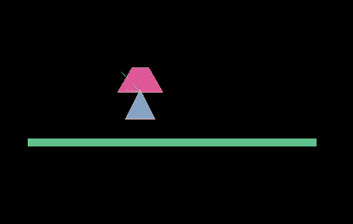
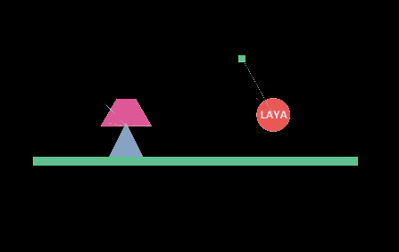

#関節、ロープ関節、マウス関節を溶接する

###1.溶接関節

溶接関節`WeldJoint`：二つの物体を相対的に動かすことができず、二つの剛体の相対的な位置と角度は同じで、一つの全体のようです。

#####属性の説明

#####other Body

[有効設定は初めてです]関節の接続剛体です。

#####アンチョー

[最初の設定が有効]関節のリンク点は、自身の剛体に対して左上の位置がずれています。

#####frequency

スプリングシステムの振動周波数は、スプリングの弾性係数と見なすことができる。

#####damping

剛体がノードに戻る過程で受けた減衰は、0~1の値を取る。

#####collideConnect

[最初の設定が有効です]2つの剛体が衝突するかどうかは、デフォルトではfalseです。

####実例訓練

溶接関節は簡単です。二つの剛体を一つの点に固定して、溶接のようにします。

私達は新しいシーンを作って、シーンの中で1つのboxに引きずり込んで成長の条を引き延ばして地面として、そしてbox colliderを添加して、剛体のタイプをstatic静的なタイプに設定します。もう一つの三角形と台形にドラッグしてpolycolliderを追加し、衝突サイズを設定します。

シーンを保存して走ると、重力や衝突の効果が見られます。

このステップを作ったら、三角形に溶接関節を追加します。台形を関節のotherbodyに引きずり込みます。

このように二つの剛体を溶接して、保存して運行します。効果が見られます。

###2.ロープ関節

ロープの関節`RopeJoint`：2点間の最大距離を制限します。大きな負荷の下でも，接続された物体間の引張は阻止される。

#####属性の説明

#####オタクボディ

[有効設定は初めてです]関節の接続剛体です。

#####アンチョー

[最初の設定が有効]関節のリンク点は、自身の剛体に対して左上の位置がずれています。

#####frequency

スプリングシステムの振動周波数は、スプリングの弾性係数と見なすことができる。

#####damping

剛体はノードへの回帰過程で受けた減衰を0~1とした。

#####collideConnect

[最初の設定が有効です]2つの剛体が衝突するかどうかは、デフォルトではfalseです。

####模範練習

ロープの関節の使い方は距離関節と似ています。シーンでは四角形と円をドラッグして、対応するbox colliderとcircllecolliderを追加して、丸型にロープ関節を追加して、距離を設定します。（設定の長さは2つの物体の距離より大きいです。）関節とは異なるシングルスイングの効果が見られます。距離。

運転効果は以下の通りです。

​

###マウスの関節

マウスの関節`MouseJoint`：マウスで物体を操作します。オブジェクトを現在のマウスカーソルの位置にドラッグします。回転には制限がありません。

#####属性の説明

#####アンチョー

［有効に設定するのは初めてです。］関節のリンク点は、自身の剛体の左上の位置に対してずれています。設定しない場合は、接続点としてマウスクリックします。

#####maxForce

マウスの関節が剛体ボディボディボディボディを引きずる時にかける最大の力です。

#####frequency

スプリングシステムの振動周波数は、スプリングの弾性係数と見なすことができる。

#####damping

剛体はノードへの回帰過程で受けた減衰を0~1とした。

####模範練習

前のシーンを引き続き使って、台形ノードにマウス関節を追加してもいいです。他のオブジェクトにも追加できます。

追加するだけで効果があります。一番簡単な関節はマウスの関節です。以下は運行します。これらの関節の効果を見てください。

マウスのドラッグの効果が見られます。関節を溶接したり、マウスの関節に弾力があります。

組み合わせの効果図を添付します。もっと多くの組み合わせは開発者が自分で完成してください。

もっと多い問題はコミュニティhttp:/ask.layabox.comに訪問してください。