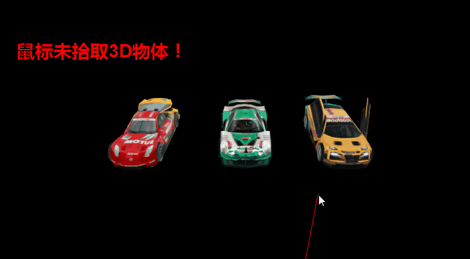

#LayaAir 3 Dマウスの対話

###マウスのインタラクションの概要

LayaAir 2 Dエンジンでは、2 D表示オブジェクトはマウスイベントを使用しています。作成ロジックは簡単で便利です。LayaAir 3 Dエンジンではこのような機能は実現されておらず、3 D空間はより複雑であり、表示対象は空間の中に奥行きがあり、遠近、積層、裁断、親子などの関係があり、空間は絶えず変化している。したがって、3 Dエンジンは、衝突器、層と物理放射線検出、衝突情報を用いてマウスの判断を行います。まず、それらの概念と役割を理解しましょう。


###衝突器Collider

衝突器は、3 D表示オブジェクトに追加することができ、主に3 D空間内の物体に衝突検出を行うために使用され、3 D表示オブジェクトの形状によって異なるタイプに分類される物理的なコンポーネントである。

LayaAir 3 Dエンジンが現在サポートしている衝突器は、3つのタイプがあります。**ボール型の衝突器スフィア・コレッダー**を選択します**ボックス型衝突器BoxCollider**を選択します**メッシュクラッシュMeshCollider**。から**衝突検出精度**和**消耗性能**低いものから高いものまで順にSphere Collider-BoxCollider-MeshColliderです。ゲームの中開発のニーズに合わせて、適当な衝突器を選ぶことができます。

3 D表示オブジェクトコードに衝突器のコンポーネントを追加する方法は以下の通りです。開発者はコードを使ってキューブテストをしないほうがいいと提案しています。面倒です。直接にユニティに衝突コンポーネントを追加してエクスポートして使用してもいいです。

Tips：衝突器はMesh Sprite 3 Dタイプの表示オブジェクトに追加しなければなりません。Sprite 3 Dオブジェクトに追加できません。そうでないと無効になります。


```typescript

/**
* 给3D精灵添加碰撞器组件
* BoxCollider    : 盒型碰撞器
* SphereCollider : 球型碰撞器
* MeshCollider   : 网格碰撞器
*/
//给模型添加盒子碰撞器
var boxCollider = box.addComponent(Laya.PhysicsCollider);
var boxShape = new Laya.BoxColliderShape(1,1,1);

//给模型添加球型碰撞器
var sphereCollider = sphere.addComponent(Laya.PhysicsCollider);
var sphereShape = new Laya.SphereColliderShape(0.5);
sphereCollider.colliderShape = sphereShape;

//给模型添加MESH碰撞器
var meshCollider = meshSprite3D.addComponent(Laya.PhysicsCollider);
var meshShape = new Laya.MeshColliderShape();
meshShape.mesh = meshSprite3D.meshFilter.shareMesh;
meshCollider.colliderShape = meshShape;
            
```


エンジン1.7.12とエクスポートプラグイン1.7.0から、Unityに3 Dモデルに追加されたColliderを導き出すことができ、エンジンの自動ローディングを作成します。

Unityでは、モデルにBoxColliderとスフィアColliderを追加した後、必要に応じて、衝突箱や衝突球の大きさを設定することもできます。衝突箱は実際のモデルより小さいか大きいか、位置も変更できます。開発者たちの論理処理に便利です。

###レイヤーLayer

デフォルトのシーンは32階で、3 D精霊を任意の階に捨てることができます。カメラに使って、カメラはレベルによって裁断できます。**衝突検出に使うと、どの層に衝突するかを制御できます。**。

3 D精霊層を指定する方法は以下の通りです。


```typescript

//指定3D精灵的层
plane.layer = 10;
```


###放射線Ray

放射線はデータの種類で、表示対象ではなく、原点orign、方向directionの属性があります。

ゲームでは、ビューの空間が常に変化しているため、マウスの3 D空間における位置をシミュレーションするために、LayaAir 3 DエンジンはカメラカメラカメラカメラCameraに放射線を作成する方法を提供しており、スクリーンに垂直な1本の放射線を発生している。

カメラが放射線を作成する方法は以下の通りです。


```typescript

//射线初始化（必须初始化）
 this.ray = new Laya.Ray(new Laya.Vector3(0, 0, 0), new Laya.Vector3(0, 0, 0));
//获取鼠标在屏幕空间位置
this.point = new Laya.Vector2();	
this.point.elements[0] = Laya.MouseManager.instance.mouseX;
this.point.elements[1] = Laya.MouseManager.instance.mouseY;
//详设计产生射线方法，通过2D坐标获取与屏幕垂直的一条射线
this.camera.viewportPointToRay(this.point,this.ray);
```


###物理放射線検査

シーン中の3 D表示オブジェクトのために衝突器を作成し、それらの層（デフォルトでは0層）を設置し、放射線を作成した後、物理的な光線衝突で交差検出ができます。開発者は必要に応じて、マウスの採取、選択、作成などの論理判断を行うことができます。

物理放射線検出はPhysics物理クラスを使用しており、衝突が発生した最初の衝突器情報を検出する方法と、衝突が発生したすべての衝突器情報を検出する方法の両方を提供しており、開発者は必要に応じてAPIを選択して使用することができます。

（図1）<br/>


###衝突情報Hit Result

放射線検出の衝突情報は、検出前に初期化しなければならず、3 D表示オブジェクトと交差する場合、衝突情報HitResult属性から、交差するオブジェクト、交差する空間位置、交差する三角面頂点などの各種情報を得ることができる。

HitResult.co llider.ownerは交わっているNodeの対象です。

pointは放射線とモデルが交差する点の空間位置である。

succededが物体と交差するかどうかはtrueとなります。

normalは衝突する物体法線です。


###マウスのピック例（放射線/上書きスクリプト）

####放射線:

上記の概念と方法に従って、マウスの放射線撮像の例を作成し、以下の手順で行います。

1、unityシーンでいくつかの3 Dアイテムを作成し、3台の自動車を例に挙げて、エクスポートプラグインを通じて使用します。

2、シーンSceneの実例を作成する。

3、モデルのMeshを取得し、Meshを利用してモデルに衝突器を追加する。

4、放射線を初期化します。

5、マウスを入れてクリックして、マウスをクリックして、また3 Dアイテムと交差すると、3 Dアイテムが消えて、情報の取得を促す。

メインクラスのコードは以下の通りです。


```typescript

import SceneScript from "./SceneScript";

var Main = (function () {
  var ray;
  var point;
  var camera;
  var stage;
  var _outHitResult;
  function Main() {

    //初始化引擎
    Laya3D.init(0, 0);

    //适配模式
    Laya.stage.scaleMode = Laya.Stage.SCALE_FULL;
    Laya.stage.screenMode = Laya.Stage.SCREEN_NONE;

    //开启统计信息
    Laya.Stat.show();

    //添加3D场景
    Laya.Scene3D.load("LayaScene_monkey/monkey.ls",Laya.Handler.create(this,function(s){
      this.scene = Laya.stage.addChild(s);
      //添加照相机
      this.camera = (this.scene.addChild(new Laya.Camera(0, 0.1, 100)));
      this.camera.transform.translate(new Laya.Vector3(0, 3, 3));
      this.camera.transform.rotate(new Laya.Vector3(-30, 0, 0), true, false);
      this.camera.clearColor = null;

      //添加方向光
      var directionLight = this.scene.addChild(new Laya.DirectionLight());
      directionLight.color = new Laya.Vector3(0.6, 0.6, 0.6);
      directionLight.transform.worldMatrix.setForward(new Laya.Vector3(1, -1, 0));

      //添加自定义模型
      var box = this.scene.addChild(new Laya.MeshSprite3D(new Laya.BoxMesh(1, 1, 1)));
      box.transform.rotate(new Laya.Vector3(0, 45, 0), false, false);
      box.transform.translate(new Laya.Vector3(3,2,2));

      var boxCollider = box.addComponent(Laya.PhysicsCollider);
      var boxShape = new Laya.BoxColliderShape(1,1,1)
      //创建物理刚体组件
      var rigidBody = box.addComponent(Laya.Rigidbody3D);
      //刚体质量
      rigidBody.mass = 10;
      //刚体的摩擦力
      rigidBody.friction = 0.4;
      //刚体的弹力
      rigidBody.restitution = 0.2;
      //刚体碰撞器的形状
      rigidBody.colliderShape = boxShape;
      //给box添加脚本组件
      box.addComponent(SceneScript);
      //给box添加材质
      var planeMat = new Laya.BlinnPhongMaterial();
      Laya.Texture2D.load("res/layabox.png", Laya.Handler.create(this,function(tex) {
        planeMat.albedoTexture = tex;
        box.meshRenderer.material = planeMat;
      }));
	  //射线初始化（必须初始化）
      this.ray = new Laya.Ray(new Laya.Vector3(0, 0, 0), new Laya.Vector3(0, 0, 0));
      this.point = new Laya.Vector2();
      //鼠标事件监听
      Laya.stage.on(Laya.Event.MOUSE_DOWN,this,this.onMouseDown);
    }));
    var _proto =Main.prototype;
    _proto.onMouseDown = function(){
      this.point.elements[0] = Laya.MouseManager.instance.mouseX;
      this.point.elements[1] = Laya.MouseManager.instance.mouseY;
      //必须先把outhitresult实例化
      this._outHitResult = new Laya.HitResult();
      //产生射线
      this.camera.viewportPointToRay(this.point,this.ray);
      //拿到射线碰撞的物体
      this.scene.physicsSimulation.rayCast(this.ray,this._outHitResult);
      //如果碰撞到物体
      if (this._outHitResult.succeeded)
      {
        //删除碰撞到的物体
        this._outHitResult.collider.owner.removeSelf();
        trace("碰撞到物体！！")
      }
    }
  }
  return Main;
} ());

new Main();

```


スクリプトクラスScenese Scriptコードは以下の通りです。

####上書きスクリプト:

**Script 3 Dを直接書き込むオンモスDownマウスモニターイベントは、マウスがモデルに触れた時にトリガされます。**


```typescript

export default class SceneScript extends Laya.Script3D{
    constructor(){super()}
    //物体必须拥有碰撞组件（Collider）
    //当被鼠标点击
    onMouseDown(e){
        console.log("点击到我了");
        //从父容器销毁我自己
        this.owner.removeSelf();
    }
    onUpdate(){

    }
    //当产生碰撞
    onCollisionEnter(collision){
        this.owner.meshRenderer.sharedMaterial.albedoColor = new Laya.Vector4(0,0,0,1); 
    }
}
```


上のコードをコンパイルすると、次のような効果が得られます（図2）、マウスクリックで車を獲得し、シーンから車のモデルを除去します。

（図2）<br/>


###マウスでオブジェクトを置く

ゲームの中で私達はまたよくマウスを使ってゲームの物品を置くことを制御して、たとえば種類のゲームを身につけて地面で建物、役、道具などを置きます。

物体をマウスで置く方法は、物体を拾う方法とほぼ同じです。同様に、衝突器、放射線、放射線検出、衝突情報などの3 D元素と方法を使う必要があります。

アイテムを作成する時は、模型線をクリックして交差させた後、私達は衝突情報のrayCastHit.pointを通じてクリック位置を得て、作成したものをここに置くことができます。また、モノを作る時にはクローン方式を使い、開発者たちはその方法に注意しています。

ピックアップ例では、ボックス型衝突器BoxColliderを使用して、作成例では、メッシュ衝突器MeshColliderを使用して、より正確である。

メインコードの修正は以下の通りです。

トラックのモデルを作成し、トラックの車体にメッシュ・クラッシュのセットを追加します。


```typescript

import SceneScript from "./SceneScript";

var Main = (function () {
  function Main() {

    //初始化引擎
    Laya3D.init(0, 0);

    //适配模式
    Laya.stage.scaleMode = Laya.Stage.SCALE_FULL;
    Laya.stage.screenMode = Laya.Stage.SCREEN_NONE;

    //开启统计信息
    Laya.Stat.show();

    //添加3D场景
    var scene = Laya.stage.addChild(new Laya.Scene3D());
    scene.addComponent(SceneScript);
    //添加方向光
    var directionLight = scene.addChild(new Laya.DirectionLight());
    directionLight.color = new Laya.Vector3(0.6, 0.6, 0.6);
    directionLight.transform.worldMatrix.setForward(new Laya.Vector3(1, -1, 0));

    var b = scene.addChild(new Laya.MeshSprite3D(new Laya.BoxMesh(10,1,10)));
    var bcollider = b.addComponent(Laya.PhysicsCollider);
    var bshape = new Laya.BoxColliderShape(10,1,10);
    bcollider.colliderShape = bshape;
    //添加自定义模型
    Laya.Sprite3D.load("LayaScene_willhero/chengqiang35.lh",Laya.Handler.create(this,function(sp){
      var cheng = scene.addChild(sp.getChildAt(0));
      var chengCollider = cheng.addComponent(Laya.PhysicsCollider);
      //添加网格型碰撞器组件
      var chengshape = new Laya.MeshColliderShape();
      //为Mesh碰撞器mesh网格（否则没有尺寸，无法被射线检测）
      chengshape.mesh = cheng.meshFilter.sharedMesh; 
      chengCollider.colliderShape = chengshape;
    }))
  }
  return Main;
} ());

Main();

```


シーンサブコードの修正は以下の通りです。


```typescript

export default class SceneScript extends Laya.Script3D{
  constructor(){
    super();
    this.camera = 0;
    this.ray = 0;
    this.point = 0;
    this.rayCastHit = 0;
    this.box = 0;
  }

  onStart(){
    //获取摄像机
    this.camera = this.owner.addChild(new Laya.Camera(0,0.1,100));
    this.camera.transform.translate(new Laya.Vector3(0, 3, 3));
    this.camera.transform.rotate(new Laya.Vector3( -30, 0, 0), true, false);
    this.camera.clearColor = null;  

    this.ray = new Laya.Ray(new Laya.Vector3(0,0,0),new Laya.Vector3(0,0,0));
    this.point = new Laya.Vector2();
    //创建一个货物模型
    this.box = this.owner.addChild(new Laya.MeshSprite3D(new Laya.BoxMesh(0.5,0.5,0.5)));
    Laya.stage.on(Laya.Event.MOUSE_DOWN,this,this.onMouseDown);
  }

  onMouseDown(){
    this.point.x = Laya.MouseManager.instance.mouseX;
    this.point.y = Laya.MouseManager.instance.mouseY;

    this.camera.viewportPointToRay(this.point,this.ray);
    this.rayCastHit = new Laya.HitResult();
    this.owner.physicsSimulation.rayCast(this.ray,this.rayCastHit);

    if (this.rayCastHit.succeeded)
    {
      //克隆一个货物模型
      var cloneBox = Laya.Sprite3D.instantiate(this.box);
      //给物体添加碰撞组件
      var meshCollider = cloneBox.addComponent(Laya.PhysicsCollider);
      var cloneMesh = new Laya.BoxColliderShape(0.5,0.5,0.5);
      meshCollider.colliderShape = cloneMesh;

      this.owner.addChild(cloneBox);
      cloneBox.transform.position = this.rayCastHit.point;
    }
  }
}
```


コンパイル実行上のコードは、マウスでクリックして物体を作成することができます。

（図3）<br/>