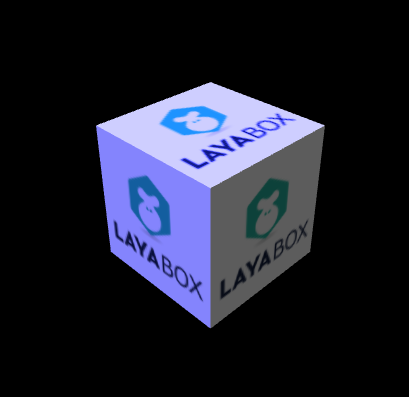
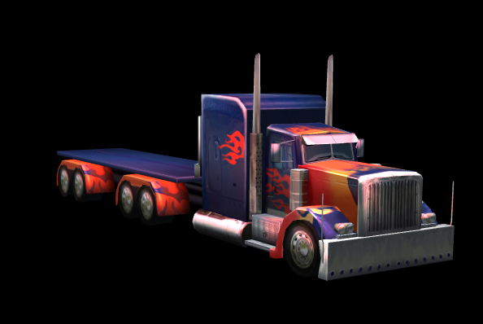

#LayaAir 3 D素材の光と色のスタンプ

###材質の光色と貼り付けの属性

標準の材質の属性は照明の光の色の属性と一定の類似があって、拡散反射、ハイライト、環境色などの属性の上で体現していますが、材質はもっとそろっていて、物体の美術効果を調整しやすくて、主に反射率、拡散反射色と拡散反射スタンプ、高光色と高光彩スタンプ、環境色と環境スタンプ、反射色と反射パッチ、法線凹凸のスタンプを含んでいます。これらの属性を詳細に紹介します。


###反射率

反射率は主に材質の明るさと色を反映しています。数値が高いほど、材質が明るいです。

反射率の値は四次元ベクトルで、下記のコードを調べます。ベクトルの中の四つの要素はそれぞれ赤、緑、青、透明alphaを表しています。

透明アルファ効果はパーセンテージで、0は全透明で、1は全透明です。半透明または全透明表示に設定する必要があるなら、反射率だけを調整するのはまだ無理です。また、材質のレンダリングモードを設定する必要があります。

「3 Dの高速オープンツアー」コースのコードを修正すると、図1の効果が得られます。


```typescript

//创建材质
var material = new Laya.PBRSpecularMaterial();
//创建漫反射二维纹理贴图
Laya.Texture2D.load("res/layabox.png",Laya.Handler.create(this,function(text){
  material.albedoTexture = text;
}));
//只有设置了渲染模式为透明混合类型才能达到透明效果
//设置材质蓝色染色及30%半透明
 material.albedoColor=new Laya.Vector4(1,1,1,0.3);
//渲染模式(也可设置数值，5-13等为混合类型，可观察其效果变化)
 material.renderMode =Laya.PBRSpecularMaterial.RENDERMODE_TRANSPARENT;
box.meshRenderer.material = material;
```


（図1）反射率染色と透明性


###拡散反射色と拡散反射スタンプ

拡散反射色（diffuseColor）とは、素材の単一自身色を指し、美術業界ではそれを物体の固有色と呼ぶことができる。拡散反射板（diffuseTexture）とは、材質の2 D固有のテクスチャ画像を指します。例えば、木の材質は木のテクスチャ画像を使います。

ゲームの中で一番多く使われているのは拡散反射スタンプです。ゲーム美術スタンプの中で仕事量が一番多いのも拡散反射スタンプです。

拡散反射色とスタンプはLayaAir 3 Dエンジンにおいても混合して使用することができ、それらは融合効果があり、拡散反射色はモデルの光面を染色する（バックライト面は変化しない）。これはライトの拡散反射光源色に似ており、より全体的な色調を発生する（図2）。

「速く3 Dの旅を開く」コースのコードを修正して、青い色の拡散反射を作成しました。効果を見ます。


```typescript

//添加方向光
var directionLight = scene.addChild(new Laya.DirectionLight());
directionLight.color = new Laya.Vector3(0.6, 0.6, 0.6);
directionLight.transform.worldMatrix.setForward(new Laya.Vector3(1, -1, 0));
scene.ambientColor = new Laya.Vector3(0.5,0.5,0.5);   
//创建材质
var material = new Laya.PBRSpecularMaterial();
//创建漫反射二维纹理贴图
Laya.Texture2D.load("res/layabox.png",Laya.Handler.create(this,function(text){
  material.albedoTexture = text;
  //设置材质漫反射颜色
  material.albedoColor = new Laya.Vector4(0.5,0.5,2,1);
})); 
box.meshRenderer.material = material;
```


(图2)漫反射颜色与贴图混合</br>


###高光色とハイライト

高光色（specularColor）は、照明の高光色と同じように、モデル物体の角を曲がったり、光源に向かって発生している高光色を指します。

モデルの高光色は照明と材質の高光色と同時に影響を受け、もし明かりや照明のない高光色が黒であれば、材質に高光色とハイライトを設置したとしても、モデル上の高い光は同様に現れません。

ハイライト（specularTexture）は、2 Dテクスチャ画像であり、画像の画素色は、それぞれのモデルにおける高い光の色と明るさを表しており、ピクセルの色が明るいほど、ピクセルにおけるモデルは高い光で明るくなる。

もちろん、高光色とハイライトは同時に使用できます。効果がより良いかもしれません。開発者たちはテストを繰り返して、必要な効果を調節できます。

「速く3 Dの旅を開く」コースのコードを修正して、シーンの中にトラックを載せます。高光色、高光度のスタンプを使って、標準の照明だけを使って高光量を比較してみてもいいです。コードは以下の通りです。


```typescript


  //获取模型
  var meshSprite3D = this.role3D.getChildAt(0).getChildAt(0);
  //从模型上获取共享材质
  var sharedMaterial =meshSprite3D.meshRenderer.sharedMaterial;
  //修改材质的高光颜色，让高光处偏红
  sharedMaterial.specularColor = new Laya.Vector4(1,0,0,1);
  //加载高光贴图（与漫反射一致，也可单独制作高光贴图）
  Laya.Texture2D.load("res/layabox.png",Laya.Handler.create(this,function(text){
      sharedMaterial.specularTexture = text;
  }));
```


上記のコードをコンパイルして、（図3）の中で材質の高い光色と高い光のスタンプを使って、効果はもっと良いです。（図4）では、照明のデフォルトの白色高光色を使用していますが、効果は一般的です。

（図3）<br/>

（図4）<br/>


###環境色

環境色（ambientColor）は、シーン内の材質を色に合わせて染色し、材質をある色の色調に近づけます。また、材質を明るくして、空の色調、光の強さをシミュレートします。

「高速3 Dオープンツアー」コースのコードを修正すると、以下のようになります。


```typescript

//添加3D场景
var scene = Laya.stage.addChild(new Laya.Scene3D());
//设置环境色，提亮模型
scene.ambientColor = new Laya.Vector3(0.5,0.5,0.5);
```


（図5）照明を固定すると、材質が環境色を使用していません。

（図6）照明を固定すると、材質は環境色で強調表示されます。


###反射板

反射スタンプ（customReflection）は、一般的に箱のテクスチャを使ってTextureCubeを貼っています。モデルを全体的に包み込み、周辺環境をモデルに反映する効果をシミュレーションします。

反射パッチの表示効果は、反射率のalbedoColor、レンダリングモードのrender Modeにも関連しています。

レンダリングモードは、両面が不透明になってこそ、反射パッチを表示することができる。

反射率albedoColorの数値が高いほど、反射スタンプの効果が小さいほど、拡散反射スタンプの効果が強くなります。水面、鏡面、金属面など、実際のモデルの材質効果によって調節できます。

「高速3 Dオープンツアー」コースのコードは以下の通りです。反射効果をより良く観察するために球形モデルを使用します。運転後に効果が得られます。


```typescript

//添加方向光
var directionLight = scene.addChild(new Laya.DirectionLight());
directionLight.color = new Laya.Vector3(0.6, 0.6, 0.6);
directionLight.transform.worldMatrix.setForward(new Laya.Vector3(1, -1, 0));
scene.ambientColor = new Laya.Vector3(0.5,0.5,0.5);
//添加自定义模型（球）
var box = scene.addChild(new Laya.MeshSprite3D(new Laya.SphereMesh(1)));
box.transform.translate(new Laya.Vector3(0,1,-3));
Laya.timer.loop(10,this,function(){
  box.transform.rotate(new Laya.Vector3(0, 1, 0), true, false);
})
//创建材质
var material = new Laya.PBRSpecularMaterial();
//创建漫反射二维纹理贴图
Laya.Texture2D.load("res/layabox.png",Laya.Handler.create(this,function(text){
  material.albedoTexture = text;
  //设置材质漫反射颜色
  // material.albedoColor = new Laya.Vector4(0.5,0.5,2,1);
  //修改材质的高光颜色，让高光处偏红
  // material.specularColor = new Laya.Vector4(1,0,0,1);
})); 	
//获取反射贴图（用立方体全视角贴图进行赋值（类似于360全景包裹））
Laya.TextureCube.load("LayaScene_test/Assets/1v1Scene/NewCubemap.ltc",Laya.Handler.create(this,function(cube){
  //设置反射贴图
  scene.customReflection = cube;
  //设置反射贴图的反射率
  scene.reflectionIntensity = 1;
}));
//设置渲染模式为不透明（否则无法显示反射贴图）
material.renderMode = Laya.PBRSpecularMaterial.RENDERMODE_OPAQUE
//降低材质的反射率，加强反射贴图反射
material.albedoColor=new Laya.Vector4(0.1,0.1,0.1,0);
//为模型赋材质
box.meshRenderer.material = material;
```


（図7）反射スタンプ<br/>


###法線凹凸貼り付け

法線凹凸スタンプは3 Dにおいて非常に重要な役割を果たしています。モデル表現の精細さは主に法線スタンプの影響を受けています。高精度、高面数モデルの細部をシミュレートして、ゲーム画面の品質を大幅に向上させます。もちろん、法線スタンプを使うと、ハードウェアの性能に対する要求が高まります。

法線のスタンプは美術デザイナーに提供しています。彼らは2つの方法で制作しています。3 D制作ソフトの中でモデルの高型焼きによって低モードで使用される法線のスタンプを作るのです。仕事量は膨大です。一つは拡散反射スタンプでいくつかのツールを通じて法線のスタンプに転化し、仕事量は少ないですが、効果は焙煎方法よりやや悪いです。法線スタンプの効果は（図8）に示すように、拡散反射パッチで変換されます。

（図8）<br/>

法線スタンプを使用する必要がある場合は、開発中に以下の問題に注意する必要があります。

1.法線スタンプはモデルデータに対して一定の要求があり、モデルに切断情報がないと法線凹凸の効果が得られない。例えばLayaAir 3 Dエンジンに内蔵されている各種MeshメッシュタイプBoxMesh、Sphere Mesh、Cylinder Meshなどは、接線情報がないので、法線スタンプを使っても、ビューに凹凸が表示されません。

2.法線スタンプを使用する必要がある場合、モデルはLayaAirのunityプラグインから導出され、Mesh Settingグリッド設定時には「無視カット」オプションにチェックを付けないように注意する必要があります。

（図9）<br/>

3.ファウルスタンプを使う必要があるなら、ゲームシーンでライトを使わなければいけません。モデルでも凹凸効果がありません。

unity 3 DからCubeモデル（unityで作成されたモデルバンドカット情報）を作成し、拡散反射パッチと法線スタンプを付与した後、LayaAirでプラグインからデータを導出して使用すると、法線スタンプも自動的にモデルにロードされます。「クイックオープン3 Dツアー」コースのコードは以下の通りです。コンパイル運転後は凹凸効果があります。


```typescript

Laya.Scene3D.load("LayaScene_test_Light/test_Light.ls",Laya.Handler.create(this,function(s){
  var scene = Laya.stage.addChild(s);
  //也可以代码加载法线贴图
  //从模型中获取meshSprite3D对像
  // var meshSprite3D=s.getChildByName("Cube");
  //获取模型的材质实例
  // var material=meshSprite3D.meshRenderer.material;
  //为材质添加法线贴图
  // Laya.Texture2D.load("LayaScene_test_Light/Assets/LayaPlugin/8.jpg",Laya.Handler.create(this,function(text){
  // 	material.normalTexture= text;
  // }));
})); 
```


(図10)法線スタンプ<br/>


###エクスポートする材質ファイル.lmat修正

素材の色と性質についての了解を通して、コードによって物体の材質属性とスタンプを修正する方法を理解しました。柔軟にコントロールするには、達成する効果が必要です。

しかし、現在の美術上の効果は基本的にunityエディタで実現され、データをエクスポートして使用されます。LayaAir 3 Dエンジンは現在完備されていますが、H 5のゲームエンジンの特徴で、unityの素材の種類と属性は全く含まれていませんので、unityでの効果と実際のゲームでの効果は違います。

未来バージョンでは、unityで専用のLayaAir標準素材を作成して開発者達に使用します。unityで作成された美術効果とゲームの効果を完全に一致させて開発者達が使用しやすいです。

待っている間、どのように修正して美術効果をあげますか？unityでは、素材ごとにエクスポート時に生成されます。lmat形式のファイルは、材質を変更します。lmatファイル方式で美術効果を調整できます。

例えば、次のコードを通して、シーンをロードし、その後、照明設定によって夜間効果を達成する（図11）。


```typescript

Laya.Scene3D.load("LayaScene_test_Light/test_Light.ls",Laya.Handler.create(this,function(s){
  var scene = Laya.stage.addChild(s);
  //设置环境光偏暗蓝色
  scene.ambientColor = new Laya.Vector3(0.2,0.2,1);
  //获取场景灯光
  var light = scene.getChildByName("Directional light");
  //设置灯光光偏暗
  light.color = new Laya.Vector3(0.5,0.5,0.5);
}));
```


（図11）<br/>

上記の図によれば、「Love」の形のモデルをランプボックスの明るさに変更する必要がある場合、コード修正により相対的に面倒で、比較的簡単な方法で、それに対応する材質ファイルを修正します。lmat、材質ファイルを開けて観察しますと、材質ファイルに保存されているのは各種の光の色属性と貼り付け（図12）です。カバー材質の環境光の色を変更します。Webファイルを更新すると効果が見られ、モデルが明るくなり、ランプボックスの効果が得られます（図13）。

（図12）<br/>

（図13）<br/>

以上の方法で、シーンの中の各種の材質の属性を調節して、美術に必要な効果を達成させます。もちろん、今後のユニティではLayaAirの専属材質がunityで直接編集されてゲームと一致する最終効果が期待されます。