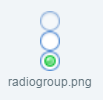

#RadioGroupコンポーネントの詳細

>多くのコンポーネント属性が共通であるため、一般的で一般的なコンポーネント属性は`属性设置器`文書で紹介しました。本編を読む前に、「プロパティ設定器」のドキュメントを読んでください。

##1、Radio Groupコンポーネントを理解する

###1.1 Radio Groupコンポーネントの役割

RadioGroupは単一選択ボックスボタングループであり、ボタングループ内のコンポーネントオプションは互いに反発し、ユーザは毎回単一選択ボックスコンポーネントしか選択できない。図1に示すように。
 (図1)

###1.2 Radio Groupコンポーネントの肌（skin）仕様

Radio Groupコンポーネントの肌は`RadioGroup`または`RadioGroup_`プレフィックスの命名は、図2に示すように、皮膚設計規範において垂直等分の二状態図または三状態図である。

 （図2）三状態Radio Group肌

*Tips：Radio Groupコンポーネントの皮膚は九宮格の属性を使用できないので、資源の設計の時に実際の応用の大きさを確定します。*

###1.3 Radio GroupコンポーネントのAPI紹介

RadioGroupのAPI紹介は参考にしてください。[ http://layaair.ldc.layabox.com/api/index.html?category=Core&class=laya.ui.RadioGroup](http://layaair.ldc.layabox.com/api/index.html?category=Core&class=laya.ui.RadioGroup)。

##2、LayaAirIDEでRadioGroupコンポーネントを作成する

###2.1 Radio Groupを作成する

リソースマネージャのRadioGroupコンポーネントのリソースをクリックして、シーンエディタにドラッグします。つまり、ページでRadioGroupコンポーネントを作成しました。図3に示すように。
​ (図3)

###2.2 Labelsによる単一選択枠の追加

図3に示すように、デフォルトの単一選択グループの中には2つの単一選択ボックスしかありません。オプションボックスを追加したい場合は、図4-1に示すようにラベルの内容を変更するだけで、ラベルの属性を追加できます。

​ (図4-1)

###2.3シングルフレームグループRadio Groupのレイアウト方向と間隔を変更する

Radio Groupはデフォルトでは水平配列(*horizontal*)であり、direction属性を変更することにより、垂直配置(*vertical*)を実現します。スペースの設定はspace属性で行うことができます。図4-2に示すように。
 (図4-2)

###2.4ラジオ枠グループRadio Groupのデフォルトオプションを設定します。

selectedIndex属性は、単一選択ボックスグループのインデックス値を変更するためのもので、デフォルトでは設定されていない場合は、任意のオプションをチェックしないで、ラジオグループのデフォルトチェックを設定すると、selectedIndexの属性値を設定できます。0は第1のシングルフレーム、1は第2のシングルフレームです。これをもって類推する。

属性値を0に設定した場合、動作効果は図4-3に示すようになります。
   （动图4-3）

### 

##3、カスタムのRadio Groupコンポーネントを作成する

上記の例では、同一の単一選択枠リソースを使用して、labelsを設定することにより、3つのサブプロジェクトの単一選択枠グループを生成した。しかし、実際のゲームでは、同じRadio Groupコンポーネントでは、単一の選択ボックスのスタイルに対して異なる需要がありますが、labelsの設定によっては効果が得られません。この場合はカスタムRadio Groupコンポーネントを使用する必要があります。

###3.1美術資源の準備

私たちは二枚の違うのを使います。`radio单选框`美術資源で構成されています。`自定义RadioGroup组件`図5に示すように、リソースが表示されます。

​ (図5)

**Tips**:

ここでは特にお肌のイメージのネーミングルールに注意してください。カスタマイズしたRadioGroupコンポーネントでは、使用できません。`RadioGroup`または`RadioGroup_`プレフィックスの名前を付けます。Radio単一選択ブロック構成要素をそのサブアセンブリとして使用するため、本例のピクチャリソース名は使用される。`radio_`プレフィックスです。

###3.2 IDEでRadioコンポーネントを作成する

リソースをプロジェクトのリソースマネージャフォルダにコピーし、IDEでは、作成したradioコンポーネントをリソースマネージャからシーンエディタにドラッグし、左から右（または上から下まで）それぞれのRadioコンポーネントのname属性を順次「item 0、item 1、item 2...」に変更します。無効なコンポーネントのため、正常に動作しません。）

label属性を設定したテキスト、labelラベルのフォント色、サイズ、位置関係などを調整した後、効果は図6、図7に示すようになります。

​ (図6) (図7)

​**Tips：カスタムRadio Groupコンポーネントのname属性では、名前付きルールは英語の文字＋数字で、英語の文字の後に下線を付けることはできません。数字は先着順に0から始まります。**。

###3.3 Radio Group容器に変換する

サブ属性を修正すると、全選択コンポーネントはショートカットキーCtrl+Bを押してコンテナに変換し、RadioGroup容器タイプに変換して決定します。

​ (図8)

変換に成功したら、デフォルト選択のインデックスselected Indexを0にします。図9に示すように、単一選択の枠間隔space、方向directは調整しなくてもいいです。シーンエディタでマウスで調整してもいいです。

​ (図9)

以上のいくつかのステップにより、カスタムRadio Groupコンポーネントの作成が成功したことが見られます。最初の選択ボックスがデフォルトで選択され、第3のフレーム選択状態に切り替わります。他の選択ボックスは第1のフレームが選択されていない状態です。