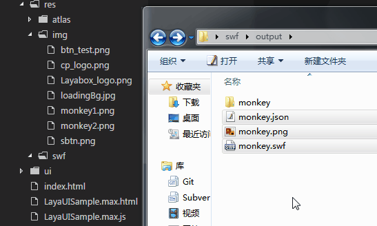

# SWF动画在LayaAir引擎中使用

###1、LayaAirエンジンにSWFアニメーションを使用する前提

FlashページツアーをサポートするためにHTML 5プロジェクトに素早く移植するために、LayaAirエンジンはSWFファイルの変換ツールを提供し、元のSWFファイルをLayaAirエンジンで識別できるフォーマットに変換するが、変換ツールは**SWFファイルにテキスト、グラデーション、カバー、コードを含む特殊な内容はサポートされていません。**。上記の内容が含まれている場合、変換後は元のSWFの効果や変換に失敗します。


>開発者がFlash及びswfアニメーションファイルの作成と導出に関する知識を知らないなら、本論文を読み続ける必要はなく、LayaAirIDEを使ってアニメーションを作ることを勧めます。
>


###2、SWFアニメーションをLayaAirエンジン識別のフォーマットに変換する

まずSWF変換仕様に合う動画ファイルを用意し、LayaAirIDEのデザインモードを開きます。

選択メニュー`工具`-->`SWF转换`図1に示すように、SWF変換ツールパネルを開くことができます。

 


（図1）

新しく開く`SWF转换`パネルには、図2に示すように、変換仕様のSWFアニメーションまたはフォルダにドラッグします。

  


（図2）

クリック`开始转换`を選択します。図3に示すように。デフォルトはswfの同級ディレクトリで作成されます。`output`ディレクトリの変換に成功したら、Outputディレクトリ内で新しいswfと図集ファイルを作成します。また、画像フォルダ(*パッケージのオプションをチェックした後、画像フォルダは管理しなくても、図セットモードでないと*)が使えます。

   


（図3）

**Tips**:

-複雑なswfファイルであれば、複数のビットマップが生成されますので、`开始转换`前確認チェック`是否打包为图集`。

-デフォルトでoutputディレクトリを生成し、開発者は入力パスバーでクリックします。`更改`出力ディレクトリを変更します。

-変換ツールが生成した新しいswfは再変換できません。

​


###3、変換後のswfアニメを使う

####3.1変換後のswf資源をプロジェクトにコピーする

swfアニメーションを使う前に、まず変換ツールを生成します。`.swf`フォーマットファイルと`图集文件`プロジェクトにコピーしたリソースディレクトリ(*本例はプロジェクトのルートディレクトリのres/swf/ディレクトリ*)は、図4に示すようになります。

  


（図4）

**Tips**:

##-図4のフォルダを動かして、この例の操作ではコピーしなくてもいいです。図集方式を採用していないと、swfと1つのピクチャリソースフォルダだけが生成されます。この場合、フォルダをコピーする必要があります。注意したいのは、LayaAirIDEではフォルダのドラッグコピーはサポートされていません。もしフォルダをコピーするなら、システムのリソースマネージャを開いて、システム内でコピーして貼り付けます。


####3.2 swfアニメーションを再生するAPIを理解する：MovieClip

LayaAirエンジンでは変換後のswfアニメーションを使用しています。**MovieClip類**APIは、図5に示すように、APIリンクを示す。[https://layaair.ldc.layabox.com/api/index.html?category=Core&class=laya.ani.swf.MovieClip](https://layaair.ldc.layabox.com/api/index.html?category=Core&class=laya.ani.swf.MovieClip)

 


（図5）

####3.3コードでswfアニメーションの放送を実現する

swfアニメーションを再生する例は、以下のコードで示します。

入口類Movie Clip Sample.as


```typescript

module LayaDEMO { 
{
  	import MovieClip = Laya.MovieClip;
	
	export class MovieClipSample 
	{
		
		constructor() 
		{
			//初始化舞台
			Laya.init(1334, 750);
			
			//创建一个 MovieClip 实例
			var mc:MovieClip = new MovieClip();
			
			//加载swf资源,load方法的第二个参数不设置为散图模式加载，设置为true是采用图集方式加载。
			mc.load("res/swf/monkey.swf",true);
			
			//添加到舞台
			Laya.stage.addChild(mc);

		}
	}
}
```

