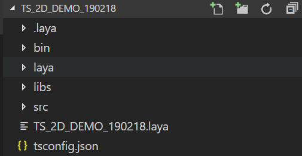

#LayaAirIDEでTS項目を作成し、ディレクトリ構造を詳しく説明します。

>*author:charley version:LayaAirIDE 2.0 udate:2019-02-18*

##一、LayaAirIDEのダウンロードとインストール

LayaAirIDEとLayaAirエンジンを使うには、ゲーム中の任意の可視位置にエンジンマークを付ける必要があります。パワードby LayaAir Engine
エンジンマークを携帯する場合は無料で利用できます。そうでなければ、ダウンロード条項の中のWeChat QRコードに連絡してビジネスに連絡して有料授権を受ける必要があります。

条項を受けてから解凍して使えます。IDEは緑色版です。インストールする必要はありません。IDEには対応するエンジンバージョンが含まれていますので、追加でダウンロードする必要はありません。

LayaAirIDE 2.0ダウンロードアドレス：https:/ldc 2.layabox.com/layadownload/？type=layaairide


##二、LayaAirIDEでTS項目を作成する

LayaAir IDEを初めて開くと、IDEは作成時に自動的に構造がはっきりしたディレクトリ構造を作成します。ここでLayaAir IDE作成プロジェクトの流れとIDE生成されたディレクトリ構造を紹介します。

####ステップ1:

LayaAirIDEを開いてクリックしてください。`新建`アイコンまたはテキストは、図1に示すように、新規プロジェクトインターフェースに入ります。

 


（図1）


####ステップ2:

選択`LayaAir 2D示例项目`プロジェクト名、プロジェクトパス、およびプログラミング言語とエンジンバージョンを選択したら、「`创建`」をクリックします。図2に示すように。

 


（図2）

####オプションを追加して説明します。

#####WeChat/Baiduのミニゲームbinディレクトリのクイックデバッグ

このオプションをチェックすると、プロジェクトを作成する際に、WeChatとBaiduのミニゲームプロジェクトファイルをプロジェクトのデバッグディレクトリ（bin）の下に同時に作成します。このように、WeChatまたはBaiduのミニゲーム開発ツールのデバッグプロジェクトを直接指定することができます。このように大量の頻繁なデバッグの時間を節約できます。デバッグの正式版をリリースするにはローカルパッケージだけをエクスポートします。エクスポートするたびに一定のリリース時間が必要です。デバッグ開発の効率に影響します。


####ステップ3:

「作成」をクリックすると、プロジェクトの構造が見えます。プロジェクトフォルダの構造は図3に示すようになります。

  

（図3）

これまでTSプロジェクトを作成することに成功しました。

*Tips:*

>LayaAirエンジンに接触したばかりの開発者には、例示的なプロジェクトを作成することを勧めます。もちろん、開発開始は他のプロジェクトの種類の作成も試みることができます。


##三、プロジェクトの構造を紹介する。

次に、前のセクションで作成したプロジェクト構造を組み合わせて、各ディレクトリの役割を紹介します。

###3.1プロジェクト配置ディレクトリ(.layaフォルダ)


 `.laya`フォルダに格納されているのは、開発運転中のプロジェクトの設定情報です。図4に示すように。

 


（図4）

#### `compile.js`ファイル紹介

`compile.js`gulpカスタムコンパイルプロセスのスクリプトファイルです。開発者がgulpに詳しいなら、ここを動かないでください。

#### `launch.json`ファイル紹介

`launch.json`ファイルはプロジェクトデバッグのいくつかの設定情報を保存しています。それぞれLayaAirIDEのデバッグ設定とchromeブラウザデバッグ設定です。簡単に変えないでください。間違ったらプロジェクトのデバッグに影響します。

#### `publish.js`ファイル紹介

`publish.js`プロジェクトに対して公開されたスクリプトファイルです。開発者はここに動かないでください。

#### **その他の説明**

一部の設定ファイルはデフォルトではありませんが、リリース時には.layaディレクトリに保存されます。例えば、web版、WeChat、Baiduなどのミニゲームは、リリース後にそれぞれのタイプに対応して、異なるjsonの設定ファイルを保存します。例えば、wxgame.jsonはWeChatのミニゲームです。

古いバージョンのリリースプロファイルの名前はpbset.jsonです。

以上のように、いくつかの理解があれば大丈夫です。通常、開発者は修正する必要がありません。だから、深く理解する必要はない。


###3.2項目の出力ディレクトリ（bin）


 `bin`ディレクトリが保存されているのは現在のプロジェクトの出力ファイルです。図5に示すように。

  


（図5）

このディレクトリは、プロジェクトから出力されたjs、HTML、ゲームリソースなどのプロジェクトの実行ファイルと、ミニゲームプロジェクトファイル（プロジェクトを作成する際に、ミニゲームのクイックデバッグオプションをチェックした場合）を保存します。

デフォルトのlayaAirのデバッグやchromeのデバッグは、実行しているこのディレクトリのファイルです。


###3.3 UIプロジェクトディレクトリ（laya）

`laya`ディレクトリはLayaAirIDE現在のUI項目を保存するために使用されます。

 


（図6）

####「`assets`」目次

UIシーンに必要なコンポーネント画像、オーディオファイルなどのリソースを保存するために使用されます。

####「`pages`」目次

IDEのシーン、アニメーション、プリセットなどのプロファイルを保存します。

####「`.laya`」ファイル

これに注意してください。layaはディレクトリではなくファイルです。layaファイルはLayaAirIDEのUI項目設定ファイルです。


###3.4プロジェクトライブラリディレクトリ（libs）

「`libs`ディレクトリ内はプロジェクトのライブラリディレクトリで、ディレクトリ下はlayaAirエンジンLayaAir.d.tsファイルとwx.d.tsです。コードのヒントとして、開発者が3つのライブラリを使っている場合、関連するD.tsファイルはこのディレクトリに置いてください。例えばwx.d.tsは、微信小ゲーム開発コードの提示に用いられる。図7に示すように。

   


（図7）


###3.5プロジェクトのソースコードディレクトリ（src）

プロジェクトで使用するソースコードファイル（TS言語項目は.tsファイル）は、デフォルトではSrcディレクトリに保存されます。

特に言いたいのは`ui`ここはIDEが自動的に生成したものです。開発者はここを変えないでください。変更しても次のエクスポートに変えられます。このカタログには自分のコードを保存しないでください。既存のコードも修正しないでください。

他の開発者は実際の必要に応じて自分でディレクトリ構造を計画すればいいです。コード例のソースコード項目構造を図8に示します。


  


（図8）


###3.6プロジェクト配置ファイル

 


（図9）

####  `项目名.laya` 


图9中的`TS_2D_DEMO_190218.laya`LayaAirIDEプロジェクトのプロジェクト配置ファイルで、ファイルには現在のプロジェクトのプロジェクト名、使用するライブラリバージョン番号などが記録されています。

たとえば:


```json

{"proName":"TS_2D_DEMO_190218","engineType":1,"proType":1,"layaProType":1,"version":"2.0.0"}
```

#### `语言版本config.json`

図9の`tsconfig.json`IDEのコンパイル設定情報が保存されています。削除しないでください。


###3.7ディレクトリを公開する

リリースディレクトリはデフォルトでは存在しません。リリースボタンをクリックしてアイテムをリリースすると、対応するバージョンディレクトリが生成されます。図10に示すように。（専門的に機能文書の紹介がありますが、ここでは詳しく説明しません）

 


（図10）

図10に示すディレクトリ構造は、リリース後のバージョンディレクトリに対応しています。


###本編の終わりに

ここで、プロジェクト作成の基礎内容を紹介しました。IDEの紹介やIDEのデザインパターンを知りたいなら、IDE編を見ることができます。