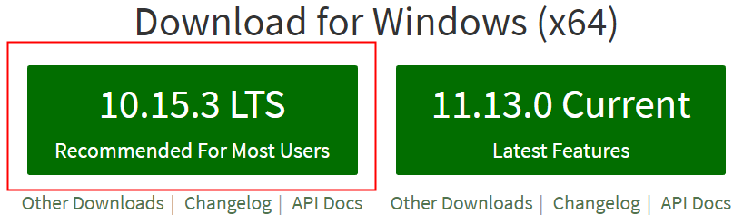

#開発環境の構築（TSコードコンパイラ）

>*author：charley version：2.0.1 udate：2019-4-8*

LayaAirIDEはType Scriptコンパイル環境をインストールする必要がありますので、編集環境に問題がある場合は参照を読んでください。インストールされている場合は、繰り返しインストールする必要はありません。

##1、インストールNode環境をダウンロードする

####1.1 node.js環境がインストールされているか確認する

Type Scriptを使って開発するにはNode.js環境が必要です。インストールされていない場合は、公式ダウンロードに行ってください。

インストール前に既成の環境があるかどうかを確認してから、コマンドラインツールを開いて、コマンドラインを入力してください。`npm -h` 


```

npm -h
```


リターンキーを押した後、npmのコマンド説明、バージョン番号、およびインストール経路などの情報が見られたら、図1-1に示すように、既にインストールされています。使用に影響がなければ、nodeの環境をダウンロードしたりインストールしたりするステップをスキップすることができます。

 


（図1-1）


####1.2 Node.js公式サイトのダウンロード

インストール環境がない場合は、直接にnode公式サイトにインストールをダウンロードすれば良いです。LTSバージョンは、図1-2に示すように、URLアドレスは以下の通りです。[https://nodejs.org/en/](https://nodejs.org/en/)

（図1−2）上の図は参照としてのみ使用され、リンクを開いてそのままLTSバージョンをダウンロードすれば良い。

>注意：デフォルトのリンクが開いているのはwindow（x 64）で、64ビットではないコンピュータはOther Downloadsをクリックして、対応するバージョンをダウンロードすればいいです。

####1.3、Node.jsをインストールする

ダウンロードしたばかりのNode.jsパッケージを見つけて、一歩ずつインストールすればいいです。完全時インターフェースは図1-3に示すようになります。

<br/>(図1-3)

インストールが完了したら、1.1小節で紹介するように命令ラインに入力してください。`npm -h`設置状態を確認します。


##2、npmコマンドでType Script環境をインストールする

Node環境に問題がないなら、npmを使ってType Scriptのコンパイル環境をインストールできます。

####2.1ダウンロードインストール

コマンドラインツールに直接コマンドを入力します。`npm install -g typescript`」キーを押して、図2-1に示すように、Type Script環境のインストールを開始します。この時は必ずネットワークの開通を維持してください。


```typescript

npm install -g typescript
```


 <br/>

（図2-1）

開発者がインストール時に図2-2の場合、通常はキャッシュ競合によるものです。（遭遇していない場合はこのステップを直接スキップします。）


（図2-2）

この場合、キャッシュ消去コマンドを使用してもいいです。`npm cache clean --force`を選択して、このコマンドを実行して、インストールコマンドを再入力すればいいです。


```

npm cache clean --force
```


####2.2インストール完了

「--typescrip@バージョン番号」を見たら、TypeScript環境のインストールが完了したことを確認できます。図3-1に示すように、コマンドラインツールをオフにすればいいです。


（図3-1）

図4のtscディレクトリは私たちType Scriptが環境のインストールディレクトリをコンパイルしています。これがあります。LayaAirIDEではこのComplerを通じてType ScriptをJavaScriptにコンパイルできます。

####2.3 Type Script編集環境バージョンを確認する

コマンドラインに「tsc-v」コマンドを入力すると、現在のType Scriptコンパイルのバージョンが図3-2に示されています。


```typescript

tsc -v
```


  


（図3-2）

出版された本の番号が表示されたら、Type Script Compler（tsc）のインストールが成功したと説明してもいいです。

>図中の実際のバージョン番号は最新のスクリーンショットであり、参照としてのみ使用されるため、前のインストール時のスクリーンショットバージョンとは一致しない。