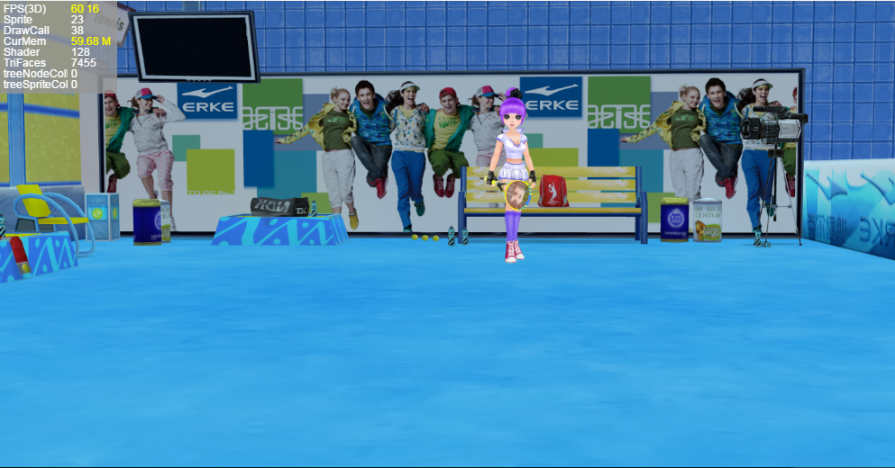

#LayaAir 3 Dの資源放出

###### 修改时间:2019-4-24,version:2.0.1

###なぜ資源を釈放しますか？

LayaAir 3 Dゲームの開発において、資源の放出は非常に重要です。3 Dリソースには、モデル、スタンプ、材質、動画などが含まれており、良い画面効果を達成するためには、ファイルは2 Dよりも大きくなります。3 Dエンジンは基本的にすべてのリソースをGPUに入れて計算してレンダリングするので、多くの表示を占めています。ゲームのレベルがどんどん読み込まれて、ゲームがどんどん深くなって、現存中の資源がだんだん多くなります。資源を解放しないと、ゲームは最終的に崩壊します。

現存はメモリと違って、メモリはゴミ回収の仕組みがあります。現存は違っています。手動で釈放しなければならないので、現存する資源の放出は重視されなければなりません。

図1、図2の統計ツールにおける現存サイズを観察する。

図1はゲーム起動後にロードされる最初のシーンで、表示回数は30527で、69.2 Mを占有している。

（図1）<br/>

図2はゲームにロードされた第2のシーンで、面数は7455しかないが、ロード後の現存リソースは118.91 Mである。これはどういう理由ですか？顔なじみが少なく、シーンが小さく、スタンプも図1のシーンより少ないです。写真のスタンプも小さいですが、現存資源がもっと大きいです。

これは第一段階のシーンの資源が解放されていないためで、その資源はまだ現存中で、だから現存占有が大きくなりました。手動でクリアしないと、ゲームは他のシーンに切り替わり続けます。一定量に達すると、携帯のディスプレイは消耗されます。ゲームカードの死、フラッシュバック、発熱などの現象が頻繁に現れます。

（図2）<br/>


###資源をロードする時の処理原則

上の図の例を通して、LayaAir 3 Dエンジンの処理資源と現存の関係を見ることができます。ゲームの性能最適化の目的を達成するために、資源をロードする時も原則を注意しなければなりません。

1、資源をロードする時は、必要な資源だけを一度に全部ロードしないでください。3 Dリソースのロードが完了すると、リソースの拡張子の名前に基づいて直接3 D表示オブジェクトを作成します。例えば.lsはScheneを作成します。lhはSprite 3 Dオブジェクトを作成します。作成した対象リソースはステージに置いていなくても直接に現存に入れるので、資源が多すぎると大量に現存します。

2、合理的に現存を管理し、頻繁に繰り返し使用する資源は現存において釈放する必要がなく、繰り返し使用する資源は使用完了後直ちに釈放して、性能オーバーヘッドを節約する。例えば主役の資源、3 Dの道具の資源、プレーヤーはいつも使って、ずっと現存の中で保管することができて、スピードを抽出するのは速いです。


###現存資源の放出方法

現存リソースを解放する方法は二つあります。一つはオブジェクトを通じて現存リソースを解放することです。ただし、リソースオブジェクトを遍歴するのは面倒です。ここでは紹介しません。もう一つは、リソースアドレスを通じて現存リソースを解放することであり、リソース管理の観点から、リソースアドレス方法を通じてより柔軟に、JSONデータテーブルを構成して管理することができる。

####切り替えシーンとリリースリソースの遷移画面

リソースをロードしてシーンを切り替えるとき、図3に示すように、遷移のための進捗表示画面をIDEで作成します。

（図3）<br/>

IDEリリース後、制御クラスを作成し、論理コードは下記を参照してください。


```typescript

import {ui} from "../ui/layaMaxUI";
export default class loading extends ui.LoadingUI{
    constructor(){
        super();
    }
    public setValue(num:number):void{
        //资源加载进度
        this.pro.value = num;
    }
    public init():void{
        //初始化，进度计时
        this.pro.value =0;
        //进度增加的帧循环
        Laya.timer.loop(20,this,this.loop);
    }
    //资环加载进度模式（假进度）
    private loop():void{
        //进度增加
        this.pro.value += 0.01;
        //最高100%进度
        if(this.pro.value>=1){
            this.pro.value =100;
            Laya.timer.clearAll(this);
            this.removeSelf();
            // Laya.stage.event("");
        }
    }
}
```


####リソースアドレステーブルを通じて現存リソースを解放する。

メインクラスでは、マウスで舞台をダブルクリックして場面を切り替え、リソースアドレスを使って現存リソースを解放する方法を使って、新しいシーンをロードします。

リソースパスのリスト方法が柔軟で、テーブルを構成することによって、テーブル内の削除リソースを増やすことができます。例えば美術はシーンをエクスポートする時、JSON表を新たに作って、このシーンの中で切り替えた後に必要でない資源のルートをすべてJ表の中に置いて、役に立つ資源は表に入れないで、資源は釈放しないで、たとえばいくつかの公共のNPC、道具、特効などのゲームの元素の資源。

Tips：リソースは、シーン光のスタンプlightmap、材質、lmat、モデル、lm、様々なタイプのスタンプ、pngまたは.jpg、動画、lani、骨格、lavなどの資源を含みます。

ここでは、リソース表の方法を紹介します。まず、エクスポートされたリソースファイルディレクトリにjsonファイルを作成し、リリースするパスリソースを編集し、Json配列を形成します。名前はlsファイルと一致しています。図5、6のように。

（図5）<br/>

（図6）<br/>

Json編集が完了したら、チェックツールでフォーマットが正しいかどうかを確認できます。次にメインクラスのコードを作成します。


```typescript

// 程序入口
import loading from "./view/loading";
class Main {
  //加载界面
  private load:loading;
  private scene:Laya.Scene3D;
  constructor() {
    //初始化引擎
    Laya3D.init(0, 0);

    //适配模式
    Laya.stage.scaleMode = Laya.Stage.SCALE_FULL;
    Laya.stage.screenMode = Laya.Stage.SCREEN_NONE;

    //开启统计信息
    Laya.Stat.show();
    //加载2d资源
    Laya.loader.load("res/atlas/comp.atlas",Laya.Handler.create(this,this.Complete2D));
  }
  //加载2D资源完成回调；
  private Complete2D():void{
    //实例化加载进度页面
    this.load = new loading();
    Laya.stage.addChild(this.load);
    this.load.init();
    //加载第一关场景角色3D资源（不能全部加载，否则太占显存）
    Laya.loader.create(["LayaScene_test/test.ls","LayaScene_twonScene/twonScene.ls"],Laya.Handler.create(this,this.Complete3D));
  }
  //加载3D资源完成的回调
  private Complete3D():void{
    //实例化场景
    this.scene = Laya.loader.getRes("LayaScene_test/test.ls");
    Laya.stage.addChild(this.scene);
    Laya.stage.setChildIndex(this.scene,0)
    //点击游戏画面切换场景
    Laya.stage.on(Laya.Event.MOUSE_DOWN,this,this.changeScene);
  }
  //加载第二关场景资源， 切换场景
  private changeScene():void{
    //去除点击事件监听
    Laya.stage.off(Laya.Event.MOUSE_DOWN,this,this.changeScene);
    this.scene.removeSelf();
    // this.load.setValue(0);
    this.load.init();
    Laya.stage.addChild(this.load);
    this.scene.destroy();

    //加载第二关场景资源到游戏中
    this.scene = Laya.loader.getRes("LayaScene_twonScene/twonScene.ls");
    Laya.stage.addChild(this.scene);
    Laya.stage.setChildIndex(this.scene,0);
    console.log("现在在显存中的资源:",Laya.Loader.loadedMap);
    this.assetsDispose();                

  }

  private assetsDispose(){
    //加载资源释放表
    Laya.loader.load("loveScene.json",Laya.Handler.create(this,this.onAssetOK)); 
  }
  //加载资源释放表完成后
  private onAssetOK():void{
    //获取加载的数据（Json数据转化成数组）
    var arr:any = Laya.Loader.getRes("loveScene.json");
    for(var i:number=arr.length -1;i>-1;i--){
      //根据资源路径获取资源
      var resource:Laya.Resource = Laya.loader.getRes(arr[i].url) as Laya.Resource;
      if(resource)
        //资源释放
        resource.destroy();
      else
        console.log(arr[i].url);
    }
  }
}
new Main();
```


上記コードassites Displaseを観察して、配置表をロードした後、Laya.loader.getsRes（arr[i].url）方法で直接にリソースによって生成されたオブジェクトを取得します。LayaAir 2.0の正式版の後で、もう一つの方法でresource.destroyを呼び出しました。

リソースをリリースした後、Loader.loadeMap属性によってキャッシュ中のリソースを確認することもできます。

上記のコードをコンパイルして実行すると、図4の効果が見られます。リリースが完了し、新しいフィールドシーンをロードすると、グラフィック占有率は前よりずっと小さくなります。これまでリリースされていなかったリソースは118.91 mで、リリース後の現存は59.68 Mのみを占めています。



###リソースの自動リリース

LayaAir 2.0は開発者の開発を容易にするために、3 D資源のリリースに便利なリリース方式を追加しました。

シーン（または精霊）を破壊した後に呼び出します。`Laya.Resource.destroyUnusedResources()`使用していないリソースは自動的に放出されます。


```typescript

//自动释放没有被使用的资源
Laya.Resource.destroyUnusedResources();
```


