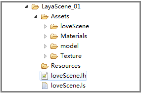

#LayaAir 3 Dモデル

##モデルの概要

3 Dモデルとは、3 Dソフトウェアによって物体の構造モデル化によって形成される3 D立体オブジェクトをいう。現在LayaAir 3 Dエンジンには2つのモデル表示タイプが含まれています。一つは普通の模型です**Mesh Sprite 3 D**。二番目はモンゴルのアニメーションモデルです。**SkinedMesh Sprite 3 D**。

違いは、モンピのアニメーションモデルとは、制作時にマスクと骨格アニメーションの模型を入れて、アニメのキャラクターがよく使われています。普通の模型はアニメがないシーン景観モデルなどを指します。

これらはいずれも模型メッシュと材質の二つの部分を含んでいます。

####モデルグリッド(Mesh):

モデルメッシュは点、線、面からなる三次元データで、LayaAirエンジンには専門的なMeshメッシュデータ類があり、3 Dモデルの表示対象Mesh Sprite 3 DまたはSkinedMesh Sprite 3 Dを付与して、シーンに表示することができます。

現在3 D制作ソフトが多く、最も主流なのは3 ds maxとmayaソフトです。3 Dモデルのデータフォーマットも多く、例えばFBX、3 DS、OBJなどです。

LayaAirエンジンは、モデル導出ツールFBXToolsとunity 3 D導出プラグインを提供し、LayaAirを生成するために必要な徳Dデータフォーマットを提供する。unityエクスポートプラグインを使用すると、FBXToolsツールは今後更新されません。

####材質(Material)：

材質説明は独立した章で紹介します。この章では説明を見合わせます。


##エンジン独自の基礎モデルを作る

高速で3 Dの旅を開くコースでは、BoxMeshケースモデルを使用しました。今回はLayaAirエンジンが提供する他のSphere Mesh、CylindersMesh基礎モデルデータを紹介します。順次作成し、トレーンform属性を通じて位置を移動します。具体的なコードは以下の通りです。

tips：作成時に、シーンにロードされたエンジンは模型を持ち、軸軸点はモデルの真ん中にありますので、モデルの中心点を参考に移動、回転、スケーリングを行います。シーンにロードすると、モデルはデフォルトでシーンの世界座標の原点に置かれます。2 Dと似ています。


```typescript

// 程序入口
class LayaAir3D {
    constructor() {
        //初始化引擎
        Laya3D.init(0, 0, true);

        //适配模式
        Laya.stage.scaleMode = Laya.Stage.SCALE_FULL;
        Laya.stage.screenMode = Laya.Stage.SCREEN_NONE;

        //开启统计信息
        Laya.Stat.show();

        //添加3D场景-----------------------
        var scene:Laya.Scene3D = new Laya.Scene3D();
        Laya.stage.addChild(scene);
        //创建摄像机(横纵比，近距裁剪，远距裁剪)-----
        var camera:Laya.Camera = new Laya.Camera( 0, 0.1, 1000);
        //加载到场景
        scene.addChild(camera);
        //移动摄像机位置
        camera.transform.position=new Laya.Vector3(0, 3, 10);
        //旋转摄像机角度
        camera.transform.rotate(new Laya.Vector3( -17, 0, 0), true, false);
        //加入摄像机移动控制脚本
        camera.addComponent(CameraMoveScript);
        //创建方向光 ------------------------
        var light:Laya.DirectionLight = scene.addChild(new Laya.DirectionLight()) as Laya.DirectionLight;
        //移动灯光位置
        light.transform.translate(new Laya.Vector3(0,2,5));
        //调整灯光方向
        light.transform.worldMatrix.setForward(new Laya.Vector3(0.5, -1, 0));
        //设置灯光漫反射颜色
        light.diffuseColor = new Laya.Vector3(0.3, 0.3, 0.3);
        //设置灯光环境色
        scene.ambientColor = new Laya.Vector3(1, 1, 1); 
        //创建模型-------------------------------
        //创建盒子模型(参数为：长、宽、高，单位：米)
        var boxMesh:Laya.BoxMesh=new Laya.BoxMesh(2,2,2);
        //创建模型显示对象
        var box3D:Laya.MeshSprite3D=new Laya.MeshSprite3D(boxMesh);
        scene.addChild(box3D);
        //创建球体模型(参数为：半径、水平层数、垂直层数)
        var sphereMesh:Laya.SphereMesh=new Laya.SphereMesh(1,8,8);
        //创建模型显示对象
        var sphere3D:Laya.MeshSprite3D=new Laya.MeshSprite3D(sphereMesh);
        //x轴上移动-3米（世界座标 向左）
        sphere3D.transform.translate(new Laya.Vector3(-3,0,0),false);
        scene.addChild(sphere3D);
        //创建圆柱体模型(参数为：半径、高、圆截面线段数)
        var cylinderMesh:Laya.CylinderMesh=new Laya.CylinderMesh(1,2,8);
        //创建模型显示对象
        var cylinder3D:Laya.MeshSprite3D=new Laya.MeshSprite3D(cylinderMesh);
        //x轴上移动3米（世界座标 向右）
        cylinder3D.transform.translate(new Laya.Vector3(3,0,0),false);
        scene.addChild(cylinder3D);
        //创建材质----------------------------------
        var material:Laya.PBRStandardMaterial = new Laya.PBRStandardMaterial();
        //为模型赋材质（单个材质可赋给多个模型）
        box3D.meshRenderer.material = material;

    }
}
new LayaAir3D();
```


上のコードでは、カメラと照明を作成し、基本的な幾何学モデルを3つ追加しました。効果は図1のように表示されます。

（図1）<br/>


##三次元ソフトウェアの生成モデルを作成します。

上記の3つの基本モデルは主に開発者がテストを学ぶために使用されます。ゲームのモデルは三次元ソフトで作られたものが多く、unityエディタでスティッチングを導入し、LayaAirでエクスポートしたツールを使って転化し、3 Dシーンやモデル表示クラスでロードして使用します。

再度、エクスポートしたリソースの種類とファイルの使い方を説明します。

エクスポートされたフォルダには、シーン、3 Dモデルの容器、3 Dモデル、3 D材質などの解析ファイル、フォトスタンプ、材質スタンプなどのデータファイルが含まれています。

（図2）<br/>

**love Sceneフォルダ**unityでフォトスタンプを作成したフォルダです。unityで作成したシーン名と同じです。フォトスタンプはシーンScene編で紹介されています。

**Materialsフォルダ**unityでFBXモデルを導入した時に素材ボールを作成するフォルダです。エクスポートしたリソースは対応するLayaAir材質データ解析ファイルです。ファイルには材質のレンダリングモード、リソースパス、材質の各種光色属性などが格納されています。

**Textureフォルダ**unityで作成した保存スタンプのフォルダです。ここでは資源は材質のスタンプファイルで、一連の画像ファイルです。LayaAirエンジンでjpgまたはpng形式の画像を使って、他のフォーマットの写真を自動的にjpgまたはpngに変換します。

####*.lsフォーマットScheneデータファイル

エクスポートされたシーンSceneタイプのデータファイルは、前のコースで説明されました。ここでは多く説明しません。

####*.lh形式Sprite 3 Dデータファイル

導出された3 D表示対象容器のsprite 3 Dタイプデータファイルは、JSONフォーマット符号化で、unity 3 DにおけるLayaAir導出プラグインが「Sprite 3 D」カテゴリを選択して生成し、内部記憶は*.lsフォーマットよりも少なくなり、その他はすべて同じです。

「*.ls」フォーマットのロードはシーンローディング方法と似ています。Sprite 3 D.load()を非同期でロードするか、Laya.loader.createをプリロードするか、コードを参照してください。


```javascript

......
//添加3D场景-----------------------
this.scene = new Laya.Scene3D();
Laya.stage.addChild(this.scene);

//方法一：直接异步加载
Laya.Sprite3D.load("res/room.lh",Laya.Handler.create(this,function(sp:Laya.Sprite3D):void{
    var sprite3D:Laya.Sprite3D = this.scene.addChild(sp) as Laya.Sprite3D;
}));

//方法二：预加载，创建为Sprite3D类型
Laya.loader.create("res/room.lh",Laya.Handler.create(this,this.onCreateComplete));
//预加载完成后回调
private onCreateComplete():void{
  //实例化加载并创建好的3D对象
  var sprite3D:Laya.Sprite3D = Laya.loader.getRes("res/room.lh");
  this.scene.addChild(sprite3D);
}
```


####*.lmフォーマットデータファイル

「Scene」ファイルまたは「SpriteD」ファイルの種類にかかわらず、エクスポートされたリソースフォルダにはシリーズ＊lm形式のファイルが含まれています。本プロジェクトではmodelフォルダはunityの開発者が構築したストレージFBXモデルフォルダです。図2のように、エクスポート時に対応するフォルダと.lmリソースファイルが生成されます。

（図3）<br/>

「*.lm」ファイルはモデルデータファイルであり、Mesh Sprite 3 DまたはSkinedMesh Sprite 3 Dタイプ表示オブジェクトのグリッドデータMeshを生成し、モデルグリッドの頂点位置、法線、頂点色、頂点UVなどの情報を含んでいます。

Mesh Sprite.load（）を非同期でロードするか、Laya.loader.create（）をプリロードする方法でロードします。参照コードは以下の通りです。


```typescript

......
//添加3D场景-----------------------
this.scene = new Laya.Scene3D();
Laya.stage.addChild(this.scene);

//方法一：直接异步加载
//Laya.Mesh.load("LayaScene_01/Assets/model/loveScene_jianzhu.lm",Laya.Handler.create(this,function(m):void{
//  	 var meshSprite3D:Laya.MeshSprite3D = scene.addChild(m) as Laya.MeshSprite3D;
//}));

//方法二：预加载，创建为Sprite3D类型
Laya.loader.create("LayaScene_01/Assets/model/loveScene_jianzhu.lm",Laya.Handler.create(this,this.onCreateComplete));
//预加载完成后回调
private onCreateComplete():void
{ 
  //创建预加载的模型网格 
  var mesh:Laya.Mesh = Laya.loader.getRes("LayaScene_01/Assets/model/loveScene_jianzhu.lm");
  //创建3D模型
  var meshSprite3D:Laya.MeshSprite3D = new Laya.MeshSprite3D(mesh);
  this.scene.addChild(meshSprite3D);
}
```


上記の2つの方法でゲーム画面にモデルを表示することができます。材質スタンプエンジンも自動的にモデルにロードされます。プロジェクトでは、状況に応じて上記の2つの方法を使ってもいいです。固定シーンは使用できます。ls形式でロードします。活動するアイテムはlsまたはlm方式でロードできます。

##サブオブジェクトモデルとグリッドを取得

3 Dモデルは、場合によっては複数のサブモデルのオブジェクトから構成されることがあります。例えばシーンモデル.lsは、基本的には複数の物体モデルと材質から構成されています。外層はSprite 3 D容器で、内部は本物のモデルMesh Sprite 3 DまたはSkinedMesh Sprite3 Dです。また、複数の階層がネストされている場合があります。

####サブオブジェクトモデルを取得

ゲームロジックを作成する時、モデルを修正したり、モデルを切り替えたり、削除したり、モデルにコンポーネントを追加したり、モデル上のアニメーションコンポーネントを取得したり、モデルの材質を修正したりする必要があります。これは全部ロードされたモデルからサブオブジェクトを取得する必要があります。**get ChildAt()**を選択します**get ChildByName()**方法はサブオブジェクトを取得します。これは2 Dエンジン取得サブオブジェクト法と同じです。

次にトラックモデルのlhファイルをロードして、そのサブオブジェクトを取得します。サブオブジェクトを取得する前に、lsファイルを開いてモデルの親子層関係を確認することを提案します。モデルを作る時に、モデルがどれぐらいのサブオブジェクトモデルで構成されているかということと、それらの命名規則を確認することもできません。

tips：3 ds maxでモデル化する場合、モデルのサブオブジェクトに名前を付けることを提案し、プロジェクトのリソース命名規則を制定し、デフォルトのモデル名を使用しないでください。

次の例ではunityから導いたトラックtruck.lhをロードして、開いた後にJSON構造で見ることができます。外層はスピリット3 D容器（unityシーンに相当）で、内部はSprite 3 D容器（unityシーンに相当するトラック）で、客車容器の中の2つのサブ対象モデルMesh Sprite 3 D（車体モデルと車体モデル）です。したがって、モデルMesh Sprite 3 Dを得るためには、2回のget ChildAt（）方式が必要です。

サブオブジェクトを取得する際には、モデルと材質がロードされていないとサブオブジェクトを取得できないので、リソースのプリロードが必要です。


```javascript

......
var truck3D:Laya.Sprite3D;
//加载导出的卡车模型
Laya.Sprite3D.load("LayaScene_truck.lh",Laya.Handler.create(this,function(sp){
     this.truck3D = sp;
     //获取模型（查看.lh文件，有两个子对象模型，一为车头“head”，一为车身"body",暂取其中一个模型）
     var meshSprite3D:Laya.MeshSprite3D = truck.getChildAt(0).getChildAt(0) as Laya.MeshSprite3D;
  	 //输出模型的名字
	 trace(meshSprite3D.name);
}))
```


上記のコードをコンパイルすると、モデルが表示されます（図4）。ブラウザでF 12でコンソールを開くと、出力されたモデルの名前が「body」となり、モデルの取得に成功したことが分かります。

（図4）<br/>


####モデルグリッドMeshを取得

ゲームの中で、私達はいつもキャラクターの入れ替えシステムを作って、時にはモデルを変えて、時にはスタンプを交換して、時には両方とも交換します。材質の貼り付け部分は後の章で説明しますので、この章では模型のグリッドを交換する方法だけを紹介します。

モデルMesh Sprite 3 DまたはSkinedMesh Sprite 3 Dにあります。**meshFilter**属性は、グリッドフィルタクラスの例です。この属性の中の**sharedMesh**モデルのメッシュです。交換や廃棄ができます。

次の例を参照してください。トラックモデルをロードしてから2秒後に、既存の車体メッシュに新しいヘッドメッシュオブジェクトを作成します。


```typescript

......
//加载导出的卡车模型
var truck3D:Laya.Sprite3D;
var meshSprite3D:Laya.MeshSprite3D;
//加载导出的卡车模型
Laya.Sprite3D.load("LayaScene_truck.lh",Laya.Handler.create(this,function(sp:Laya.Sprite3D):void{
  	 truck3D = sp;
  	 //获取模型（查看.lh文件，有两个子对象模型，一为车头“head”，一为车身"body",暂取其中一个模型）
     meshSprite3D = truck.getChildAt(0).getChildAt(0) as Laya.MeshSprite3D;
     //输出模型的名字
	 trace(meshSprite3D.name);
  	 Laya.timer.once(2000,this,onTimerOnce);
}));

//2秒后更换模型网络
private onTimerOnce(){
   //创建模型网格并更换原始网格
  	Laya.Mesh.load("LayaScene_truck/Assets/truck-head.lm",Laya.Handler.create(this,function(m:*):void{
		 meshSprite3D.meshFilter.sharedMesh = m;
 		 //因使用了卡车头网格，位置会重合，因此进行位置移动
 		 meshSprite3D.transform.translate(new Vector3(0,0,-8));
   	}));
}
```


（図5）<br/>