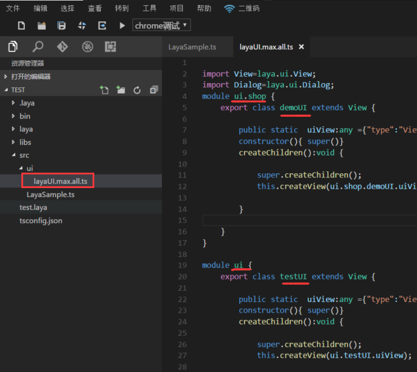
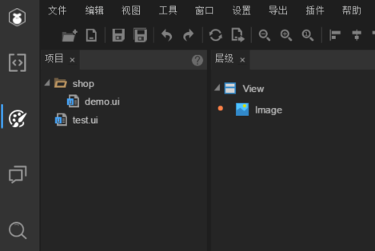

#IDEで作成したページをコードで表示します。

>本編を読む前に、設計モードの基礎にある文書「UIページ、粒子、アニメーション、スクリプト新規パネル詳細」を読んでください。

本記事はLayaAirエンジンとIDEに接触したばかりの初心者向けで、IDEを使ってUIページを作成し、IDE編集を行ったら、どうやって編集コードを使ってUIページを表示しますか？次の内容を続けてみてください。


##知っておくべきUIの使用基準

####1、UI類がどのディレクトリにエクスポートされているかを知る

まず、UIページをエクスポートすることを知りたいです。`F12或ctrl+F12`）後、もし私達がデフォルト値を変更していないなら、UIクラスのコードは`src/ui`目次の下。変更する場合は、図1に示すように、F 9ショートカットキーを押して項目設定パネルを呼び出すことができます。

 


（図1）

####2、Type Scriptプロジェクトは必ず知っておくべきUIディレクトリの命名規則

Type Script自体の理由で、TSプロジェクトはUIにディレクトリ名を付ける際に、2つの重要なルールがあります。

1、新規作成禁止ディレクトリの名前は`ui`コードで時報が間違って表示されます。

2、同じ縦方向のディレクトリの下にリネームディレクトリがあることを禁止します。例えば、親ディレクトリとサブディレクトリの同名（aa/aa）、または親ディレクトリと孫ディレクトリの同名（aa/bb/aa）は、いくつかの階層的な関係を隔てていても、同じ縦方向のディレクトリの下で、任意の階層的関係の同じディレクトリの名前は禁止されており、エラーが発生します。

####3、エクスポート後に生成されたコードファイル

IDE導出機能を使用すると、デフォルトはsrc/uiディレクトリの下でtsのUIファイルを生成する（`layaUI.max.all.ts`を選択します。ここには、図2-1に示すように、作成されたUIページ情報が全部含まれる。

 


（図2-1）

 


（図2-2）

図2-1の赤い糸部分と図2-2のディレクトリ構造を比較すると、その関係が分かりやすいです。uiは根構造で、shopはuiの下の一級カタログです。デモはUIファイルのファイル名であり、クラスファイルでは、UIファイル名とUIキーワードでUIクラス名（demoUIなど）を構成しています。元々IDEで作成されたUIファイル名ではありません。例えば、使用するUIクラスを以下のコードで参照する。


```typescript

import demoUI = ui.shop.demoUI;
```


####4、index.htmlで導入されたUI類jsを知る。

デフォルトでは、IDEはindex.htmlで自動的にコンパイルされたUIクラスを導入します。図3に示すように。ここに来てみてもいいです。問題がない限り、ここに来てみてもいいです。

  


（図3）


##コードを作成し、IDEで作成されたページを表示します。

図2-2のtest.uiで編集したページを表示すると仮定します。

####1、先にエクスポートするUIクラスを参照する


```typescript

//引入test页面的UI类
import testUI = ui.testUI;
```


####2、プライベートなロード方法を作成し、UIマップリソースのフィードバックをロードする。

この方法では、導入されたtestUIオブジェクトをtestに実装し、ステージに追加する。


```typescript

private onLoaded():void{
        //实例化UI界面
        var test:testUI = new testUI();
        //把实例后的UI界面添加到舞台
         Laya.stage.addChild(test);
    }
```


####3、ページで使用される図集リソースをロードし、UIをリピート方法でステージに表示する。


```typescript

//加载页面中的图集，并将页面显示
Laya.loader.load("res/atlas/comp.atlas", Laya.Handler.create(this, this.onLoaded));
```


####4、完全なコード

例空項目の入口プログラムLayaSample.ts


```typescript

//引入test页面的UI类
import testUI = ui.testUI;
class GameMain{
    constructor()
    {
        Laya.init(600,400);
      	//加载页面中的图集，并将页面显示
        Laya.loader.load("res/atlas/comp.atlas", Laya.Handler.create(this, this.onLoaded));
    }

    private onLoaded():void{
        //实例化UI界面
        var test:testUI = new testUI();
        //把实例后的UI界面添加到舞台
         Laya.stage.addChild(test);
    }
}
new GameMain();
```


>この文書は非常に基本的で、簡単です。もしUIが表示されなかったら、必ずこの文書の手順を厳格に押してください。命名まで同じにして、まず問題がないことを確認してから、柔軟に試してください。