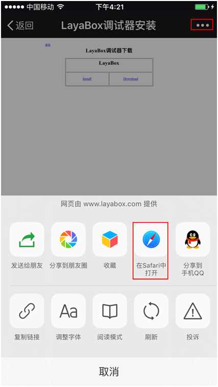
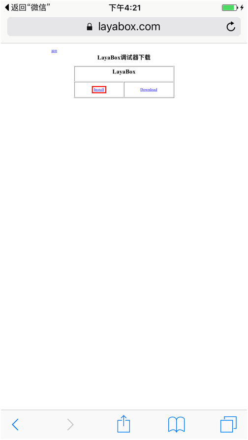
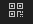

#LayaNativeテストアプリでプロジェクトを実行するにはどうすればいいですか？

###一、アプリのダウンロードとインストールをテストします。

####1.テストアプリのダウンロード二次元コードを表示する

LayaAirIDEを開いて、左上のをクリックします。メニューボタンをクリックして、メニューバーをイジェクトします。

メニューバーの「ツール」->「実行器ダウンロード」をクリックして、Appの二次元コードをテストして住所をダウンロードします。

   
図1

​ 
図2

####2.Androidバージョンのダウンロードとインストール

Androidの携帯電話でコードをスキャンし、アプリをクリックしてインストールすればいいです。

**Tips：WeChatスキャンコードを使用すると、WeChatのセキュリティ設定のため、コードをスキャンした後、リンク先を携帯ブラウザにコピーしてダウンロードする必要があります。**    

####3.iOSバージョンのダウンロードとインストール

WeChatでコードをスキャンして「Safariで開く」をクリックし、Safariブラウザで開いてクリックします。**Install**ボタンを押して取り付けをクリックし、下図のようにしてください。

**ステップ1:**

​  
図3

**ステップ2:**

   
図4

**ステップ3:**

   
図5

**Tips:**

インストールをクリックして、ここには自動ジャンプ機能がありません。手動でシステムデスクトップを見に行きます。Layaboxのアプリがインストールされていますか？インストール中なら、インストールが完了したら次の操作を行います。

**ステップ4:**

インストールが成功したら、実行をクリックすると「信頼されていない企業開発者」が表示されます。この時は開発者自身で設定してください。

「設定」－>「汎用」－「機器管理」－「LayaBox Network Technologyをクリックしてください。」－「信頼をクリックしてください。」

その後LayaBoxテストアプリを開けば正常に使えます。具体的な手順は以下の通りです。

**ステップ5:**

​ 
図6

**ステップ6:**

​ 
図7

**ステップ7:**

​ 
図8

**ステップ8:**

​ 
図9

**ステップ9:**

​ 
図10

###二、テストアプリを使ってプロジェクトのテストを行います。

**ステップ1:**

アプリケーションを開くと、図11のようなインターフェースが見えます。

 
図11

**ステップ2:**

LayaAirIDEを使ってケース項目を開け、メニューバーの一番右側の二次元コードアイコンをクリックします。項目の二次元コードインターフェース（図12）が表示されます。 
図12

**ステップ3:**

テストAPP内の青い二次元コードアイコン（図13）をクリックして、コードスキャンの画面に入ります。右側のlayanativeの二次元コード（図14）をスキャンすると試験が開始されます。

   
図13

   
図14

コードスキャンが成功したら、Appをテストしてケース項目を実行します（図15）。

<！--TODO：他のプロジェクトの写真が必要かもしれません。-->

   
図15

**Tips：LayaNativeはブラウザではありません。住所を入力するのは全パスを入力してください。たとえデフォルトで起動しているのがindex.ですとしても、入力します。**

*http://testgame.layabox.com/index.jsが正しい
*http://192.168.0.100:8899/index.jsが正しいです。
*http://testgame.layabox.com/エラー
*http://testgame.layabox.comエラー
*http://192.168.0.100:8899/エラー
*http://192.168.0.100:8899エラー

<！--TODO：送信後接続先を変更する*Tips：住所を入力すると、画面に何の画面も表示されていないことが判明しました。プロジェクトのために横向きスクリーンが正しく設定されていない可能性があります。ドキュメントを参照してください。

###三、注意事項

テキストフォーマットのファイル（例えば、ini、xml、）、json、jsなど）は、すべてutf 8符号化フォーマットである必要があります。IOSデバイスは、現在、非utf 8フォーマット符号化のファイルをサポートしていません。

###四、アドバイス

開発者にandroidとiosの開発の基本的な知識を学ぶように提案します。使用中にモバイル機器をパソコンに接続して、いつでもロゴを確認してください。ロゴの中には重要な情報がたくさんあります。開発者の位置付けを助けることができます。例えば、非utf 8フォーマットでエンコードされたファイル名、ネットワークエラー、ダウンロードエラーなどです。