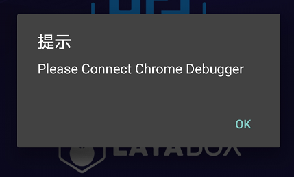

#Androidの実機でJavaScriptコードをデバッグします。

##注意:
最近chromeバージョンが69に更新されたので、LayaNative環境でJSを本格的にデバッグしました。断点デバッグを手動で設定することができません。解決策：
1、開発者はコードの中にデバッグを書いてデバッグすることができます。
2、Chrome 68のバージョンをインストールしてデバッグする。
わが社のエンジンチームはできるだけ早くこの問題を解決しますので、ご迷惑をおかけします。ご了承ください。

##一、デバッグの原理

JavaScriptコードのデバッグはデバッグマシン上のChromeブラウザを使って行います。Androidテスト機のLayaNativeが起動すると同時にWebSocketサーバーが起動します。ChromeブラウザはWebSocketを通じてLayaNativeと通信を接続し、Chromeを使ったプロジェクトのJavaScriptのデバッグを実現します。

デバッグ項目のJavaScriptのコードの場合、以下の2つのデバッグモードが選択できます。

1.Debug/Normalモード

このモードでは、Androidテスト機の項目を直接起動して実行することができます。Chromeブラウザはプロジェクト実行後に接続してデバッグすることができます。

2.Debug/Waitモード

このモードでは、Androidテスト機の項目が起動したら、Chromeブラウザの接続をずっと待っています。Chrome接続が成功すると、JavaScriptスクリプトが継続されます。
起動時にロードされたJavaScriptスクリプトをデバッグする必要がある場合は、優先的にこのモードを選択してください。

**注意：デバッグの工程では、デバッグマシンとAndroidテスト機が同じネットワークにあることを確認してください。**

##二、layaAirIDE構築のAndroidプロジェクトをデバッグする。

###ステップ1:

LayaAirIDEを使ってプロジェクトを構築し、Androidを生成するプロジェクトです。

<！--TODO：リンク先を追加します。具体的には「IDEを使ったプロジェクト構築」を参照してください。-->

###ステップ2：デバッグモードを変更する

Android Studioを使って構築後の工程を開けます。

Android/ustudio/ap/src/main/assites/config.iniを開いて、JSDebugModeの値を修正して、必要なデバッグモードを設定します。図1のように：

！

図1

JSDebugModeの採値と意味は以下の通りです。

124が値を取るという意味が124になる
|：--：124;：--：124;
|0 124;デバッグ機能をオフにする
|1|Debug/Normalモード|
|2|Debug/Waitモード𞓜

**Tips:**

プロジェクトが正式に発表されたら、JSDebugModeの値を0に設定してください。いいえの方はプロジェクトの運行時の性能に影響があります。

###ステップ3：アイテムをコンパイルして実行する

Android Studioを用いてコンパイルしたプロジェクトです。

Debug/Normalモードを選択したら、Androidテスト機の成功を待っています。**起動して実行する**プロジェクト。

！

図2 Androidテスト機の起動に成功し、プロジェクトを実行しています。

Debug/Waitモードを選択したら、Androidテスト機の成功を待っています。**起動**プロジェクト。

！

図3 Androidテスト機の起動に成功しました。

###ステップ4：Chrome接続プロジェクトを使用する

デバッグマシンのChromeブラウザを開き、以下のURLを入力します。

>chrome-devtools:/devtools/bundled/inspector.experiments=true&v 8 only=true&ws=10.82.142:5959

**注意:**ws=10.82.142:5959の10.82.142はAndroidテスト機のipアドレスで、5959はステップ2のconfig.iniファイルのJSDebugPortに設定されているポート番号の値です。自分の設備の実際の状況と需要に応じて変更してください。

###ステップ5：デバッグを行う

接続が成功したら、Chromeを使ってプロジェクトのJavaScriptをデバッグすることができます。図2に示すように、

！

図4

##三、テストアプリを使ってデバッグする

###ステップ1：ipアドレスとポート番号を確認する

テストアプリを開くと、Androidデバイスのipアドレスとデバッグに必要なポート番号が左上に見えます。

図1に示すように、デバイスのipアドレスは10.10.82.142であり、ポート番号は5959である。

図5

###ステップ2：デバッグモードを選択する

画面の下の中央のボタンをクリックして、デバッグモードを選択します。

図6

図7

###ステップ3：スキャン項目の二次元コード

アプリの中間の青い二次元コードアイコンをクリックして、項目のlayanativeの二次元コードアドレスをスキャンします。

Debug/Normalモードを選択したらプロジェクトの成功を待っています。**起動して実行する**。

図8ケースプロジェクトの成功運転

Debug/Waitモードが選択された場合、テストアプリのポップアップを待って次の画面が表示されます。

図9

###ステップ4：Chromeブラウザにテストアプリを接続する

Chromeブラウザを開き、以下のURLを入力します。

>chrome-devtools:/devtools/bundled/inspector.experiments=true&v 8 only=true&ws=10.82.142:5959

**注意:**ws=10.82.142:5959は、ステップ1で見たipアドレスとポート番号です。自分の設備の実際状況に応じて変更してください。

###ステップ5：デバッグを行う

接続が成功したら、Chromeを使ってプロジェクトのJavaScriptをデバッグすることができます。図7に示すように、

！

図10

**Tips:**テストアプリのショートカットボタン

テストアプリがプロジェクトを成功させたら、画面に二つのボタンが表示されます。二つのボタンの役割は以下の通りです。

**1.更新ボタン**

項目のコードを変更したら、更新ボタンをクリックして変更後のプロジェクトを再読み込みできます。

**注意:**Chrome接続の場合、テストアプリが更新ボタンをクリックすると崩壊する場合があります。この問題は今後バージョンで解決しますので、ご了承ください。

**2.戻るボタン**

リターンボタンをクリックして、スキャンコードの画面に戻り、再度スキャンを行います。

##四、現在バージョンに存在する問題

**以下の問題は今後のバージョンで解決しますので、ご了承ください。**

デバッグ中にデバッグが発生する可能性があります。デバッグが混乱する可能性があります。
このような場合は、以下の手順で処理してください。

ステップ1：設定したブレークポイントは以下の通りです。

！

図11

ステップ2：すべてのブレークポイントをキャンセルします。

！

図12

ステップ3：起動プロジェクトを再起動し、Chrome接続プロジェクトを再利用する。

！

図13

ステップ4：必要なブレークポイントを回復する

！

図14