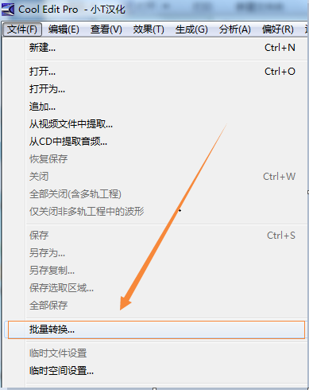
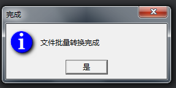

#音について

LayaNativeでは、BGM、サウンドの2つのモードがあります。

##1.背景音楽

LayaNativeでは、バックグラウンドミュージックはmp 3形式しかサポートされていません。バックグラウンドミュージックは一つしか再生できません。

##2.サウンド効果

プロジェクトの中で、音の効果はすべて高周波の発生事件で、運行の効率を確保するため、LayaNativeはopenALを使って音の効果を放送して、mp 3がストリームのメディアのフォーマットなため、現在まだ解析することができません。
**Tips:**  
**1、LayaNativeのサウンドはwavとoggフォーマットのみをサポートします。**  
**2、wavとoggは8位と16位だけで、まだ32位をサポートしていません。**

**Tips:**wavとoggは22050サンプリングレート、16 bit、モノラルを使用することを推奨します。

##3.ヒント情報

呼び出したら`SoundManager.playSound()`ただし、入力されたファイル形式がmp 3であると、ヒント情報が表示されます。
`The sound only supports wav or ogg format,for optimal performance reason,please refer to the official website document.`  
この時にmp 3をwavまたはggに変換します。


##4.互換性を解決する

もしあなたのプロジェクトがウェブページのバージョンでmp 3形式を使用すれば、LayaNativeではwav形式を使用します。プロジェクトは配置ファイルを使用してロードすることを提案します。このように配置ファイルをロードするところだけで、LayaNative実行環境と判断するコードを追加します。疑似コードは下記の通りです。


```javascript

if(window.conch)
{
    ...加载 "soundConfig-LayaPlayer.json"
}
else
{
    ...加载 "soundConfig-json"
}
SoundManager.playSound(soundJson[0].url,1);
....
SoundManager.playSound(soundJson[1].url,1);
```


**Tips**  
*1、conchはLayaNative環境でしか呼び出しができません。ウェブページのバージョンにはconchの定義がないので、存在するかどうかを判断する必要があります。＊
*2、as言語を使って開発する場合は、`Browser.window['conch'] `このようにしてconchオブジェクトを取得します。*
*3、または使う`if(Render.isConchApp )`判断してもいいです。*

##5.Cool Edit Proツールを使って音声フォーマットの変換を行う
今はMP 3に対してwavを変換できるツールがたくさんあります。ここで簡単に紹介するCool Edit Proツールです。mp 3変換wavの具体的な操作手順を紹介します。
1、まず自分でダウンロードして、まずCool Edit Proツールをインストールして、Cool Edit Proプログラムを開きます。


2、左上の「ファイル」の下の「一括変換」をクリックして、「一括変換」サブメニューに入ります。




**注意：次の1、2、3、4のステップを一括ファイルに変換してください。**

3、ファイルのソースを選択します。右をクリックしてファイルを追加します。ここでsoundファイルのすべてのファイルを選択してバッチ処理を行います。その後クリックして開きます。


4、サンプルの種類を変換します。再サンプリングカタログの下でクリックして目標フォーマットを変更します。ここで私達が必要とするサンプルレート22050 Hz、モノラル、16ビットビットビットを選択して、クリックして確定します。


5、新しいフォーマットを選択します。出力フォーマットは私達が必要なWindows PCM（*.wav）、フォーマットタイプは22050 Hz、16ビット、モノラルを選択します。


8、ターゲットフォルダとファイル名を選択します。ここは簡単に出力ディレクトリを選択してください。そして「実行バッチ処理」をクリックして出力するために必要なファイルがあります。「ファイル一括変換完了」というメッセージが出たら、MP 3変換wavの一括変換が成功したということです。



9、Cool Edit Proを実行してバッチ処理を行う時に次のパチンコが現れたら、Resample.xfmファイルを新たに取り替えるだけで、Cool Edit Proを再起動すればいいです。


**このような場合は、cool edit reample.xfmを検索したり、正規版cool editを買ったりします。（わかりました）**

**10、オンラインでダウンロードしたcool edit proが大量に変換されていない場合、先に回してもいいです。大量に変換されます。**
