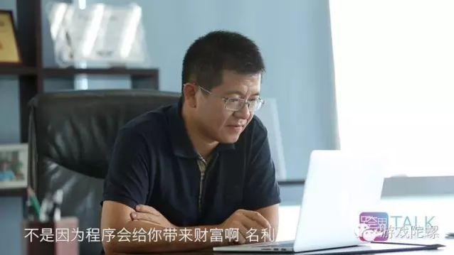

#Layabox創始者の謝成鴻：プログラマーの情熱と夢

​ 
図(1)
###ことばを引く

ウェブサイトを売って千万元を儲けて、端遊の損失をして億を過ぎて、今LayaBox Aラウンドは1億融資します。創業20年近くの謝成鴻さんは世界トップクラスのゲームエンジンをやります。

LayaBox CEOの謝成鴻氏は「プログラマーとして、自分のものを作って、世界に影響を与えるものを変えたい」と話しています。

##十年の夢から覚めた謝成鴻と彼のLayaBox

>「私はいいゲームプロデューサーではないかもしれませんが、とてもいい技術者です。」
>

LayaBoxは謝成鴻（以下、老謝という）が2014年に創立したゲームエンジン、ゲームリリース、ゲームチャネルなど多くの分野が一体となっている会社です。LayaBoxは老礼が「十年の谷」に返り咲いた作品と言える。

​ 
図(2)

2014年の謝さんがLayaBoxを創立した時、LayaFlashさんによって1000万級の天使の融資をもらいました。2015年にはH 5産業チェーン全体がエンジン、CP、チャネルプラットフォーム、データサービスなどの数十社の企業が次々と融資を獲得しました。しかし2016年まで爆発が遅れて、資本はH 5産業に対して慎重になってきました。このような時に、2016年6月にLayaBoxはAラウンドでまた深い投資、金慧豊、合力資本などの基金の共同投資を獲得しました。億の投資はどの分野でも多くないです。謝さんは何を頼りに投資者を感動させましたか？

LayaBoxは2011年から研究開発を開始しており、2015年には初代のエンジンLayaFlashの創始的な開発言語としてFlash AS 3を引用しています。第二世代のオープンソースエンジンLayaAirは、Flash AS 3、Type Script、JavaScriptの3つの開発言語をサポートしており、2 D、3 D、AR、VRゲームの開発をサポートしています。また、アプリのハンドリング、Flashページツアー、HTML 5ゲームをワンタッチでリリースすることもできます。H 5の発展を制約するものがあれば、技術はその原因の一つに違いない。謝さんはこの問題を見て解決しました。

ありがとうございます。自分のチームと製品に自信を持っています。彼はモバイルWEBは発展の傾向にあると思います。また、大量の流量が統合されているので、H 5ゲームは非常に良い機会です。LayaBoxが解決できるワンタッチマルチプラットフォームのリリース問題は、コストを大幅に削減しながらゲームの性能を向上させました。現在はLayaBoxをゲームエンジンの開発者生態に基づいて作っていく計画です。LayaBoxは自分のruntimeを持っています。これはH 5ゲームの生態を発展させる基礎です。孵化器と投資のほかに、LayaBoxは「LayaBox教育連盟」のLayaBoxのフィールド周波数に関する学習資料をメンバーの教育計画に入れています。「未来LayaBox教育連盟」はまた各大学で協力して、LayaBoxを大学生のグループに入らせます。

##28年プログラマ18年の創業路

>「創業は苦しくないですか？創業はもちろん苦しいですが、苦難に対する見方は人それぞれです。
>

今の感謝は再起とも言える。「十年の谷」の後に鳴り響くと、どれほどの人が知っていますか？彼が経験した悲しい、成功の裏の物語です。

1988年に国内の大多数の人がコンピュータに対してよく知らない時、いつも謝さんはもう独学でプログラミングし始めました。中国の第二世代プログラマーになりました。彼は以前からの理想は技術監督になりたいです。彼は技術が大好きですから。1998年の謝さんは正式に創業して、相次いでいくつかの会社を創立しました。歌灯会社からコーラまでです。一回の経験した成功と失敗、苦しみと苦しみはすべて謝創業の道中の財産になりました。創業が最も苦しい時、いつも謝さんは高いビルの民家から「スラム街」に引っ越しました。投資者の資金を投入しただけでなく、自分も財産を使い果たしました。彼は冗談めかして言いました。「創業以来、最後には妻と子供が一人しかいません。」笑いが隠せないのは彼のあの時間に対する思い出です。もしかしたら、自分から見ると、あの日は「苦難」ではなく、創業途中の大切な思い出だけです。

​ 
図(3)

「創業が一番怖いのは失敗ではなく、自信を失うことです」という言葉を覚えています。失敗と谷間の自信に対する打撃はどれぐらいありますか？直接経験したのではなく、感じにくいと思います。「あの時は我慢してきたかもしれないと思いました。自分も十年とは思いませんでした。」と感謝したのはこのように成功に対する渇望を持っていて、自分とチームに対する自信を持って、理想の堅持に対して十八年を経って、今日まで来ました。

成功したことがない人は十分な能力があるとは限らない。失敗したことがない人は本当に自分を知ることが難しい。老謝が成功した時の努力は、失敗した時の堅持が彼が再び成功することを運命付けています。

##簡単なプログラマーは「職人」と「職人」です。

>「私は88年からコードを書き始めて、今まで28年です。」
>

18年の創業は、老謝がLayaBoxを創造したと言えます。LayaBoxが老礼を果たしたとも言えます。成功した創業者として、自分の位置付けは皆さんの想像と違っています。彼は自分のポジションについては単なるプログラマーであり、「職人」と「職人」である。

LayaBoxエンジンの研究開発の初期に、謝さんは毎日会社の普通のプログラマーと同じようにコンピュータの前に座ってコードを書いています。毎日平均的な睡眠は5時間を超えません。疲れたら会社で休んで、目が覚めたら仕事を続けます。疲れは何ですか？寝たらいいじゃないですか？ありがとうございます。エンジンの開発と会社全体の動力の一番強い触媒になりました。

>**「山に登るのが好きな人もいれば、入れるのが好きな人もいます。コードを書くと楽しいと思います。」**
>

​

 
図(4)

エンジンの開発が成功した当初、謝さんは「商業化」というものを作っていませんでした。ただエンジンをシェアして、エンジンをもっと多くの人にサービスして、彼らに一定の便利をもたらしたいです。「技術会社としての最大の夢は、技術を通じて皆様の富を創造することです」と技術を通じて皆様の財産を創造することです。これは単纯に见える一言で、プログラマーとしての心の中にある真挚な気持ちを表しています。ゲームのコマがLayaBoxが自分のエンジンに対する追求を聞いた時、**社の最大の追求は、叱られないことです。私たちはこのエンジンがいいと思ったら、毎日私たちのエンジンに何か問題があるかを突っ込まないでください。私たちは満足しています。**人生の中で主導できる時間は50年、28年といえば半人生です。ありがとうございます。彼の最高の時間をプログラムに与えました。コードを与えました。彼のすべての言葉は、プログラマの情熱と夢を述べています。

原文のリンク:[http://www.youxituoluo.com/502075.html](http://www.youxituoluo.com/502075.html)