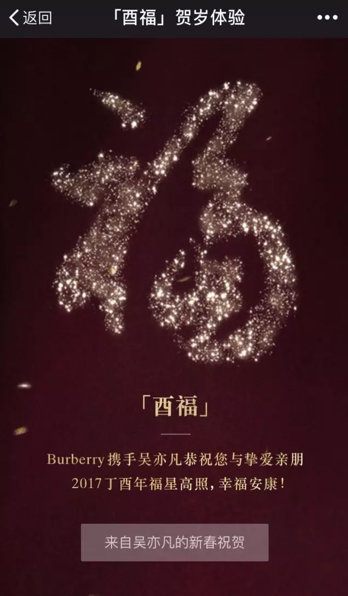
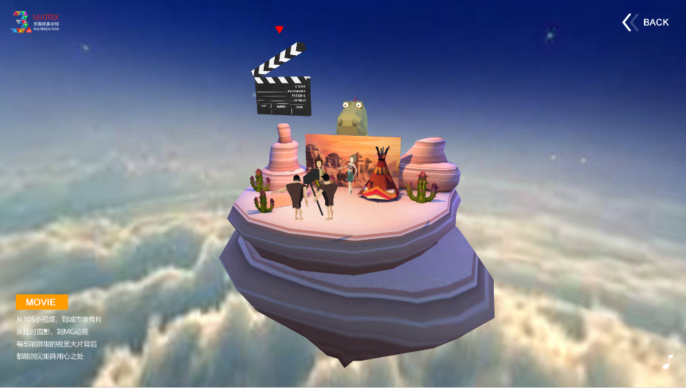

#Layaboxのエンジンはゲーム以外のケースです。

Layaboxは検索ゲームネットワーク科技（北京）有限公司が作った中国のゲームエンジンのプロバイダーブランドで、傘下の第二世代エンジンLayaAirはHTML 5契約に基づくオープンソースエンジンで、性能と3 Dはエンジンの核心競争力です。同時に、アクションScript 3、JavaScript、Type Scriptの3つの開発言語をサポートし、同時にAPP（AndroidとiOS）、HTML 5、WeChatミニゲーム、QQ軽いゲーム、Baiduのミニゲームなどの複数のプラットフォームのゲームエンジンを発表します。2 D\3 D\VR\ARのゲーム開発に対応するほか、エンジンはアプリケーション、広告、マーケティング、教育などの分野にも利用できます。性能はAPPエンジンに匹敵する。

多くのゲーム以外の事例の中から、いくつかの有名な代表作品を選んで、開発者の友達に展示します。

##一、LayaAir IDE

LayaAirIDEの1.0と2.0はLayaAirエンジンによって開発され、LayaAir UIシステムに基づいて、可視化UI編集、アニメーション編集、コード編集などの機能を実現しています。見たところ元のデスクトップソフトと違いないです。
 
図（1）はLayabox公式サイトでダウンロードできます。

##二、バーバリーの微信H 5広告

上海の彼の町はLayaAirエンジンを使って開発した贅沢なブランドのBurberryの新年広告が微信の友達の輪に現れて、一時的に話題になりました。H 5全体はプライベートオーダー、商品展示、呉亦凡拝などの要素を融合させ、精美な画質、流暢な体験、優れたビデオ再生性能を融合させ、Burberryの英風優雅さを表現しました。

​ 
図(2)

​ 
図(3)

##三、深セン地下鉄路線図

2016年、深セン地下鉄は市民の旅を便利にするために、LayaAirエンジンを使ってオンライン地下鉄運営ネットワーク路線図を作成しました。市民が各駅間の往来と乗り換えをリアルタイムで調べて、市民が旅行路線を明確に計画することができます。

​ 
図（5）は深セン地下鉄の公式サイトで体験できます。

##四、美団マーケティング広告

 

（図6-1）美団H 5マーケティング広告のスクリーンショット

 

（図6-2）美団H 5マーケティング広告体験二次元コード

##五、楽視マーケティング広告

 

（図7-1）楽視マーケティング広告のスクリーンショット

 

（図7-2）楽視マーケティング広告体験二次元コード

##六、3 Dインタラクティブホームページ展示

「ふしぎな群島」は、ゲーム要素を使ったHTML 5インタラクティブ3 Dページです。異なる浮空小島の間で切り替えます。各シーンに入って360度の全角度で島の様子を見る。

 

体験住所はhttp://dmt.juzhen 01.com/dmt 3/

##七、教育ゲーム

LayaAir教育を採用したミニゲームが多いです。これだけのコードを見つけて直接コードをスキャンして体験することができます。加減乗除法を組み合わせ、加減乗除の熟練度や数字への反応力を試すミニゲームです。

 