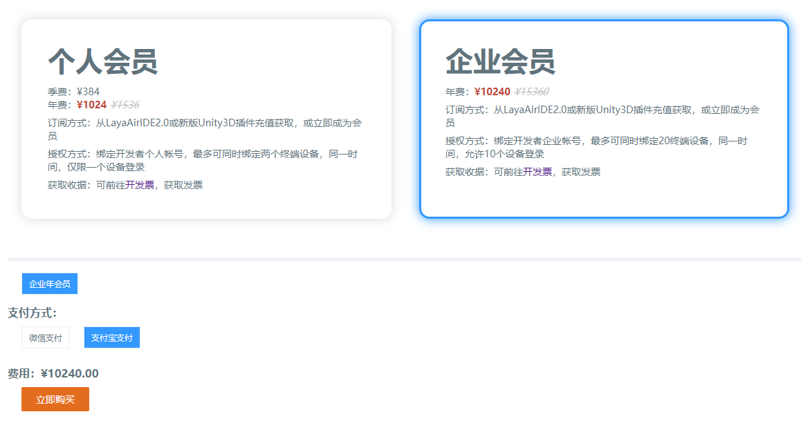
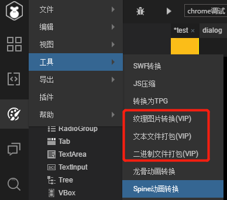
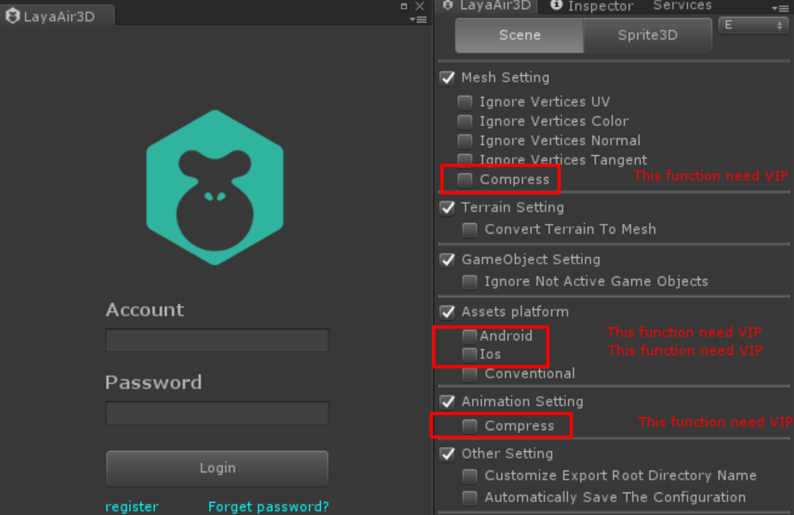
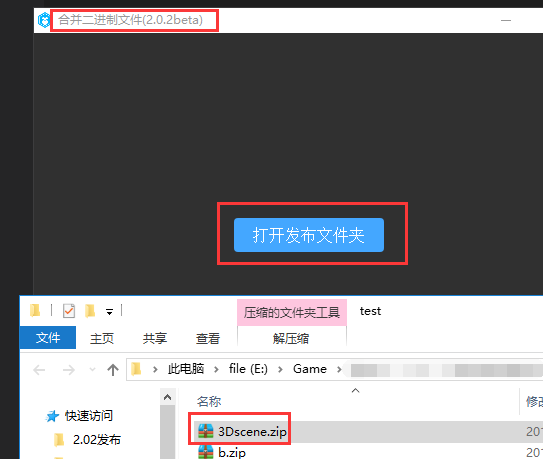

#LayaAirエンジンVIPの専属機能紹介

>著者：charley本論文のエンジンとツールバージョン：LayaAir 2.02本文の更新時間：2019-04-15

以下のディレクトリをクリックして直接ジャンプできます。

[TOC]

##一、LayaAir 2.0はなぜVIPの専属機能を押すのですか？

LayaAir 1.0の時、無料エンジンが利潤モードでないため、エンジンチームの生存に圧力がかかります。エンジンチームの生存圧力を軽減するためには、ドキュメントやコミュニティなど周辺サービスの人員投入を縮小するしかない。しかし、これはエンジンの持続可能な発展の道ではありません。エンジンの全部の業務は永遠に無料で、エンジンを困らせるだけです。もしエンジン企業が生存できないなら、大多数の開発と維持能力がないゲーム企業にとっては悪いニュースです。

ですから、2.0を発売する前に、開発者のために開発コストを下げるというバランスを考えています。無料でエンジンと低い敷居を使って、効率的にゲームを開発して、エンジンを生存させる持続可能な発展の道を探しています。

したがって、LayaAir 2.0エンジンの基礎機能は無料で続けられます。無料の2.0エンジンとツールで引き続きエンジンの高性能を強化し、エンジンの使いやすさを強化し、エンジン機能、特に3 Dエンジンの成熟度を絶えず改善しています。しかし、エンジン周辺のいくつかの付加価値サービスで有料化を試み、エンジンを持続的に発展させることも決めた。

現在のVIPの専属機能の有料化はその中の一つの試みであり、VIP機能の料金は比較的低いので、個人でも大丈夫です。VIP機能を使わなくてもゲームのオンラインに影響しません。もちろん、使った後にきっとゲームの効果をもっと良くなります。あるいは最適化されます。

最後に、エンジン周辺の付加価値課金業務が開発者たちの理解と支持を得られることを望んでいます。エンジン企業だけが生存圧力を解決した後、より良い人力と精力を文書及びその他の基礎の無料サービスに投入することができます。エンジンの持続可能な発展の生態をいっそう繁栄させる。


##二、VIPの専属機能にはどのようなサービスが含まれていますか？

専属機能である以上、VIP会員はもちろんVIP開発者ではないユニークな機能を持っています。機能は現在以下のいくつかの方面に提供されています。

###1、3 Dモデルのファイル圧縮：

効果：モデルのファイルサイズを約60%低減します。

機能紹介：3 Dゲームのモデルはゲームの資源の体積の重要な構成部分です。したがって、モデルファイルのサイズを減らすことで、ゲームのロード時間を短縮し、ゲームのスピードを上げることができます。現在のネット速度の環境の下で、ゲームの体積を減らしますか？それとも比較的に重要な付加価値の機能です。

###2、テクスチャ圧縮（2 D+3 D）：

効果：現存の約75%を下げて、ピクチャのデコードのカートン現象を減らします。

ゲーム中にテクスチャを使わずに圧縮すると、表示の維持のために占用されます。通常は原図を低解像度の機種で設計し、ゲーム中に高解像度の機種を引っ張ります。このようにゲームのモザイク現象（Androidのいくつかの高清解像度の機種でこのような問題が発生している場合が多いです。きっとこの問題によるものです。）を引き起こします。テクスチャ圧縮のモードは高解像度で設計しても小さい現像を占めていますので、同等の顕在占有の場合、高解像度の機種では、2 D画像の圧縮効果と引張効果があります。例えば図1に示す。3 Dスタンプは圧縮後の効果がより良く、圧縮は原図に対する損失は視覚効果においてほぼ無視できる。

 


（図1）

>注意：3 Dテクスチャを使って圧縮したら、視覚的にはほとんど見えないので、おすすめです。しかし、2 Dのテクスチャ圧縮は慎重に、静止画（例えばUI）はテクスチャ圧縮機能を使用しないようにしてください。動画（2 Dキャラクター動画など）はあまり目立ちません。高画質表現のニーズがないものは使用できます。

機能概要：

ゲームによくあるピクチャーファイルのフォーマットは、一般的にPNGやJPGなどです。これらの画像はまずCPUを通じて復号し、GPUに転送して使用します。テクスチャ圧縮後のフォーマットは、復号なしでGPUに直接読み込まれて表示されるフォーマットであるため、大量の現存を節約する一方で、ピクチャ復号によるCPU圧力を低減することができる。

開発者の注意が必要なのは。テクスチャ圧縮は、グラフィックスのハードウェアの加速に依存しますので、webGLモードでのみ利用できます。また、異なるプラットフォーム（オペレーティングシステム）のフォーマットも異なっています。例えば、私たちはAndroidプラットフォームでktxフォーマットです。iOSプラットフォームではpvrフォーマットです。

>異なるプラットフォームのフォーマットが異なるので、プラットフォームを跨ぐゲームは、テクスチャ圧縮を使って現存を低減しながら、価格はファイルのサイズを増加させます。

###3 Dアニメーションファイル圧縮：

効果：3 D動画ファイルのサイズを約40%低減。

機能概要：3 Dアニメーションファイルの圧縮はモデルの圧縮と同じで、ファイルのダウンロードの大きさを減らして、プレイヤーがゲームに入るスピードを速めるのに役立ちます。

###4、ファイル合併（JSON+バイナリ）：

JSONタイプのテキストファイルをマージして、ファイルのダウンロード相互作用の数を大幅に減らして、ゲームのロード効率を高めます。

機能概要：

ゲームの小さいファイルが多いとHTTP要求が大幅に増加し、ロードが遅くなりますが、マージファイル機能はJsonタイプのファイルをマージすることができます。これはファイルのHTTP要求数を減らし、ロード効率を向上させます。もちろん、盲目的に合併すると、パッケージ化後にファイルを一度にダウンロードする時間が長くなります。だから、開発者はプロジェクトの実際の状況によって使います。特に小さいファイルが多い時に使います。

###5、その他：

今後はより多くの拡張モジュールを増やし続けます。

###特別に説明する

####1、VIP機能にはVIP機能以外の技術サービスが含まれていません。

VIPを購入したら、エンジンの問題を解決してくれますか？ここで申し訳ないのですが、VIPを購入する際に提供される権益は主に専用機能そのものです。VIP専用機能の使用に関する質問も提供しています。例えばVIP専用機能は使えない、またはBUGと思われる、VIP専用機能に対するアドバイスや意見など、直接VIPエンジンの専属機能コミュニケーションQQ群に参加して交流してもいいです。QQ群号は以下の通りです。`739490368`

技術サービスの需要があれば、これは人件費に対する要求が高いため、現在のVIP専属機能の価格に耐えられるものではありません。技術サービスの購買需要があれば、WeChatで検索できます。`399050`技術サービスの業務提携担当者と連絡してコミュニケーションを行います。

####2、個人VIPと企業VIPのサービスの違い

企業VIPと個人VIPは機能の使用上は全く同じで、機能上は区別がありません。

唯一の違いは、個人VIPアカウントは最大で2つの端末しか紐付けられません。同じ時間、アカウントはその中の一つの端末にしか登録できません。企業VIPの同じアカウントは20個の端末を結びつけることができ、同時に10個の端末を登録することができます。このようにすれば、企業口座の管理・維持が便利になり、従業員の離職引継ぎによる問題が避けられます。


##三、VIP機能の定価と購入方法と領収書を取得する。

###1、VIP機能の定価

####個人VIP：

1024元/年/最大バインディング2端末/同時登録1端末

####企業VIP:

10240元/年/最大バインディング20端末/同時登録10端末

###2、購入方法

####公式ページで購入します。

リンク先:[https://www.layabox.com/vip/](https://www.layabox.com/vip/)

ステップ1：公式サイトのVIP紹介ページでクリックして会員になります。図1-1に示すように、購入ページに入ることができます。


（図1-1）

ステップ2：購入ページで登録方式を選択し、アカウントとコミュニティのアカウントは共通しています。図1-2に示すようにクリックしてください。`手机或用户名登录`を選択して、携帯番号とユーザー名とパスワードを入力して登録を確認してから購入できます。


（図1-2）

ステップ3：ログイン後、まず個人会員か企業会員タイプかを選択し、支払い方法（WeChatまたはAlipay）を選択し、最後にクリックして直ちに購入します。図1-3に示すように。最終的に支払いが完了すると、それまで登録していたアカウントがVIP会員アカウントとなります。VIP機能を使う前にこのアカウントを登録すればVIP専属機能が楽しめます。

 


（図1-3）

####LayaAirIDEで購入します

ステップ1:

最新バージョンのLayaAirIDEをダウンロードして、右下の広告図または右上の個人センター（小人アイコン）ボタンをクリックしてください。ログイン後（コミュニティ内のアカウントとパスワードでもあります）、会員購入ボタンは図2-1の通りです。このボタンを直接クリックして購買画面に入ります。

 


（図2-1）

ステップ2:

チャージページでは、VIP会員のタイプを選択して、お支払い方法のボタン（アリペイまたはWeChatを支払う）をクリックすると、対応する二次元コードがポップアップされます。図2-2に示すように、スキャンコードで支払えばVIP会員になります。VIP機能を使う前にアカウントを登録すれば、VIP専属機能を楽しむことができます。


（図2-2）

####LayaAirのUnityエクスポートプラグインで購入します。

ステップ1:

最新バージョンのUnity 3 Dプラグインかどうかをチェックします。そうでない場合は更新を勧めます。また、エンジンがプラグインのバージョン番号と一致しているかどうかを確認します。そうでないと、古いバージョンのエンジンは新しいバージョンのプラグインを認識できなくなり、機能の一部が使えなくなります。

最新バージョンのUnityエクスポートプラグインをダウンロードします。[点击进入插件下载地址](https://ldc2.layabox.com/layadownload/?type=layaairide)）を図3-1に示します。


（図3-1）

ステップ2:

インストール後、どのVIP機能をクリックしてもアカウント認証権限が必要です。図3-2に示すように。

 


（図3-2）

ステップ3:

すでにログインしてVIPだったら、直接VIPの機能を使えばいいです。

VIPをまだ買っていないなら、図3-2右側のVIP機能をクリックして、直接VIP購入インターフェースにジャンプします。またはプラグインをクリックします。`Account`(アカウント)の中の`Recharge`（チャージ）ボタンを押してVIP購入画面に入ります。図3-3に示すように。

 


（図3-3）

VIP購入画面では、VIP会員のタイプを選択し、お支払い方法のボタン（アリペイまたはWeChatを支払う）をクリックして、右側のスキャンコードで支払ったらVIP会員になります。図3-4に示すように。VIP機能を使う前にこのアカウントを登録すればVIP専属機能が楽しめます。

 


（図3-4）

###3、領収書の発行に関すること

####領収書の入り口

領収書を発行するウェブサイト：[https://developers.masteropen.layabox.com/dist/recharge_succ_list.html](https://developers.masteropen.layabox.com/dist/recharge_succ_list.html)

####領収書の記入を選択します。

領収書を発行するバックグランドで、すでに支払った消費記録を選んで、チェックして選んだ後に、次のステップをクリックします。図4-1に示すように。


（図4-1）

####インボイス情報と宅配便の受領情報を記入してください。

開票の消費記録を選んでクリックします。`下一步`その後、領収書の情報を記入するページに入ります。図4-2のオプションと入力ボックスによって、真実で間違いない情報を記入してください。`提交`はい、（情報の正確性を自分で確認してください。情報の提供ミスによる領収書の発行ミスは記入側が責任を負います。）


  


（図4-2）

####リマインダを発行:

領収書の税務周期性の問題に関連しているので、

毎月20日前に領収書を提出した場合は、今月中に紙の領収書を発行して送ります。

20日以降に領収書を提出する場合は、翌月10日以降（10日から一週間程度）に紙の領収書を作成して送る必要があります。

以上のサイクルは祝日に会うと順延になります。

最後に、特に緊急があれば、VIP専属機能コミュニケーションQQ群（グループ番号）に参加することができます。`739490368`）で管理者に連絡して相談します。


##四、VIP機能の使い方

2 DのVIP機能はLayaAirIDEで使用する必要があります。3 DのVIP機能はLayaAirのUnity導出プラグインで使用する必要があります。まず簡単に調べてみます。

図5-1に示すように。2 DのVIP機能は、ナビゲーションメニューのツールバーで見つけられ、使用できます。

  


（図5-1）

図5-2に示すように、3 DのVIP機能は通常の機能と一緒にあり、直感的に見ることができます。登録検証VIPの後にのみ使用できます。



（図5-2）
VIP機能の使用については、3 D機能の多くは分かりやすいです。テクスチャ圧縮には注意が必要ですが、現在のモデル圧縮と動画ファイル圧縮はファイルサイズの変更だけです。チェック機能を選択してそのまま使えばいいです。特に説明する必要はありません。以下、注意すべき機能について詳しく紹介します。

###1、テクスチャ画像変換（テクスチャ圧縮）

LayaAirIDEを開く`纹理图片转换`機能インターフェース、

クリック`浏览`変換する画像の場所フォルダを選択します。（単一図であれば、フォルダを選択したくないです。この機能パネルにドラッグするしかないです。）

しかし、出力を指定するディレクトリと、圧縮後に使用するプラットフォーム（AndroidまたはiOS）を選択して、図6-1に示すようにします。

 


（図6-1）

####jpg単図のテクスチャ圧縮

ここで注意したいのは、テクスチャ圧縮の使用はプラットフォームを区別し、圧縮されたAndroidとiOSのファイル拡張子も異なっています。図6-1で操作したら、クリックします。`确定`見えます`.ktx`和`.pvr`2つの異なる拡張子のファイルは、図6-2に示されている。

 


（図6-2）

この2つのファイルはそれぞれ異なるシステムプラットフォームに使用され、その中のktxはAndroidプラットフォームに使用される。pvrはアップルのiOSプラットフォームに使用されます。

この二つの異なる拡張子のファイルを置いてもいいです。`bin/res`目次の下使う方式はjpgとpng資源と区別していません。使う時に判断を加えてプラットフォームを区分して、異なる拡張機能を起動すればいいです。簡単にコードを与えるには以下を参照してください。


```typescript

//以下代码片段仅作参照
.......
    if (Browser.onAndroid) {
		this.extension = "ktx";
    } else if (Browser.onIOS) {
        this.extension = "pvr";
    }

    var sp:Sprite = new Sprite();
    sp.loadImage("res/1."+this.extension);
.......	
//以上代码片段仅作参照
```


####PNGテクスチャ圧縮

Androidプラットフォームは、pngフォーマットがテクスチャ圧縮フォーマットに変換されるのをサポートしていないため（Androidプラットフォームではpngフォーマットをそのまま使用すればいい）、ipngフォーマットの画像はiOSプラットフォームでテクスチャ圧縮を使用するしかない。

工具の使用フローについては、jpg単図と大差がありません。一方、Androidプラットフォームはテクスチャ圧縮の変換ができず、引き続きpng形式のリソースを使うしかないので注意してください。一方、PNG図の幅の高さは2のべき乗の場合が必要です。

#####ギャラリー圧縮

png拡張子の画集圧縮については、使用法も単図と同じですが、画集の処理については、ピクチャパスの欄にドラッグして、png拡張画像または.atlas画集ファイルを識別して圧縮に成功しました。フローは図6-3に示す。

 


（図6-3）

###2、ファイルパッケージ（JSONファイル+バイナリファイル）

この機能は、複数の分散したファイルを一つのファイルにまとめてパッケージ化し、json形式のテキストファイルのマージとバイナリファイルのマージをサポートすることができます。図7に示すように。

 


（図7）

####JSON形式ファイル統合の操作

開く`文本文件打包`VIP機能インターフェースは、図7-1に示すように、色ブロック領域をクリックすると、binディレクトリ下のjson形式ファイルを選択して統合することができます。

 


（図7-1）

合併規則は複数設定できます。`(+)`新しいパネルでは、図7-2に示すように、統合ルールを新たに作成することができます。
  


（図7-2）

注意したいのは、図7-2のファイル名のそれです。`.plf`は伪りのサフィックスで、最初は本物のサフィックスですが、微信小游戏ローカルパッケージは认识されていません。最終的に生成されるのは、図7-3に示すように、jsonを拡張子とするファイルである。

すべてのマージ規則が設定されたら、クリックして確定します。図7-3のパッケージコンパイルの結果が見えます。`打开发布文件夹`ボタンをクリックします。

 


（図7-3）

####バイナリファイルマージの操作

バイナリファイルの合併とJSON形式のファイルの合併の操作の流れは基本的に同じです。jsonはjson形式のファイルをマージしています。バイナリマージはバイナリファイルです。また、jsonファイルの統合タイプはplfで、出力はjson拡張子のファイルです。バイナリファイルのタイプはplfbで、出力は.zip拡張子のファイルです。ですから、操作の流れはもう詳しく説明しません。二枚の図を通して、使用の流れと違いを説明します。

 


（図7-4）注意の種類はplfbである。

 


（図7-5）

一つのファイル統合規則は、3 DCene.plfb規則などのzipファイルに対応しており、作成されたファイルは3 DCene.zipファイルである。

ここで注意したいのですが、このzip拡張子は標準のzip形式ではなく、zipの拡張子があるバイナリファイルです。WeChatのゲームに対応するために、珍しい拡張子を識別しないので、いつも使っている拡張子の中から一つだけを探して使っています。合成出力後のzipファイルのストレス解消を試みないでください。

####統合後のファイルの使用

図集であれ、場面であれ、合併前と合併後の使い方はあまり変わりません。元の図集や場面名を含めた開け方は元の通りです。唯一の注意点としては、統合前のギャラリーまたはシーンを使用するには、マージ後のファイルのロードが完了することを保証する必要があります。したがって、以前のロードの使用ロジックはマージ後のファイルのロードバックに入れます。

JSON例参照コードは以下の通りです。


```typescript

//先加载plf类型的合并后文件Image.json
Laya.loader.load([{url: "res/Image.plf", type: "plf"}], Handler.create(this, function():void {
	
    //在回调里，正常使用原来的图集
	Laya.loader.load("res/atlas/comp.atlas", Handler.create(this, function():void {
		var img:Texture = Laya.loader.getRes("comp/comp.png");
		var sp:Sprite = new Sprite();
		sp.graphics.drawTexture(img);
		Laya.stage.addChild(sp);
		}));
    
	Laya.loader.load("res/atlas/test.atlas", Handler.create(this, function():void {
		var img:Texture = Laya.loader.getRes("test/test.png");
		var sp:Sprite = new Sprite();
		sp.graphics.drawTexture(img);
		Laya.stage.addChild(sp);
		}));
}));
```


バイナリの例参照コードは以下の通りです。


```typescript

//先加载plfb类型的合并后二进制文件bone.zip
Laya.loader.load([{url: "res/bone/bone.zip", type: "plfb"}], Laya.Handler.create(this, function() {
            // 模板
            let template = new Laya.Templet();
            template.on(Laya.Event.COMPLETE, this, function() {
                let skeleton = template.buildArmature(0);
                Laya.stage.addChild(skeleton);
                skeleton.pos(300, 300);
                skeleton.scale(.5, .5);
                skeleton.play(0, true);
            });
            template.loadAni("res/bone/alien.sk");
        }));
```


注意しなければならないのは、テキストファイルを包装してロードするタイプがplfです。`type: "plf"`）、バイナリパッケージロードのタイプはplfb（`type: "plfb"`を選択します。


###VIP機能問題コミュニケーション方式

最後に、もしVIP機能を購入した開発者であれば、VIP機能の問題に出会い、VIP機能コミュニケーショングループの中で交流することを歓迎します。

QQ群番号は：739490368です。

注意したいのは、エンジンの関係者はグループの中でVIP機能の使用に関する問題、提案、BUGだけを答えます。VIP機能以外の問題はクイズサービスを提供しません。

