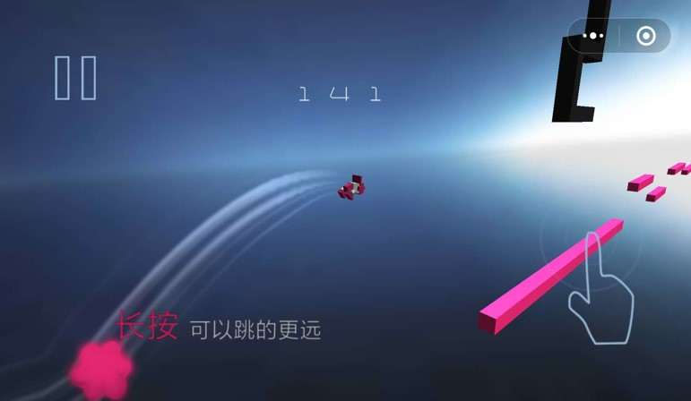
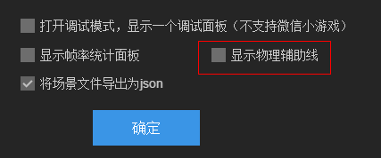

#2 D

を選択します。**コアライブラリ**

cachas=normalを解決する時文字のはっきりしない問題をスケーリングして、および文字の関連している最適化

Sceneを修復して、Spriteのdestroyは誤報するかもしれない問題を解決します。

calLaterの遅延を調整します。

Loader解決自動判断ファイルタイプが正しくないかもしれない問題

Scenee Loaderはskファイルをプリロードする時に自動的にプリロードします。pngファイル

カラーフィルタが付いていない問題を解決します。

AudioSound破壊時にPool中のオブジェクトを破壊し、存在する可能性のある音が解放されない問題を解決します。

Stageは拡大縮小モードが正しくないかもしれない問題を解決します。

アニメーションは多動画解析が間違っているかもしれない問題を解決します。

を選択します。**UI庫**

ListとPanelはelastic Enbaled属性を増加し、輪ゴム効果を有効にします。

Dialog単体を修復した場合、動画が再生されていないときに再び開いてしまい、失敗したバグを開いてしまいます。

を選択します。**適応ライブラリ**

WeChatとBaiduの入力ボックスは正規の使用をサポートします。

3 dプロジェクトの資源を修復して特殊な情況の下で出す問題をロードします。

サウンドキャッシュスキームを変更

#3 D

を選択します。**3 Dエンジン**

カメラのrender関数はreplaccemenntTagパラメータを増加します。

ShaderフレームがSub Shader概念を増加する。

プログラムを追加して空の素材にします。

アニメーションメモリの占有を最適化

物理コンポーネントをTransformで更新する変換機構を調整します。

カスタムShaderの設定パラメータを簡素化し、使いやすさを向上させる。

骨格のアニメーションの模型のファイルのサイズと現存の大きさを最適化します。

アニメイト動画では、倒順再生機能がサポートされています。

モデルファイル圧縮機能を追加

最適化camera layer関連インターフェース

Stt統計drawCallはRenderBatchです。

Primitive Mesh関連のサブクラスをMesh共通クラスに調整し、作成方式を静的工場式Primitive Mesh.createXX（）方法に変更し、グリッド類を簡素化する。

修正CharcterController廃棄バグ

いくつかのモデルの頂点フォーマットの読み込みエラーを修正します。

剛体部品のスケーリングを修復

物理的なイベントを修復し、物理的なコンポーネントを破壊すると、バグが崩壊する恐れがあります。

精霊を修復してcastShadowをセットしたら、崩壊する恐れがあります。

物理コンポーネントのクローンを修復した後、フリップフロップ属性エラーバグを修正します。

3 Dプリセットノードの破壊を修復した後、キャッシュノードBUGに再ロードする。

PixelLine Sprite 3 D修正maxLine Countがクラッシュする可能性があります。

アニメ融合バグを修正

カメラのズームを修復すると、異常なバグが表示されます。

を選択します。**3 Dユニティプラグイン**

会員口座管理ページの調整

法線のスタンプを修正してバグをエクスポートします。

Androidプラットフォームのテクスチャの圧縮速度を最適化する

LayaAirRun機能を最適化し、cmdウィンドウを削除します。

#IDE

を選択します。**機能を追加**

テクスチャ画像変換ツールを追加し、Androidとiosファイルのメモリサイズを大幅に減らす（vipサービス）。

新しいバージョンのnodejsリリースシステムに基づいて、自分でカスタマイズしてリリースすることができます。コマンドラインで実行することもできます。

シーンページ右ボタンで検索参照機能を追加します。

シーンのエクスポートキャッシュの最適化を追加し、ファイルが変わらない場合はエクスポートしないで、コンパイルの効率を向上させます。

クラスのファイルの変更を監督して、変更しないでコンパイルしないで、コンパイルの効率を高めます。

ブロックチェーン項目（ETH、NEO、HPB）を追加します。

#ベータ版日誌
###beta 1
​

一年間の準備を経て、ついに2.0のテスト版を迎えました。2.0からは、引き続き性能を重視する以外に、エンジンの機能が完備し、使いやすさ、拡張性などの面でさらに力を入れました。Nativeは3 D加速をサポートすると同時に、他の200以上の細部改良があります。その中の主な改善は以下の通りである。

#2 D

1.**物理システム内蔵**

LayaAir 1.0はMatterの物理エンジンをサポートしていますが、単純なサポートだけで、深い統合がなく、直感的に使うには不便です。小さいゲームの開放に従って、ますます多くのゲームは物理エンジンの支持を必要として、だから2.0から、私達はbox 2 dの物理のエンジンを内蔵して、物理の部品をカプセル化して、IDE物理の属性の可視化の編集を提供して、物理のゲームを作るのが更に便利ですばやいです。物理エンジンがMatterからbox 2 dに変更されたのは、Matterの精度があまり高くなく、サポートを浸透させないため、いくつかのタイプのゲームを作る時には意味不明な問題が発生します。

​

​

2.**コンポーネント化サポート**

1.0簡単なスクリプト拡張サポートを提供します。ユーザーがますます広くなるにつれて、需要はますます複雑になり、一般的な需要に拡大します。このニーズの体験を改善するために、コンポーネントスクリプトのサポートを追加しました。公式に提供されたデフォルトコンポーネントは、必要に応じられない場合、スクリプトの拡張によってコンポーネント機能を改善し、個性的なニーズを実現します。コンポーネント化は機能の抽象化、多重化、開発効率の向上にも役立つ。同時に、私たちはページベース継承の処理方式を保留しています。UIロジックを処理する時にとても便利です。

【ヒント】スクリプトはページ継承と比較して、ページレベルの論理であれば、頻繁にページ内の複数の要素にアクセスし、継承式の書き方を使います。独立した小さいモジュールであれば、機能が単一に多重され、シナリオで実現することを提案します。

より多くのコンポーネント化サポート文書の詳細は、https:/ldc 2.layabox.com/doc/？nav=zh-as-2-4-0

​

​

3.**シーン管理に基づいて**

2.0シーンベースの管理方式を提供しました。開発者はシーンに注目するだけの創意設計を提供しています。残りのシーンのロード、切り替え、資源のロード、図集の使用、資源の破壊など、エンジンはすべて完全な方案を提供しています。元々はメインコースでやるべきことがありました。今はエンジンも提供しています。開発コストを簡略化しました。。

​

​

4.**コンパイル調整可能**

2.0私たちはgulp自動化スクリプトを用いてコンパイルとテストプロセスを構築し、全体のコンパイルとデバッグプロセスは、シナリオタスクの方式で直列に接続できます。コンパイルとデバッグの間にカスタムの新しいプロセスを挿入したいならば、copy;圧縮など、gulpファイル内に新しいタスクを追加するだけでいいです。このようにして、プロジェクトごとにカスタマイズされ、インテリジェント化ができます。

同時にエンジンのデフォルトはrequireをサポートしています。このように大量の第三者のnodejsライブラリはエンジン内で直接使用できます。

同時にWeChatのデバッグ方式を改善しました。開発しながらデバッグできます。再リリース後デバッグする必要はありません。

後のバージョンは、リリースパネルもスクリプトを使ってカスタマイズして再構成されますので、個性的なニーズを発表しても大丈夫です。

   

​

5.**3 Dエディタ**

2.0からIDEは3 Dプロジェクト編集支援を追加し、IDEで3 Dシーン、材質、物理などの機能を編集できます。

現在はまだ改善中ですので、テストバージョンはまだ公開されていません。

​

​

6.**新規layacloudプロジェクト**

LayaCloudゲームサーバのクラスタは、急速な開発に基づいて複数人で対戦するゲームを設計し、高い信頼性と拡張を主な目標として構築し、サーバーの開発コストを簡略化する。詳細はhttps://wiki.cloud.layabox.com/を参照してください。

   

​

7.**新しいIDE**

2.0私達はIDE皮膚とレイアウトを新たに設計し、より簡潔で綺麗にし、同時に大量の機能を改善し、さらに使いやすさを高め、開発効率を高め、実際に使用する中で会議を行うことができます。

​

​

​

​

#3 D

1.**パフォーマンス**
周知のように、LayaAirはずっと性能で有名です。今回のLayaAir 3 D 2.0は機能、使いやすさに対して多くの強化と改善を行いました。性能は依然として大幅に向上しました。大規模な再構成アップグレードを行い，静的モデルと動的モデルの両方に対して，特に静的シーン性能を大幅に向上させた。同時により先進的な機構を採用して、JSとWebGLのローカルインターフェースの呼び出し回数を減らして、性能を向上させます。

2.**材質システム**
LayaAir 2.0は材質を多く改良し、向上させ、エンジンの中でより多くの公式材質及びより多くのカスタム材質に関する機能を提供しています。新たに追加された主要な公式材質はPBRSTANDARD Material、PBRSpecular Material及びUnilit Material材質などを含みます。PBRの材質はここ数年比較的に流行っている物理に基づいて材質を誇張して、更に科学的なsharerアルゴリズムを採用して更に真実な材質感を表現します。UnilitMaterialは、単純化された無光学素材で、技能効果などに使われています。加色法や透明混合によって、剛体アニメーションと結合することで、多くの特殊効果が得られます。カスタムShaderは主にマルチパス機能を追加しました。例えば、漫画のレンダリングに必要なエッジ効果を実現するなど、マルチパスはsharderにレンダリングされる時に何度もレンダリングされます。材質はrenderQueインターフェースを開放しています。レンダーqueueは精霊をレンダリングする時の並べ替えの根拠です。開発者はランダーQueの値を指定して材質が属する精霊のレンダリング順序を修正できます。

1）Shaderマルチパスレンダリングを追加する
2）ランダーQueを開放し、開発者はカスタマイズしてレンダリングすることができます。
3）Unilit Materialの材質を追加する
4）Effect素材の追加
5）PBRStandarMaterialの材質を追加します。
6）PBRSpecular Materialの材質を追加します。

 

3.**テクスチャシステム**
LayaAir 2.0はテクスチャ機能の向上と改良を行い、テクスチャの柔軟性と制御性を高めました。mipmapは、テクスチャフォーマット（例えば、R 8 G 8 B 8とR 8 G 8 B 8 A 8など）であり、wrapModeUおよびwrapModeVはテクスチャアドレスモードであり、filterModeはテクスチャフィルタモードであり、anisoLevelは、それぞれ異なる方向にフィルタリングされている。テクスチャアップロードのピクセルインターフェースを追加しました。開発者は自分でカスタムピクセルの色をアップロードしてテクスチャを作ることができます。GPUテクスチャ圧縮（Android、IOS）に対応し、具体的にはETC、PVRとして、現存占用を大幅に減らすことができ、ゲーム資源の総量を増やし、ゲームの品質を向上させる。

1）多種類のテクスチャパラメータ配置（mipmap、format、wrapModeV、filterMode、anisoLevel）を追加します。
2）テクスチャアップロードのピクセルインターフェースを追加する
3）GPUテクスチャ圧縮

4.**アニメーションシステム**
LayaAir 2.0はより完璧なアニメイトアニメーションシステムを備えており、より多くのアニメ属性をサポートし、アニメーションの移行と融合をサポートしており、動きがより自然に切り替わり、二つの一貫していない動作が切り替わる時にフラッシュカット現象が発生することを避ける。アニメイトでは、アニメのマルチメディアミックスをサポートしており、アニメの上下半身分離などの機能を実現し、各フロアで独自に骨格をコントロールできます。アニメイト動画はリアルタイム補間に調整され、メモリを大幅に削減し、同じフレームレートで動画の流暢さを向上させることができます。

1）アニメイトのアニメ融合機能crossFadeを追加
2）アニメマルチプレックスの追加
3）アニメーション更新メカニズムはリアルタイム補間に調整され、メモリと動画の流暢性表現を大幅に減少させます。
4）複数の材質属性アニメーションを追加

 

5.**物理システム**
LayaAir 1.0は物理機能が非常に乏しく、2.0は物理システムの再構成設計に重点を置いています。RigidBody、Physics Collider、CharracterControllerを含む様々な物理コンポーネントを追加し、開発者はプロジェクトのニーズに応じて異なる物理コンポーネントを選択することができる。複数のShapeを追加して、開発者は任意の1つまたは複数のShapeを追加して物理コンポーネントの輪郭説明を行うことができる。

1）剛体追加：RigidBody
2）衝突器の追加：Physics Collider
3）キャラクターコントローラの追加：CharcterController
4）衝突器の形状を追加する：BoxCollider Shape、Capule Collider Shape、CompundCollider Shape、ConneCollider Shape、Cylinder Collider Shape、スフィアCollider Shape、MeshCollider Shape
5）補助検査機能を追加する：sharpeCast、shapeCastAllなど

6.**精霊**
ドラッグ＆ドロップの効果を実現するために、三次元効果でよく使われているいくつかの精霊が、それぞれ粒子、Meshと剛体アニメーション、そして今回2.0で追加されたのです。同時に、ピクセルラインの精霊を追加して、ピクセルラインの枠を描きます。これは一般的にゲームや開発中のデバッグモードの中で有用です。

1）Trail Sprite 3 Dの追加
2）PixelLine Sprite 3 Dの追加

     

7.**スクリプトシステム**
LayaAir 2.0はエンジンの使いやすさの向上に非常に注目しています。スクリプトには衝突フィードバックの回転、三次元モデルのマウスのピックアップなどの多種類のコールバック関数が追加されています。具体的なonCollison XXは物理的な衝突時に触発され、衝突に入ることと衝突を維持することを含みます。

1）onCollisionEnter、onCollisionStay、onCollisionExit、onMouse Down、onMouse Drag、onMouse Click、onMouseUp、onMouseEnter、onMouseOver、onMouseOut衝突のコールバック関数を追加します。

8.**その他**
資源の放出に対して、LayaAir 1.0では開発者が頭を抱えています。LayaAir 2.0において、私達の公式はdestroyUniusedeResource（）を採用して、GCのリリースをシミュレーションしています。LayaAir 2.0は、光照射スタンプを最適化して表示しており、光照射スタンプは1.0より大きいHDR色表示効果をよりリアルに表示できるようにしています。

1）大量資源の解放機能を追加する。
2）HDR光照贴图フォーマットを追加する

その他の主要な改善：

##-再構築WebGL底部実現 重构HTMLDivElement实现，由原先的节点模式改为Graphic模式，减少节点创建，提高渲染性能

##-カラーフィルタは、輝度、コントラスト、彩度、色調の設定を増加させ、より便利に使用できます。Graphicsコマンドラインcmdの戻りを増加し、cmdコマンドの調整を容易にします。
##-GraphicsのdrawTexture関数は、カラーとbleandModeのサポートを追加します。GraphicsにdrawImageを追加し、簡易バージョンのdrawTextureを実現します。
##-Graphics drawTrianglesを追加し、頂点情報に基づいて三角形を描くことができます。LoaderはWorkder Loaderに対する支持を増加します。
##-スピリットのTexture実現を改善し、Textureレンダリング性能を向上させ、マルチユースを提案します。Spriteでboundsを取得する性能を最適化しました。
##-すべての色の値はAlphaチャネルのサポートを増加しました。ノードはoffAllCallerインターフェースを追加し、あるオブジェクトにあるすべてのイベントをキャンセルしやすく、利便性を向上させる。
##-UIコンポーネントの大部分を改善し、リソースの非同期ロードをサポートする。エンジンは大図集のサポートを抜き、利用者の理解コストとエンジンの複雑さを減らす。
##-IF-Flash関連コードをすべて取り除き、不要な分岐を減らし、コードのサイズを減らします。他の既知のバグを解決します。

IDE

##-物理システムのサポートを追加し、物理的な属性を視覚化して編集し、物理的なミニゲームをより簡単に作ることができます。コンポーネント化拡張サポートを追加し、すべてのノードがコンポーネント方式で拡張でき、個人化ニーズを迅速に実現する。
##-リソースサムネイルのプレビューパネルを追加し、管理リソースの位置を特定しやすくします。IDE可視化インターフェース構造を調整し、資源パネルとページパネルを融合させ、スクリプトと基本コンポーネントの展示を増やし、実用性を向上させる。
##-Prefab作成とサポートを追加し、コンポーネント多重化を容易にするプラグイン項目の作成を追加し、プラグインの拡張メカニズムを充実させ、IDEの拡張を容易にする。
##-デバッグ機能を改善し、ワンタッチでコンパイルデバッグをリリースし、運行機能を追加し、連結VSCDEデバッグをスキップして、直接chromeのデバッグを使用することができます。図や図セットの自動マッピングを追加し、図を読み込むと、自動的にセットがあるかどうかを判定します。あれば優先的にセットを使います。
##-シーン切り替えの調整を強化し、特定のシーンの調整を容易にする（例えば、現在開いているシーン）階層サポートは、ノードをダブルクリックして名前を変更し、ロケーションを容易にします。
##-視覚化編集ツールを強化します。回転ツール、シーン拡大ツール、ツールの配置などです。IDE起動速度を最適化し、より迅速に起動する。
##-最新のVsCodeをサポートし、より強力な機能を持ち、tsとjsにより友好的なサポートを提供します。最新のAS 3コードを使ってプラグインを提示して、AS 3言語の使用体験を改善します。
##-View Stock使用体験を改善しました。カスタマイズ可能なタスクフローを追加し、ユーザー定義の流れを便利にします。
##-属性のデフォルト値の表示を追加し、属性の表示をより直感的にする小道具の位置を改善し、界面要素を簡略化し、より簡潔にする。
##-時間軸増加関数コールサポートプロジェクトリストページを追加し、履歴項目の管理に便利です。
##-テンプレート保存ボタンを追加し、テンプレートとして保存しやすくします。ページ設定ボタンを追加
##-ゲームパラメータ設定、スタートシーン設定を追加します。デバッグとフレームレートスイッチを追加します。
-スクリプト選択制御を追加し、第三者スクリプトの使用を選択しやすくします。

###beta 2
​

2.0が発表したばかりなので、機能はまだ安定していません。バージョンの更新を加速して、毎週のバージョンの更新力を維持します。もし何か問題があったら、直ちにフィードバックしてください。

**物理エンジン**

物理エンジンをさらに充実させ、物理補助線の設置を増やし、インターフェースを増やし、注釈を完備させる。

`IDE内通过项目设置面板（快捷键F9），可以打开物理辅助线，代码中可以通过PhysicsDebugDraw.enable()打开`

物理エンジン調整

-物理補助線を完備し、物理補助線のwebglレンダリングを実現し、オープンスイッチを追加する。

-RigidBodyのlineaVelocity属性をobjectタイプに変更します。

-RigidBodyはgetWorld Centerインターフェースを増加して、剛体の中心点を獲得しやすいです。

-Phiysics類は剛体数、関節数、衝突数を増加してインターフェースを獲得します。

-衝突イベント追加衝突点情報取得方法

-関連する物理類の注釈を改善し、詳細な説明を追加する。

**ゲーム表現を完璧にする**

-WeChatはsceneファイルのアップロードをサポートしていませんので、エンジンの増加に適しています。sceneの拡張子をロードするシーンを、同じ名前のjsonファイルをロードするように変更します。ゲームコードはそのまま維持しています。その後、WeChatはsceneの拡張機能をサポートしてから、スイッチをオフにします。

-IDEブートスイッチは、シーンなどのファイルをJsonにエクスポートし、項目設定で開くことができます。

-微信小ゲーム内の、IOSで文字が表示されないバグを修正する。

**バグを修正**

-IDE内でデバッグできない問題を修正する

-リペア大図設定9宮格表示異常

-IDE内ショートカット異常を修復

-投稿機能異常の修復

-リソース属性の設定を修復したらすぐに更新されない問題があります。

-canvasモードを修復し、フィルタが正しくないことを表示します。

-webglでrgb a(r，g，b，a)rgb(r，g，b)タイプの色が間違っていることを修復する問題

-DRawCirl drawlineは、スケーリングがある場合は異常かもしれません。

**その他**

-API文書情報https://layaair.ldc.layabox.com/api 2/

-graphicsプロパティパネルにrendetype設定を追加します。

-サウンドリリース戦略を改善し、より合理的にする

-DRawCirl drawlineなどの適量のインターフェースを改善し、Webglで正常でない可能性がある問題を表示する。

**3 Dエンジン**

-CompundCollider Shape clearChild Shapeメソッドを追加します。

-精霊のスケーリングによるリギdbod3 D異常BUGの修正

-ShnnedMesh RendererのrootBone関連機構を調整し、無rootBoneは骨格ノード同期行列に関連しない。

-物理世界更新のタイミングを調整する

-物理的なShapeを修復するためにセンターオフセットがある場合、正常なバグが移動しません。

-WeChatの3 D初期化に失敗した問題を修正する

**3 Dユニティプラグイン**

-エクスポートリソースの速度を最適化する

-blinphong素材の頂点色を追加します。

-動画のエクスポート時のmotionのバグを修復する

-シーンファイルのリネームをバグ修正

-unityのデフォルト画像を使用してリソースをエクスポートするBUGを修復します。

-blinphong初切替のバグを修正する

###beta 3
#2 D

を選択します。**WeChatオープンドメインのデータ展示コンポーネントを追加します。**

WeChatオープンデータドメインの使用はずっと面倒です。特殊コードが必要です。そして、性能のボトルネックです。また、マウスのイベントがよく発生します。

LayaAir 2.0から、Laya公式はWeChatオープンドメインUIコンポーネントを提供しました。これらの問題を解決して、より簡単に使用できます。性能がもっと高いです。詳しくはhttp:/ldc 2.layabox.com/doc/nav=zh-as-5-7を確認してください。

  

​

を選択します。**LayaAirIDE 2.0 Macバージョンのリリース**

  

​

を選択します。**物理**

物理コンポーネントを最適化し、オブジェクトの作成オーバーヘッドを低減し、コメントを完全にする。

マウスの関節を改善し、制御点を設定することができます。設定しない場合は、マウスのクリック位置に応じて制御点とします。

マウスの関節を修復して何度もクリックして故障したバグを修正します。

​

を選択します。**コアライブラリ**

Loaderはsk、aniなどのファイルの拡張子の自動識別を増加します。

WeChatのミニゲームを修復して、特定のios 10.1.1バージョンの文字が表示できない不具合を修正しました。

音の読み込み中に正しく停止されない不具合を修正します。

Animation類のloadAnimationロジックエラーを修正します。

drawTonvasを調整しました。

粒子修正エラーを修正

​

#3 D

物理部品の破壊を修復

物理コンポーネントを修復して初期化したら、精霊の座標位置がバグにならないかもしれません。

collision GroupとcanCollideWithクラッシュBUGを修復します。

物理イベントの不具合を修正しました。

リソースバンドバージョンの読み込みエラーを修正します。

CompundCollider Shape.removeChild Shape（）を修復する方法BUG

リギdbody 3 D.clearForce方法崩壊バグを修正します。

Physics Colliderの位置を修復します。BUGを更新しないかもしれません。

**3 Dユニティプラグイン**

修復シーンファイルのエクスポートレベルが失われました。

頂点色を修復する機能

###ベスト4
今回の更新では、主に皆様からのフィードバックを修正しました。

#クラス

を選択します。**2 Dクラス**

Schene類open方法はparamパラメータを増加します。このパラメータは最終的にOpen方法に伝達されます。シーンを開けやすい時にパラメータを処理します。

Sceneクラスの増加は、単例のサポートで、ガイド内にあるシーンを一例として設定すると、このシーンを開くのはあくまでも一例です。

2.0バージョンを完成しました。QQはプラットフォームの相性がいいです。

Byte類追加readArayBuffer方法

無料のゲームフロー共有コンポーネントを追加します。

骨格を増やす動画はデータが取れない異常処理があります。

を選択します。**3 Dクラス**

Animartは精霊のactive属性サポートを追加します。

マウスイベントのバグを修復

物理コンポーネントのCollider Shapeが空の場合、バグを修正します。

2 D、3 D混合を修復すると、階層的なバグが発生する可能性があります。

リギdbody 3 DのラインアラVelocityとアングラルVelocityを設定すると、無効なバグが発生する可能性があります。

tranformのrotationEulerを修復してバグを取得しました。

Input 3 D座標エラーを修正するバグ

修正モデルの合併バグ

#エディタ

を選択します。**LayaAirIDE**

リソースプレビューパネルにキーボードのショートカットの位置付けを追加します。

リソースツリーの右ボタンを使って、新規ディレクトリメニューを追加します。

時間軸パネルは、0フレーム目をどこかにドラッグすることができます。

デフォルトの属性が正しく保存されていない問題を修復します。

参考図の不具合を修正します。

ts varの異常な問題を修正します。

asプロジェクトの名前を修復します。runtimeは位置決めファイルをクリックできません。

UIViewのエクスポートが間違っている問題を修正します。

プロジェクトパネルをドラッグしてフォルダを修復します。正常に更新されていない問題です。

を選択します。**3 Dユニティプラグイン**

UnityのLaya Shaderの出力色の価値範囲を調整します。

精霊のactive属性を修復してバグをエクスポートします。

Auto Generateにチェックを付けて光をエクスポートし、誤ったバグを報告する（使用エラー警告を破棄する）

MeshColliderのエクスポートエラーを修正します。

###beta 5
#2 D

を選択します。**コアライブラリ**

  **Baiduの子供向けゲームを追加して、LayaAirエンジンはシームレスにBaiduのスマートゲームにリリースできます。**

  **【互換性のない調整】**Sceneクラスopen方法paramパラメータとcompletteeパラメータの順序を調整します。**ここは調整に対応していません。completteパラメータを使うなら、順番を調整してください。**

Sceneクラスはprogressフィードバックを増加し、シーンローディング進捗情報を入手しやすくなります。

Scieneはloadingページ設定を追加し、set LoadingPage方法でロードページを設定し、シーン切り替え時にloadingページを表示し、loadingページは現在のシーンのprogressイベントを自動的に受信する。

Sceneはshow LoadingPageとhideLoadingPageを増加して手動でloadingページを制御して表示します。

Scheneのclose方法はtype属性を増加して、閉じる原因を知ることができます。

Sprite loadImage方法はurlを増加して空の保護になります。

文字の大きすぎる崩壊問題を解決します。

EventDisplatch offAllCallerの失効を解決するbug

sleepモードでtime更新を正しく実行していない不具合を解決しました。

マスター関連のバグを解決します

cachas=normalを解決して異常な問題を表示します。

Text paddingが間違っている問題を解決します。

文字スタンプの再利用による文字の乱れを解消するバグ

を選択します。**UI庫**

UIライブラリは皮膚のコンポーネントを動的にロードし、リゾーゼイベントの配布を完了しました。

PanelネストVoxを解決すると、デッドサイクルの問題を引き起こす可能性があります。

dialogカバーが外れていない不具合を解決します。

を選択します。**骨格ギャラリー**

BoneSlotの肌交換は正常ではない場合があります。

#3 D

を選択します。**3 Dエンジン**

Rigidbody 3 Dモジュールは、睡眠状態の属性isSleepingを追加しますか？

Rigidbody 3 Dコンポーネントは、sleep LinerVelocityとsleep AnglarVelocityのプロパティを追加します。

物理コンポーネントのactivateを除去する方法で、Rigidbod3 DコンポーネントwakeUpを追加します。

Trail Sprite 3 D精霊を再構築し、いくつかのバグを修復します。詳細はAPIを参照してください。

PixelLine Sprite 3 D精霊を再構築し、使いやすさを向上させ、APIを参照してください。

Vector 3 SetValueメソッドを追加します。

TrailRender Trans formZモードを追加しました。

アニメイトの動画を修復すると、バグが流れる可能性があります。

精霊Activeがfalseである場合、物理コンポーネントは依然としてBUGを有効にします。

粒子RotationOverLifeTimeモジュールBUGを修復し、3 Dモード関連機能を充実させる。

粒子の並べ替えを修復

を選択します。**3 Dユニティプラグイン**
アニメイトモジュールのエクスポートを修復し、重複や余分な掛りがひどいバグを修正します。

プラグインのエクスポート性能を最適化

#IDE

を選択します。**機能を追加**

  **Baiduのゲームのリリース機能を追加します。**

同じタイプのノードを追加して、このタイプのより多くの属性機能を表示します。

styleファイル（リソースのデフォルト属性）の変化検出機能を追加します。styleが変化しているとIDEが自動的に更新を提示します。効果の表示が間違っていることを防ぐために効果的です。

九宮格設定画面の入力枠tab切替機能を追加しました。

を選択します。**バグを修正**

コードのエクスポートキャッシュが間違っている問題を解決します。

プレビューパネルが正常に選択されていない問題を解決します。

パネルを最後までドラッグして問題を解決します。

階層パネルを他のノードにドラッグすると、異常な問題が選択されます。

画像キャッシュが更新されていない問題を解決します。

Scriptをドラッグしてシーンにエラーを報告する問題を解決します。

ハイビジョンのドラッグが正しくない問題を解決します。

###beta 5.1
###IDE **機能を追加**

新規スクリプトファイルのサポート
LayaCloudは正式な環境に展開し、管理センター機能を開く。

  **ショートカットを変更:**

Ctrl+Pページを開く

Ctrl+Shift+Pページ設定