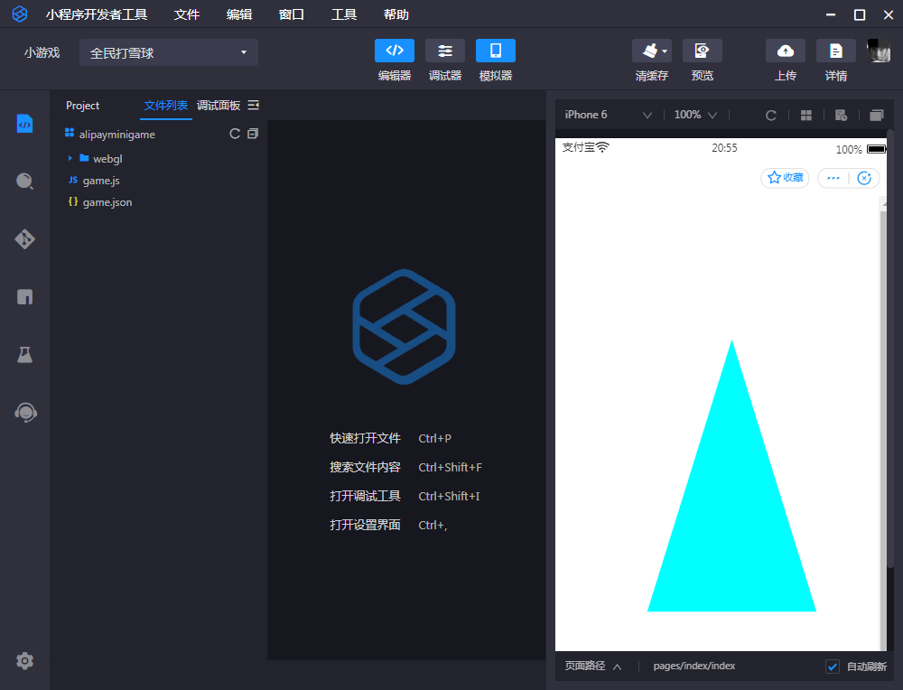

#最初のアリーゲームを作成します。

###一、開発環境を整える

####1、LayaAirIDE統合開発環境をダウンロードしてインストールする

LayaAirIDEはLayaAirエンジンの集積開発環境であり、LayaAirエンジンとサンプルプロジェクト、UI、アニメーションなどの可視化編集、プロジェクトコードの作成と管理などの開発ツールを集積しています。**beta 5以降の開発者は直接LayaAirIDEを使ってアリーのミニゲームプロジェクトを作成し、リリースすることができます。**

**公式サイトのダウンロード**ここはアドレス書きのダウンロードアドレスです。

####2、アリ開発者ツールをダウンロードしてインストールする

アリ開発者ツールは主にミニゲームのプレビューとデバッグ、実機テスト、アップロード提出などに使います。ミニゲーム開発に必要なツールです。

**開発ツールのダウンロード先**:
[まだ開放されていません。提携は私達のビジネスと連絡して取得できます。]

####3、開発者ID（AppID）を取得する

アプリIDがなくてもデバッグは開発できますが、機能は制限されます。

開発者IDはまだ登録されていません。もし必要があれば、私達のビジネス協力に連絡してください。

#同前

###二、LayaAirIDEでアリのミニゲームプロジェクトを作成して発表します。

####1、LayaAirIDEでアリのミニゲームの例を発表します。

2.0はもう適当な操作をする必要はありません。リリース時にAlipay（アリ）のミニゲームを選択すればいいです。

ファイルの抽出が重要です。アリのミニゲーム4 Mパッケージのアップロード制限のためです。ファイル抽出機能により、指定されたアリゲームプロジェクトディレクトリに4 Mパッケージのファイルのみをコピーすることができます。この機能はWeChatゲームと一致します。下図のように。

>パッケージ制限は、8 Mまで可能です。関連内容は他のドキュメントで紹介されています。この記事は初心者向けの、簡単なゲームリリースの流れを把握しています。

 

（図：ファイル抽出機能は、クリックして閲覧した後、フィルタでチェックした4 Mパッケージファイルのみをコピーすることができます）

**Tips**:

>リリースプラットフォームの右側の疑問符アイコンをクリックすると、各オプションの詳細な説明が表示されます。

リリースに必要な内容を設定してから。最終クリックでリリースします。アリのミニゲームプロジェクトが生成できます。

###三、アリ開発者ツールでミニゲームプロジェクトを作成する

####1、作成項目

「アリ開発者ツール」を開き、ポップアップパネルで左側のプラス記号をクリックして作成します。

 

  

`项目目录`抽出機能でコピーしたばかりのローカルパッケージを選択した方がいいです。この機能についてはまだ詳しくないです。流れを走るためだけに、LayaAirIDEがリリースしたばかりのゲームのカタログを一時的に選択することもできます。

`AppID`アリのミニゲームのアプリを入力すればいいです。入力しなくてもデバッグを開発してミニゲームをクリックすることができますが、機能が制限されます。だからAppIDを入力したほうがいいです。

####3、アリ開発者ツールのコンパイル

ゲームアイテムの作成が完了したら、ツール内で効果とデバッグをプレビューできます。

 

