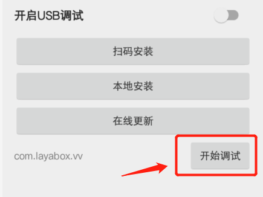

#vivoミニゲームのリリースとデバッグガイド

>udate：2019-07-01
>
>vivoミニゲームのリリースはLayaAirIDEを使用しなければなりません。IDEのダウンロード使用については、関連文書を確認してください。本編の紹介の範囲内ではありません。

##1、vivoミニゲームのリリース、デバッグ環境準備

1、vivoブランドの携帯電話

2、vivoをインストールするデバッグアプリをダウンロードし、ページをダウンロードする：[https://minigame.vivo.com.cn/documents/](https://minigame.vivo.com.cn/documents/#/download/debugger)#[/download/debugger](https://minigame.vivo.com.cn/documents/#/download/debugger)

ページに入ったら、すぐにダウンロードして、インストールをダウンロードできます。vivoデバッグアプリのインストール方法については、ここでは紹介しません。

3、ビデオゲームのエンジンをダウンロードする

現在**デバッグアプリ**内蔵されているvivoエンジンのバージョンは1034です。このバージョンは既知のバグがあります。私たちはvivoミニゲーム公式サイトに最新バージョンのミニゲームエンジンappkをダウンロードしなければなりません。

ダウンロードページ:

https://minigame.vivo.com.cn/documents/#//download/engine

現在の推奨バージョンは1041です。インストールをダウンロードした後、私たちはvivoアプリのデバッタのプラットフォームバージョン番号を見ることができます。そこに表示されている1041もあります。

4、PCのchromeブラウザと携帯電話のデータ接続線。

5、nodejs環境をインストールする[node官网：[https://nodejs.org/en/](https://nodejs.org/en/)」

インストールをダウンロードするということです。簡単です。詳しく紹介してくれません。コマンドラインでnpmコマンドをセットできたら成功です。

6、LayaAirIDE集中開発環境、LayaAir IDE 2.1.1 betaまたは以上のバージョン[ 官网下载: [https://ldc2.layabox.com/layadownload/?type=layaairide](https://ldc2.layabox.com/layadownload/?type=layaairide)」

7、ADBの取り付け

ADBは授権や配信などに利用でき、ADBの公式サイトにダウンロードしてインストールすることができます。


 [ ADB官网下载:  [http://adbshell.com/downloads](http://adbshell.com/downloads)」

>ADB Kitsをダウンロードし、ダウンロードした後の圧縮パッケージは、一つの経路の簡単なディレクトリに展開することを提案します。`D:\adb`を選択します。環境変数を追加することを覚えてください。
>

##2、vivoミニゲームのリリースとアクセスの完全な流れ

###1、vivoミニゲームパッケージ（X.rpk）をリリースする。

LayaAirIDEのリリース機能には、vivoミニゲームのリリース機能が内蔵されています。まずLayaAirエンジンの項目をリリース機能により.rpk拡張パッケージにします。リリース機能の使用について。ここでは重複しないように紹介します。いいえ、公式文書で確認できます。

リンク:[https://ldc2.layabox.com/doc/?nav=zh-ts-3-0-6](https://ldc2.layabox.com/doc/?nav=zh-ts-3-0-6)

###2、保留して二次元コードインターフェースをリリースします。

リリースが完了すると、図1に示すように二次元コードの画面があります。このインターフェイスは消さないでください。後ろの携帯はコードスキャンをして使います。

 


（図1）

###3、chromeデバッグ環境を起動する

####3.1クイックアプリケーションにインストールして、デバッタに入る

パソコンPCのchromeデバッグ環境を起動するには、まずvivoミニゲームのデバッグアプリ（クイックアプリデバッグ）をインストールして、図3に示すようにします。をクリックして入力します。

 


（図3）

####3.2クイックアプリケーションのインタフェースでコードをスキャンしてvivoミニゲームのrpkパッケージをインストールする

クイックアプリケーションのコーディネーターに入ると、図4に示すようなAPP操作インターフェースが見られます。

  


（図4）

この時、図4のスキャンコードのインストールをクリックして、LayaAir IDEの画面上の二次元コードをスキャンします。携帯電話は本物の環境で運行できます。

>ここで提示したいのは、携帯電話のネットワークはPCと同じローカルエリアのネットワークセグメントであることです。

配布カタログ下/distディレクトリ内のrpkバッグを携帯電話に送れば、ポイントを通過します。`本地安装`ボタンを押してインストールしてもいいです。しかし、スイープコードのインストールは、スイープコードのステップがより速くて便利です。

####3.3物理回線接続及び授権を保持する

経験のある開発者に対しては、USBケーブルの物理回線が接続されていることを確認し、USBデバッグのライセンスも大丈夫です。このステップをスキップすることができます。

#####関連操作は以下の通りです。

1、まず携帯電話の接続線で携帯電話とPCを物理的に接続します。

2、前に開いたコマンドラインの下で、adb shellを入力して、図5-1に示すようにします。USBデバッグモードの承認が得られていません。

 


（図5-1）

この時、私達は携帯端末に注目して、図5-2に示すようなヒントがあるかどうか、もしあれば、USBのデバッグを許可することを確定します。

 


（図5-2）

3、授権を再確認する。

USBデバッグモードのライセンスが成功したら、再度adb shellを入力します。図5-3に示すように。

 


（図5-3）

つまり、この段階では、PCはこの携帯機器をデバッグする権限があることを保障します。

####3.4スタートchromeデバッグ環境

前にコードをスキャンしてインストールすると、インストールされたばかりのゲームやDEMOに自動的に入ります。

デバッグを開始するには、まずキャンセルします。

次に、図6に示すように、クリックします。**デバッグを開始します**を選択して、vivoミニゲームのデバッグモードに入ります。

 


（図6）

真機はデバッグモードに入ったら、またPCでchromeブラウザを開きます。

この時忘れないでください。USBケーブルを接続して、携帯電話の設備とPCを接続します。権限の問題はすでに言っています。もう繰り返しません。

私たちは携帯端末で携帯のIPを調べて彼を覚えます。注意しなければならないのは、携帯電話網とPC網はずっと同じローカルエリアのネットワークを維持していることです。

chromeブラウザの入力欄に入力します。


```

chrome-devtools://devtools/bundled/inspector.html?v8only=true&ws={IP}:5086/00010002-0003-4004-8005-000600070008
```


{IP}を携帯電話のIPアドレスに置き換えればいいです。図7に示すように。

（図7）


これでvivoミニゲームのリリースからスタートまでのchromeデバッグまでの完全な流れが紹介されました。もっと多くのvivoミニゲームのアクセスフローとドキュメント紹介を知りたいなら、このURLを覚えてください。

https://minigame.vivo.com.cn


##この文章は賞賛します

本論文があなたのために役立つと思ったら、スキャンコードの作者への賞賛を歓迎します。激励は私たちがより多くの優れた文書を書くための動力です。


