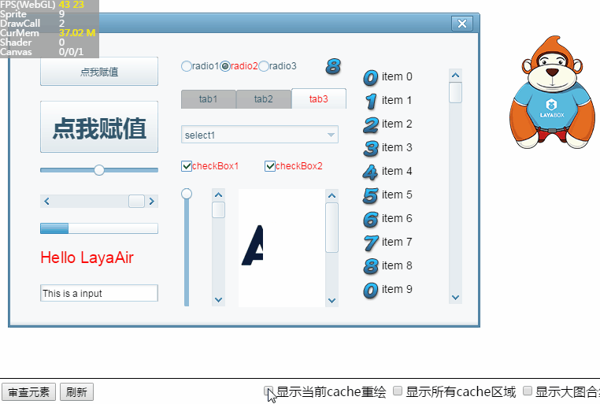

#Layair Debugpanel 도구

###1, Debugpanel 디버그 패널 사용하기

Debugpanel 디버그 판넬은 Div 에 기반된 디버그 창입니다. 편집 모드에서 F9 를 누르면 패널 설정을 엽니다.


디버깅 패널만 켜면 됩니다.(주의, 이 방법으로 강추!차다

코드 모드에서 디버그 패널을 시작할게요.`Laya.enableDebugPanel();`무대 초기화 방법`Laya.enable()`다음의 임의코드 중 사용을 늘립니다. 예를 들어 다음 코드 표시:

입구 종류 Main.as


```java

package
{
	import laya.debug.DebugPanel;
	import laya.display.Sprite;
	
	public class Main
	{
		public function Main()
		{
			//初始化舞台
			Laya.init(1334,750);    
			//调用DebugPanel调试面板
			Laya.enableDebugPanel();
			//设置舞台背景色
			Laya.stage.bgColor  = "#ffffff";
			
			var Img:Sprite = new Sprite(); 			 
			//添加到舞台
			Laya.stage.addChild(Img);   
			Img.loadImage("res/img/monkey1.png",200); 	
		}
	}
}
```


실행 효과

< br / > (그림 1)


###2. 대상 노드 트리 새로 고침

기본 상태 아래, 대상 노드 트리 중`DebugInfoLayer`노드, 노드 개발자는 상관하지 않는다.제품 페이지 의 대상 노드 를 새로 고쳐야 나타날 수 있고 클릭`调试面板`위의`刷新`단추를 누르면 페이지의 모든 노드 트리 구조가 나타납니다.동도 2 개처럼.

< br / > (동영상 2)


###3. 노드 대상 속성 보기

노드 나무의 노드를 누르면 오른쪽 측에서 선택한 노드 대상 속성을 볼 수 있습니다.

< br / > (그림 3)

**Tips**디버깅 패널의 노드 대상 속성치를 살펴보면 문제의 판단과 디버깅을 가속시킬 수 있다.


###4. 페이지 원소 심사

노드 나무에서 노드 대상을 클릭하여 속성 밖을 살펴본다.클릭을 통해서.`审查元素`단추를 누르고 페이지의 목표 내용을 누르면 디버깅 패널의 오른쪽 영역에서 이 노드를 직접 볼 수 있는 대상 속성을 찾을 수 있습니다.효과는 동도 4소와 같다.

< br / > (동영상 4)


###5, 디버그 패널 속 노드 대상 속성 수정

매번 디버깅 때마다 코드에서 수정을 피하기 위해 다시 실행하는 복잡한 디버그 프로세스를 편역한다.Debugpanel 디버그 패널에서 속성값을 직접 수정할 수 있습니다.그리고 속성 값 입력 상자를 이출하면 수정 효과를 볼 수 있습니다.조작과 효과는 동도 5개와 같다.

< br / > (동영상 5)


###6, 노드 제어

디버그 패널에서 노드를 선택하면 통과할 수 있다**취소**노드`可见勾选状态`노드**페이지 중 볼 수 없음**.다시 클릭`勾选`효과는 동도 6 개처럼 다시 나타난다.

< br / > (동영상 6)


###7, 노드 레드 테두리 표시 제어

디버깅 패널`可见`제어의 오른쪽은`显示边框`제어, 선택 후, 이 노드 페이지 중**빨간 테두리**높고 밝다.효과가 7 시에 제시한 것과 같다.

< br / > (7)

**Tips**：*노드 cacheAs 속성 설정이 활성화되면 테두리를 표시해도 빨간색 테두리를 표시하지 않습니다.*


###8, 노드 대상을 콘솔으로 인쇄

Debugpanel 디버그 패널 클릭`打印到控制台`단추를 누르면 선택한 노드 대상을 브라우저 콘솔에 출력할 수 있습니다. (* Console *) 을 제어 콘솔에서 더 디버깅하기 편리합니다.효과는 8 시에 보여 준다.

< br / > (그림 8)


###9. 콘솔에서 enable 사슬과 size 사슬을 보기

enable 체인과 size 체인 버튼을 통해 노드 대상의 enable 관련 속성 또는 size 관련 속성 수출을 컨트롤 콘솔으로 할 수 있습니다.그림 9시.

< br / > (그림 9)


###10, 디스플레이 및 그림 전환

webgl 모드에서 성능 최적화`512*512`자원 엔진은 자동으로 큰 그림과 텍스트 정보를 합병할 수 있다.Layaiair 엔진의 기본적인 상한은 여섯 개의 큰 그림이 합쳐져 있는 크기와 내용을 살펴보면 적정적인 최적화를 할 수 있다.

고르다`显示大图合集`그 후, 현재 의 큰 그림 합집 을 볼 수 있고, 왼쪽 에서 분해 가 붉은색 이 나타날 수 있다`图集当前数/图集总数`모두 두 개의 수치이다.선택 을 취소하고 다시 선택하면 된다`切换`다음 큰 그림으로 합류하다.동도 10개와 같이.

< br / > (동영상 10)

**Tips**：

그림 합성 기능은 WebGL 모드에 제한되어 있으며, Canvas 모드에서 이 기능이 없습니다.

하나의 큰 그림이 모아진 총폭 이 높다`2048*2048`.


###11, 현재 cache 재생 영역과 모든 cache 영역 보이기

cache 를 설치하면 성능을 최적화할 수 있지만 cache가 설치되지 않으면 성능을 낮출 수 있다.예를 들어 cache 영역이 자주 재생될 때 성능을 낮출 수 있습니다.

통과하다`显示当前cache重绘`과`显示所有cache区域`cache 의 상태를 통계할 수 있다.

**그린 현재 cache 구역**지역 색 상자는 3초 동안 머물게 됩니다.효과는 동도 11개와 같다.

< br / > (동영상 11)


**모든 cache 영역은 보라색 테두리**지역 색 상자 표시 후 바로 사라지고 마지막 cache 영역에 머물렀습니다.효과는 동도 12소와 같다.

< br / > (동영상 12)


 

