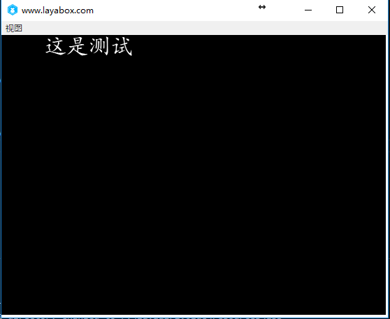
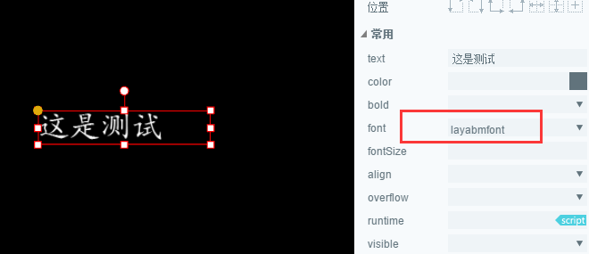

#비디오 글꼴 제작 및 사용


Starling 또는 Cococos, 심지어 유니티의 글꼴은 분명 낯설지 않고 간단한 그림을 넣고 사용자 정의 텍스트를 넣으면 항목에서 보기 좋은 텍스트를 표시할 수 있다.레이어에서도 비디오 글꼴 사용과 디스플레이를 지원합니다.다음은 비디오 글꼴 레이어에서 사용하는 효과입니다.


 


###비디오 글꼴 만들기

1. 내보내는 텍스트를 txt 글에 쓴다.
​

2. 파일 선택-> 유니코드 인코딩으로 다른 이름으로 저장된 txt 파일입니다.
​

3. windows 아래 무료 비디오 글꼴 제작 도구 Bitmap Font Generator 다운로드.
다운로드 주소:[http://www.angelcode.com/products/bmfont/](http://www.angelcode.com/products/bmfont/install_bmfont_1.13.exe)

4. 소프트웨어를 켜고 Opotion-> FontSetting, 내보내야 할 글꼴의 일반 설정을 설정하고 오케이 단추를 누르십시오.

        

**중요 인자 설명:**

Font: 내보내는 비디오 글꼴입니다.
Size: 내보내는 비디오 글꼴 크기를 설정합니다.사용할 때 얼마나 큰 글자가 필요한지 여기에 같은 크기의 글자를 설정할 것을 건의합니다.
Height: 글꼴의 스트레칭 높이를 설정하고 기본 100% 유지하면 됩니다.
​*주의: Charset 값은 유니코드를 선택합니다.*

​

5. 메뉴 표시줄 Edit-> Select chars from file, 방금 만든 txt 파일을 선택합니다. 힌트를 사용하지 않으면 txt 파일은 유니코드 파일과 글꼴이 포함된 글꼴을 체크하십시오.

​

6. 내보내기 스타일을 설정하고 메뉴 표시줄의 Options - > Export Options, Export Options 설정 내보내기 옵션 설정을 완료하고 오케이 단추를 누르십시오.

Padding: 텍스트 안에 테두리나 문자의 주변에 비워두면 얼마나 큽니까.후기 스타일을 할 때 이 속성은 매우 중요합니다. 테두리, 발광 등 특효로 사용해야 합니다.예를 들어 2px 테두리를 추가하고 오른쪽 아래쪽 2px 투샷을 추가해 패ding: 2px 4px 2px 2px 2px 2px 2px
Bit depth: 32명, 그렇지 않으면 투명층이 없다.
Presets: 글꼴 초기화된 색상 채널 설정, 즉 글꼴 초기 색상 설정이 어떤 것인지, 화이트 글자를 사용하면 화이트 글자로 직접 설정할 수 있습니다.
Font descriptor: 글꼴 설명 파일, xml 선택
Textures: 텍스처 그림 형식, png 선택


​        
7. 비디오 글꼴 내보내기.메뉴 표시줄의 Options - > Save bitmap font as..., 글꼴 묘사 파일 (.


 


###레이어 항목에서 비디오 글꼴 사용

1. 프로젝트의 출력 목록에 자원을 넣어라.
내보내는 비디오 파일을 동일한 이름으로 변경한 다음 레이레이레이어 프로젝트의 Bin 디렉토리에 저장합니다.

​

그림: testu 0.png 이름을 test.png 으로 바꾸어 fnt 파일과 동명이라고 보증합니다.test.png 과 test.fnt 파일을 bin 디렉터리에 올려놓겠습니다.


 


**비디오 글꼴이 Layair 항목에서 일반적인 사용 방법:**

1. 비디오 글꼴 개체 생성.

2. 비트맵 글꼴을 탑재해 완성 여부를 탐색한다.

3. 비디오 글꼴 등록.

4. 글꼴 사용.

다음은 완전한 예례가 실행되는 효과가 있다.



완전한 코드 다음과 같습니다:


 


```java

package
{
    import laya.display.Stage;
    import laya.display.Text;
    import laya.resource.Texture;
    import laya.utils.Handler;
    import laya.display.BitmapFont;
    public class TestBitmapFont
    {
        //自定义文件名称
        private var mFontName:String = "diyFont";
        private var mBitmapFont:BitmapFont;
        public function TestBitmapFont()
        {
            Laya.init(550, 400);
            mBitmapFont = new BitmapFont();
            //这里不需要扩展名，外部保证fnt与png文件同名
            mBitmapFont.loadFont("layabmfont.fnt",new Handler(this,onLoaded));
        }
        private function onLoaded():void
        {
            init();
        }
        private function init():void
        { 
            //如果位图字体中，没放空格，最好设置一个空格宽度
            mBitmapFont.setSpaceWidth(10);
            Text.registerBitmapFont(mFontName, mBitmapFont);
            var txt:Text = new Text();
            txt.text = "这是测试";
            //设置宽度，高度自动匹配
            txt.width = 250;
            //自动换行
            txt.wordWrap = true;
            txt.align = "center";
            //使用我们注册的字体
            txt.font = this.mFontName;
            txt.fontSize = 50;
            txt.leading = 5;
            Laya.stage.addChild(txt);
        }
    }
}
```


 


### **Text 종류 관련 인터페이스:**


 **regiter Bitmapfont() 방법**  

public stattic function regiterBitmapFont (name: Stmapfont: Bitmapfont: void

비디오 글꼴 등록.

인자

name: String — 비디오 글꼴의 이름입니다.
bitmapfont:Bitmapfont — 비트맵 글꼴 파일입니다.


 


**unregiser Bitmapfont() 방법** 

public stattic function unregiserbitmapfont (name: String, destory: boolean = true: void

등록된 비디오 글꼴 파일을 삭제합니다.

인자

name: String — 비디오 글꼴의 이름입니다.
destory:boolean(default=true)—현재 글꼴 파일을 없애지 않았는지.


  


###BitmapFont 종류 관련 인터페이스:


 **loadFont() 방법** 

public function loadFont (path: String, complete: Handler):void

지정한 비트맵 글꼴 파일 경로를 통해 비트맵 글꼴 파일을 불러옵니다.

인자
path:String—비디오 글꼴 파일의 경로.
complete: Handler — 가재 완료된 반전을 알립니다. 상층 글꼴 파일은 이미 불러오기 및 해상을 알립니다.


 


**parseFont() 방법** 

public function parseFont (xml: XmlDom, texture: Texture: void

글꼴 파일을 분석하다.

인자

xml: XmlDom — 글꼴 파일 XML.
texture: Texture — 글꼴 텍스처.


 

 


**destory() 방법**

public function destory ():void

비트맵 글꼴을 없애고 Text.unregiser Bitmapont을 호출할 때 기본값으로 소각됩니다.


  


**setSpacewidth () 방법**

public function setSpacewidth (spaceWidth: Number):void

빈칸의 넓이를 설정합니다 (글꼴이 빈칸이 있으면 여기에는 설정할 수 있습니다.

인자

spacewidth:Number-너비 단위


 

  


###Layair IDE 에서 비디오 글꼴 사용하기

1. 글꼴 파일을 Layair IDE 프로젝트의 자원 디렉터리에서 (laya / asets /), 두 파일의 이름이 같을 경우 test.fnt, test.png, 이렇게 자동으로 test 의 비트맵 글꼴을 등록합니다.


2. 비트맵 글꼴의 텍스트 구성 요소를 설정하는 font 속성치를 편집기 위젯 글꼴의 이름으로 설정합니다.



3. 프로그램 코드에서 비디오 글꼴의 페이지를 실제 사용하기 전에 페이지를 생성하고 등록 페이지에 사용한 비디오 글꼴을 생성해야 합니다.


 