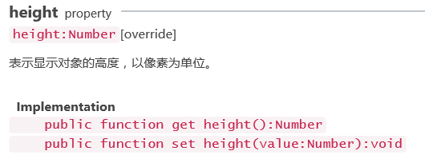

#텍스트 정렬 & 자동 줄 바꾸기

정렬 모드 방면에 관하여 일반적 수준 정렬과 수직 정렬 으로 우리 텍스트 영역 에 표시 할 수 있다.API 의 인자 설명을 먼저 파악하고, 예시 코드 를 통해 소개합니다.laya.display.text 텍스트 스타일에 대한 API 인자:

</br>>

</br>>

</br>>

</br>>

글꼴 스타일의 코드를 설정할 때 이 텍스트 영역에 텍스트 영역을 설정한 다음 텍스트 영역 수준과 수직 정렬을 설정합니다.텍스트 영역의 직접적인 텍스트를 설정하지 않는 수직 정렬과 수직 정렬은 효과가 없을 것이다.


```java

package
{
	import laya.display.Text;

	public class LayaSample
	{
		public function LayaSample()
		{
			//初始化引擎
			Laya.init(1136,640);
			
			var txt:Text = new Text();
			//设置文本内容
			txt.text = "hello_world";
			//设置文本区背景
			txt.bgColor = "#c30c30";
			//设置文本的宽高
			txt.width = 400;
			txt.height = 400;
			//设置文本水平居中
			txt.align = "center";
			//设置文本垂直居中
			txt.valign = "middle";
			Laya.stage.addChild(txt);
		}
	}
}
```


</br>>

실제 인코딩에서 다른 정렬 패턴이 필요하다면 API 안의 align 과 valign 의 값을 참고하여 프로젝트에 적합한 수준의 정렬 모드를 찾을 수 있습니다.

만약 텍스트 콘텐츠가 우리가 설치한 텍스트 영역을 초과하면 무대 내용을 표시하지 않을 것입니다. 이럴 때 우리는 자동으로 바꾸어 우리의 오래된 텍스트를 표시해야 합니다.

API 인자:

</br>>

위 코드 중 txt 의 텍스트를 많이 설정한 다음 자동으로 바꾸는 코드 추가합니다.

텍스트 영역의 넓이와 높게 설정해야 합니다. 아니면 문자가 기본 text 넓이에 따라 자동으로 연결됩니다.코드 다음과 같이:


```java

package
{
	import laya.display.Text;

	public class LayaSample
	{
		public function LayaSample()
		{
			//初始化引擎
			Laya.init(1136,640);
			
			var txt:Text = new Text();
			//设置文本内容
			txt.text = "Layabox是HTML5引擎技术提供商与优秀的游戏发行商，面向AS/JS/TS开发者提供HTML5开发技术方案！";
			//设置文本区背景
			txt.bgColor = "#c30c30";
			//设置文本的宽高
			txt.width = 400;
			txt.height = 400;
			//设置文本水平居中
			txt.align = "center";
			//设置文本垂直居中
			txt.valign = "middle";
			//设置自动换行
			txt.wordWrap = true;
			Laya.stage.addChild(txt);
		}
	}
}
```


</br>>

여기에서 우리가 설치한 자동으로 바꾼다는 것을 볼 수 있습니다. 모든 문자가 이 텍스트 영역에 표시되어 있습니다.