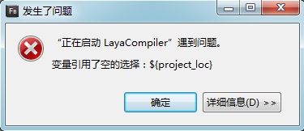

#초보 상시 문제: 설정 환경 이후 실행 오류, 흑 스크린 클릭


###하나, AS3 원생 인용으로 인한 오류

**현상:**

FB 에서 새 프로젝트에서 FB의 컴파일링 환경을 설정하고 환경설정 후 클릭 응용-실행보 오류, 그림 1의 제시:

​< br >>
(그림 1)

**원인:**

오류는 코드 중 원생 플래쉬 AS3 의 API 와 원생 AS3의 Sprite 를 도입해 발생한 것이다.Layaiair 엔진은 Flash A3언어의 기초 문법을 지원하지만 원생 ASAPI 인용과 상속은 지원하지 않는다.

​< br >>
(2)

**건의:**

1, 프로젝트 오른쪽 키 -> 구성 경로 -> flash 원생의 sdk 삭제.라이브러리 경로에서 Laya swc 파일, 원본 경로에서 Laya 엔진 라이브러리 파일을 인용했습니다.그림 3, 도 4, 도 5 개 시.

2, 개발할 때 레이야아 엔진 API 를 숙지하고, 레이아라 엔진을 사용하는 API 개발이 필요하다.

​< br >>
(그림 3) 기존 sdk 삭제

​< br >>
(도 4) 레이야아 엔진 라이브러리 압축 가방에 가져온 playerglobal.swc

​< br >>
(그림 5) 엔진 라이브러리 도입, 그림 중 경로는 참고로


###둘째, 문서 클래스 (기본 프로그램) 설정하지 않은 컴파일러 오류

**현상:**

​< br >>
(그림 6) 프로젝트 번역 시 오류 발생

**원인:**

편집할 때 그림 6의 오류가 발생할 때 문서류 (기본값 프로그램) 을 설치하지 않은 것이 틀림없다.

**해결 방안:**

​< br >>
(7) FlashBuilder 안에 입구를 기본 프로그램으로 설정해야 합니다

​< br >>
(그림 8) FlashDevelop 안에 입구 프로그램을 문서류로 설정해야 합니다

​< br >>
(그림 9) 레이어이더에서 asconfig.json 프로젝트에서 수정


###3, 여가 문자로 인한 컴파일러 오류

**현상:**

​< br >>
(그림 10)

그림 10의 오류가 발생한 후, 클릭 클릭, 브라우저 컨트롤 콘솔의 오류는 그림 11개처럼 보여 줍니다:

​< br >>
(도 11)

**원인:**

이런 오류가 발생한 대다수의 경우는 다른문자 등 문법 불법 문제로 인한 것이다.

**건의:**

FlashBuilder 로 AS3 버전을 개발하는 Layaiaiair 엔진 프로젝트를 추천합니다. FlashBuilder 에서 자동문법 검사 기능이 성숙해지면 일부 부주의하지 않는 작은 실수로 오류가 발생하는 것을 피할 수 있습니다.


###넷, 선택되지 않은 프로그램 파일로 인한 컴파일링 오류

**현상:**

누르거나 단축키를 사용하면 그림 12의 신문이 발생합니다.

​< br >>
(그림 12)

**원인:**

마우스가 선택된 프로그램 파일이 없기 때문에 직접 번역을 실행하면 그림 12의 오류가 발생할 수 있습니다.

**해결 방안:**

유효한 프로그램 파일이나 폴더를 선택하여 다시 번역하면 됩니다.


###5, 다역으로 인한 흑 스크린 문제

**현상:**

프로젝트를 실행한 후 브라우저에 검은색 스크린 보이기, 컨트롤 데스크에서 그림 13개 보여 주기:


​        < br >>
(그림 13)


 


**원인:**
브라우저 기본값은 파일이 읽는 것을 허용하지 않습니다. 다역 문제입니다.

**해결 방안:**

1, 로컬 디버깅 해결:

chrome 브라우저 단축식 -> 오른쪽에서 속성 열기 -> 단축식 1란`--allow-file-access-frome-files`

2, 서버 webServer 해결:

webServer (일반적인 webserver 대부분은 apache, nginx, tomcat 등), 특정 도메인 이름에 도메인 마크를 더하면 nginx 를 예로:


```nginx

http {

  ......

  add_header Access-Control-Allow-Origin *;

  add_header Access-Control-Allow-Headers X-Requested-With;

  add_header Access-Control-Allow-Methods GET,POST,OPTIONS;

  ......

}

```


이렇게 되면 GET, POST, OPTIONS 의 크로스필드 요청의 지지를 실현할 수 있습니다.

괜찮다`add_header Access-Control-Allow-Origin http://www.layabox.com;`지정 허용 url;

3, 데이터 요청 다운로드라면 백엔드 어휘 수정이 필요합니다. 요청에 header 표시를 더하면 php 언어를 예로:

`header("Access-Control-Allow-Origin: *");`꼭 쓸모가 없다`*`,`*`모든 호스트 다역 방문을 허용하고 도메인 아래 호스트를 지정할 수 있습니다.
