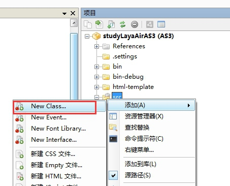

#FlashDevelop 첫 번째 프로그램 "Hello Layabox"

>>###이 글은 AS3 언어를 사용하여 FlashDevelop 환경에서 텍스트 Hello Layabox
> 본편을 다 배우고 리야아 엔진을 완성하기 위한 첫 번째 프로그램입니다.본편을 공부하기 전에 반드시 먼저 읽을 것을 보증합니다:**FlashDevelop 개발 환경 설정**
>>
><LayairierIDE 로 AS3 프로젝트를 만들고 디렉터리 구조를 상세히 해명하고 프로젝트를 세웠다면 첫 번째 단계를 뛰어넘을 수 있습니다.우리는 모두에게 LayairierIDE 건립 프로젝트를 채택할 것을 건의합니다.
>>


##FlashDevelop 새 프로젝트

​**절차 1**FlashDevelop 열기, 메뉴 표시줄에서 '항목' 을 찾아 '새 항목을 누르십시오.

​< br >>
그림 (1)

​**절차 2**AS3 Project '형식, 항목 이름 입력, 항목 이름 선택 위치 선택' 을 클릭 '새 프로젝트를 완성합니다.

​< br >>
그림 (2)


  


##2단계 설정 항목

###2.1 인용 엔진 라이브러리

**절차 1**프로젝트 패널에서 '프로젝트 속성' 단추를 누르고 항목 속성 설정 창 열기.

​< br >>
그림 (3)

​**절차 2**클릭: '종류 경로 추가하기' Layaia 엔진 디렉터리를 선택하면 '확정' 을 클릭하여 Layair 엔진의 인용을 완성합니다.

< br >>
그림 (4)


 


###2.2를 라이브러리에 추가하기

엔진을 다운로드할 때 엔진 패키지가 압축된 후 우리는 3개의 swc 파일을 볼 수 있으며, 각각 루트 디렉토리의'playerglobal.swc'와 레이아아일랜드 디렉터리에서 'Layair Flash.swc' (glslsl2agal.swc '.playerglobal.swc 는 개발 과정에서 Layair 엔진 API를 사용합니다.또 두 개의 swc 파일은 Flash 버전으로 사용된 것이다.Flash 버전을 발표하지 않는다면 "Layair Flash.swc" "glsl2agal.swc"도 라이브러리에 추가되지 않을 수 있다.

​**절차 1**새 프로젝트의 studyayaiarAAAS3에 libs 폴더를 추가합니다.

​< br >>
그림 (5)

​**절차 2**다운로드 해제 후 Layair 엔진 루트 디렉터리에'playerglobal.swc'는 마우스 지점에서 끌어당기는 방식을 사용하여 새로 만든 libs 폴더로 끌어당긴다.또는 붙여넣는 방식을 복사해서 libs 폴더에 붙여줍니다.그리고 오른쪽 단추를 누르면 swc 파일, 왼쪽 단추를 누르면 라이브러리에 추가합니다.

​< br >>
그림 (6)


 


##3단계 텍스트 표시 'Hello Layabox'

###3.1 새 파일 Hello Layabox

​**절차 1**오른쪽 키 'src 디렉토리' 새로운 종류를 추가합니다.(힌트: 추가된 파일은 src 디렉토리에 추가하거나, "종류 경로 추가하기" 로 인용됩니다. 그렇지 않으면 번역되지 않습니다)

​< br >>
그림 (7)

​**절차 2**클래스 이름 HelloLayabox

​< br >>
그림 (8)

###3.2 H5 페이지에'헬로 Layabox'를 표시합니다.

​**절차 1**HelloLayabox.as 를 문서류로 설정합니다.


​    < br >>
그림 (9)

​**절차 2**"Hello Layabox"의 텍스트를 무대에 추가하여 코드:


```java

package {
 import laya.display.Text;
  
 /** @author Charley */
  
 public class HelloLayabox {
  public function HelloLayabox() {
   //创建舞台，默认背景色是黑色的
   Laya.init(600, 300);
   var txt:Text = new Text();
    
   //设置文本内容
   txt.text = "Hello Layabox";
    
   //设置文本颜色为白色，默认颜色为黑色
   txt.color = '#ffffff';
    
   //将文本内容添加到舞台 
   Laya.stage.addChild(txt);
  }
 }
}
```


​**절차 3**코드 작성을 완료한 후, 기존 정의 컴파일 단축키 (Alt + F5) 를 A3코드를 HTML5 로 편집했습니다.


​    < br >>
그림 (10)

번역이 완료된 후 번역기가 자동으로 chrome 실행 결과를 표시합니다.

​< br >>
그림 (11)

​**순서**"Hello Layabox"가 보여졌지만 누추합니다. 다음은 "Hello Layabox"가 더 예뻐졌습니다. 코드가 다음과 같습니다:


```java

package {
 import laya.display.Text;
  
 /**
  * @author Charley
  */
 public class HelloLayabox {
  public function HelloLayabox() {
   //创建舞台
   Laya.init(600, 300);//舞台默认背景色是黑色的
   var txt:Text = new Text();
   txt.text = "Hello Layabox";
    
   //设置文本颜色
   txt.color = '#FF0000';
   //设置文本字体大小，单位是像素
   txt.fontSize = 66;
    
   //设置字体描边
   txt.stroke = 5;  //描边为5像素
   txt.strokeColor = '#FFFFFF';
    
   //设置为粗体
   txt.bold = true;
    
   //设置文本的显示起点位置X,Y
   txt.pos(60, 100);
    
   //设置舞台背景色
   Laya.stage.bgColor = '#23238E';
    
   //将文本内容添加到舞台
   Laya.stage.addChild(txt);
   
  }
 }
}
```


실행 결과는 다음 그림에 제시한 것과 같다:

​< br >>
그림 (12)


**이로써 당신이 본편의 입문 과정을 따라갈 수 있다면, 이 그림의 디스플레이를 완성할 수 있다면, Google은 AS3 언어로 개발한 HTML5 프로그램을 완성하였고, Layair의 개발 환경 설정이 틀림없다.더 많은 Layaiair 엔진이 개발한 API 사용 방법, 홈페이지 Layabox 개발자 센터가 온라인 API 와 온라인 DEME 를 살펴보세요.**
