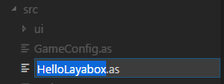

#LayairIDE 첫 번째 프로그램 "Hello Layabox"

>> AS3 언어를 사용하여 LayairIDE 환경에서 텍스트 Hello Layabox
>>
> 본편을 다 배우고 리야아 엔진을 완성하기 위한 첫 번째 프로그램입니다.본편을 공부하기 전에 반드시 먼저 읽을 것을 보증합니다:**《LayairierIDE 로 AS3 프로젝트 만들기 및 디렉터리 구조 》.**
>>

​


 **절차 1**LayairIDE AS3 프로젝트 열기, src 디렉토리 아래에서 '새 파일을 클릭', 그림 1개처럼 보여 줍니다.

​< br >>
그림 (1)


​**절차 2**Hello Loyabox.aas를 입력한 후 다시 차를 돌리면 Hellleyabox.as 의 as의 ast 파일을 생성할 수 있습니다.

​< br >>
그림 (2)


​**절차 3**Helloyabox.as 를 문서류로 설정합니다.FlashDevelop 프로젝트 파일 열기 클릭`“项目名.as3proj”`(여기는...`myLaya.as3proj`고치다`<compiletargets></compiletargets>`탭 내의 문서 번역 경로, 그림 3의 보여, 이 예를 들어 새로 지은 파일 HellleLayabox.as 의 경로, 구체적인 작업은 다음 그림에 표시된 것 같습니다.

​< br >>
그림 (3)


​**순서**하나`“Hello Layabox”`무대에 대한 텍스트가 추가되었습니다.HelleLayabox.as 추가 코드:
​< br >>
그림 (4)


**HellleLayabox.as 코드:**


```javascript

package 
{
    /**
     * ...
     * @author laya_Aaron(小明)
     */
    import laya.display.Text;
    public class HelloLayabox
    {
        public function HelloLayabox()
        {
            //创建舞台，默认背景色是黑色的
            Laya.init(600, 300);
            var txt:Text = new Text();
             
            //设置文本内容
            txt.text = "Hello Layabox";
             
            //设置文本颜色为白色，默认颜色为黑色
            txt.color = '#ffffff';
             
            //将文本内容添加到舞台 
            Laya.stage.addChild(txt);       
        }
    }
 
}

```


​

**단계 5**코드 작성을 완료한 후 F5 단축키 컴파일을 사용하여 실행한 결과 다음 그림에 표시됩니다:

​< br >>
그림 (5)


​**단계 6**그림에 제시한 것처럼`“Hello Layabox”`이미 드러났지만 좀 초라하니, 다음은 우리가 양보하자.`“Hello Layabox”`더 예뻐져서 코드 변경:

​< br >>
그림 (6)

**HellleLayabox.as 코드:**


```javascript

package 
{
    /**
     * ...
     * @author laya_Aaron(小明)
     */
    import laya.display.Text;
    public class HelloLayabox
    {
        public function HelloLayabox()
        {
            //创建舞台
            Laya.init(600, 300);//舞台默认背景色是黑色的
            var txt:Text = new Text();
            txt.text = "Hello Layabox";
             
            //设置文本颜色
            txt.color = '#FF0000';
            //设置文本字体大小，单位是像素
            txt.fontSize = 66;
             
            //设置字体描边
            txt.stroke = 5;  //描边为5像素
            txt.strokeColor = '#FFFFFF';
             
            //设置为粗体
            txt.bold = true;
             
            //设置文本的显示起点位置X,Y
            txt.pos(60, 100);
             
            //设置舞台背景色
            Laya.stage.bgColor = '#23238E';
             
            //将文本内容添加到舞台
            Laya.stage.addChild(txt);
        }
    }
 
}
```


​

실행 결과는 다음 그림에 제시한 것과 같다:

​< br >>
그림 (7)


이로써 본편의 입문 과정을 따라갈 수 있다면, 이 그림을 완성할 수 있는 디스플레이에 성공을 축하드립니다. 우리는 이미 LayairID에서 처음으로 AS3 언어로 개발한 HTML5 프로그램을 완성하였고, Layaiair의 개발 환경 설정에 틀림이 없습니다.더 많은 Layair 엔진이 개발한 API 사용 방법, 홈페이지 Layabox 개발자 센터가 온라인 API 와 온라인 DEME

