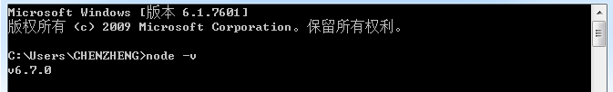

#도문 혼식 채팅 룸의 WebSocket 서버

Layaiair 엔진은 디자인의 초반에 주로 게임의 클라이언트 개발에 사용되지만, 노dejs 성행에 따라 Layair가 번역하는 최종 파일을 js 언어로 합니다.그럼 Layair로 지원하는 AS, TS 언어 개발 서버도 좋은 선택입니다. 클라이언트 프로그램도 앞뒤 동시에 개발할 수 있습니다!전체 창고 엔지니어가 되다.또한 ES5 가 과정을 향한 그런 문법은 점점 더 어려워지고, 상대를 위한 언어로 개발하는 것이 중요하다.

이번 사례 중 우리는 AS3.0언어로 도문 혼식 채팅을 개발해 전후단 개발 과정을 포함했다.이 수업은 AS3.0으로 nodejs WebSocket 채팅 서버를 개발하고, layair로 nodejs 실행할 수 있는 서버 코드를 번역합니다.


###다운로드 및 설치 nodejs

nodejs 개발은 당연히 nodejs 설치가 빠질 수 없다.관공망[https://nodejs.org/en/](https://nodejs.org/en/)nodejs 안정 버전을 다운로드합니다.그리고 기본적으로 next 설치하면 됩니다.설치 완료, cmd 입력 열기`node -v`이 같은 버전 정보를 보여주면 성공을 표시합니다.nodejs 자세한 정보에 대한 설명이 없습니다. nodejs 중국어 네트워크 API 문서를 참고하여 알아볼 수 있습니다. 웹 주소는 htp: / nodejs.cn/api


  < br / > (그림 1)


###nodejs 서버 위 모듈 다운로드

개발 즉시 채팅 서버에서 node 서버의 websocket 모듈은 제3자 모듈을 사용해야 합니다. Ws 모듈을 사용하면 됩니다.

cmd 열기, ws 디렉토리를 저장하기 위해 입력하십시오`npm install ws `차를 되돌리다.우리는 아래의 힌트를 볼 수 있다.Gools 디렉터리에 다운로드, Gools 디렉토리를 다운로드하는 디렉토리: node u modules, ws 등 파일을 포함한 파일을 다운로드합니다.

< br / >2)


###새 서버 프로젝트

Flash Builder 에서 GameServer 의 Actionscript 항목을 새로 짓고 가동류 GameServer.as 를 수정하고 Sprite 의 코드를 제거하고 서버 단이 node 에서 실행되므로 상속할 필요가 없습니다.

```<code>[CODECONTENT]</code>
<p>用LayaAir编译运行，可以看到在bin_debug下生成了h5目录及相应的js文件。将我们下载安装ws时生成的目录node_modules拷贝到h5目录中，以供服务器程序调用。</p>


<h3> AS3调用nodejs原生模块方法</h3>
<p>
在nodejs中，有较多的模块，比如在本课中会使用到的ws、events、os（详情参考nodejsAPI），js中需要使用时必须导入。原生js调用webSocket方法参考以下代码：</p>

<pre class=

package
{
	/**
	 *聊天室服务器 
	 */	
	public class GameServer
	{
		public function GameServer()
		{
			
		}
	}
}
```


이 부호에서는 require () 방법을 통해 webSocket 모듈을 도입한 후 실제 사용합니다.그럼 Layair로 편역할 수 있는 AS3.0언어로 어떻게 쓰나요?

이하 코드를 관찰하여 Layair가 지원하는 AS3 언어 방법을 운용했습니다`java '><br>[PRECONTENT]<br><br>`원생의 js 방법을 도입하고 생성류 (또는 대상) 을 생성할 수 있는 다음 실제 사용이 가능합니다.


```

// 导入WebSocket模块:
const WebSocket = require('ws');
// 引用Server类:
const WebSocketServer = WebSocket.Server;
// 实例化:
const wss = new WebSocketServer({ port: 3000});
```


```

		/***导入nodeJs原生WebSocket模块中的Server***/
		const WebSocketServer:Object = __JS__("require('ws').Server");
		
		//创建服务器，端口号设置为8999
		const server:Object = new WebSocketServer({ port: 8999 });
```


이번 수업에서 우리는 원생 js 방법을 사용해야 할 모든 곳을 사용했다`__JS__()`.


###채팅 서버의 가설

####서버 수요 분석

nodejs 서버의 준비가 완료되었을 때 AS3 가 js 원생 방법을 어떻게 호출한 후, 우리는 채팅 서버의 정식으로 설정을 시작하였다.우선 수요를 간단하게 분석하다.

1. 메인 GameServer, socket 서버, 본기 IP 주소를 인식하고 클라이언트의 연결을 감청합니다.

2. 룸 클라이언트 가입, 방송, 클라이언트 목록 업데이트 등을 포함한다.

3. 클라이언트 클라이언트 클라이언트 클라이언트 클라이언트 클라이언트 클라이언트 클라이언트 클라이언트 클라이언트 클라이언트 클라이언트 클라이언트

< br / > (그림 3)

####메인 GameServer

주요 종류는 비교적 간단하고, ws 모듈이 서버를 세울 때 os 모듈을 검색 서버의 하드웨어 네트워크 IP 정보 등을 도입할 수 있습니다.클라이언트 연결이 있는지 확인하고 연결 후 테이프 렌즈 소cket 클라이언트 클라이언트 클라이언트 생성합니다.

js 원생 bind(this)에 가입하는 방법은 Layair 엔진을 사용하지 않기 때문에 js 원생법 납치 역할 영역을 가입해야 한다. 그렇지 않으면 전체 국면을 찾을 수 없다.

주 논리 코드 다음과 같습니다:


```

		//导入nodejs原生os系统操作模块
		var os:Object =__JS__("require('os')")
		
		//获得网络接口列表。
		var ifaces:Object = os.networkInterfaces();
```


####룸 관리 룸

이 종류 의 주요 역할 은 클라이언트 관리 를 일반적 인 채팅 룸 에서 많은 방 을 창설 했 다. 예를 들면 ‘떼’는 방 과 여러 개 의 방 을 여러 개 를 이 수업 에서 우리 만 한 방 을 들 었 다. 학생들 은 이 기초 에서 확장 할 수 있다.

방 기본 수요를 제외하고 방, 방, 방, 방, 접수, 메시지 요구 외, 다음 논리 주의해야 합니다.

1. 클라이언트 이름 목록 clientNames 는 클라이언트 검색 중명, 업데이트 사용자 목록에 사용됩니다.

2. 방 클래스에서 nodejs 사건 발사기 모듈 Eventer 모듈, 이벤트 감청과 데이터로 전달, 서버 급에서 Layair 엔진 중 event 효율이 높기 때문에 원생을 권장합니다.

3. 논리 코드 작성 전에 메시지 형식 분류, 전후 단일, 단일 메시지 생성
이 수업에서 소식은 비교적 적어서 로그인 메시지, 채팅 메시지 (시스템 메시지 포함), 사용자 목록 메시지 3가지로 나뉘어 메시지를 건립하지 않았습니다.

Room 종류 코드 다음과 같습니다:


```

package
{
	public class GameServer
	{
		/**新建一个聊天房间 ***/		
		private var room:Room = new Room();
		
		/***导入第三方ws原生WebSocket服务器模块***/
		private const WebSocketServer:Object = __JS__("require('ws').Server");
		
		/***webSocket服务器***/
		private var server:Object;
		
		public function GameServer()
		{
			///创建服务器，端口号设置为8999
			server = new WebSocketServer({ port: 8999 });
			trace("启动服务器,端口号:"+8999);
			trace("服务器IP地址为:"+IP);
			//服务器监听客户端连接事件(需加js原生的作用域绑定bind(this))
			server.on('connection',connectionHandler.bind(this));
		}
		
		/**
		 * 有客户端连接成功
		 * @param webSocket 连接时会分配一个客户端的webSocket镜像
		 */		
		private function connectionHandler(webSocket:Object):void
		{
			trace("有玩家上线了！！！")
			//新的客户端连接服务器，创建client类
			var client:Client = new Client(webSocket);
			//添加到房间
			room.addUser(client);
		}
		
		/**
		 * 获取本机的ip地址 
		 */		
		private function get IP():String
		{
			//导入nodejs原生os系统操作模块
			var os:Object =__JS__("require('os')")
			//获得网络接口列表。
			var ifaces:Object = os.networkInterfaces();
			//本机IP地址
			var ip:String= '';
			//遍历网络接口,获得本机ip地址
			for (var dev:String in ifaces)
			{
				//有多种接口，包括物理地址、IP地址等
				var info:Object=ifaces[dev]
//				trace(info)
				for(var i:String in info)
				{
					if (ip === '' && info[i].family === 'IPv4' && !info[i]["internal"])
					{
						ip = info[i].address;
						return ip;
					}
				}
			}
			return ip;
		}
	}
}
```


####클라이언트 클라이언트 Client

현재 서버를 연결한 다음 서버는 프론트의 클라이언트 렌즈를 생성할 수 있습니다. 앞부분과 같은 socket, 메시지 수신 및 발송은 두 형제간에 진행됩니다.이에 따라 클리엔의 역할은 주로 감청 소식과 클라이언트와 클라이언트를 끊은 뒤 방으로 후속 논리를 처리하라고 통지했다.

Client 종류 코드 다음과 같습니다:


```

package
{
	/**
	 *客户端房间管理 
	 * @author CHENZHENG
	 * 
	 */	
	public class Room
	{
		/***所有客户端的连接 */		
		public var clients:Array = [];
		/***所有客户端昵称列表**/
		public var clientNames:Array=[];
			
		/***原生nodejs的事件发送模块***/		
		public var EventEmitter:Object =__JS__("require('events').EventEmitter");
		
		/**webSocket事件发送者***/
		public var eventEmitter:Object=new EventEmitter();
		
		/****定义一个简单的消息体（注：-1为系统头像）****/
		public var msgData:Object ={"name":"","head":-1,"data":""};
		
		public function Room()
		{
			//监听消息产生事件(js原生的作用域绑定bind(this))
			eventEmitter.on("message",onMessage.bind(this));
			//监听离开房间事件(js原生的作用域绑定bind(this))
			eventEmitter.on("leaveRoom",removeUser.bind(this));
		}
		/**
		 * 添加新连接的客户端 
		 */		
		public function addUser(client:Client):void
		{
			//加入一个客户端
			this.clients.push(client);
			//客户端消息事件对象，用于发送消息
			client.eventEmitter=this.eventEmitter;
			
			//给新客户端发送在线用户列表（用于判断是重名和更新用户列表）
			var msgClients:Object={"clients":this.clientNames}
			//发送用户列表
			client.webSocket.send(JSON.stringify(msgClients))
		}
		/**
		 *移除房间用户 
		 */		
		private function removeUser(client:Client):void
		{
			//查找离开的客户端昵称索引
			var index:int=clientNames.indexOf(client.clientName);
			//如果找到
			if(index!=-1)
			{
				//删除离开的客户端昵称
				clientNames.splice(index,1);
			}
			
			//查找客户端索引
			var index1:int = this.clients.indexOf(client);
			//如果找到
			if(index1!=-1)
			{	
				//删除离开的客户端
				this.clients.splice(index1,1);
				//离开消息提示
				trace("系统消息:"+client.clientName+"离开了房间！");
				msgData.name ="系统";
				msgData.head=-1;
				msgData.data = "“"+client.clientName+"”离开了我们的房间！！";
				//系统广播离开消息
				this.broadcast(JSON.stringify(msgData));
			}
			
			//更新用户昵称列表
			updateClientNames();
		}
		
		/**
		 *接收到消息
		 */
		private function onMessage(msg:Object):void
		{
			//接收的消息分为两类：登录用户昵称消息，对话消息
			//如果是刚连接的消息,更新客户端名称，并发出欢迎消息
			if(msg.hasOwnProperty("login"))
			{
				//连接提示消息
				msgData.name="系统";
				msgData.head=-1;
				msgData.data ="欢迎“"+msg.name+"”加入我们的房间！！";
				this.clientNames.push(msg.name);
				//更新用户昵称列表（向所有人广播）
				updateClientNames();
			}else//否则直接使用对话消息
			{
				//直接生成对话消息体
				msgData.name = msg.name;
				msgData.head=msg.head;
				msgData.data = msg.data;
			}
			
			//系统广播对话消息或欢迎消息
			this.broadcast(JSON.stringify(msgData));
		}
		
		/**
		 * 广播消息 
		 * @param msg 发送的消息字符串
		 */		
		public function broadcast(msg:String):void
		{
			//获取客户端总数
			var len:int = this.clients.length;
			var client:Client;
			//遍历所有客户端并发送消息
			for(var i:int = 0;i<len;i++)
			{
				client =this.clients[i];
				client.webSocket.send(msg);
			}
		}
		/**
		 * 新增用户昵称并广播给所有人
		 * @param clientName 新增的用户昵称
		 */		
		public function updateClientNames():void
		{
			//用户列表信息
			var msgClients:Object={"clients":this.clientNames};
			//广播给所有客户端
			broadcast(JSON.stringify(msgClients));
		}
	}
}
```


###번역 실행 서버

서버의 가설을 실현한 후 번역 코드!cmd 를 열고 *bin-debug/ h5*디렉토리에 들어갑니다.**node**Google은 번역된 * GameSever.max.js * 파일을 실행할 수 있습니다. 서버가 실행되었습니다.

< br / > (그림 4)


물론 Cmd에서 디버그 실행이 불편합니다. 만약 코드 오류가 발생할 경우 디버깅을 중단할 수 없습니다. 따라서 학생들이 Visual Sudio Code 실행 서버를 다운로드할 수 있으며, 코드 검색과 디버그 디버깅을 지원합니다.(그림 5)

< br / > (그림 5)

이 수업은 모두 끝났고, 위의 코드는 논리적 문제가 있는지 여부에 따라 클라이언트 작성 과정에서 검사할 수 있다.

